# Tutorial: integrate Azure Functions with an Azure virtual network using private endpoints

This tutorial shows you how to use Azure Functions to connect to resources in an Azure virtual network with private endpoints. You'll create a function with a storage account locked behind a virtual network that uses a service bus queue trigger.

> [!div class="checklist"]
> * Create a function app in the Premium plan
> * Create Resources (Service Bus, Storage Account, Virtual Network)
> * Lock down your Storage account behind a private endpoint
> * Lock down your Service Bus trigger behind a private endpoint
> * Deploy a Service Bus trigger and HTTP trigger
> * Lock down your function app behind a private endpoint
> * Test to see that your function app is secure behind the virtual network
> * How to deploy when everything is locked down
> * Clean up Resources

## Create a function app in a Premium plan

First, you create a function app in the [Premium plan]. This plan provides serverless scale while supporting virtual network integration.

[!INCLUDE [functions-premium-create](../../includes/functions-premium-create.md)]

You can pin the function app to the dashboard by selecting the pin icon in the upper right-hand corner. Pinning makes it easier to return to this function app.

## Create a storage account

A separate storage account from the one created in the initial creation of your function app is required for virtual networks.

1. From the Azure portal menu or the **Home** page, select **Create a resource**.

1. In the New page, search for **Storage Account** and select **Create**

1. On the **Basics** tab, set the settings as specified in the table below. The rest can be left as default:

    | Setting      | Suggested value  | Description      |
    | ------------ | ---------------- | ---------------- |
    | **Subscription** | Your subscription | The subscription under which your resources are created. | 
    | **[Resource group](../azure-resource-manager/management/overview.md)**  | myResourceGroup | Choose the resource group you created with your function app. |
    | **Name** | mysecurestorage| The name you will give your storage account that will be locked down with private endpoints. |
    | **[Region](https://azure.microsoft.com/regions/)** | myFunctionRegion | Choose the region you created your function app in. |

1. Select **Review + create**. After validation completes, select **Create**.

## Create a service bus

1. From the Azure portal menu or the **Home** page, select **Create a resource**.

1. In the New page, search for **Service Bus** and select **Create**.

1. On the **Basics** tab, set the settings as specified in the table below. The rest can be left as default:

    | Setting      | Suggested value  | Description      |
    | ------------ | ---------------- | ---------------- |
    | **Subscription** | Your subscription | The subscription under which your resources are created. | 
    | **[Resource group](../azure-resource-manager/management/overview.md)**  | myResourceGroup | Choose the resource group you created with your function app. |
    | **Name** | myServiceBus| The name you will give your service bus that will be locked down with private endpoints. |
    | **[Region](https://azure.microsoft.com/regions/)** | myFunctionRegion | Choose the region you created your function app in. |
    | **Pricing tier** | Premium | You must choose this tier to use private endpoints with Service Bus. |

1. Select **Review + create**. After validation completes, select **Create**.

## Create a virtual network

Azure resources in this tutorial either integrate with or are placed within a virtual network. The use of private endpoints keeps network traffic contained with the virtual network.

The tutorial uses two subnets:
- Subnet for Azure Function virtual network integration. This subnet is delegated to the Function App.
- Subnet for private endpoints. Private IP addresses are allocated from this subnet.

Now, create the virtual network that you will later attach your function app to.

1. From the Azure portal menu or the Home page, select **Create a resource**.

1. In the New page, search for **Virtual Network** and select **Create**.

1. On the **Basics** tab, use the virtual network settings as specified below:

    | Setting      | Suggested value  | Description      |
    | ------------ | ---------------- | ---------------- |
    | **Subscription** | Your subscription | The subscription under which your resources are created. | 
    | **[Resource group](../azure-resource-manager/management/overview.md)**  | myResourceGroup | Choose the resource group you created with your function app. |
    | **Name** | myVirtualNet| The name of your virtual network that you will connect your function app to. |
    | **[Region](https://azure.microsoft.com/regions/)** | myFunctionRegion | Choose the region you created your function app in. |

1. On the **IP Addresses** tab, click **Add subnet**. Use the settings as specified below when adding a subnet:

    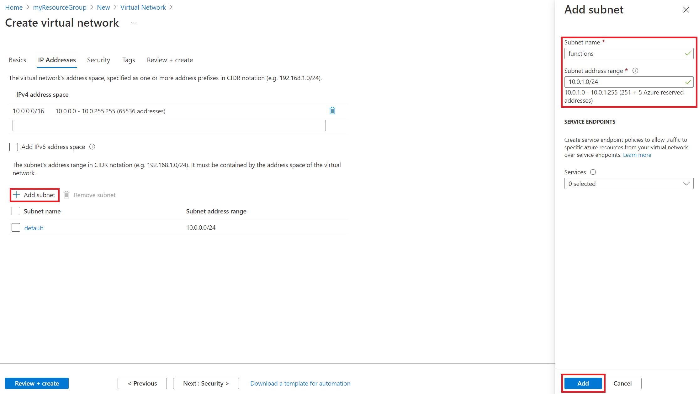

    | Setting      | Suggested value  | Description      |
    | ------------ | ---------------- | ---------------- |
    | **Subnet name** | functions | The name of the subnet your function app will connect to. | 
    | **Subnet address range** | 10.0.1.0/24 | Notice our IPv4 address space in the image above is 10.0.0.0/16. If the above was 10.1.0.0/16, the recommended *Subnet address range* would be 10.1.1.0/24. |

1. Select **Review + create**. After validation completes, select **Create**.

## Lock down your storage account with private endpoints

Azure Private Endpoints are used to connect to specific Azure resources using a private IP address. This ensures that network traffic remains within the designated virtual network, and access is available only for specific resources. Now, create the private endpoints for Azure File storage and Azure Blob storage with your storage account.

1. In your new storage account, select **Networking** in the left menu.

1. Click on the **Private endpoint connections** tab, and select **Private endpoint**.

    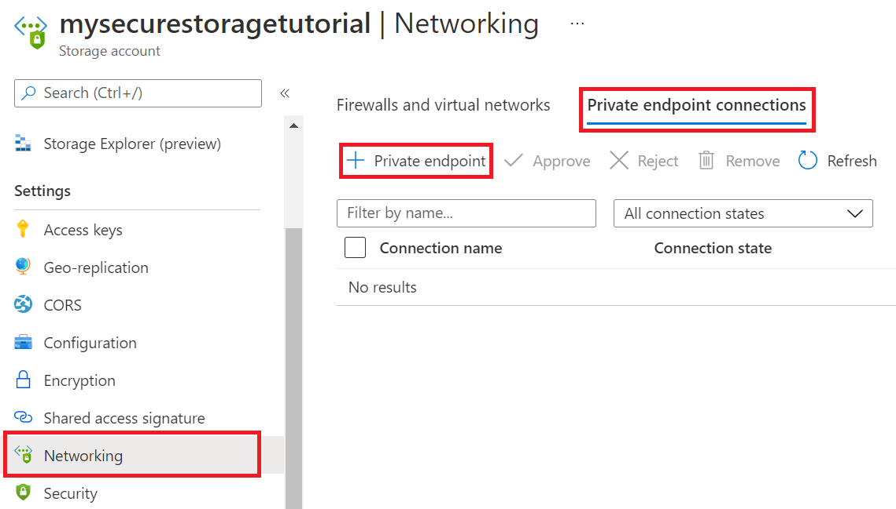

1. On the **Basics** tab, use the private endpoint settings as specified below:

    | Setting      | Suggested value  | Description      |
    | ------------ | ---------------- | ---------------- |
    | **Subscription** | Your subscription | The subscription under which your resources are created. | 
    | **[Resource group](../azure-resource-manager/management/overview.md)**  | myResourceGroup | Choose the resource group you created with your function app. | |
    | **Name** | file-endpoint | The name of the private endpoint for files from your storage account. |
    | **[Region](https://azure.microsoft.com/regions/)** | myFunctionRegion | Choose the region you created your storage account in. |

1. On the **Resource** tab, use the private endpoint settings as specified below:

    | Setting      | Suggested value  | Description      |
    | ------------ | ---------------- | ---------------- |
    | **Subscription** | Your subscription | The subscription under which your resources are created. | 
    | **Resource type**  | Microsoft.Storage/storageAccounts | This is the resource type for storage accounts. |
    | **Resource** | mysecurestorage | The storage account you just created |
    | **Target sub-resource** | file | This private endpoint will be used for files from the storage account. |

1. On the **Configuration** tab, choose **default** for the Subnet setting.


1. Select **Review + create**. After validation completes, select **Create**. Resources in the virtual network will now be able to talk to storage files.

1. Create another private endpoint for blobs. For the **Resources** tab, use the below settings. For all other settings, use the same settings from the file private endpoint creation steps you just followed. After completing this, resources in the virtual network will be able to talk to storage blobs.

    | Setting      | Suggested value  | Description      |
    | ------------ | ---------------- | ---------------- |
    | **Subscription** | Your subscription | The subscription under which your resources are created. | 
    | **Resource type**  | Microsoft.Storage/storageAccounts | This is the resource type for storage accounts. |
    | **Resource** | mysecurestorage | The storage account you just created |
    | **Target sub-resource** | blob | This private endpoint will be used for blobs from the storage account. |

## Lock down your service bus with a private endpoint

Now, create the private endpoint for your Azure Service Bus.

1. In your new service bus, select **Networking** in the left menu.

1. Click on the **Private endpoint connections** tab, and select **Private endpoint**.

    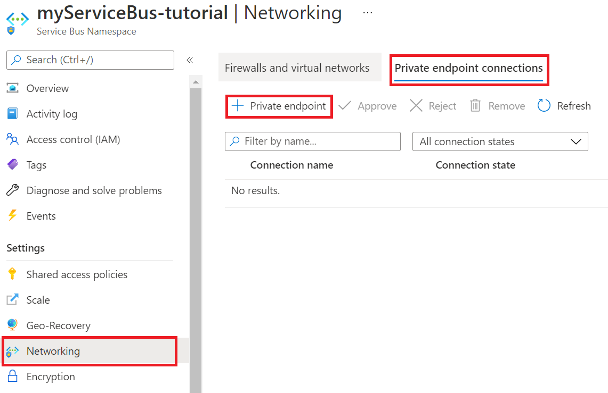

1. On the **Basics** tab, use the private endpoint settings as specified below:

    | Setting      | Suggested value  | Description      |
    | ------------ | ---------------- | ---------------- |
    | **Subscription** | Your subscription | The subscription under which your resources are created. | 
    | **[Resource group](../azure-resource-manager/management/overview.md)**  | myResourceGroup | Choose the resource group you created with your function app. |
    | **Name** | sb-endpoint | The name of the private endpoint for files from your storage account. |
    | **[Region](https://azure.microsoft.com/regions/)** | myFunctionRegion | Choose the region you created your storage account in. |

1. On the **Resource** tab, use the private endpoint settings as specified below:

    | Setting      | Suggested value  | Description      |
    | ------------ | ---------------- | ---------------- |
    | **Subscription** | Your subscription | The subscription under which your resources are created. | 
    | **Resource type**  | Microsoft.ServiceBus/namespaces | This is the resource type for Service Bus. |
    | **Resource** | myServiceBus | The Service Bus you created earlier in the tutorial. |
    | **Target sub-resource** | namespace | This private endpoint will be used for the namespace from the service bus. |

1. On the **Configuration** tab, choose **default** for the Subnet setting.

1. Select **Review + create**. After validation completes, select **Create**. Resources in the virtual network will now be able to talk to service bus.

## Create a file share

1. In the storage account you created, select **File shares** in the left menu.

1. Select **+ File shares**. Provide **files** as the name for the file share for the purposes of this tutorial.

    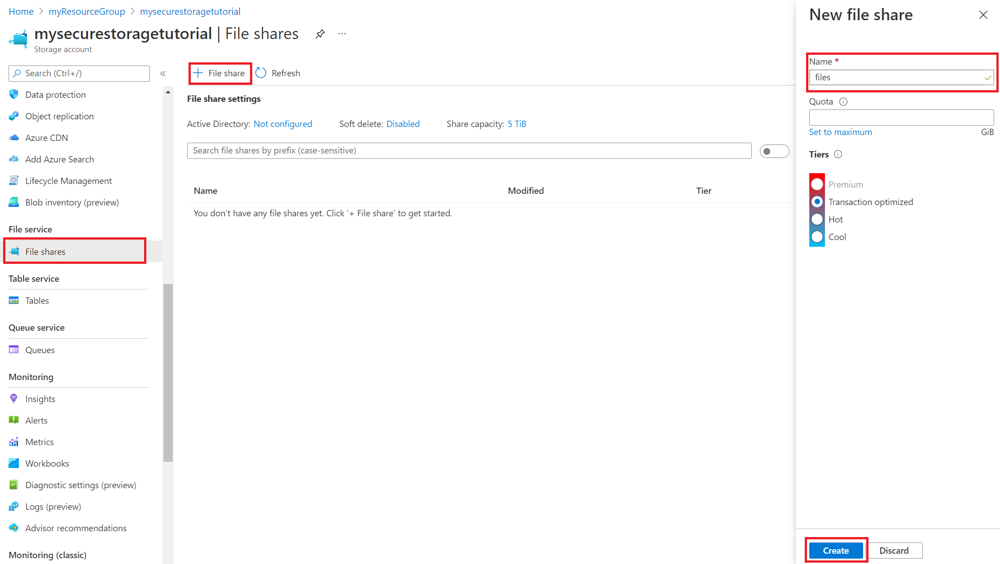

## Get storage account connection string

1. In the storage account you created, select **Access keys** in the left menu.

1. Select **Show keys**. Copy the connection string of key1, and save it. We will need this connection string later when configuring the app settings.

    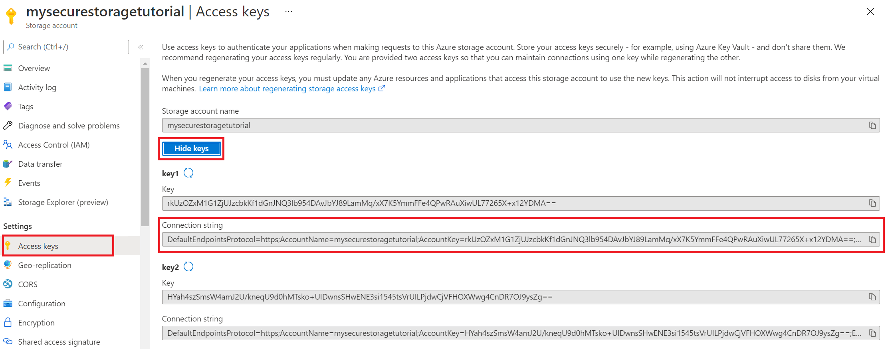

## Create a queue

1. In your service bus, select **Queues** in the left menu.

1. Select **Shared access policies**. Provide **queue** as the name for the queue for the purposes of this tutorial.

    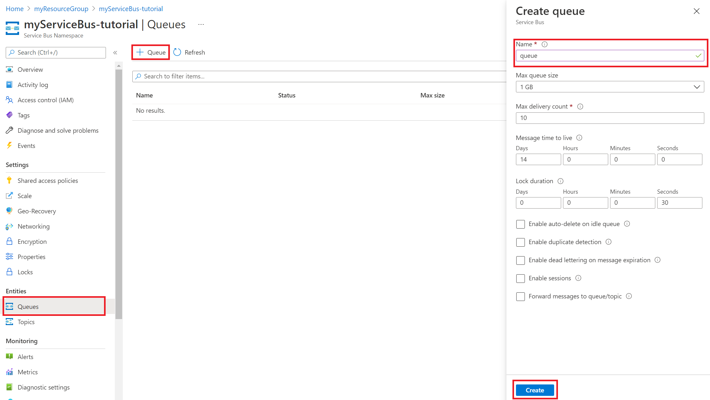

## Get service bus connection string

1. In your service bus, select **Shared access policies** in the left menu.

1. Select **RootManageSharedAccessKey**. Copy the **Primary Connection String**, and save it. We will need this connection string later when configuring the app settings.

    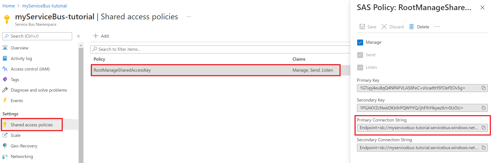

## Integrate function app with your virtual network

To use your function app with virtual networks, you will need to join it to a subnet. We use a specific subnet for the Azure Function virtual network integration and the default one for all other private endpoints created in this tutorial.

1. In your function app, select **Networking** in the left menu.

1. Select **Click here to configure** under VNet Integration.

    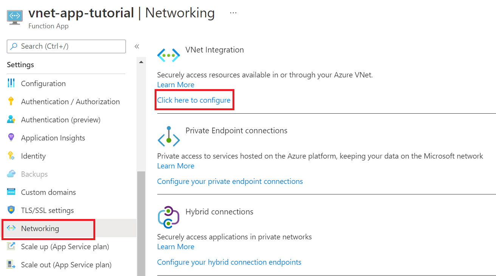

1. Click **Add VNet**

1. In the blade that opens up under **Virtual Network**, select the virtual network you created earlier.

1. Select the **Subnet** we created earlier called **functions**. Your function app is now integrated with your virtual network!

    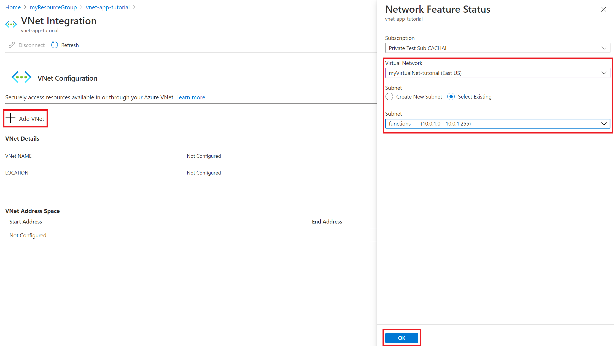

## Configure your function app settings for private endpoints

1. In your function app, select **Configuration** from the left menu.

1. To use your function app with virtual networks, the following app settings will need to be updated. Click **+ New application setting** or the pencil by **Edit** in the rightmost column of the app settings table as appropriate. When done, click **Save**.

    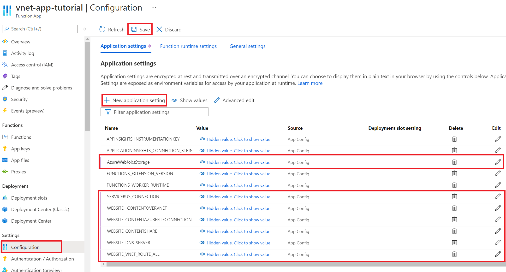

    | Setting      | Suggested value  | Description      |
    | ------------ | ---------------- | ---------------- |
    | **AzureWebJobsStorage** | mysecurestorageConnectionString | The connection string of the storage account you created. This is the storage connection string from [Get storage account connection string](#get-storage-account-connection-string). By changing this setting, your function app will now use the secure storage account for normal operations at runtime. | 
    | **WEBSITE_CONTENTAZUREFILECONNECTIONSTRING**  | mysecurestorageConnectionString | The connection string of the storage account you created. By changing this setting, your function app will now use the secure storage account for Azure Files which are used when deploying. |
    | **WEBSITE_CONTENTSHARE** | files | The name of the file share you created in the storage account. This app setting is used in conjunction with WEBSITE_CONTENTAZUREFILECONNECTIONSTRING. |
    | **SERVICEBUS_CONNECTION** | myServiceBusConnectionString | Create an app setting for the connection string of your service bus. This is the storage connection string from [Get service bus connection string](#get-service-bus-connection-string).|
    | **WEBSITE_CONTENTOVERVNET** | 1 | Create this app setting. A value of 1 enables your function app to scale when you have your storage account restricted to a virtual network. You should enable this setting when restricting your storage account to a virtual network. |
    | **WEBSITE_DNS_SERVER** | 168.63.129.16 | Create this app setting. Once your app integrates with a virtual network, it will use the same DNS server as the virtual network. This is one of two settings needed have your function app work with Azure DNS private zones and are required when using private endpoints. These settings will send all outbound calls from your app into your virtual network. |
    | **WEBSITE_VNET_ROUTE_ALL** | 1 | Create this app setting. Once your app integrates with a virtual network, it will use the same DNS server as the virtual network. This is one of two settings needed have your function app work with Azure DNS private zones and are required when using private endpoints. These settings will send all outbound calls from your app into your virtual network. |

1. Staying on the **Configuration** view, select the **Function runtime settings** tab.

1. Set **Runtime Scale Monitoring** to **On**, and click **Save**. Runtime driven scaling allows you to connect non-HTTP trigger functions to services running inside your virtual network.

    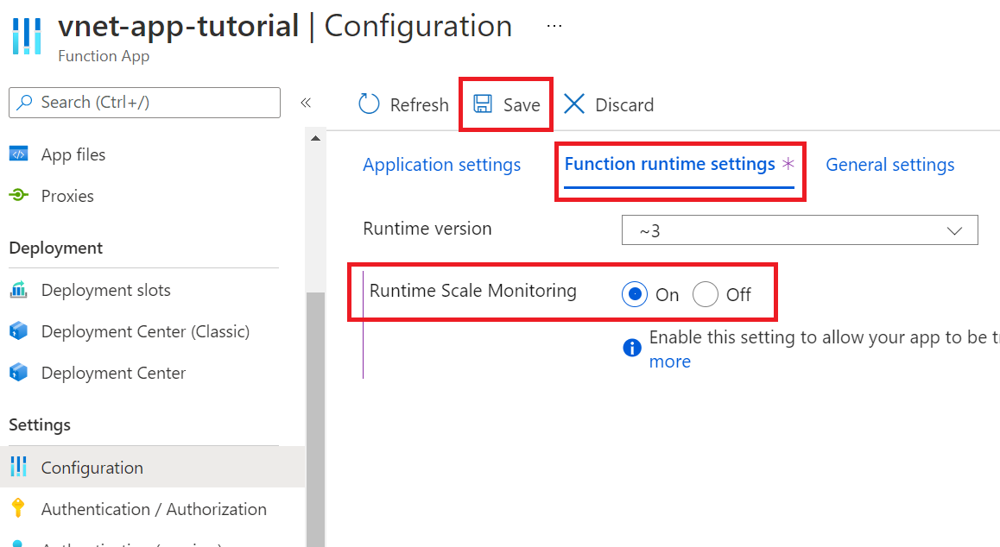

## Deploy a service bus trigger and http trigger to your function app

1. Clone the following Git repository which contains an HTTP Trigger and Service Bus Queue Trigger.

    ```git
    git clone https://github.com/cachai2/functions-vnet-tutorial.git
    ```

1. Open the cloned repository in VS Code.

1. Go to your subscription in the Azure view of the left menu, right click Application Settings. Click **Download Remote Settings...**. This will create a **local.settings.json** file in your folder with the correct app settings for your function project.

    

1. Deploy to the portal. Click on your function app, and then, click on the blue upwards arrow to deploy.

    

1. Your deployment will be complete once you get the message, **Deployment from <functionapp> completed.** in the bottom right of your VS Code view.

1. Once your function app is secured behind a private endpoint, you will need to add your local machine to your virtual network before deploying again. This can be done using ExpressRoute private peering or a VPN.

## Lock down your function app with a private endpoint

Now, create the private endpoint for your function app.

1. In your function app, select **Networking** in the left menu.

1. Select **Click here to configure** under Private Endpoint Connections.

    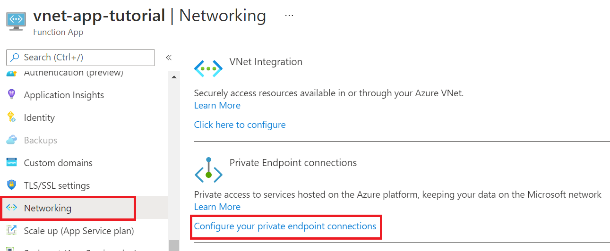

1. Click **Add**.

1. On the blade that opens up, use the private endpoint settings as specified below:

    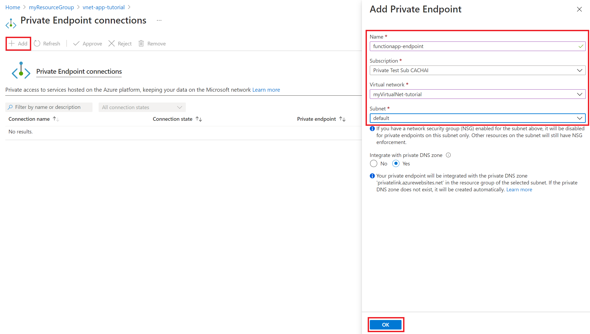

1. Click **Ok** to add the private endpoint. Congratulations! You've successfully secured your function app, service bus, and storage account with private endpoints!

## Private DNS Zones
Using a private endpoint to connect to Azure resources means connecting to a private IP address instead of the public endpoint. Existing Azure services are configured to use existing DNS to connect to the public endpoint. The DNS configuration will need to be overridden to connect to the private endpoint.

A private DNS zone was created for each Azure resource configured with a private endpoint. A DNS A record is created for each private IP address associated with the private endpoint.

The following DNS zones were created in this tutorial:

- privatelink.file.core.windows.net
- privatelink.blob.core.windows.net
- privatelink.servicebus.windows.net
- privatelink.azurewebsites.net

## Test your locked down function app

1. In your function app, select **Functions** from the left menu.

1. Select the **ServiceBusQueueTrigger**.

1. From the left menu, select **Monitor**. You will see that you are unable to monitor your app. This is because your browser doesn't have access to the virtual network, so it can't directly access resources within the virtual network. We will now demonstrate another method by which you can still monitor your function, Application Insights.

1. In your function app, select **Application Insights** from the left menu and select **View Application Insights data**.

    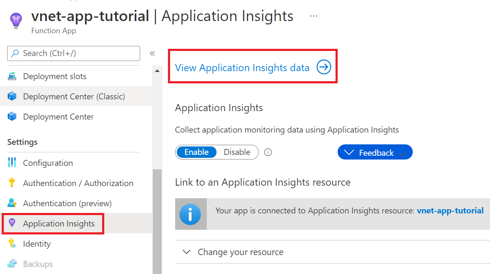

1. Select **Live metrics** from the left menu.

1. Open a new tab. In your Service Bus, select **Queues** from the left menu.

1. Select your queue.

1. Select **Service Bus Explorer** from the left menu. Under **Send**, choose **Text/Plain** as the **Content Type** and enter a message. 

1. Click **Send** to send the message.

    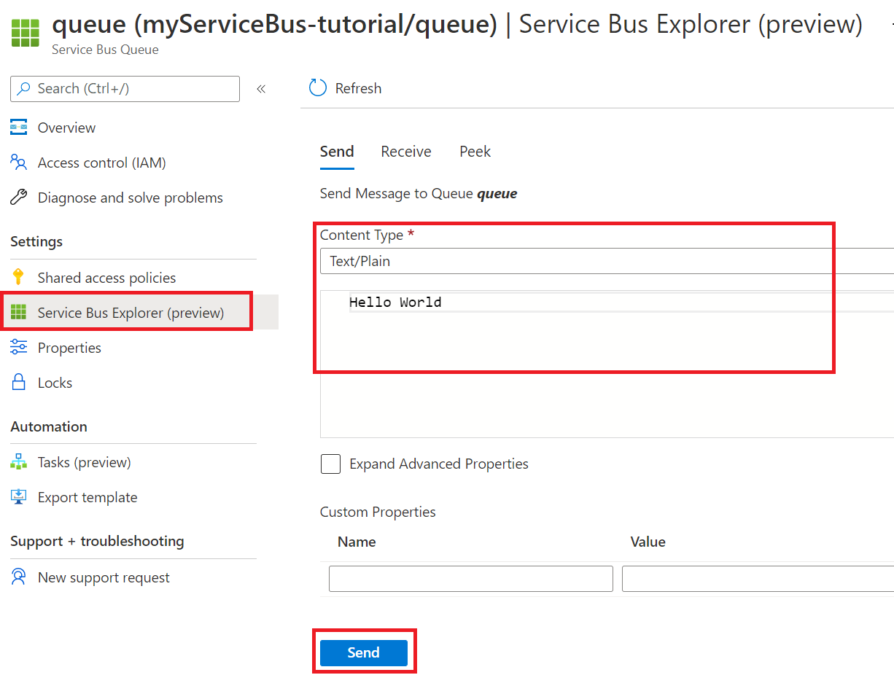

1. On the tab with **Live metrics** open, you should see that your Service Bus queue trigger has triggered. If it hasn't, resend the message from **Service Bus Explorer**

    

1. Congratulations! You have successfully tested your function app set up with private endpoints!

## Next steps

In this tutorial, you created a Premium function app, storage account, and Service Bus, and you secured them all behind private endpoints! Learn more about the various networking features available below:

> [!div class="nextstepaction"]
> [Learn more about the networking options in Functions](./functions-networking-options.md)

[Premium plan]: functions-premium-plan.md
