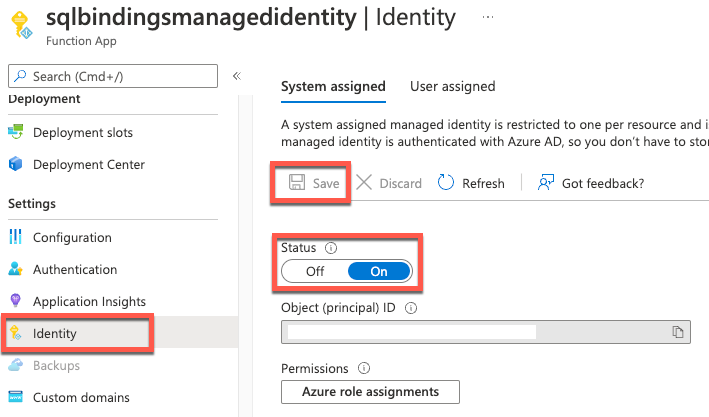

# Tutorial: Connect a function app to Azure SQL with managed identity and SQL bindings

Azure Functions provides a [managed identity](../active-directory/managed-identities-azure-resources/overview.md), which is a turn-key solution for securing access to [Azure SQL Database](/azure/sql-database/) and other Azure services. Managed identities make your app more secure by eliminating secrets from your app, such as credentials in the connection strings. In this tutorial, you'll add managed identity to an Azure Function that utilizes [Azure SQL bindings](./functions-bindings-azure-sql.md).  A sample Azure Function project with SQL bindings is available in the [ToDo backend example](/samples/azure-samples/azure-sql-binding-func-dotnet-todo/todo-backend-dotnet-azure-sql-bindings-azure-functions/).


When you're finished with this tutorial, your Azure Function will connect to Azure SQL database without the need of username and password.

An overview of the steps you'll take:

> [!div class="checklist"]
> * [Enable Azure AD authentication to the SQL database](#grant-database-access-to-azure-ad-user)
> * [Enable Azure Function managed identity](#enable-system-assigned-managed-identity-on-azure-function)
> * [Grant SQL Database access to the managed identity](#grant-sql-database-access-to-the-managed-identity)
> * [Configure Azure Function SQL connection string](#configure-azure-function-sql-connection-string)


## Grant database access to Azure AD user

First enable Azure AD authentication to SQL database by assigning an Azure AD user as the Active Directory admin of the server. This user is different from the Microsoft account you used to sign up for your Azure subscription. It must be a user that you created, imported, synced, or invited into Azure AD. For more information on allowed Azure AD users, see [Azure AD features and limitations in SQL database](/azure/azure-sql/database/authentication-aad-overview#azure-ad-features-and-limitations).

Enabling Azure AD authentication can be completed via the Azure portal, PowerShell, or Azure CLI.  Directions for Azure CLI are below and information completing this via Azure portal and PowerShell is available in the [Azure SQL documentation on Azure AD authentication](/azure/azure-sql/database/authentication-aad-configure).

1. If your Azure AD tenant doesn't have a user yet, create one by following the steps at [Add or delete users using Azure Active Directory](../active-directory/fundamentals/add-users-azure-active-directory.md).

1. Find the object ID of the Azure AD user using the [`az ad user list`](/cli/azure/ad/user#az-ad-user-list) and replace *\<user-principal-name>*. The result is saved to a variable.

    For Azure CLI 2.37.0 and newer:

    ```azurecli-interactive
    azureaduser=$(az ad user list --filter "userPrincipalName eq '<user-principal-name>'" --query [].id --output tsv)
    ```

    For older versions of Azure CLI:

    ```azurecli-interactive
    azureaduser=$(az ad user list --filter "userPrincipalName eq '<user-principal-name>'" --query [].objectId --output tsv)
    ```

    > [!TIP]
    > To see the list of all user principal names in Azure AD, run `az ad user list --query [].userPrincipalName`.
    >

1. Add this Azure AD user as an Active Directory admin using [`az sql server ad-admin create`](/cli/azure/sql/server/ad-admin#az-sql-server-ad-admin-create) command in the Cloud Shell. In the following command, replace *\<server-name>* with the server name (without the `.database.windows.net` suffix).

    ```azurecli-interactive
    az sql server ad-admin create --resource-group myResourceGroup --server-name <server-name> --display-name ADMIN --object-id $azureaduser
    ```

For more information on adding an Active Directory admin, see [Provision an Azure Active Directory administrator for your server](/azure/azure-sql/database/authentication-aad-configure#provision-azure-ad-admin-sql-database)


## Enable system-assigned managed identity on Azure Function

In this step we'll add a system-assigned identity to the Azure Function.  In later steps, this identity will be given access to the SQL database.

To enable system-assigned managed identity in the Azure portal:

1. Create an Azure Function in the portal as you normally would. Navigate to it in the portal.
1. Scroll down to the Settings group in the left navigation.
1. Select Identity.
1. Within the System assigned tab, switch Status to On. Click Save.




For information on enabling system-assigned managed identity through Azure CLI or PowerShell, check out more information on [using managed identities with Azure Functions](../app-service/overview-managed-identity.md?tabs=dotnet&toc=%2fazure%2fazure-functions%2ftoc.json#add-a-system-assigned-identity).

    >[!TIP]
    >For User Managed Identity, Switch to User Assigned tab. Click Add and select a Managed Identity. For more information on creating user-assigned managed identity, see the [Manage user-assigned managed identities](../active-directory/managed-identities-azure-resources/how-manage-user-assigned-managed-identities.md).
    

## Grant SQL database access to the managed identity

In this step we'll connect to the SQL database with an Azure AD user account and grant the managed identity access to the database.

1. Open your preferred SQL tool and login with an Azure AD user account (such as the Azure AD user we assigned as administrator).  This can be accomplished in Cloud Shell with the SQLCMD command.

    ```bash
    sqlcmd -S <server-name>.database.windows.net -d <db-name> -U <aad-user-name> -P "<aad-password>" -G -l 30
    ```

1. In the SQL prompt for the database you want, run the following commands to grant permissions to your function. For example, 

    ```sql
    CREATE USER [<identity-name>] FROM EXTERNAL PROVIDER;
    ALTER ROLE db_datareader ADD MEMBER [<identity-name>];
    ALTER ROLE db_datawriter ADD MEMBER [<identity-name>];
    GO
    ```

    *\<identity-name>* is the name of the managed identity in Azure AD. If the identity is system-assigned, the name is always the same as the name of your Function app.


## Configure Azure Function SQL connection string

In the final step we'll configure the Azure Function SQL connection string to use Azure AD managed identity authentication.

The connection string setting name is identified in our Functions code as the binding attribute "ConnectionStringSetting", as seen in the SQL input binding [attributes and annotations](./functions-bindings-azure-sql-input.md?pivots=programming-language-csharp#attributes). 

In the application settings of our Function App the SQL connection string setting should be updated to follow this format:

`Server=demo.database.windows.net; Authentication=Active Directory Managed Identity; Database=testdb`

*testdb* is the name of the database we're connecting to and *demo.database.windows.net* is the name of the server we're connecting to.

    >[!TIP]
    >For User Managed Identity, use `Server=demo.database.windows.net; Authentication=Active Directory Managed Identity; User Id=ClientIdOfManagedIdentity; Database=testdb`.

## Next steps

- [Read data from a database (Input binding)](./functions-bindings-azure-sql-input.md)
- [Save data to a database (Output binding)](./functions-bindings-azure-sql-output.md)
- [Review ToDo API sample with Azure SQL bindings](/samples/azure-samples/azure-sql-binding-func-dotnet-todo/todo-backend-dotnet-azure-sql-bindings-azure-functions/)
