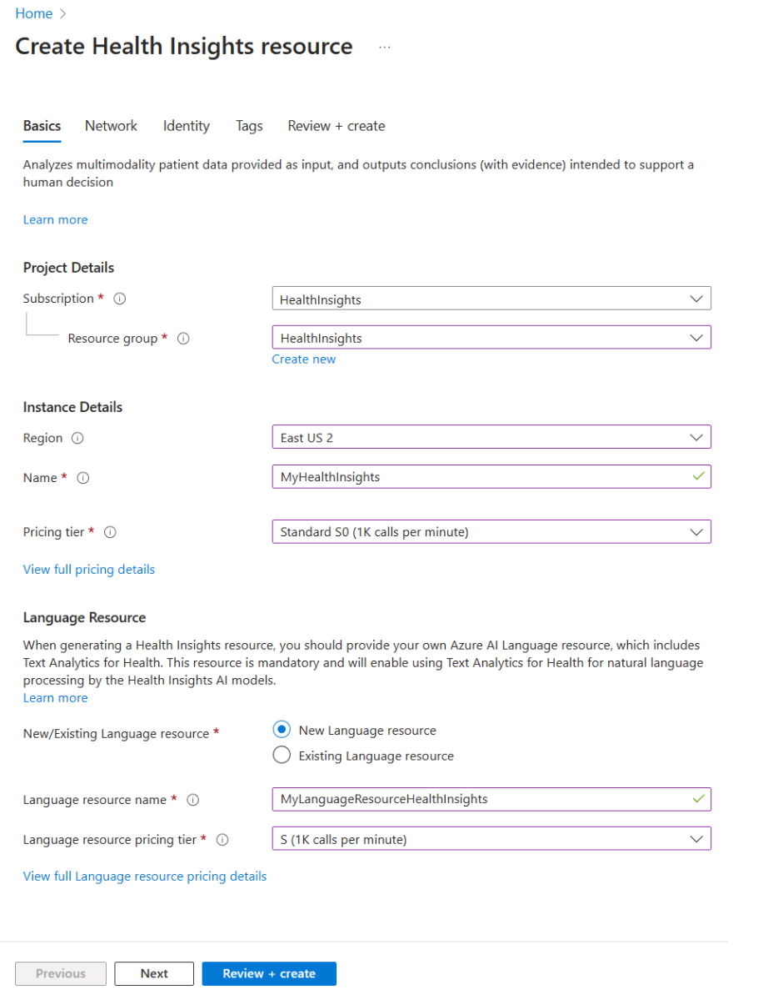

# Quickstart: Deploy Azure AI Health Insights using the Azure portal

In this quickstart, you learn how to deploy Azure AI Health Insights using the Azure portal.

Once deployment is complete, you can use the Azure portal to navigate to the newly created Azure AI Health Insights, and retrieve the needed details such your service URL, keys and manage your access controls.

## Deploy Azure AI Health Insights

1. Sign in to the [Azure portal](https://portal.azure.com/).
2. Create a new **Resource group**.
3. Add a new Azure AI services account to your Resource group and search for **Health Insights**.

    

    or Use this [link](https://portal.azure.com/#create/Microsoft.CognitiveServicesHealthInsights) to create a new Azure AI services account.

4. Enter the following values:
    - **Resource group**: Select or create your Resource group name.
    - **Region**: Select an Azure location, such as West Europe.
    - **Name**: Enter an Azure AI services account name.
    - **Pricing tier**: Select your pricing tier.
    - **New/Exisiting Language resource**: Choose if to create a new Language resource or provide an exisiting one.
    - **Language resource name**: Enter the Language resource name.
    - **Language resource pricing tier**: Select your Language resource pricing tier.

     

It is necessary to associate an Azure AI Language resource with the Health Insights resource, to enable the use of Text Analytics for Health by the Health Insights AI models. 
When a Language resource is associated with a Health Insights resource, a couple of things happen in the background, in order to allow the Health Insights resource access to the Language resource:
 - A system assigned managed identity is enabled for the Health Insights resource.
 - A role assignment of 'Cognitive Services User' scoped for the Language resource is added to the Health Insights resource's identity.

It is important not to change or delete these assignments. 
Any of the following actions may disrupt the required access to the associated Language resource and cause API request failures: 
- Deleting the Language resource.
- Disabling the Health Insights resource system assigned managed identity.
- Removing the Health Insights resource 'Cognitive Services User' role from the Language resource. 

5. Navigate to your newly created service.
    
    

## Configure private endpoints

With private endpoints, the network traffic between the clients on the VNet and the Azure AI services account run over the VNet and a private link on the Microsoft backbone network. Using private endpoints as described eliminates exposure from the public internet.

Once the Azure AI services account is successfully created, configure private endpoints from the Networking page under Resource Management. 

## Next steps

To get started using Azure AI Health Insights, get started with one of the following models:

>[!div class="nextstepaction"]
> [Onco-Phenotype](oncophenotype/index.yml) 

>[!div class="nextstepaction"]
> [Trial Matcher](trial-matcher/index.yml) 

>[!div class="nextstepaction"]
> [Radiology Insights](radiology-insights/index.yml) 
