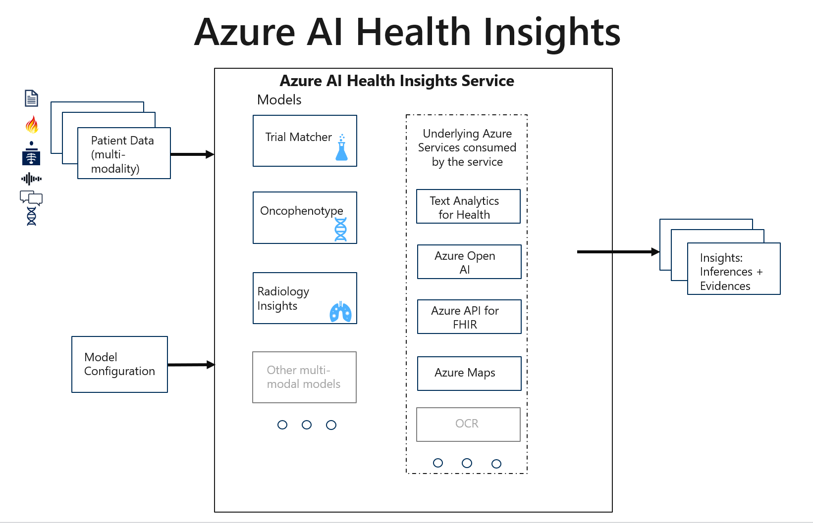

# What is Azure Health Insights?

Azure Health Insights is a Cognitive Service providing an API that serves insight models, which perform analysis and provide inferences to be used by a human. The models can receive input in different modalities, and return insight inferences including evidence as a result, for key high value scenarios in the health domain

> [!IMPORTANT] 
> Azure Health Insights is a capability provided “AS IS” and “WITH ALL FAULTS.” Azure Health Insights isn't intended or made available for use as a medical device, clinical support, diagnostic tool, or other technology intended to be used in the diagnosis, cure, mitigation, treatment, or prevention of disease or other conditions, and no license or right is granted by Microsoft to use this capability for such purposes. This capability isn't designed or intended to be implemented or deployed as a substitute for professional medical advice or healthcare opinion, diagnosis, treatment, or the clinical judgment of a healthcare professional, and should not be used as such. The customer is solely responsible for any use of Azure Health Insights. 

## Why use Azure Health Insights?

Health and Life Sciences organizations have multiple high-value business problems that require clinical insights inferences that are based on clinical data. 
Azure Health Insights is a Cognitive Service that provides prebuilt models that assist with solving those business problems.

## Available decision dupport models

There are currently two models available in Azure Health Insights: 

The [Trial Matcher](./trial-matcher/overview.md) model receives patients' data and clinical trials protocols, and provides relevant clinical trials based on eligibility criteria.

The [OncoPhenotype](./oncophenotype/overview.md) receives clinical records of oncology patients and outputs cancer staging, such as  **clinical stage TNM** categories and **pathologic stage TNM categories** as well as **tumor site** and **histology**.


## Architecture

 

Azure Health Insights service receives patient data through multiple input channels. This can be unstructured healthcare data, FHIR resources or specific JSON format data. This in combination with the correct model configuration, such as ```includeEvidence```. 
With these input channels and configuration, the service can run the data through several health insights AI models, such as Trial Matcher or OncoPhenotype.  

## Next steps

Review the following information to learn how to deploy Azure Health Insights and to learn additional information about each of the models:

>[!div class="nextstepaction"]
> [Deploy Azure Health Insights](deploy-portal.md) 

>[!div class="nextstepaction"]
> [OncoPhenotype](oncophenotype/overview.md) 

>[!div class="nextstepaction"]
> [Trial Matcher](trial-matcher//overview.md) 
