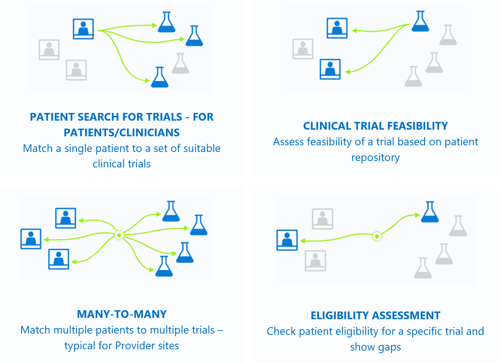

# Trial Matcher modes

The Trial Matcher is a decision support model, offered within the context of the broader Azure Health Insights. Trial Matcher is designed to match patients to potentially suitable clinical trials and find group of potentially eligible patients to a list of clinical trials. 

Trial Matcher provides the user of the services two main modes of operation: **patients centric** and **clinical trial centric**. 

 

## Patient Centric
**Patient Centric** is when the Trial Matcher model matches a single patient to a set of relevant clinical trials, that this patient appears to be qualified for. Patient centric is also known as **one-to-many** use case. 

The Trial Matcher logic is based on the patient **clinical health information**, **location**, **priorities**, **trial eligibility criteria**, and **other criteria** that the patient and/or service users may choose to prioritize. 

Typically, when using Trial Matcher in Patient centric the service user will provide the patient data in one of the following data formats::
- Gradual Matching
- Key-Value structure 
- FHIR Bundle
- Unstructured Clinical Note

## Clinical Trial Centric

**Clinical Trial Centric** is when the Trial Matcher model finds potentially eligible group of patients to a clinical trial.
The service user provides patients data and the clinical trial to match to. The Trial Matcher then analyses the data and provides the results per patient, both if they are eligible or ineligible. 

Clinical Trial Centric is also known as **many-to-one** use case, and the extension of it is **many-to-many** when there is a list of clinical trials to match the patients to.
The process of matching patients is typically done in two phases. 
- First phase, done by the service user, starts with all patients in the data repository, and goal is to mark all patients that meet a baseline criteria like a clinical condition. 
- In second phase, the server user provides the Trial Matcher as input a subset group of patients which was the outcome of first phase, and match only those patients to the detailed exclusion and inclusion criteria of a clinical trial.

Typically, when using Trial Matcher in clinical trial centric the service user will provide the patient data in one of the following data formats:
- Key-Value structure 
- FHIR Bundle
- Unstructured Clinical Note

## Gradual matching
Trial Matcher can be used to match patients with known structured medical information, or it can be used to collect the required medical information during the qualification process, which is known as Gradual matching. 

Gradual matching can be utilized through any client application. One common implementation is by leveraging the [Azure Health Bot](/azure/health-bot/) to create a conversational mechanism for collecting information and qualifying patients. Information about integrating the Azure Health Bot with Trial Matcher can be found [here](azure-healthbot-integration.md).

When performing Gradual matching, the response of each call to the Trial Matcher will include Needed [clinical info](patient-info.md) – health information derived from the subset of clinical trials found that is required to qualify the patient. This information should be captured from the user (e.g. by generating a question and waiting for user input) and sent back to the Trial Matcher in the following request, to perform a more accurate qualification.

## Next steps

For more info you can read further on the following pages
>[!div class="nextstepaction"]
> [patient info](patient-info.md) 

>[!div class="nextstepaction"]
> [model configuration](model-configuration.md) 

>[!div class="nextstepaction"]
> [inference information](inferences.md) 