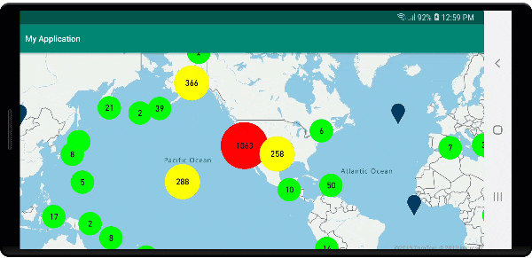
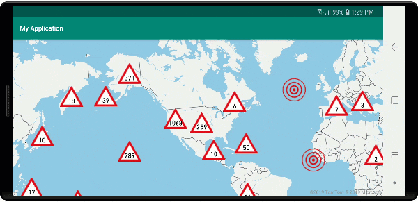
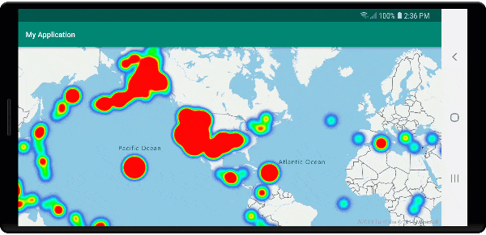
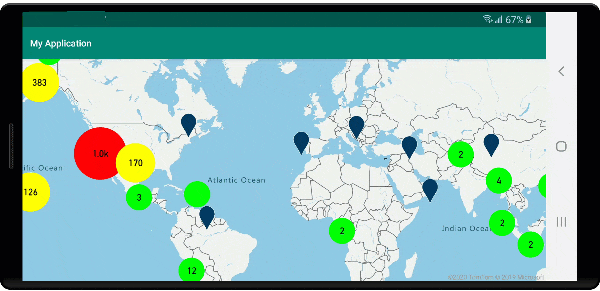
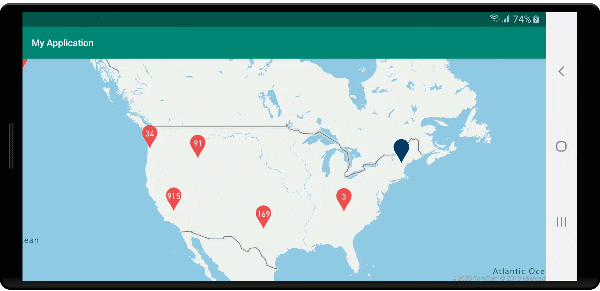
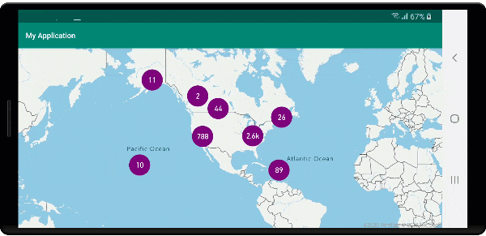

# Clustering point data in the Android SDK

When visualizing many data points on the map, data points may overlap over each other. The overlap may cause the map may become unreadable and difficult to use. Clustering point data is the process of combining point data that are near each other and representing them on the map as a single clustered data point. As the user zooms into the map, the clusters break apart into their individual data points. When you work with large number of data points, use the clustering processes to improve your user experience.

</br>

>[!VIDEO https://docs.microsoft.com/Shows/Internet-of-Things-Show/Clustering-point-data-in-Azure-Maps/player?format=ny]

## Prerequisites

Be sure to complete the steps in the [Quickstart: Create an Android app](quick-android-map.md) document. Code blocks in this article can be inserted into the maps `onReady` event handler.

## Enabling clustering on a data source

Enable clustering in the `DataSource` class by setting the `cluster` option to `true`. Set `clusterRadius` to select nearby points and combines them into a cluster. The value of `clusterRadius` is in pixels. Use `clusterMaxZoom` to specify a zoom level at which to disable the clustering logic. Here is an example of how to enable clustering in a data source.

::: zone pivot="programming-language-java-android"

``` java
//Create a data source and enable clustering.
DataSource source = new DataSource(
    //Tell the data source to cluster point data.
    cluster(true),

    //The radius in pixels to cluster points together.
    clusterRadius(45),

    //The maximum zoom level in which clustering occurs.
    //If you zoom in more than this, all points are rendered as symbols.
    clusterMaxZoom(15)
);
```

::: zone-end

::: zone pivot="programming-language-kotlin"

```kotlin
 //Create a data source and enable clustering.
val source = DataSource( 
    //Tell the data source to cluster point data.
    cluster(true),  

    //The radius in pixels to cluster points together.
    clusterRadius(45),  

    //The maximum zoom level in which clustering occurs.
    //If you zoom in more than this, all points are rendered as symbols.
    clusterMaxZoom(15)
)
```

::: zone-end

> [!CAUTION]
> Clustering only works with `Point` features. If your data source contains features of other geometry types, such as `LineString` or `Polygon`, an error will occur.

> [!TIP]
> If two data points are close together on the ground, it's possible the cluster will never break apart, no matter how close the user zooms in. To address this, you can set the `clusterMaxZoom` option to disable the clustering logic and simply display everything.

The `DataSource` class provides the following methods related to clustering as well.

| Method | Return type | Description |
|--------|-------------|-------------|
| `getClusterChildren(Feature clusterFeature)` | `FeatureCollection` | Retrieves the children of the given cluster on the next zoom level. These children may be a combination of shapes and subclusters. The subclusters will be features with properties matching ClusteredProperties. |
| `getClusterExpansionZoom(Feature clusterFeature)` | `int` | Calculates a zoom level at which the cluster will start expanding or break apart. |
| `getClusterLeaves(Feature clusterFeature, long limit, long offset)` | `FeatureCollection` | Retrieves all points in a cluster. Set the `limit` to return a subset of the points, and use the `offset` to page through the points. |

## Display clusters using a bubble layer

A bubble layer is a great way to render clustered points. Use expressions to scale the radius and change the color based on the number of points in the cluster. If you display clusters using a bubble layer, then you should use a separate layer to render unclustered data points.

To display the size of the cluster on top of the bubble, use a symbol layer with text, and don't use an icon.

The following code displays clustered points using a bubble layer, and the number of points in each cluster using a symbol layer. A second symbol layer is used to display individual points that are not within a cluster.

::: zone pivot="programming-language-java-android"

``` java
//Create a data source and add it to the map.
DataSource source = new DataSource(
    //Tell the data source to cluster point data.
    cluster(true),

    //The radius in pixels to cluster points together.
    clusterRadius(45),

    //The maximum zoom level in which clustering occurs.
    //If you zoom in more than this, all points are rendered as symbols.
    clusterMaxZoom(15)
);

//Import the geojson data and add it to the data source.
map.importDataFromUrl("https://earthquake.usgs.gov/earthquakes/feed/v1.0/summary/all_week.geojson");

//Add data source to the map.
map.sources.add(source);

//Create a bubble layer for rendering clustered data points.
map.layers.add(new BubbleLayer(source,
    //Scale the size of the clustered bubble based on the number of points in the cluster.
    bubbleRadius(
        step(
            get("point_count"),
            20,             //Default of 20 pixel radius.
            stop(100, 30),  //If point_count >= 100, radius is 30 pixels.
            stop(750, 40)   //If point_count >= 750, radius is 40 pixels.
        )
    ),

    //Change the color of the cluster based on the value on the point_cluster property of the cluster.
    bubbleColor(
        step(
            toNumber(get("point_count")),
            color(Color.GREEN),              //Default to lime green.
            stop(100, color(Color.YELLOW)),  //If the point_count >= 100, color is yellow.
            stop(750, color(Color.RED))      //If the point_count >= 100, color is red.
        )
    ),

    bubbleStrokeWidth(0f),

    //Only rendered data points which have a point_count property, which clusters do.
    BubbleLayerOptions.filter(has("point_count"))
));

//Create a symbol layer to render the count of locations in a cluster.
map.layers.add(new SymbolLayer(source,
    iconImage("none"),                //Hide the icon image.
    textField(get("point_count")),    //Display the point count as text.
    textOffset(new Float[]{ 0f, 0.4f }),

    //Allow clustered points in this layer.
    SymbolLayerOptions.filter(has("point_count"))
));

//Create a layer to render the individual locations.
map.layers.add(new SymbolLayer(source,
    //Filter out clustered points from this layer.
    SymbolLayerOptions.filter(not(has("point_count")))
));
```

::: zone-end

::: zone pivot="programming-language-kotlin"

```kotlin
//Create a data source and add it to the map.
val source = DataSource( 
    //Tell the data source to cluster point data.
    cluster(true),  

    //The radius in pixels to cluster points together.
    clusterRadius(45),  

    //The maximum zoom level in which clustering occurs.
    //If you zoom in more than this, all points are rendered as symbols.
    clusterMaxZoom(15)
)

//Import the geojson data and add it to the data source.
map.importDataFromUrl("https://earthquake.usgs.gov/earthquakes/feed/v1.0/summary/all_week.geojson")

//Add data source to the map.
map.sources.add(source)

//Create a bubble layer for rendering clustered data points.
map.layers.add(
    BubbleLayer(
        source,  

        //Scale the size of the clustered bubble based on the number of points in the cluster.
        bubbleRadius(
            step(
                get("point_count"),
                20,  //Default of 20 pixel radius.
                stop(100, 30),  //If point_count >= 100, radius is 30 pixels.
                stop(750, 40) //If point_count >= 750, radius is 40 pixels.
            )
        ),  

        //Change the color of the cluster based on the value on the point_cluster property of the cluster.
        bubbleColor(
            step(
                toNumber(get("point_count")),
                color(Color.GREEN),  //Default to lime green.
                stop(100, color(Color.YELLOW)),  //If the point_count >= 100, color is yellow.
                stop(750, color(Color.RED)) //If the point_count >= 100, color is red.
            )
        ),
        bubbleStrokeWidth(0f),  

        //Only rendered data points which have a point_count property, which clusters do.
        BubbleLayerOptions.filter(has("point_count"))
    )
)

//Create a symbol layer to render the count of locations in a cluster.
map.layers.add(
    SymbolLayer(
        source,
        iconImage("none"),  //Hide the icon image.
        textField(get("point_count")),  //Display the point count as text.
        textOffset(arrayOf(0f, 0.4f)),  

        //Allow clustered points in this layer.
        SymbolLayerOptions.filter(has("point_count"))
    )
)

//Create a layer to render the individual locations.
map.layers.add(
    SymbolLayer(
        source,  

        //Filter out clustered points from this layer.
        SymbolLayerOptions.filter(not(has("point_count")))
    )
)
```

::: zone-end

The following image shows the above code display clustered point features in a bubble layer, scaled and colored based on the number of points in the cluster. Unclustered points are rendered using a symbol layer.



## Display clusters using a symbol layer

When visualizing data points, the symbol layer automatically hides symbols that overlap each other to ensure a cleaner user interface. This default behavior might be undesirable if you want to show the data points density on the map. However, these settings can be changed. To display all symbols, set the `iconAllowOverlap` option of the Symbol layer to `true`.

Use clustering to show the data points density while keeping a clean user interface. The sample below shows you how to add custom symbols and represent clusters and individual data points using the symbol layer.

::: zone pivot="programming-language-java-android"

``` java
//Load all the custom image icons into the map resources.
map.images.add("earthquake_icon", R.drawable.earthquake_icon);
map.images.add("warning_triangle_icon", R.drawable.warning_triangle_icon);

//Create a data source and add it to the map.
DataSource source = new DataSource(
    //Tell the data source to cluster point data.
    cluster(true)
);

//Import the geojson data and add it to the data source.
map.importDataFromUrl("https://earthquake.usgs.gov/earthquakes/feed/v1.0/summary/all_week.geojson");

//Add data source to the map.
map.sources.add(source);

//Create a symbol layer to render the clusters.
map.layers.add(new SymbolLayer(source,
    iconImage("warning_triangle_icon"),
    textField(get("point_count")),
    textOffset(new Float[]{ 0f, -0.4f }),

    //Allow clustered points in this layer.
    filter(has("point_count"))
));

//Create a layer to render the individual locations.
map.layers.add(new SymbolLayer(source,
    iconImage("earthquake_icon"),

    //Filter out clustered points from this layer.
    filter(not(has("point_count")))
));
```

::: zone-end

::: zone pivot="programming-language-kotlin"

```kotlin
//Load all the custom image icons into the map resources.
map.images.add("earthquake_icon", R.drawable.earthquake_icon)
map.images.add("warning_triangle_icon", R.drawable.warning_triangle_icon)

//Create a data source and add it to the map.
val source = DataSource( 
    //Tell the data source to cluster point data.
    cluster(true)
)

//Import the geojson data and add it to the data source.
map.importDataFromUrl("https://earthquake.usgs.gov/earthquakes/feed/v1.0/summary/all_week.geojson")

//Add data source to the map.
map.sources.add(source)

//Create a symbol layer to render the clusters.
map.layers.add(
    SymbolLayer(
        source,
        iconImage("warning_triangle_icon"),
        textField(get("point_count")),
        textOffset(arrayOf(0f, -0.4f)),  

        //Allow clustered points in this layer.
        filter(has("point_count"))
    )
)

//Create a layer to render the individual locations.
map.layers.add(
    SymbolLayer(
        source,
        iconImage("earthquake_icon"),  

        //Filter out clustered points from this layer.
        filter(not(has("point_count")))
    )
)
```

::: zone-end

For this sample, the following image is loaded into the drawable folder of the app.

|  |  |
|:-----------------------:|:--------------------------:|
| earthquake_icon.png     | warning_triangle_icon.png  |

The following image shows the above code rendering clustered and unclustered point features using custom icons.



## Clustering and the heat maps layer

Heat maps are a great way to display the density of data on the map. This visualization method can handle a large number of data points on its own. If the data points are clustered and the cluster size is used as the weight of the heat map, then the heat map can handle even more data. To achieve this option, set the `heatmapWeight` option of the heat map layer to `get("point_count")`. When the cluster radius is small, the heat map will look nearly identical to a heat map using the unclustered data points, but it will perform much better. However, the smaller the cluster radius, the more accurate the heat map will be, but with fewer performance benefits.

::: zone pivot="programming-language-java-android"

``` java
//Create a data source and add it to the map.
DataSource source = new DataSource(
    //Tell the data source to cluster point data.
    cluster(true),

    //The radius in pixels to cluster points together.
    clusterRadius(10)
);

//Import the geojson data and add it to the data source.
map.importDataFromUrl("https://earthquake.usgs.gov/earthquakes/feed/v1.0/summary/all_week.geojson");

//Add data source to the map.
map.sources.add(source);

//Create a heat map and add it to the map.
map.layers.add(new HeatMapLayer(source,
    //Set the weight to the point_count property of the data points.
    heatmapWeight(get("point_count")),

    //Optionally adjust the radius of each heat point.
    heatmapRadius(20f)
), "labels");
```

::: zone-end

::: zone pivot="programming-language-kotlin"

```kotlin
//Create a data source and add it to the map.
val source = DataSource( 
    //Tell the data source to cluster point data.
    cluster(true),  

    //The radius in pixels to cluster points together.
    clusterRadius(10)
)

//Import the geojson data and add it to the data source.
map.importDataFromUrl("https://earthquake.usgs.gov/earthquakes/feed/v1.0/summary/all_week.geojson")

//Add data source to the map.
map.sources.add(source)

//Create a heat map and add it to the map.
map.layers.add(
    HeatMapLayer(
        source,  
        
        //Set the weight to the point_count property of the data points.
        heatmapWeight(get("point_count")),  

        //Optionally adjust the radius of each heat point.
        heatmapRadius(20f)
    ), "labels"
)
```

::: zone-end

The following image shows the above code display a heat map that is optimized by using clustered point features and the cluster count as the weight in the heat map.



## Mouse events on clustered data points

When mouse events occur on a layer that contains clustered data points, the clustered data point return to the event as a GeoJSON point feature object. This point feature will have the following properties:

| Property name             | Type    | Description   |
|---------------------------|---------|---------------|
| `cluster`                 | boolean | Indicates if feature represents a cluster. |
| `point_count`             | number  | The number of points the cluster contains.  |
| `point_count`             | number  | The number of points the cluster contains.  |
| `point_count_abbreviated` | string  | A string that abbreviates the `point_count` value if it's long. (for example, 4,000 becomes 4K)  |

This example takes a bubble layer that renders cluster points and adds a click event. When the click event triggers, the code calculates and zooms the map to the next zoom level, at which the cluster breaks apart. This functionality is implemented using the `getClusterExpansionZoom` method of the `DataSource` class and the `cluster_id` property of the clicked clustered data point.

::: zone pivot="programming-language-java-android"

``` java
//Create a data source and add it to the map.
DataSource source = new DataSource(
    //Tell the data source to cluster point data.
    cluster(true),

    //The radius in pixels to cluster points together.
    clusterRadius(45),

    //The maximum zoom level in which clustering occurs.
    //If you zoom in more than this, all points are rendered as symbols.
    clusterMaxZoom(15)
);

//Import the geojson data and add it to the data source.
source.importDataFromUrl("https://earthquake.usgs.gov/earthquakes/feed/v1.0/summary/all_week.geojson");

//Add data source to the map.
map.sources.add(source);

//Create a bubble layer for rendering clustered data points.
BubbleLayer clusterBubbleLayer = new BubbleLayer(source,
    //Scale the size of the clustered bubble based on the number of points in the cluster.
    bubbleRadius(
        step(
            get("point_count"),
            20f,    //Default of 20 pixel radius.
            stop(100, 30),   //If point_count >= 100, radius is 30 pixels.
            stop(750, 40)    //If point_count >= 750, radius is 40 pixels.
        )
    ),

    //Change the color of the cluster based on the value on the point_cluster property of the cluster.
    bubbleColor(
        step(
            get("point_count"),
            color(Color.GREEN),  //Default to green.
            stop(100, color(Color.YELLOW)), //If the point_count >= 100, color is yellow.
            stop(750, color(Color.RED))     //If the point_count >= 100, color is red.
        )
    ),

    bubbleStrokeWidth(0f),

    //Only rendered data points which have a point_count property, which clusters do.
    BubbleLayerOptions.filter(has("point_count"))   
);

//Add the clusterBubbleLayer and two additional layers to the map.
map.layers.add(clusterBubbleLayer);

//Create a symbol layer to render the count of locations in a cluster.
map.layers.add(new SymbolLayer(source,
    //Hide the icon image.
    iconImage("none"),   

    //Display the 'point_count_abbreviated' property value.
    textField(get("point_count_abbreviated")), 
    
    //Offset the text position so that it's centered nicely.
    textOffset(new Float[] { 0f, 0.4f }),

    //Only rendered data points which have a point_count property, which clusters do.
    SymbolLayerOptions.filter(has("point_count")) 
));

//Create a layer to render the individual locations.
map.layers.add(new SymbolLayer(source,
    //Filter out clustered points from this layer.
    SymbolLayerOptions.filter(not(has("point_count"))) 
));

//Add a click event to the cluster layer so we can zoom in when a user clicks a cluster.
map.events.add((OnFeatureClick) (features) -> {
    if(features.size() > 0) {
        //Get the clustered point from the event.
        Feature cluster = features.get(0);

        //Get the cluster expansion zoom level. This is the zoom level at which the cluster starts to break apart.
        int expansionZoom = source.getClusterExpansionZoom(cluster);

        //Update the map camera to be centered over the cluster.
        map.setCamera(
            //Center the map over the cluster points location.
            center((Point)cluster.geometry()),

            //Zoom to the clusters expansion zoom level.
            zoom(expansionZoom),

            //Animate the movement of the camera to the new position.
            animationType(AnimationType.EASE),
            animationDuration(200)
        );
    }

    //Return true indicating if event should be consumed and not passed further to other listeners registered afterwards, false otherwise.
    return true;
}, clusterBubbleLayer);
```

::: zone-end

::: zone pivot="programming-language-kotlin"

```kotlin
//Create a data source and add it to the map.
val source = DataSource( //Tell the data source to cluster point data.
    //The radius in pixels to cluster points together.
    cluster(true),  

    //The maximum zoom level in which clustering occurs.
    clusterRadius(45),  

    //If you zoom in more than this, all points are rendered as symbols.
    clusterMaxZoom(15)
)

//Import the geojson data and add it to the data source.
source.importDataFromUrl("https://earthquake.usgs.gov/earthquakes/feed/v1.0/summary/all_week.geojson")

//Add data source to the map.
map.sources.add(source)

//Create a bubble layer for rendering clustered data points.
val clusterBubbleLayer = BubbleLayer(
    source,  

    //Scale the size of the clustered bubble based on the number of points in the cluster.
    bubbleRadius(
        step(
            get("point_count"),
            20f,  //Default of 20 pixel radius.
            stop(100, 30),  //If point_count >= 100, radius is 30 pixels.
            stop(750, 40) //If point_count >= 750, radius is 40 pixels.
        )
    ),  
    
    //Change the color of the cluster based on the value on the point_cluster property of the cluster.
    bubbleColor(
        step(
            get("point_count"),
            color(Color.GREEN),  //Default to green.
            stop(
                100,
                color(Color.YELLOW)
            ),  //If the point_count >= 100, color is yellow.
            stop(750, color(Color.RED)) //If the point_count >= 100, color is red.
        )
    ),

    bubbleStrokeWidth(0f),  

    //Only rendered data points which have a point_count property, which clusters do.
    BubbleLayerOptions.filter(has("point_count"))
)

//Add the clusterBubbleLayer and two additional layers to the map.
map.layers.add(clusterBubbleLayer)

//Create a symbol layer to render the count of locations in a cluster.
map.layers.add(
    SymbolLayer(
        source,  

        //Hide the icon image.
        iconImage("none"),  

        //Display the 'point_count_abbreviated' property value.
        textField(get("point_count_abbreviated")),  

        //Offset the text position so that it's centered nicely.
        textOffset(
            arrayOf(
                0f,
                0.4f
            )
        ),  

        //Only rendered data points which have a point_count property, which clusters do.
        SymbolLayerOptions.filter(has("point_count"))
    )
)

//Create a layer to render the individual locations.
map.layers.add(
    SymbolLayer(
        source,  

        //Filter out clustered points from this layer.
        SymbolLayerOptions.filter(not(has("point_count")))
    )
)

//Add a click event to the cluster layer so we can zoom in when a user clicks a cluster.
map.events.add(OnFeatureClick { features: List<Feature?>? -> 
    if (features.size() > 0) {
        //Get the clustered point from the event.
        val cluster: Feature = features.get(0)

        //Get the cluster expansion zoom level. This is the zoom level at which the cluster starts to break apart.
        val expansionZoom: Int = source.getClusterExpansionZoom(cluster)

        //Update the map camera to be centered over the cluster.
        map.setCamera( 

            //Center the map over the cluster points location.
            center(cluster.geometry() as Point?),  

            //Zoom to the clusters expansion zoom level.
            zoom(expansionZoom),  

            //Animate the movement of the camera to the new position.
            animationType(AnimationType.EASE),
            animationDuration(200)
        )
    }
    true
}, clusterBubbleLayer)
```

::: zone-end

The following image shows the above code display clustered points on a map that when clicked, zoom into the next zoom level that a cluster starts to break apart and expand.



## Display cluster area

The point data that a cluster represents is spread over an area. In this sample when the mouse is hovered over a cluster, two main behaviors occur. First, the individual data points contained in the cluster will be used to calculate a convex hull. Then, the convex hull will be displayed on the map to show an area.  A convex hull is a polygon that wraps a set of points like an elastic band and can be calculated using the `atlas.math.getConvexHull` method. All points contained in a cluster can be retrieved from the data source using the `getClusterLeaves` method.

::: zone pivot="programming-language-java-android"

``` java
//Create a data source and add it to the map.
DataSource source = new DataSource(
    //Tell the data source to cluster point data.
    cluster(true)
);

//Import the geojson data and add it to the data source.
source.importDataFromUrl("https://earthquake.usgs.gov/earthquakes/feed/v1.0/summary/all_week.geojson");

//Add data source to the map.
map.sources.add(source);

//Create a data source for the convex hull polygon. Since this will be updated frequently it is more efficient to separate this into its own data source.
DataSource polygonDataSource = new DataSource();

//Add data source to the map.
map.sources.add(polygonDataSource);

//Add a polygon layer and a line layer to display the convex hull.
map.layers.add(new PolygonLayer(polygonDataSource));
map.layers.add(new LineLayer(polygonDataSource));

//Create a symbol layer to render the clusters.
SymbolLayer clusterLayer = new SymbolLayer(source,
    iconImage("marker-red"),
    textField(get("point_count_abbreviated")),
    textOffset(new Float[] { 0f, -1.2f }),
    textColor(Color.WHITE),
    textSize(14f),

    //Only rendered data points which have a point_count property, which clusters do.
    SymbolLayerOptions.filter(has("point_count"))
);
map.layers.add(clusterLayer);

//Create a layer to render the individual locations.
map.layers.add(new SymbolLayer(source,
    //Filter out clustered points from this layer.
    SymbolLayerOptions.filter(not(has("point_count")))
));

//Add a click event to the layer so we can calculate the convex hull of all the points within a cluster.
map.events.add((OnFeatureClick) (features) -> {
    if(features.size() > 0) {
        //Get the clustered point from the event.
        Feature cluster = features.get(0);

        //Get all points in the cluster. Set the offset to 0 and the max long value to return all points.
        FeatureCollection leaves = source.getClusterLeaves(cluster, Long.MAX_VALUE, 0);

        //Get the point features from the feature collection.
        List<Feature> childFeatures = leaves.features();

        //When only two points in a cluster. Render a line.
        if(childFeatures.size() == 2){
            //Extract the geometry points from the child features.
            List<Point> points = new ArrayList();

            childFeatures.forEach(f -> {
                points.add((Point)f.geometry());
            });
            
            //Create a line from the points.
            polygonDataSource.setShapes(LineString.fromLngLats(points));
        } else {
            Polygon hullPolygon = MapMath.getConvexHull(leaves);

            //Overwrite all data in the polygon data source with the newly calculated convex hull polygon.
            polygonDataSource.setShapes(hullPolygon);
        }
    }

    //Return true indicating if event should be consumed and not passed further to other listeners registered afterwards, false otherwise.
    return true;
}, clusterLayer);
```

::: zone-end

::: zone pivot="programming-language-kotlin"

```kotlin
//Create a data source and add it to the map.
val source = DataSource( 
    //Tell the data source to cluster point data.
    cluster(true)
)

//Import the geojson data and add it to the data source.
source.importDataFromUrl("https://earthquake.usgs.gov/earthquakes/feed/v1.0/summary/all_week.geojson")

//Add data source to the map.
map.sources.add(source)

//Create a data source for the convex hull polygon. Since this will be updated frequently it is more efficient to separate this into its own data source.
val polygonDataSource = DataSource()

//Add data source to the map.
map.sources.add(polygonDataSource)

//Add a polygon layer and a line layer to display the convex hull.
map.layers.add(PolygonLayer(polygonDataSource))
map.layers.add(LineLayer(polygonDataSource))

//Create a symbol layer to render the clusters.
val clusterLayer = SymbolLayer(
    source,
    iconImage("marker-red"),
    textField(get("point_count_abbreviated")),
    textOffset(arrayOf(0f, -1.2f)),
    textColor(Color.WHITE),
    textSize(14f),  

    //Only rendered data points which have a point_count property, which clusters do.
    SymbolLayerOptions.filter(has("point_count"))
)
map.layers.add(clusterLayer)

//Create a layer to render the individual locations.
map.layers.add(
    SymbolLayer(
        source,  

        //Filter out clustered points from this layer.
        SymbolLayerOptions.filter(not(has("point_count")))
    )
)

//Add a click event to the layer so we can calculate the convex hull of all the points within a cluster.
map.events.add(OnFeatureClick { features: List<Feature?>? -> 
    if (features.size() > 0) {
        //Get the clustered point from the event.
        val cluster: Feature = features.get(0)

        //Get all points in the cluster. Set the offset to 0 and the max long value to return all points.
        val leaves: FeatureCollection = source.getClusterLeaves(cluster, Long.MAX_VALUE, 0)

        //Get the point features from the feature collection.
        val childFeatures = leaves.features()

        //When only two points in a cluster. Render a line.
        if (childFeatures!!.size == 2) {
            //Extract the geometry points from the child features.
            val points: MutableList<Point?> = ArrayList()
            childFeatures!!.forEach(Consumer { f: Feature ->
                points.add(
                    f.geometry() as Point?
                )
            })

            //Create a line from the points.
            polygonDataSource.setShapes(LineString.fromLngLats(points))
        } else {
            val hullPolygon: Polygon = MapMath.getConvexHull(leaves)

            //Overwrite all data in the polygon data source with the newly calculated convex hull polygon.
            polygonDataSource.setShapes(hullPolygon)
        }
    }
    true
}, clusterLayer)
```

::: zone-end

The following image shows the above code display the area of all points within a clicked clustered.



## Aggregating data in clusters

Often clusters are represented using a symbol with the number of points that are within the cluster. But, sometimes it's desirable to customize the style of clusters with additional metrics. With cluster properties, custom properties can be created and equal to a calculation based on the properties within each point with a cluster. Cluster properties can be defined in `clusterProperties` option of the `DataSource`.

The following code calculates a count based on the entity type property of each data point in a cluster. When a user clicks on a cluster, a popup shows with additional information about the cluster.

::: zone pivot="programming-language-java-android"

``` java
//An array of all entity type property names in features of the data set.
String[] entityTypes = new String[] { "Gas Station", "Grocery Store", "Restaurant", "School" };

//Create a popup and add it to the map.
Popup popup = new Popup();
map.popups.add(popup);

//Close the popup initially.
popup.close();

//Create a data source and add it to the map.
source = new DataSource(
    //Tell the data source to cluster point data.
    cluster(true),

    //The radius in pixels to cluster points together.
    clusterRadius(50),

    //Calculate counts for each entity type in a cluster as custom aggregate properties.
    clusterProperties(new ClusterProperty[]{
        new ClusterProperty("Gas Station", sum(accumulated(), get("Gas Station")), switchCase(eq(get("EntityType"), literal("Gas Station")), literal(1), literal(0))),
        new ClusterProperty("Grocery Store", sum(accumulated(), get("Grocery Store")), switchCase(eq(get("EntityType"), literal("Grocery Store")), literal(1), literal(0))),
        new ClusterProperty("Restaurant", sum(accumulated(), get("Restaurant")), switchCase(eq(get("EntityType"), literal("Restaurant")), literal(1), literal(0))),
        new ClusterProperty("School", sum(accumulated(), get("School")), switchCase(eq(get("EntityType"), literal("School")), literal(1), literal(0)))
    })
);

//Import the geojson data and add it to the data source.
source.importDataFromUrl("https://azuremapscodesamples.azurewebsites.net/Common/data/geojson/SamplePoiDataSet.json");

//Add data source to the map.
map.sources.add(source);

//Create a bubble layer for rendering clustered data points.
BubbleLayer clusterBubbleLayer = new BubbleLayer(source,
    bubbleRadius(20f),
    bubbleColor("purple"),
    bubbleStrokeWidth(0f),

    //Only rendered data points which have a point_count property, which clusters do.
    BubbleLayerOptions.filter(has("point_count"))
);

//Add the clusterBubbleLayer and two additional layers to the map.
map.layers.add(clusterBubbleLayer);

//Create a symbol layer to render the count of locations in a cluster.
map.layers.add(new SymbolLayer(source,
    //Hide the icon image.
    iconImage("none"),

    //Display the 'point_count_abbreviated' property value.
    textField(get("point_count_abbreviated")),

    textColor(Color.WHITE),
    textOffset(new Float[] { 0f, 0.4f }),

    //Only rendered data points which have a point_count property, which clusters do.
    SymbolLayerOptions.filter(has("point_count"))
));

//Create a layer to render the individual locations.
map.layers.add(new SymbolLayer(source,
    //Filter out clustered points from this layer.
    SymbolLayerOptions.filter(not(has("point_count")))
));

//Add a click event to the cluster layer and display the aggregate details of the cluster.
map.events.add((OnFeatureClick) (features) -> {
    if(features.size() > 0) {
        //Get the clustered point from the event.
        Feature cluster = features.get(0);

        //Create a number formatter that removes decimal places.
        NumberFormat nf = DecimalFormat.getInstance();
        nf.setMaximumFractionDigits(0);

        //Create the popup's content.
        StringBuilder sb = new StringBuilder();

        sb.append("Cluster size: ");
        sb.append(nf.format(cluster.getNumberProperty("point_count")));
        sb.append(" entities\n");

        for(int i = 0; i < entityTypes.length; i++) {
            sb.append("\n");

            //Get the entity type name.
            sb.append(entityTypes[i]);
            sb.append(": ");

            //Get the aggregated entity type count from the properties of the cluster by name.
            sb.append(nf.format(cluster.getNumberProperty(entityTypes[i])));
        }

        //Retrieve the custom layout for the popup.
        View customView = LayoutInflater.from(this).inflate(R.layout.popup_text, null);

        //Access the text view within the custom view and set the text to the title property of the feature.
        TextView tv = customView.findViewById(R.id.message);
        tv.setText(sb.toString());

        //Get the position of the cluster.
        Position pos = MapMath.getPosition((Point)cluster.geometry());

        //Set the options on the popup.
        popup.setOptions(
            //Set the popups position.
            position(pos),

            //Set the anchor point of the popup content.
            anchor(AnchorType.BOTTOM),

            //Set the content of the popup.
            content(customView)
        );

        //Open the popup.
        popup.open();
    }

    //Return a boolean indicating if event should be consumed or continue bubble up.
    return true;
}, clusterBubbleLayer);
```

::: zone-end

::: zone pivot="programming-language-kotlin"

```kotlin
//An array of all entity type property names in features of the data set.
val entityTypes = arrayOf("Gas Station", "Grocery Store", "Restaurant", "School")

//Create a popup and add it to the map.
val popup = Popup()
map.popups.add(popup)

//Close the popup initially.
popup.close()

//Create a data source and add it to the map.
val source = DataSource( 
    //Tell the data source to cluster point data.
    cluster(true),  

    //The radius in pixels to cluster points together.
    clusterRadius(50),  

    //Calculate counts for each entity type in a cluster as custom aggregate properties.
    clusterProperties(
        arrayOf<ClusterProperty>(
            ClusterProperty("Gas Station", sum(accumulated(), get("Gas Station")), switchCase(eq(get("EntityType"), literal("Gas Station")), literal(1), literal(0))),
            ClusterProperty("Grocery Store", sum(accumulated(), get("Grocery Store")), switchCase(eq(get("EntityType"), literal("Grocery Store")), literal(1), literal(0))),
            ClusterProperty("Restaurant", sum(accumulated(), get("Restaurant")), switchCase(eq(get("EntityType"), literal("Restaurant")), literal(1), literal(0))),
            ClusterProperty("School", sum(accumulated(), get("School")), switchCase(eq(get("EntityType"), literal("School")), literal(1), literal(0)))
        )
    )
)

//Import the geojson data and add it to the data source.
source.importDataFromUrl("https://azuremapscodesamples.azurewebsites.net/Common/data/geojson/SamplePoiDataSet.json")

//Add data source to the map.
map.sources.add(source)

//Create a bubble layer for rendering clustered data points.
val clusterBubbleLayer = BubbleLayer(
    source,
    bubbleRadius(20f),
    bubbleColor("purple"),
    bubbleStrokeWidth(0f),  

    //Only rendered data points which have a point_count property, which clusters do.
    BubbleLayerOptions.filter(has("point_count"))
)

//Add the clusterBubbleLayer and two additional layers to the map.
map.layers.add(clusterBubbleLayer)

//Create a symbol layer to render the count of locations in a cluster.
map.layers.add(
    SymbolLayer(
        source,  

        //Hide the icon image.
        iconImage("none"),  

        //Display the 'point_count_abbreviated' property value.
        textField(get("point_count_abbreviated")),

        textColor(Color.WHITE),
        textOffset(arrayOf(0f, 0.4f)),  

        //Only rendered data points which have a point_count property, which clusters do.
        SymbolLayerOptions.filter(has("point_count"))
    )
)

//Create a layer to render the individual locations.
map.layers.add(
    SymbolLayer(
        source,  

        //Filter out clustered points from this layer.
        SymbolLayerOptions.filter(not(has("point_count")))
    )
)

//Add a click event to the cluster layer and display the aggregate details of the cluster.
map.events.add(OnFeatureClick { features: List<Feature> ->
    if (features.size > 0) {
        //Get the clustered point from the event.
        val cluster = features[0]

        //Create a number formatter that removes decimal places.
        val nf: NumberFormat = DecimalFormat.getInstance()
        nf.setMaximumFractionDigits(0)

        //Create the popup's content.
        val sb = StringBuilder()

        sb.append("Cluster size: ")
        sb.append(nf.format(cluster.getNumberProperty("point_count")))
        sb.append(" entities\n")

        for (i in entityTypes.indices) {
            sb.append("\n")

            //Get the entity type name.
            sb.append(entityTypes[i])
            sb.append(": ")

            //Get the aggregated entity type count from the properties of the cluster by name.
            sb.append(nf.format(cluster.getNumberProperty(entityTypes[i])))
        }

        //Retrieve the custom layout for the popup.
        val customView: View = LayoutInflater.from(this).inflate(R.layout.popup_text, null)

        //Access the text view within the custom view and set the text to the title property of the feature.
        val tv: TextView = customView.findViewById(R.id.message)
        tv.text = sb.toString()

        //Get the position of the cluster.
        val pos: Position = MapMath.getPosition(cluster.geometry() as Point?)

        //Set the options on the popup.
        popup.setOptions( 
            //Set the popups position.
            position(pos),  

            //Set the anchor point of the popup content.
            anchor(AnchorType.BOTTOM),  

            //Set the content of the popup.
            content(customView)
        )

        //Open the popup.
        popup.open()
    }

    //Return a boolean indicating if event should be consumed or continue bubble up.
    true
} as OnFeatureClick, clusterBubbleLayer)
```

::: zone-end

The popup follows the steps outlined in the [display a popup](display-feature-information-android.md?#display-a-popup) document.

The following image shows the above code display a popup with aggregated counts of each entity value type for all points in the clicked clustered point.



## Next steps

To add more data to your map:

> [!div class="nextstepaction"]
> [Create a data source](create-data-source-android-sdk.md)

> [!div class="nextstepaction"]
> [Add a symbol layer](how-to-add-symbol-to-android-map.md)

> [!div class="nextstepaction"]
> [Add a bubble layer](map-add-bubble-layer-android.md)
