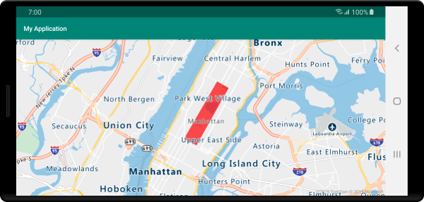
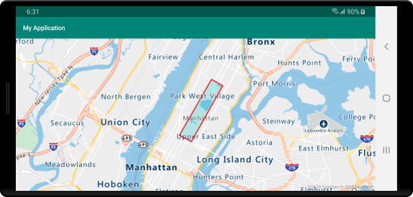
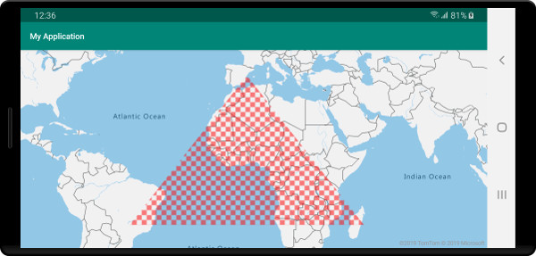

# Add a polygon layer to the map (Android SDK)

This article shows you how to render the areas of `Polygon` and `MultiPolygon` feature geometries on the map using a polygon layer.

## Prerequisites

Be sure to complete the steps in the [Quickstart: Create an Android app](quick-android-map.md) document. Code blocks in this article can be inserted into the maps `onReady` event handler.

## Use a polygon layer

When a polygon layer is connected to a data source and loaded on the map, it renders the area with `Polygon` and `MultiPolygon` features. To create a polygon, add it to a data source, and render it with a polygon layer using the `PolygonLayer` class.

::: zone pivot="programming-language-java-android"

```java
//Create a data source and add it to the map.
DataSource source = new DataSource();
map.sources.add(source);

//Create a rectangular polygon.
source.add(Polygon.fromLngLats(
    Arrays.asList(
        Arrays.asList(
            Point.fromLngLat(-73.98235, 40.76799),
            Point.fromLngLat(-73.95785, 40.80044),
            Point.fromLngLat(-73.94928, 40.79680),
            Point.fromLngLat(-73.97317, 40.76437),
            Point.fromLngLat(-73.98235, 40.76799)
        )
    )
));

//Create and add a polygon layer to render the polygon on the map, below the label layer.
map.layers.add(new PolygonLayer(source, 
    fillColor("red"),
    fillOpacity(0.7f)
), "labels");
```

::: zone-end

::: zone pivot="programming-language-kotlin"

```kotlin
//Create a data source and add it to the map.
val source = DataSource()
map.sources.add(source)

//Create a rectangular polygon.
source.add(
    Polygon.fromLngLats(
        Arrays.asList(
            Arrays.asList(
                Point.fromLngLat(-73.98235, 40.76799),
                Point.fromLngLat(-73.95785, 40.80044),
                Point.fromLngLat(-73.94928, 40.79680),
                Point.fromLngLat(-73.97317, 40.76437),
                Point.fromLngLat(-73.98235, 40.76799)
            )
        )
    )
)

//Create and add a polygon layer to render the polygon on the map, below the label layer.
map.layers.add(
    PolygonLayer(
        source,
        fillColor("red"),
        fillOpacity(0.7f)
    ), "labels"
)
```

::: zone-end

The following screenshot shows the above code rendering the area of a polygon using a polygon layer.



## Use a polygon and line layer together

A line layer is used to render the outline of polygons. The following code sample renders a polygon like the previous example, but now adds a line layer. This line layer is a second layer connected to the data source.

::: zone pivot="programming-language-java-android"

```java
//Create a data source and add it to the map.
DataSource source = new DataSource();
map.sources.add(source);

//Create a rectangular polygon.
source.add(Polygon.fromLngLats(
    Arrays.asList(
        Arrays.asList(
            Point.fromLngLat(-73.98235, 40.76799),
            Point.fromLngLat(-73.95785, 40.80044),
            Point.fromLngLat(-73.94928, 40.79680),
            Point.fromLngLat(-73.97317, 40.76437),
            Point.fromLngLat(-73.98235, 40.76799)
        )
    )
));

//Create and add a polygon layer to render the polygon on the map, below the label layer.
map.layers.add(new PolygonLayer(source,
    fillColor("rgba(0, 200, 200, 0.5)")
), "labels");

//Create and add a line layer to render the outline of the polygon.
map.layers.add(new LineLayer(source,
    strokeColor("red"),
    strokeWidth(2f)
));
```

::: zone-end

::: zone pivot="programming-language-kotlin"

```kotlin
//Create a data source and add it to the map.
val source = DataSource()
map.sources.add(source)

//Create a rectangular polygon.
source.add(
    Polygon.fromLngLats(
        Arrays.asList(
            Arrays.asList(
                Point.fromLngLat(-73.98235, 40.76799),
                Point.fromLngLat(-73.95785, 40.80044),
                Point.fromLngLat(-73.94928, 40.79680),
                Point.fromLngLat(-73.97317, 40.76437),
                Point.fromLngLat(-73.98235, 40.76799)
            )
        )
    )
)

//Create and add a polygon layer to render the polygon on the map, below the label layer.
map.layers.add(
    PolygonLayer(
        source,
        fillColor("rgba(0, 200, 200, 0.5)")
    ), "labels"
)

//Create and add a line layer to render the outline of the polygon.
map.layers.add(
    LineLayer(
        source,
        strokeColor("red"),
        strokeWidth(2f)
    )
)
```

::: zone-end

The following screenshot shows the above code rendering a polygon with its outline rendered using a line layer.



> [!TIP]
> When outlining a polygon with a line layer, be sure to close all rings in polygons such that each array of points has the same start and end point. If this is not done, the line layer may not connect the last point of the polygon to the first point.

## Fill a polygon with a pattern

In addition to filling a polygon with a color, you may use an image pattern to fill the polygon. Load an image pattern into the maps image sprite resources and then reference this image with the `fillPattern` option of the polygon layer.

::: zone pivot="programming-language-java-android"

```java
//Load an image pattern into the map image sprite.
map.images.add("fill-checker-red", R.drawable.fill_checker_red);

//Create a data source and add it to the map.
DataSource source = new DataSource();
map.sources.add(source);

//Create a polygon.
source.add(Polygon.fromLngLats(
    Arrays.asList(
        Arrays.asList(
            Point.fromLngLat(-50, -20),
            Point.fromLngLat(0, 40),
            Point.fromLngLat(50, -20),
            Point.fromLngLat(-50, -20)
        )
    )
));

//Create and add a polygon layer to render the polygon on the map, below the label layer.
map.layers.add(new PolygonLayer(source,
        fillPattern("fill-checker-red"),
        fillOpacity(0.5f)
), "labels");
```

::: zone-end

::: zone pivot="programming-language-kotlin"

```kotlin
//Load an image pattern into the map image sprite.
map.images.add("fill-checker-red", R.drawable.fill_checker_red)

//Create a data source and add it to the map.
val source = DataSource()
map.sources.add(source)

//Create a polygon.
source.add(
    Polygon.fromLngLats(
        Arrays.asList(
            Arrays.asList(
                Point.fromLngLat(-50, -20),
                Point.fromLngLat(0, 40),
                Point.fromLngLat(50, -20),
                Point.fromLngLat(-50, -20)
            )
        )
    )
)

//Create and add a polygon layer to render the polygon on the map, below the label layer.
map.layers.add(
    PolygonLayer(
        source,
        fillPattern("fill-checker-red"),
        fillOpacity(0.5f)
    ), "labels"
)
```

::: zone-end

For this sample, the following image was loaded into the drawable folder of the app.

| |
|:-----------------------------------------------------------------------:|
| fill-checker-red.png                                                    |

The following is a screenshot of the above code rendering a polygon with a fill pattern on the map.



## Next steps

See the following articles for more code samples to add to your maps:

> [!div class="nextstepaction"]
> [Create a data source](create-data-source-android-sdk.md)

> [!div class="nextstepaction"]
> [Use data-driven style expressions](data-driven-style-expressions-android-sdk.md)

> [!div class="nextstepaction"]
> [Add a line layer](android-map-add-line-layer.md)

> [!div class="nextstepaction"]
> [Add a polygon extrusion layer](map-extruded-polygon-android.md)
