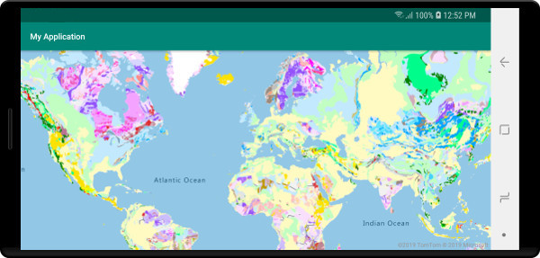
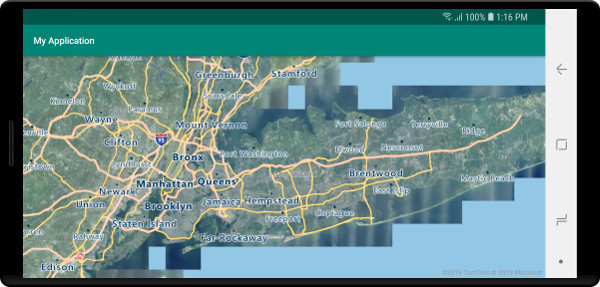

# Add a tile layer to a map (Android SDK)

This article shows you how to render a tile layer on a map using the Azure Maps Android SDK. Tile layers allow you to superimpose images on top of Azure Maps base map tiles. More information on Azure Maps tiling system can be found in the [Zoom levels and tile grid](zoom-levels-and-tile-grid.md) documentation.

A Tile layer loads in tiles from a server. These images can be pre-rendered and stored like any other image on a server, using a naming convention that the tile layer understands. Or, these images can be rendered with a dynamic service that generates the images near real time. There are three different tile service naming conventions supported by Azure Maps TileLayer class:

* X, Y, Zoom notation - Based on the zoom level, x is the column and y is the row position of the tile in the tile grid.
* Quadkey notation - Combination x, y, zoom information into a single string value that is a unique identifier for a tile.
* Bounding Box - Bounding box coordinates can be used to specify an image in the format `{west},{south},{east},{north}`, which is commonly used by [web-mapping Services (WMS)](https://www.opengeospatial.org/standards/wms).

> [!TIP]
> A TileLayer is a great way to visualize large data sets on the map. Not only can a tile layer be generated from an image, but vector data can also be rendered as a tile layer too. By rendering vector data as a tile layer, the map control only needs to load the tiles, which can be much smaller in file size than the vector data they represent. This technique is used by many who need to render millions of rows of data on the map.

The tile URL passed into a Tile layer must be an http/https URL to a TileJSON resource or a tile URL template that uses the following parameters:

* `{x}` - X position of the tile. Also needs `{y}` and `{z}`.
* `{y}` - Y position of the tile. Also needs `{x}` and `{z}`.
* `{z}` - Zoom level of the tile. Also needs `{x}` and `{y}`.
* `{quadkey}` - Tile quadkey identifier based on the Bing Maps tile system naming convention.
* `{bbox-epsg-3857}` - A bounding box string with the format `{west},{south},{east},{north}` in the EPSG 3857 Spatial Reference System.
* `{subdomain}` - A placeholder for the subdomain values, if the subdomain value is specified.
* `azmapsdomain.invalid` - A placeholder to align the domain and authentication of tile requests with the same values used by the map. Use this when calling a tile service hosted by Azure Maps.

## Prerequisites

To complete the process in this article, you need to install [Azure Maps Android SDK](how-to-use-android-map-control-library.md) to load a map.

## Add a tile layer to the map

This sample shows how to create a tile layer that points to a set of tiles. This sample uses the "x, y, zoom" tiling system. The source of this tile layer is the [OpenSeaMap project](https://openseamap.org/index.php), which contains crowd sourced nautical charts. Often when viewing tile layers it is desirable to be able to clearly see the labels of cities on the map. This behavior can be achieved by inserting the tile layer below the map label layers.

::: zone pivot="programming-language-java-android"

```java
TileLayer layer = new TileLayer(
    tileUrl("https://tiles.openseamap.org/seamark/{z}/{x}/{y}.png"),
    opacity(0.8f),
    tileSize(256),
    minSourceZoom(7),
    maxSourceZoom(17)
);

map.layers.add(layer, "labels");
```

::: zone-end

::: zone pivot="programming-language-kotlin"

```kotlin
val layer = TileLayer(
    tileUrl("https://tiles.openseamap.org/seamark/{z}/{x}/{y}.png"),
    opacity(0.8f),
    tileSize(256),
    minSourceZoom(7),
    maxSourceZoom(17)
)

map.layers.add(layer, "labels")
```

::: zone-end

The following screenshot shows the above code displaying a tile layer of nautical information on a map that has a dark grayscale style.


## Add an OGC web-mapping service (WMS)

A web-mapping service (WMTS) is an Open Geospatial Consortium (OGC) standard for serving images of map data. There are many open data sets available in this format that you can use with Azure Maps. This type of service can be used with a tile layer if the service supports the `EPSG:3857` coordinate reference system (CRS). When using a WMS service, set the width and height parameters to the same value that is supported by the service, be sure to set this same value in the `tileSize` option. In the formatted URL, set the `BBOX` parameter of the service with the `{bbox-epsg-3857}` placeholder.

::: zone pivot="programming-language-java-android"

``` java
TileLayer layer = new TileLayer(
    tileUrl("https://mrdata.usgs.gov/services/gscworld?FORMAT=image/png&HEIGHT=1024&LAYERS=geology&REQUEST=GetMap&STYLES=default&TILED=true&TRANSPARENT=true&WIDTH=1024&VERSION=1.3.0&SERVICE=WMS&CRS=EPSG:3857&BBOX={bbox-epsg-3857}"),
    tileSize(1024)
);

map.layers.add(layer, "labels");
```

::: zone-end

::: zone pivot="programming-language-kotlin"

```kotlin
val layer = TileLayer(
    tileUrl("https://mrdata.usgs.gov/services/gscworld?FORMAT=image/png&HEIGHT=1024&LAYERS=geology&REQUEST=GetMap&STYLES=default&TILED=true&TRANSPARENT=true&WIDTH=1024&VERSION=1.3.0&SERVICE=WMS&CRS=EPSG:3857&BBOX={bbox-epsg-3857}"),
    tileSize(1024)
)

map.layers.add(layer, "labels")
```

::: zone-end

The following screenshot shows the above code overlaying a web-mapping service of geological data from the [U.S. Geological Survey (USGS)](https://mrdata.usgs.gov/) on top of a map, below the labels.



## Add an OGC web-mapping tile service (WMTS)

A web-mapping tile service (WMTS) is an Open Geospatial Consortium (OGC) standard for serving tiled based overlays for maps. There are many open data sets available in this format that you can use with Azure Maps. This type of service can be used with a tile layer if the service supports the `EPSG:3857` or `GoogleMapsCompatible` coordinate reference system (CRS). When using a WMTS service, set the width and height parameters to the same value that is supported by the service, be sure to set this same value in the `tileSize` option. In the formatted URL, replace the following placeholders accordingly:

* `{TileMatrix}` => `{z}`
* `{TileRow}` => `{y}`
* `{TileCol}` => `{x}`

::: zone pivot="programming-language-java-android"

``` java
TileLayer layer = new TileLayer(
    tileUrl("https://basemap.nationalmap.gov/arcgis/rest/services/USGSImageryOnly/MapServer/WMTS/tile/1.0.0/USGSImageryOnly/default/GoogleMapsCompatible/{z}/{y}/{x}"),
    tileSize(256),
    bounds(-173.25000107492872, 0.0005794121990209753, 146.12527718104752, 71.506811402077),
    maxSourceZoom(18)
);

map.layers.add(layer, "transit");
```

::: zone-end

::: zone pivot="programming-language-kotlin"

```kotlin
val layer = TileLayer(
    tileUrl("https://basemap.nationalmap.gov/arcgis/rest/services/USGSImageryOnly/MapServer/WMTS/tile/1.0.0/USGSImageryOnly/default/GoogleMapsCompatible/{z}/{y}/{x}"),
    tileSize(256),
    bounds(-173.25000107492872, 0.0005794121990209753, 146.12527718104752, 71.506811402077),
    maxSourceZoom(18)
)

map.layers.add(layer, "transit")
```

::: zone-end

The following screenshot shows the above code overlaying a web-mapping tile service of imagery from the [U.S. Geological Survey (USGS) National Map](https://viewer.nationalmap.gov/services/) on top of a map, below the roads and labels.



## Next steps

See the following article to learn more about ways to overlay imagery on a map.

> [!div class="nextstepaction"]
> [Image layer](map-add-image-layer-android.md)
