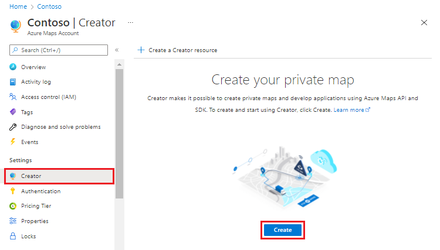
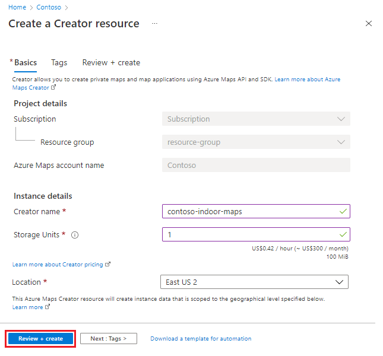

# Manage Azure Maps Creator (Preview) 

> [!IMPORTANT]
> Azure Maps Creator services are currently in public preview.
> This preview version is provided without a service level agreement, and it's not recommended for production workloads. Certain features might not be supported or might have constrained capabilities. 
> For more information, see [Supplemental Terms of Use for Microsoft Azure Previews](https://azure.microsoft.com/support/legal/preview-supplemental-terms/).

Azure Maps Creator lets you create private indoor map data. Using the Azure Maps API and the Indoor Maps module, you can develop interactive and dynamic indoor map web applications. Currently, Creator is only available in the United States using the S1 pricing tier.

This article takes you through the steps to create and delete a Creator resource in an Azure Maps account.

## Create Creator (Preview) Resource

1. Sign in to the [Azure portal](https://portal.azure.com)

2. Select your Azure Maps account. If you can't see your Azure Maps account under the **Recent resources**, then navigate to the Azure portal menu. Select **All resources**. Find and select your Azure Maps account.

    

3. Once you're on the Azure Maps account page, navigate to the **Overview** option under **Creator**. Select  **Create**  to create an Azure Maps Creator resource.

    

4. Enter the name and location for your Creator resource. Currently, Creator is only supported in the United States. Select **Review + create**.

   

5. Review your settings and select **Create**.

    

6. When the deployment completes, you'll see a page with a success or a failure message.

   

7. Select **Go to resource**. Your Creator resource view page shows the status of your Creator resource and the chosen demographic region.

    

   >[!NOTE]
   >From the Creator resource page, you can navigate back to the Azure Maps account it belongs to by selecting Azure Maps Account.

## Delete Creator (Preview) Resource

To delete the Creator resource, navigate to your Azure Maps account. Select **Overview** under **Creator**. Select the **Delete** button.

>[!WARNING]
>When you delete the Creator resource of your Azure Maps account, you will also delete the datasets, tilesets, and feature statesets created using Creator services.

Select the **Delete** button and type your Creator name to confirm deletion. Once the resource is deleted, you'll see a confirmation page, like in the image below:

## Authentication

Creator (Preview) inherits Azure Maps Access Control (IAM) settings. All API calls for data access must be sent with authentication and authorization rules.

Creator usage data is incorporated in your Azure Maps usage charts and activity log.  For more information, see [Manage authentication in Azure Maps](./how-to-manage-authentication.md).

## Access to Creator services

Creator services (Preview) and services that use data hosted in Creator (for example, Render service), are accessible at a geographical URL. The geographical URL is determined by the location selected during creation. For example, if Creator is created in the United States geographical location, all calls to the Conversion service must be submitted to `us.atlas.microsoft.com/conversion/convert`.

Also, all data imported into Creator should be uploaded into the same geographical location as the Creator resource. For example, if Creator is provisioned in the United Stated, all raw data should be uploaded via `us.atlas.microsoft.com/mapData/upload`.

## Next steps

Introduction to Creator services (Preview) for indoor mapping:

> [!div class="nextstepaction"]
> [Data Upload](creator-indoor-maps.md#upload-a-drawing-package)

> [!div class="nextstepaction"]
> [Data Conversion](creator-indoor-maps.md#convert-a-drawing-package)

> [!div class="nextstepaction"]
> [Dataset](creator-indoor-maps.md#datasets)

> [!div class="nextstepaction"]
> [Tileset](creator-indoor-maps.md#tilesets)

> [!div class="nextstepaction"]
> [Feature State set](creator-indoor-maps.md#feature-statesets)

Learn how to use the Creator services (Preview) to render indoor maps in your application:

> [!div class="nextstepaction"]
> [Azure Maps Creator tutorial](tutorial-creator-indoor-maps.md)

> [!div class="nextstepaction"]
> [Indoor map dynamic styling](indoor-map-dynamic-styling.md)

> [!div class="nextstepaction"]
> [Use the Indoor Maps module](how-to-use-indoor-module.md)