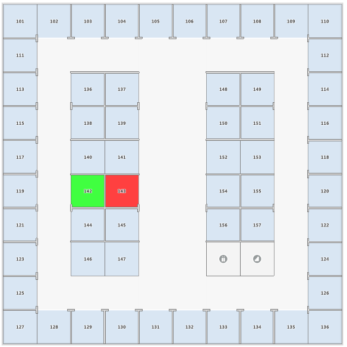

# Implement dynamic styling for Creator indoor maps

Azure Maps Creator [Feature State service](/rest/api/maps/v2/featurestate) lets you apply styles based on the dynamic properties of indoor map data features.  For example, you can render facility meeting rooms with a specific color to reflect occupancy status. This article describes how to dynamically render indoor map features with the [Feature State service](/rest/api/maps/v2/featurestate) and the [Indoor Web Module](how-to-use-indoor-module.md).

## Prerequisites

1. [Create an Azure Maps account](quick-demo-map-app.md#create-an-azure-maps-account)
2. [Obtain a primary subscription key](quick-demo-map-app.md#get-the-primary-key-for-your-account), also known as the primary key or the subscription key.
3. [Create a Creator resource](how-to-manage-creator.md)
4. Download the [sample Drawing package](https://github.com/Azure-Samples/am-creator-indoor-data-examples).
5. [Create an indoor map](tutorial-creator-indoor-maps.md) to obtain a `tilesetId` and `statesetId`.
6. Build a web application by following the steps in [How to use the Indoor Map module](how-to-use-indoor-module.md).

This tutorial uses the [Postman](https://www.postman.com/) application, but you may choose a different API development environment.

## Implement dynamic styling

Once you complete the prerequisites, you should have a simple web application configured with your subscription key, `tilesetId`, and `statesetId`.

### Select features

To implement dynamic styling, a feature, such as a meeting or conference room, must be referenced by its feature `id`. You'll use the feature `id` to update the dynamic property or *state* of that feature. To view the features defined in a dataset, you can use one of the following methods:

* WFS API (Web Feature Service). Datasets can be queried using the [WFS API](/rest/api/maps/v2/wfs). WFS follows the Open Geospatial Consortium API Features. The WFS API is helpful for querying features within a dataset. For example, you can use WFS to find all mid-size meeting rooms of a given facility and floor level.

* Implement customized code that allows a user to select features on a map using your web application. In this article, we'll make use of this option.  

The following script implements the mouse click event. The code retrieves the feature `id` based on the clicked point. In your application, you can insert the code below your Indoor Manager code block. Run your application and check the console to obtain the feature `id` of the clicked point.

```javascript
/* Upon a mouse click, log the feature properties to the browser's console. */
map.events.add("click", function(e){

    var features = map.layers.getRenderedShapes(e.position, "indoor");

    features.forEach(function (feature) {
        if (feature.layer.id == 'indoor_unit_office') {
            console.log(feature);
        }
    });
});
```

The [Create an indoor map](tutorial-creator-indoor-maps.md) tutorial configured the feature stateset to accept state updates for `occupancy`.

In the next section, we'll set the occupancy *state* of office `UNIT26` to `true`. while office `UNIT27` will be set to `false`.

### Set occupancy status

 We'll now update the state of the two offices, `UNIT26` and `UNIT27`:

1. In the Postman app, select **New**.

2. In the **Create New** window, select **Collection**.

3. Select **New** again.

4. In the **Create New** window, select **Request**.

5. Enter a **Request name** for the request, such as *POST Data Upload*.

6. Select the collection you previously created, and then select **Save**.

7. Enter the following URL to the [Feature Update States API](/rest/api/maps/v2/featurestate/updatestatespreview) (replace `{Azure-Maps-Primary-Subscription-key}` with your primary subscription key and `statesetId` with the `statesetId`):

    ```http
    https://us.atlas.microsoft.com/featurestatesets/{statesetId}/featureStates/UNIT26?api-version=2.0&subscription-key={Azure-Maps-Primary-Subscription-key}
    ```

8. Select the **Headers** tab.

9. In the **KEY** field, select `Content-Type`. In the **VALUE** field select `application/json`.

     :::image type="content" source="./media/tutorial-creator-indoor-maps/stateset-header.png"alt-text="Header tab information for stateset creation.":::

10. Select the **Body** tab.

11. Select **raw** and **JSON** in the dropdown lists.

12. Copy-paste the following JSON style into the **Body** window:

    ```json
    {
        "states": [
            {
                "keyName": "occupied",
                "value": true,
                "eventTimestamp": "2020-11-14T17:10:20"
            }
        ]
    }
    ```

    >[!IMPORTANT]
    >The update will be saved only if the posted time stamp is after the time stamp used in previous feature state update requests for the same feature `ID`.

13. Change the URL you used in step 7 by replacing `UNIT26` with `UNIT27`:

    ```http
    https://us.atlas.microsoft.com/featurestatesets/{statesetId}/featureStates/UNIT27?api-version=2.0&subscription-key={Azure-Maps-Primary-Subscription-key}
    ```

14. Copy-paste the following JSON style into the **Body** window:

    ``` json
    {
        "states": [
            {
                "keyName": "occupied",
                "value": false,
                "eventTimestamp": "2020-11-14T17:10:20"
            }
        ]
    }
    ```

### Visualize dynamic styles on a map

The web application you previously opened in a browser should now reflect the updated state of the map features. `UNIT27`(142) should appear green and `UNIT26`(143) should appear red.



[See live demo](https://azuremapscodesamples.azurewebsites.net/?sample=Creator%20indoor%20maps)

## Next steps

Learn more by reading:

> [!div class="nextstepaction"]
> [Creator for indoor mapping](creator-indoor-maps.md)

See to the references for the APIs mentioned in this article:

> [!div class="nextstepaction"]
> [Data Upload](creator-indoor-maps.md#upload-a-drawing-package)

> [!div class="nextstepaction"]
> [Data Conversion](creator-indoor-maps.md#convert-a-drawing-package)

> [!div class="nextstepaction"]
> [Dataset](creator-indoor-maps.md#datasets)

> [!div class="nextstepaction"]
> [Tileset](creator-indoor-maps.md#tilesets)

> [!div class="nextstepaction"]
> [Feature State set](creator-indoor-maps.md#feature-statesets)

> [!div class="nextstepaction"]
> [WFS service](creator-indoor-maps.md#web-feature-service-api)