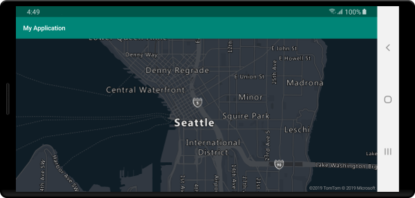
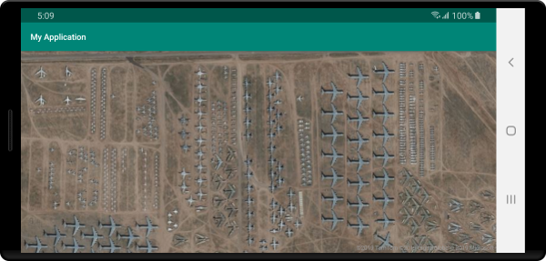

# Set map style (Android SDK)

This article shows you two ways to set map styles using the Azure Maps Android SDK. Azure Maps has six different maps styles to choose from. For more information about supported map styles, see [supported map styles in Azure Maps](supported-map-styles.md).

## Prerequisites

Be sure to complete the steps in the [Quickstart: Create an Android app](quick-android-map.md) document.

## Set map style in the layout

You can set a map style in the layout file for your activity class when adding the map control. The following code sets the center location, zoom level and map style.

```XML
<com.microsoft.azure.maps.mapcontrol.MapControl
    android:id="@+id/mapcontrol"
    android:layout_width="match_parent"
    android:layout_height="match_parent"
    app:mapcontrol_centerLat="47.602806"
    app:mapcontrol_centerLng="-122.329330"
    app:mapcontrol_zoom="12"
    app:mapcontrol_style="grayscale_dark"
    />
```

The following screenshot shows the above code displaying a road map with the grayscale dark style.



## Set map style in code

The map style can be set in programmatically in code by using the `setStyle` method of the map. The following code sets the center location and zoom level using the maps `setCamera` method and the map style to `SATELLITE_ROAD_LABELS`.

::: zone pivot="programming-language-java-android"

```java
mapControl.onReady(map -> {

    //Set the camera of the map.
    map.setCamera(center(Point.fromLngLat(-122.33, 47.64)), zoom(14));

    //Set the style of the map.
    map.setStyle(style(MapStyle.SATELLITE_ROAD_LABELS));
});
```

::: zone-end

::: zone pivot="programming-language-kotlin"

```kotlin
mapControl!!.onReady { map: AzureMap ->
    //Set the camera of the map.
    map.setCamera(center(Point.fromLngLat(-122.33, 47.64)), zoom(14))

    //Set the style of the map.
    map.setStyle(style(MapStyle.SATELLITE_ROAD_LABELS))
}
```

::: zone-end

The following screenshot shows the above code displaying a map with the satellite road labels style.



## Setting the map camera

The map camera controls the what part of the map is displayed in the map. The camera can be in the layout our programmatically in code. When setting it in code, there are two main methods for setting the position of the map; using center and zoom, or passing in a bounding box. The following code shows how to set all optional camera options when using `center` and `zoom`.

::: zone pivot="programming-language-java-android"

```java
//Set the camera of the map using center and zoom.
map.setCamera(
    center(Point.fromLngLat(-122.33, 47.64)), 

    //The zoom level. Typically a value between 0 and 22.
    zoom(14),

    //The amount of tilt in degrees the map where 0 is looking straight down.
    pitch(45),

    //Direction the top of the map is pointing in degrees. 0 = North, 90 = East, 180 = South, 270 = West
    bearing(90),

    //The minimum zoom level the map will zoom-out to when animating from one location to another on the map.
    minZoom(10),
    
    //The maximum zoom level the map will zoom-in to when animating from one location to another on the map.
    maxZoom(14)
);
```

::: zone-end

::: zone pivot="programming-language-kotlin"

```kotlin
//Set the camera of the map using center and zoom.
map.setCamera(
    center(Point.fromLngLat(-122.33, 47.64)), 

    //The zoom level. Typically a value between 0 and 22.
    zoom(14),

    //The amount of tilt in degrees the map where 0 is looking straight down.
    pitch(45),

    //Direction the top of the map is pointing in degrees. 0 = North, 90 = East, 180 = South, 270 = West
    bearing(90),

    //The minimum zoom level the map will zoom-out to when animating from one location to another on the map.
    minZoom(10),
    
    //The maximum zoom level the map will zoom-in to when animating from one location to another on the map.
    maxZoom(14)
)
```

::: zone-end

Often it is desirable to focus the map over a set of data. A bounding box can be calculated from features using the `MapMath.fromData` method and can be passed into the `bounds` option of the map camera. When setting a map view based on a bounding box, it's often useful to specify a `padding` value to account for the pixel size of points being rendered as bubbles or symbols. The following code shows how to set all optional camera options when using a bounding box to set the position of the camera.

::: zone pivot="programming-language-java-android"

```java
//Set the camera of the map using a bounding box.
map.setCamera(
    //The area to focus the map on.
    bounds(BoundingBox.fromLngLats(
        //West
        -122.4594,

        //South
        47.4333,
        
        //East
        -122.21866,
        
        //North
        47.75758
    )),

    //Amount of pixel buffer around the bounding box to provide extra space around the bounding box.
    padding(20),

    //The maximum zoom level the map will zoom-in to when animating from one location to another on the map.
    maxZoom(14)
);
```

::: zone-end

::: zone pivot="programming-language-kotlin"

```kotlin
//Set the camera of the map using a bounding box.
map.setCamera(
    //The area to focus the map on.
    bounds(BoundingBox.fromLngLats(
        //West
        -122.4594,

        //South
        47.4333,
        
        //East
        -122.21866,
        
        //North
        47.75758
    )),

    //Amount of pixel buffer around the bounding box to provide extra space around the bounding box.
    padding(20),

    //The maximum zoom level the map will zoom-in to when animating from one location to another on the map.
    maxZoom(14)
)
```

::: zone-end

Note that the aspect ratio of a bounding box may not be the same as the aspect ratio of the map, as such the map will often show the full bounding box area, but will often only be tight vertically or horizontally.

## Next steps

See the following articles for more code samples to add to your maps:

> [!div class="nextstepaction"]
> [Add a symbol layer](how-to-add-symbol-to-android-map.md)

> [!div class="nextstepaction"]
> [Add a bubble layer](map-add-bubble-layer-android.md)
