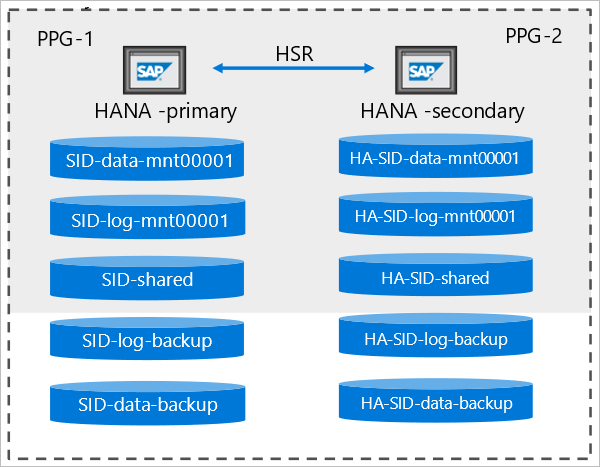
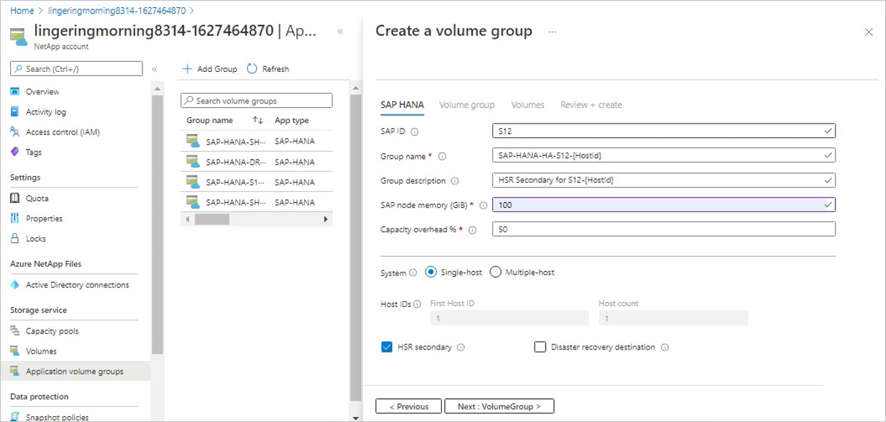
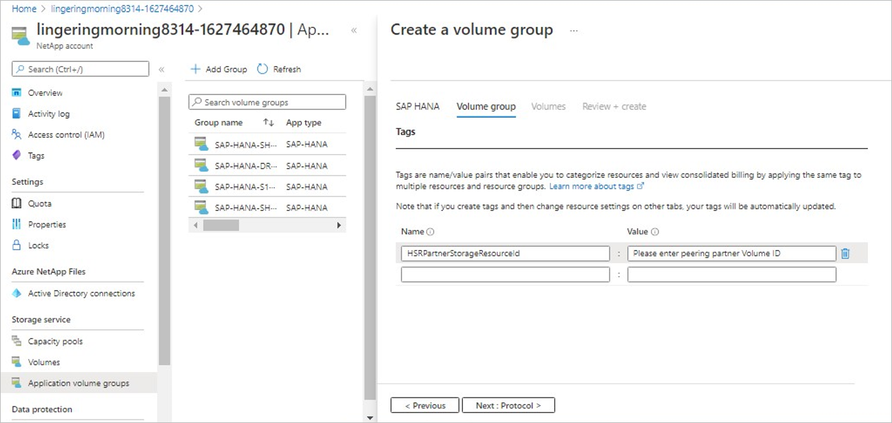
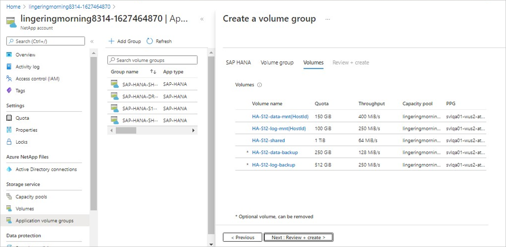
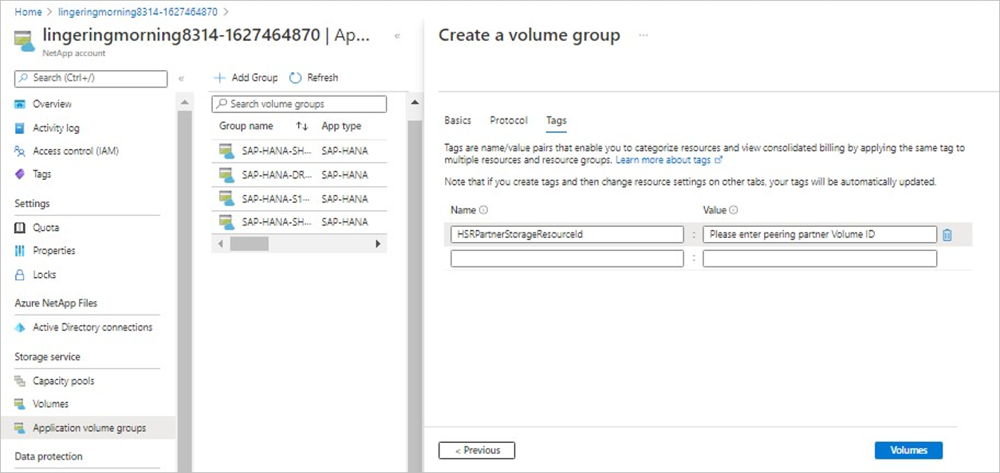

# Add volumes for an SAP HANA system as a secondary database in HSR

This article describes using application volume group to add volumes for an SAP HANA system as a secondary database in HANA System Replication (HSR).

## HANA System Replication 

The HANA System Replication (HSR) functionality enables SAP HANA databases to synchronously or asynchronously replicate from a primary SAP HANA system to a secondary SAP HANA system. The HSR uses application-level synchronization. The primary and the secondary SAP HANA systems have the same storage requirements, except for the following differences:

* Both the primary and the secondary SAP HANA databases have the same SAP ID (SID), but their volume names need to be different.

* The secondary SAP HANA system might be in a different location, typically a different zone or region.  As such, the proximity placement group (PPG, availability set) is different.

The following diagram illustrates the concept of HSR: 

  

To enable HSR, the configuration of the secondary SAP HANA system must be identical to the primary SAP HANA system. That is, if the primary system is a single-host HANA system, then the secondary SAP HANA system also needs to be a single-hosts system. The same applies for multiple host systems.

The workflow for creating a secondary SAP HANA system is similar to the workflow for creating the primary SAP HANA system. However, a key difference is that you need to select the **HSR secondary** option in the SAP HANA tab to indicate that you are creating a replication secondary system for the SAP HANA system.

## Steps

This section shows an example of creating a single-host, secondary SAP HANA system.

1. From your NetApp account, select **Application volume groups**, and click **+Add Group**. Then, in Deployment Type, select **SAP HANA** and click **Next**. 

2. In the **SAP HANA** tab, provide HANA specific information. 

    > [!IMPORTANT]
    > Be sure to select the **HSR secondary** option to indicate that you are creating a replication secondary system for the HANA system.  

    * **SAP ID (SID)**:    
        The three alphanumeric-character SAP HANA system identifier.
    * **Group name**: 
        The volume group name. 
    * **SAP node memory**:  
        This value defines the size of the SAP HANA database on the host. It is used to calculate the required volume size and throughput. 
    * **Capacity overhead (%)**:  
        When you use snapshots for data protection, you need to plan for extra capacity. This field will add additional size (%) for the data volume.  
        You can estimate this value by using `"change rate per day" X "number of days retention"`.
    * **Single-host**:  
        Select this option for an SAP HANA single-host system or the first host for a multiple-host system. Shared and backup volumes can be created only with the first host.
    * **Multiple-host**: 
        Select this option to add additional hosts to a multiple-hosts HANA system.
    * **HSR secondary**:  
        Select this option to create a HANA database that will be a replication secondary system for SAP HANA System Replication (HSR).

    Selecting **HSR secondary** also triggers the naming convention for the volume group name to include `"-HA-"` to indicate the HA setup.   

    Click **Next: Volume Group** to continue.

    

3.	In the **Volume group** tab, provide information for creating the volume group:  

    * **Proximity placement group (PPG)**: 
        Specifies that the data, log, and shared volumes are to be created close to the VMs.
    * **Capacity pool**: 
        All volumes will be placed in a single manual QoS capacity pool.  
        If you want to create the log-backup and data-backup volumes in a separate capacity pool, you can choose not to add those volumes to the volume group.
    * **Virtual network**: 
        Specify an existing VNet where the VMs are placed. 
    * **Subnet**: 
        Specify the delegated subnet where the IP addresses for the NFS exports will be created. Ensure that you have a delegated subnet with enough free IP addresses.

    Click **Next: Protocol**.

4. In the **Protocols** section of the Volume Group tab, you can modify the **Export Policy**, which should be common to all volumes.  

    Click **Next: Tags**.

5. Because the **HSR secondary** option is selected, the **Tags** section of the Volume Group tab is populated with the tag `HSRPartnerStorageResourceId`. 

    This tag marks the volume resource ID of the corresponding primary volume in the HSR setup, so that the primary volume can be identified for each secondary volume that will be created. 

    You will be able to modify this tag for each volume. 

    > [!IMPORTANT]
    > At the group level, filling the TAG will populate all the volumes in the group with the same volume ID. You will need to change the volume ID for each individual volume later in the workflow or when you update the volumes. Using this TAG is optional; it’s for documentation purposes only.

    Click **Next: Volumes**.

    

6. The **Volumes** tab displays information about the volumes that are being created.  

    The volume naming convention includes an `"HA-"` prefix to indicate that the volume belong to the secondary system of an HSR setup.

    

7. In the **Volumes** tab, you can select each volume to view or change the volume details, including the protocol and tag for the volume.

    In the **Tags** section of a volume, you can populate the `HSRPartnerStorageResourceId` tag with the resource ID of the corresponding primary volume. 

    This action only marks the primary volume; it does not validate the provided resource ID.

    

    Click **Volumes** to return to the Volumes overview page.  

8. Click **Review + Create** to list all volumes that will be created. Click **Create Volume Group** to start the volume group creation. 

To add more HANA hosts for a multiple-host SAP HANA system, follow steps in [Add hosts to a multiple-host SAP HANA system](application-volume-group-add-hosts.md). Be sure to select the **HSR secondary** option in the SAP HANA tab to indicate the replication secondary system.   

## Next steps  

* [Understand Azure NetApp Files application volume group for SAP HANA](application-volume-group-introduction.md)
* [Requirements and considerations for application volume group for SAP HANA](application-volume-group-considerations.md)
* [Deploy the first SAP HANA host using application volume group for SAP HANA](application-volume-group-deploy-first-host.md)
* [Add hosts to a multiple-host SAP HANA system using application volume group for SAP HANA](application-volume-group-add-hosts.md)
* [Add volumes for an SAP HANA system as a DR system using cross-region replication](application-volume-group-disaster-recovery.md)
* [Manage volumes in application volume group](application-volume-group-manage-volumes.md)
* [Delete an application volume group](application-volume-group-delete.md)
* [Application volume group FAQs](faq-application-volume-group.md)
