# Deploy the first SAP HANA host using application volume group for SAP HANA

All deployments start with the volumes for a single SAP HANA host. This is the case even for large, multiple-host installations. The shared, log-backup, and data-backup volumes will be created only for the first host. All other hosts in a multiple-host environment will share these volumes, and they will add only data and log volumes for each additional host.

This article describes how to deploy the first SAP HANA host using Azure NetApp Files application volume group for SAP HANA.

## Before you begin

> [!IMPORTANT]
> Azure NetApp Files application volume group for SAP HANA is currently in preview. You need to submit a waitlist request for accessing the feature through the [**Azure NetApp Files application volume group for SAP HANA waitlist submission page**](https://aka.ms/anfavgpreviewsignup). Wait for an official confirmation email from the Azure NetApp Files team before using application volume group for SAP HANA. 

You should understand the [requirements and considerations for application volume group for SAP HANA](application-volume-group-considerations.md). 

## Steps 

1. From your NetApp account, select **Application volume groups**, and click **+Add Group**.

    [ 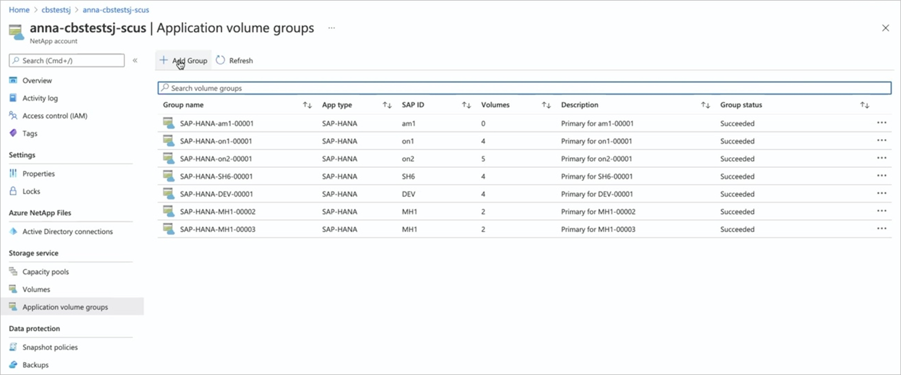 ](../media/azure-netapp-files/application-volume-group-add-group.png#lightbox)

2. In Deployment Type, select **SAP HANA** and click **Next**. 

    [ 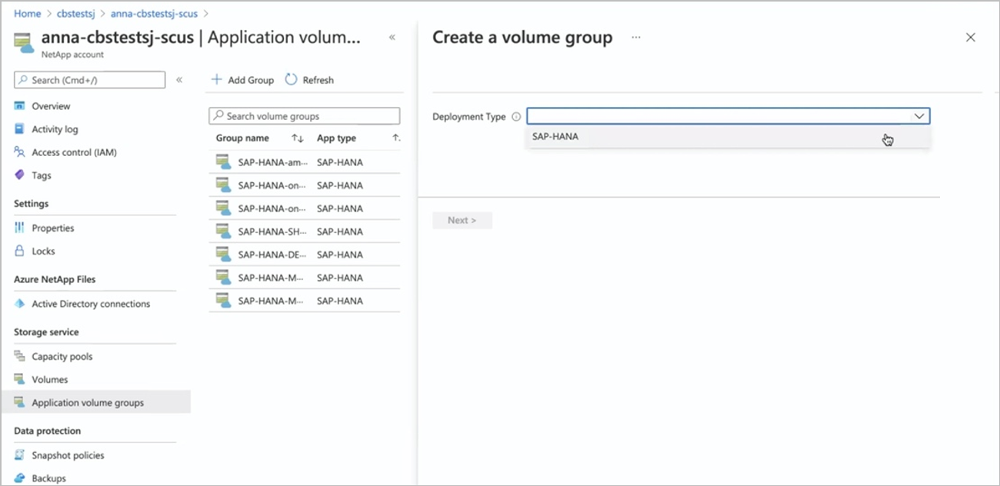 ](../media/azure-netapp-files/application-volume-group-create-group.png#lightbox)

3. In the **SAP HANA** tab, provide HANA-specific information:   

    * **SAP ID (SID**):    
        The three alphanumeric-character SAP HANA system identifier.
    * **Group name**: 
        The volume group name. For a multiple-host SAP HANA system, each host will create its own group. Because you are creating the first host, the group name starts with `'Name-proposal'-00001`.
    * **SAP node memory**:  
        This value defines the size of the SAP HANA database on the host. It is used to calculate the required volume size and throughput. 
    * **Capacity overhead (%)**:  
        When you use snapshots for data protection, you need to plan for extra capacity. This field will add an additional size (%) for the data volume.  
        You can estimate this value by using `"change rate per day" X "number of days retention"`.
    * **Single-host**:  
        Select this option for an SAP HANA single-host system or the first host for a multiple-host system. Only the shared, log-backup, and data-backup volumes will be created with the first host.
    * **Multiple-host**:
        Select this option for adding additional hosts to a multiple-hosts HANA system.

    Click **Next: Volume Group**.

    

4. In the **Volume group** tab, provide information for creating the volume group:  

    * **Proximity placement group (PPG)**:  
        Specifies that the data, log, and shared volumes are to be created close to the VMs.
    * **Capacity pool**:  
        All volumes will be placed in a single manual QoS capacity pool.  
        If you want to create the log-backup and data-backup volumes in a separate capacity pool, you can choose not to add those volumes to the volume group.
    * **Virtual network**:  
        Specify an existing VNet where the VMs are placed. 
    * **Subnet**:  
        Specify the delegated subnet where the IP addresses for the NFS exports will be created. Ensure that you have a delegated subnet with enough free IP addresses.

    Click **Next: Tag**. 

    

5. In the **Tags** section of the Volume Group tab, you can add tags as needed for the volumes.   

    Click **Next: Protocol**. 

    [ 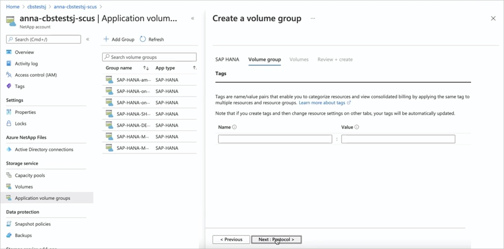 ](../media/azure-netapp-files/application-add-tags.png#lightbox)

6. In the **Protocols** section of the Volume Group tab, you can modify the **Export Policy**, which should be common to all volumes.  

    Click **Next: Volumes**. 

    [ 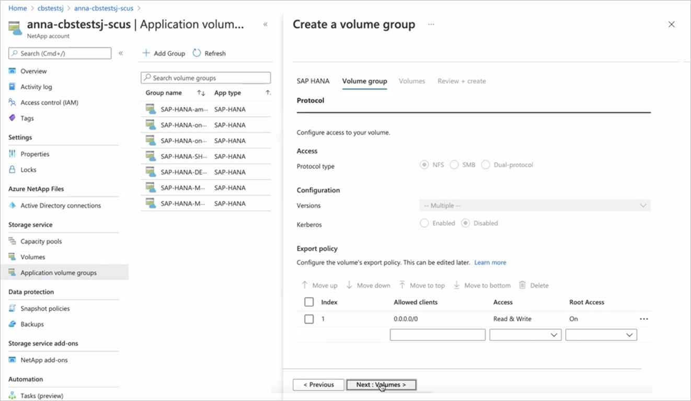 ](../media/azure-netapp-files/application-protocols-tag.png#lightbox)

7. The **Volumes** tab summarizes the volumes that are being created with proposed volume name, quota, and throughput. 

    The Volumes tab also shows that only the data, log, and shared volumes will be created close to the HANA VMs.  The other volumes (data-backup and log-backup) are created at a different location within the region.

    The creation for the data-backup and log-backup volumes is optional.

    [ 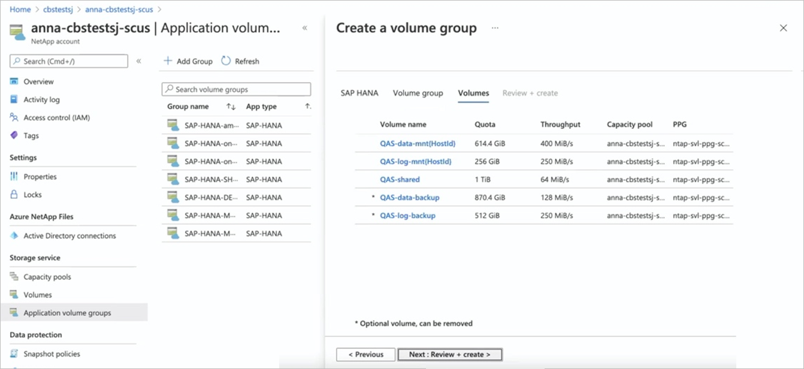 ](../media/azure-netapp-files/application-volume-list.png#lightbox)

8. In the **Volumes** tab, you can select each volume to view or change the volume details. For example, select "data-*volume-name*".  

    Not all settings can be changed because of SAP HANA certification restrictions.
 
    When you select a volume, you can change the following values in the **Basics** tab:  

    * **Volume Name**:   
        It is recommended that you retain the suggested naming conventions.
    * **Quota**:   
        The size of the volume.
    * **Throughput**:  
        You can reduce the throughput requirements for development or test systems accordingly to the value required for your use cases.

    Click **Next: Protocols** to review the protocol settings. 

    [ 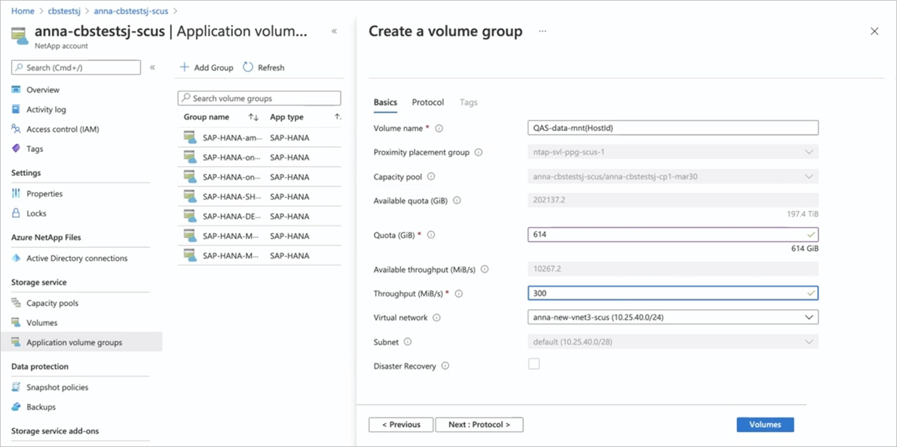 ](../media/azure-netapp-files/application-create-volume-basics-tab.png#lightbox)

9. In the **Protocols** tab of a volume, you can modify **File path** (the export name where the volume can be mounted) and **Export policy** as needed.

    You cannot change the protocol for the data and log volumes. 

    Click the **Tags** tab if you want to specify tags for a volume. Or click **Volumes** to return to the Volumes overview page.

    [ 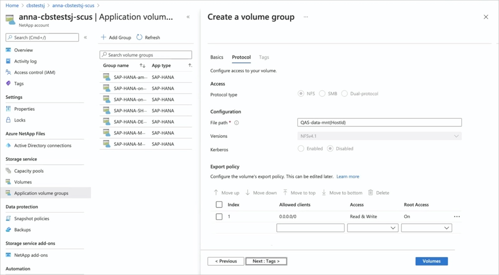 ](../media/azure-netapp-files/application-create-volume-protocol-tab.png#lightbox)

10.	The **Volumes** page displays volume details.  

    [ 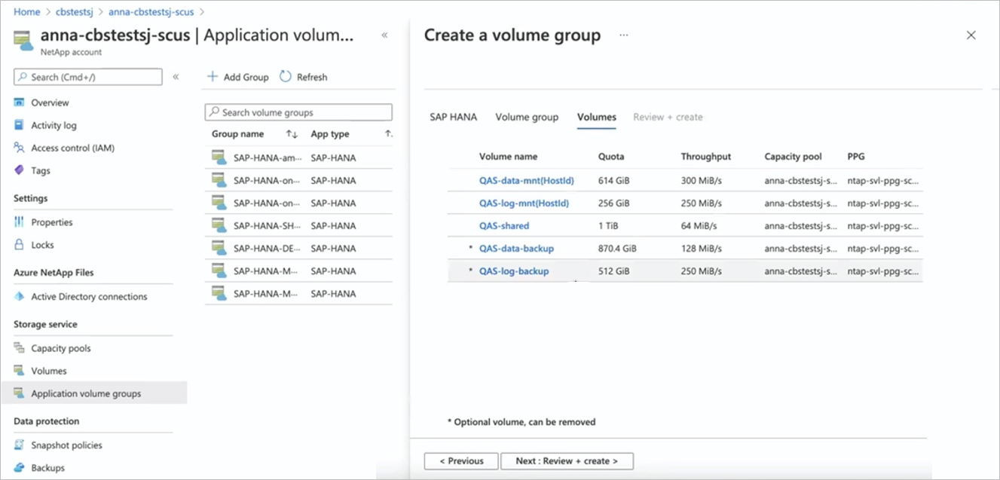 ](../media/azure-netapp-files/application-volume-details.png#lightbox)

    If you want to remove the optional volumes (marked with a `*`) such as data-backup volume or log-backup volume from the volume group, select the volume and click **Remove volume**. Confirm the removal in the dialog box that appears.

    > [!IMPORTANT]
    > You cannot add a removed volume back to the volume group again.

    [ 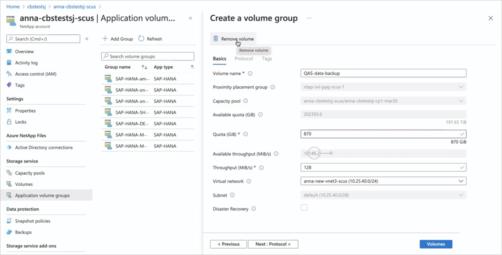 ](../media/azure-netapp-files/application-volume-remove.png#lightbox)

    Click **Volumes** to return to the Volume overview page. Click **Next: Review + create**.

11.	The **Review + Create** tab lists all the volumes and how they will be created.  Click **Create Volume Group** to start the volume group creation.

    [ 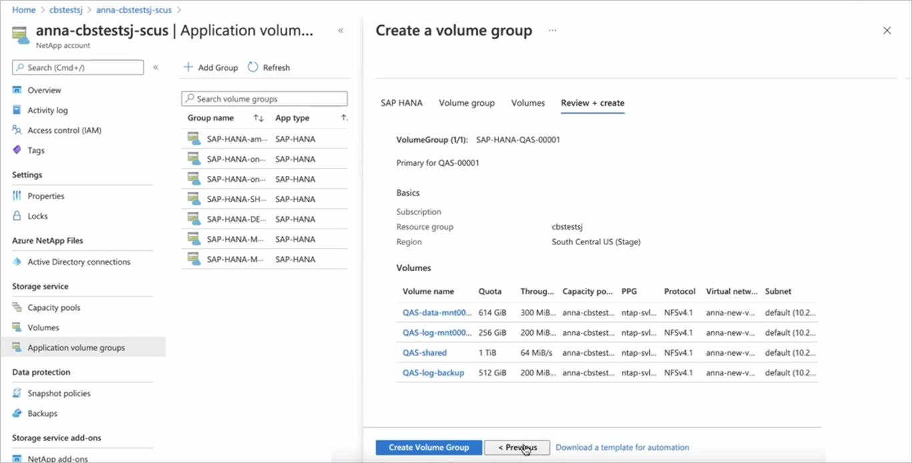 ](../media/azure-netapp-files/application-review-create.png#lightbox)

12. The **Volume Groups** deployment workflow starts, and the progress is displayed. This process can take a few minutes to complete.

    

    You can display the list of volume groups to see the new volume group. You can select the new volume group to see the details and status of each of the volumes being created.

    Creating a volume group is an "all-or-none" operation. If one volume cannot be created, all remaining volumes will be removed as well.

    [ 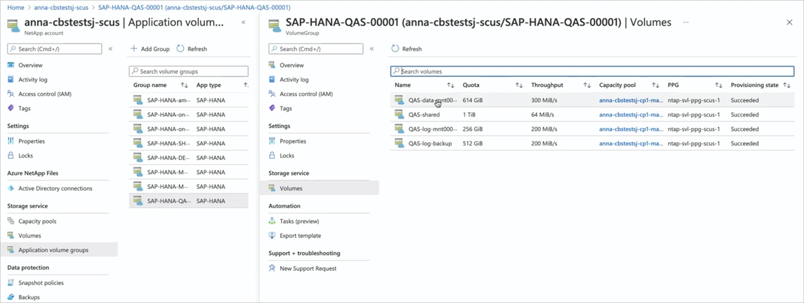 ](../media/azure-netapp-files/application-new-volume-group.png#lightbox)

## Next steps  

* [Understand Azure NetApp Files application volume group for SAP HANA](application-volume-group-introduction.md)
* [Requirements and considerations for application volume group for SAP HANA](application-volume-group-considerations.md)
* [Add hosts to a multiple-host SAP HANA system using application volume group for SAP HANA](application-volume-group-add-hosts.md)
* [Add volumes for an SAP HANA system as a secondary database in HSR](application-volume-group-add-volume-secondary.md)
* [Add volumes for an SAP HANA system as a DR system using cross-region replication](application-volume-group-disaster-recovery.md)
* [Manage volumes in an application volume group](application-volume-group-manage-volumes.md)
* [Delete an application volume group](application-volume-group-delete.md)
* [Application volume group FAQs](faq-application-volume-group.md)

