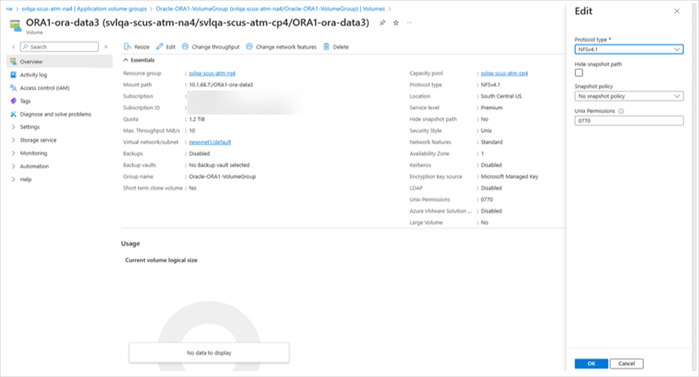

# Manage volumes in an application volume group for Oracle

You can manage a volume from its volume group. You can resize, delete, or change throughput for the volume. 

## Steps

1. From your NetApp account, select **Application volume groups**.   
    Click a volume group to display the volumes in the group. 

2. Select the volume you want to resize, delete, or change throughput. The volume overview will be displayed. 

      

3. From **Volume Overview**, you can select:

    * **Edit**    
        You can change individual volume properties such as:
        * Protocol type
        * Hide snapshot path
        * Snapshot policy
        * Unix permissions

        > [!NOTE] 
        > Changing the protocol type involves reconfiguration at the Linux host. When using dNFS, it's not recommended to mix volumes using NFSv3 and NFSv4.1.  

        > [!NOTE] 
        > Using Azure NetApp Files built-in automated snapshots doesn't create database consistent backups. Instead, use data protection software such as [AzAcSnap](azacsnap-introduction.md) that supports snapshot-based data protection for Oracle. 

    * **Change Throughput**   
        You can adapt the throughput of the volume.

      

## Next steps  

* 