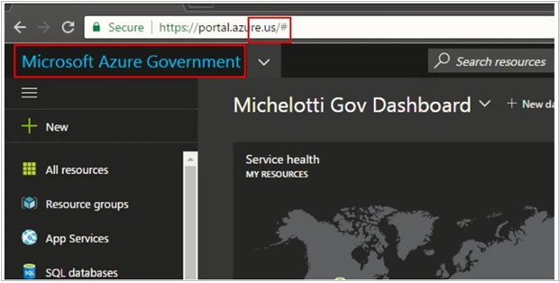

# Azure NetApp Files for Azure Government 

[Microsoft Azure Government](../azure-government/documentation-government-welcome.md) delivers a dedicated cloud enabling government agencies and their partners to transform mission-critical workloads to the cloud.  

This article describes Azure NetApp Files feature availability in Azure Government. It also shows you how to access the Azure NetApp Files service within Azure Government.

## Feature availability

For Azure Government regions supported by Azure NetApp Files, see the *[Products Available by Region page](https://azure.microsoft.com/explore/global-infrastructure/products-by-region/?products=netapp&regions=usgov-non-regional,us-dod-central,us-dod-east,usgov-arizona,usgov-texas,usgov-virginia&rar=true)*.  

All [Azure NetApp Files features](whats-new.md) available on Azure public cloud are also available on supported Azure Government regions ***except for the features listed in the following table***: 

| Azure NetApp Files features | Azure public cloud availability |  Azure Government availability |
|:--- |:--- |:--- |
| Azure NetApp Files backup | Public preview | No |
| Standard network features | Generally available (GA) | No |
| Azure NetApp Files datastores for AVS | Generally available (GA) | No | 
| Azure NetApp Files customer-managed keys | Public preview | No |
| Azure NetApp Files large volumes | Public preview | No |
| Standard storage with cool access in Azure NetApp Files | Public preview | No |

## Portal access

Azure Government users can access Azure NetApp Files by pointing their browsers to **portal.azure.us**.  The portal site name is **Microsoft Azure Government**. See [Connect to Azure Government using portal](../azure-government/documentation-government-get-started-connect-with-portal.md) for details.   



From the Microsoft Azure Government portal, you can access Azure NetApp Files the same way you would in the Azure portal. For example, you can enter **Azure NetApp  Files** in the portal’s Search Resources box, and then select **Azure NetApp Files** from the list that appears.  

You can follow [Azure NetApp Files](./index.yml) documentation for details about using the service.

## Azure CLI access

You can connect to Azure Government by setting the cloud name to `AzureUSGovernment` and then proceeding to sign in as you normally would with the `az login` command. After running the sign-in command, a browser will launch where you enter the appropriate Azure Government credentials.  

```azurecli 

az cloud set --name AzureUSGovernment 

``` 

To confirm the cloud has been set to `AzureUSGovernment`, run: 

```azurecli 

az cloud list --output table 

``` 

This command will produce a table with Azure cloud locations. The `isActive` column entry for `AzureUSGovernment` should read `true`.  

See [Connect to Azure Government with Azure CLI](../azure-government/documentation-government-get-started-connect-with-cli.md) for details.

## REST API access

Endpoints for Azure Government are different from commercial Azure endpoints. For a list of different endpoints, see Azure Government’s [Guidance for Developers](../azure-government/compare-azure-government-global-azure.md#guidance-for-developers).

## PowerShell access

When connecting to Azure Government through PowerShell, you must specify an environmental parameter to ensure you connect to the correct endpoints. From there, you can proceed to use Azure NetApp Files as you normally would with PowerShell. 

| Connection type | Command | 
| --- | --- | 
| [Azure](/powershell/module/az.accounts/Connect-AzAccount) commands |`Connect-AzAccount -EnvironmentName AzureUSGovernment` | 
| [Azure Active Directory](/powershell/module/azuread/connect-azuread) commands |`Connect-AzureAD -AzureEnvironmentName AzureUSGovernment` | 
| [Azure (Classic deployment model)](/powershell/module/servicemanagement/azure.service/add-azureaccount) commands |`Add-AzureAccount -Environment AzureUSGovernment` | 
| [Azure Active Directory (Classic deployment model)](/previous-versions/azure/jj151815(v=azure.100)) commands |`Connect-MsolService -AzureEnvironment UsGovernment` | 

See [Connect to Azure Government with PowerShell](../azure-government/documentation-government-get-started-connect-with-ps.md) for details.

## Next steps
* [What is Azure Government?](../azure-government/documentation-government-welcome.md)
* [What's new in Azure NetApp Files](whats-new.md)
* [Compare Azure Government and global Azure](../azure-government/compare-azure-government-global-azure.md)
* [Azure NetApp Files REST API](azure-netapp-files-develop-with-rest-api.md)
* [Azure NetApp Files REST API using PowerShell](develop-rest-api-powershell.md)
