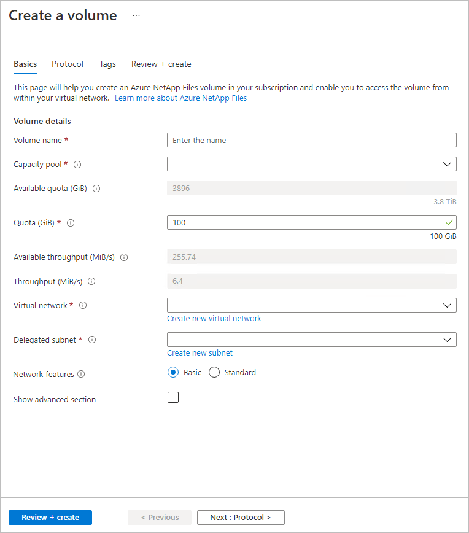
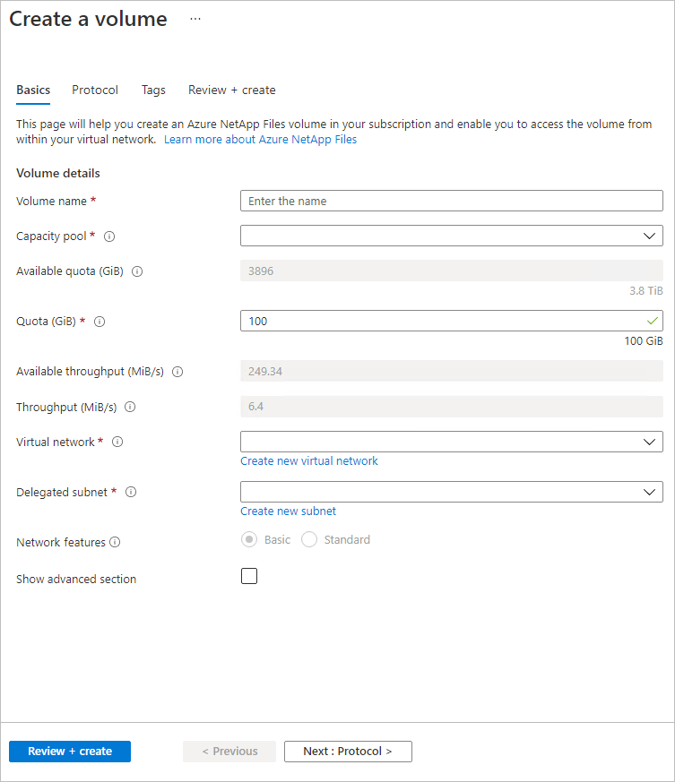
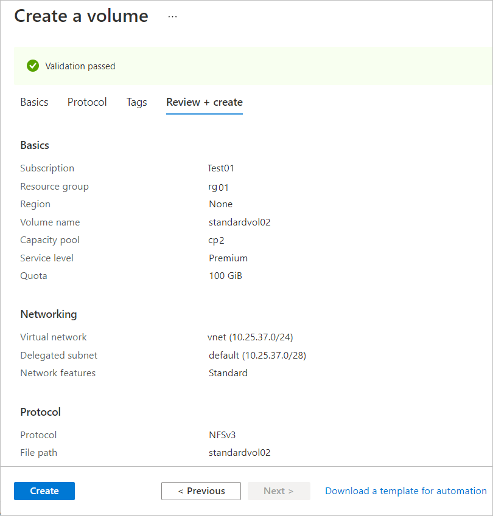

# Configure network features for an Azure NetApp Files volume

The **Network Features** functionality is available for public preview.  This functionality enables you to indicate whether you want to use VNet features for an Azure NetApp Files volume. With this functionality, you can set the option to ***Standard*** or ***Basic***. You can specify the setting when you create a new NFS, SMB, or dual-protocol volume. See [Guidelines for Azure NetApp Files network planning](azure-netapp-files-network-topologies.md) for details about network features.

This article helps you understand the options and shows you how to configure network features.

## Options for network features 

Two settings are available for network features: 

* ***Standard***  
    This setting enables VNet features for the volume.  

    If you use VNet features such as [network security groups](../virtual-network/network-security-groups-overview.md), [user-defined routes](../virtual-network/virtual-networks-udr-overview.md#user-defined), [Private Endpoints](../private-link/private-endpoint-overview), and [Service Endpoints](../virtual-network/virtual-network-service-endpoints-overview.md), you should set network features to *Standard*.

* ***Basic***  
    This setting provides no VNet features for the volume for network features.  

    You should set network features to *Basic* if you do not require VNet features.  

## Considerations

* Regardless of the network feature option you set (*Standard* or *Basic*), an Azure VNet can only have one subnet delegated to Azure NetApp files. See [Delegate a subnet to Azure NetApp Files](azure-netapp-files-delegate-subnet.md#considerations). 
 
* Currently, you can specify the network features setting only during the creation process of a new volume. You cannot modify the setting on existing volumes. 

* You can create volumes with the Standard network features only if the corresponding [Azure region supports the Standard volume capability](#supported-regions). 
    * If the Standard volume capability is supported for the region, the network features field of the Create a Volume page defaults to *Standard*. You can change this setting to *Basic*. 
    * If the Standard volume capability is not available for the region, the network features field of the Create a Volume page defaults to *Basic*, and you cannot modify the setting.

* The ability to locate storage compatible with the desired type of network features depends on the VNet specified.  If you cannot create a volume because of insufficient resources, you can try a different VNet for which compatible storage is available.
  
## Register the feature 

The network features capability is currently in public preview. If you are using this feature for the first time, you need to register the feature first.

1.  Register the feature by running the following commands:

    ```azurepowershell-interactive
    Register-AzProviderFeature -ProviderNamespace Microsoft.NetApp -FeatureName ANFSDNAppliance

    Register-AzProviderFeature -ProviderNamespace Microsoft.NetApp -FeatureName AllowPoliciesOnBareMetal
    ```

2. Check the status of the feature registration: 

    > [!NOTE]
    > The **RegistrationState** may be in the `Registering` state for up to 60 minutes before changing to `Registered`. Wait until the status is `Registered` before continuing.

    ```azurepowershell-interactive
    Get-AzProviderFeature -ProviderNamespace Microsoft.NetApp -FeatureName ANFSDNAppliance

    Get-AzProviderFeature -ProviderNamespace Microsoft.NetApp -FeatureName AllowPoliciesOnBareMetal
    ```

You can also use [Azure CLI commands](/cli/azure/feature?preserve-view=true&view=azure-cli-latest) `az feature register` and `az feature show` to register the feature and display the registration status. 

## Supported regions 

Currently the network features capability is supported in the following regions: 

* North Central US 

## Set the network features option

This section shows you how to set the network features option. 

1. During the process of creating a new [NFS](azure-netapp-files-create-volumes.md), [SMB](azure-netapp-files-create-volumes-smb.md), or [dual-protocol](create-volumes-dual-protocol.md) volume, you can set the Network Features option to **Basic** or **Standard** under the Basic tab of the Create a Volume screen.

    The following screenshot shows a volume creation example for a region that supports the Standard network features capabilities: 

    

    The following screenshot shows a volume creation example for a region that does not support the Standard network features capabilities: 

    

2. Before completing the volume creation process, you can display the specified network features setting in the **Review + Create** tab of the Create a Volume screen. Click **Create** to complete the volume creation.

    

3. You can click **Volumes** to display the network features setting for each volume:

    

## Next steps  

* [Guidelines for Azure NetApp Files network planning](azure-netapp-files-network-topologies.md)
* [Create an NFS volume for Azure NetApp Files](azure-netapp-files-create-volumes.md)
* [Create an SMB volume for Azure NetApp Files](azure-netapp-files-create-volumes-smb.md) 
* [Create a dual-protocol volume for Azure NetApp Files](create-volumes-dual-protocol.md) 