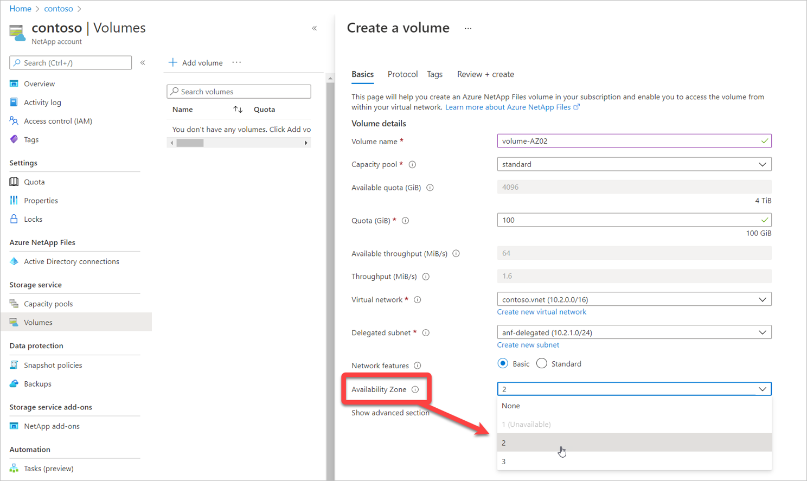
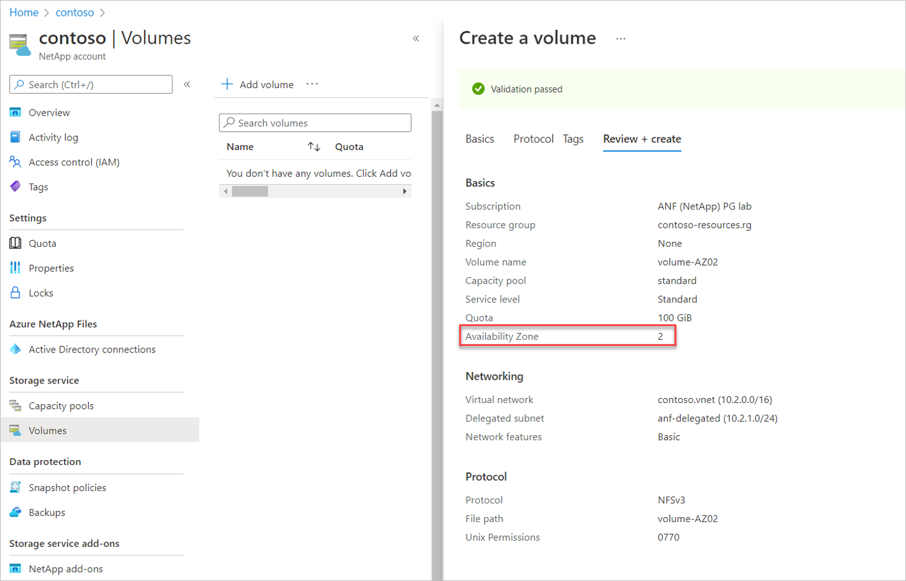

# Manage availability zone volume placement for Azure NetApp Files

Azure’s push towards the use of [availability zones](../availability-zones/az-overview.md#availability-zones) (AZs) has increased, and the use of high availability (HA) deployments with availability zones are now a default and best practice recommendation in [Azure’s Well Architected Framework](/azure/architecture/framework/resiliency/design-best-practices#use-zone-aware-services). Azure NetApp Files lets you deploy new volumes in the logical availability zone of your choice. 

Azure availability zones are highly available, fault tolerant, and more scalable than traditional single or multiple datacenter infrastructures. Using Azure availability zones lets you design and operate applications and databases that automatically transition between zones without interruption.  

Availability zones are referred to as *logical zones*. Each data center is assigned to a *physical zone*. Physical zones are mapped to logical zones in your Azure subscription. Azure subscriptions are automatically assigned this mapping when a subscription is created. Enterprise applications and resources are increasingly deployed into multiple availability zones to achieve this level of high availability (HA) or failure domain (zone) isolation. 

This feature lets you deploy new volumes in the logical availability zone of your choice. However, *it does not constitute (close) proximity towards other Azure resources (like VMs), nor does it guarantee lowest possible latencies.*

The following diagram summarizes availability zone volume placement for Azure NetApp Files:   

[  ](../media/azure-netapp-files/availability-zone-volume-placement.png#lightbox)

## Requirements and considerations 

* The availability zone volume placement feature is supported only on newly created volumes. It is not currently supported on existing volumes. 

* This feature does not guarantee free capacity in the availability zone. For example, even if you can deploy a VM in availability zone 3 of the East US region, it doesn’t guarantee free Azure NetApp Files capacity in that zone. If no sufficient capacity is available, volume creation will fail.

* After a volume is created with an availability zone, the specified availability zone can’t be modified. Volumes can’t be moved between availability zones.

* NetApp accounts and capacity pools are not bound by the availability zone. A capacity pool can contain volumes in different availability zones.  

* This feature provides zonal volume placement, with latency within the zonal latency envelopes. It does not provide proximity placement towards compute. As such, it doesn’t provide lowest latency guarantee.

* Each data center is assigned to a physical zone. Physical zones are mapped to logical zones in your Azure subscription. Azure subscriptions are automatically assigned this mapping at the time a subscription is created. This feature aligns with the generic logical-to-physical availability zone mapping for the subscription. 

* VMs and Azure NetApp Files volumes are to be deployed separately, within the same logical availability zone to create zone alignment between VMs and Azure NetApp Files. This availability zone volume placement feature does not create zonal VMs upon volume creation or vice versa.

## Register the feature 

The feature of availability zone volume placement is currently in preview. If you are using this feature for the first time, you need to register the feature first.

1.  Register the feature: 

    ```azurepowershell-interactive
    Register-AzProviderFeature -ProviderNamespace Microsoft.NetApp -FeatureName <<NEED FEATURE NAME>>
    ```

2. Check the status of the feature registration: 

    ```azurepowershell-interactive
    Get-AzProviderFeature -ProviderNamespace Microsoft.NetApp -FeatureName <<NEED FEATURE NAME>>
    ```

    > [!NOTE]
    > The **RegistrationState** may be in the `Registering` state for up to 60 minutes before changing to `Registered`. Wait until the status is **Registered** before continuing.

You can also use [Azure CLI commands](/cli/azure/feature) `az feature register` and `az feature show` to register the feature and display the registration status. 

## Create a volume with an availability zone 

1.	Click **Volumes** from your capacity pool. Then Click **+ Add volume** to create a volume.

    For details about volume creation, see:   
    * [Create an NFS volume](azure-netapp-files-create-volumes.md)   
    * [Create an SMB volume](azure-netapp-files-create-volumes-smb.md)      
    * [Create a dual-protocol volume](create-volumes-dual-protocol.md)    

2.	In the **Create a Volume** page, under the **Basic** tab, select the **Availability Zone** pulldown to specify an availability zone where Azure NetApp Files resources are present.   

    > [!IMPORTANT]
    > Logical availability zones for the subscription without Azure NetApp Files presence are marked `(Unavailable)` and are greyed out.

    [  ](../media/azure-netapp-files/availability-zone-menu-drop-down.png#lightbox)

 
3.	Follow the UI to create the volume. The **Review + Create** page shows the selected availability zone you specified.

    [  ](../media/azure-netapp-files/availability-zone-display-down.png#lightbox)
 
4.	After you create the volume, the **Volume Overview** page includes availability zone information for the volume.

    [  ](../media/azure-netapp-files/availability-zone-volume-overview.png#lightbox) 


## Next steps  

* [Create an NFS volume for Azure NetApp Files](azure-netapp-files-create-volumes.md)   
* [Create an SMB volume for Azure NetApp Files](azure-netapp-files-create-volumes-smb.md)      
* [Create a dual-protocol volume for Azure NetApp Files](create-volumes-dual-protocol.md)    
