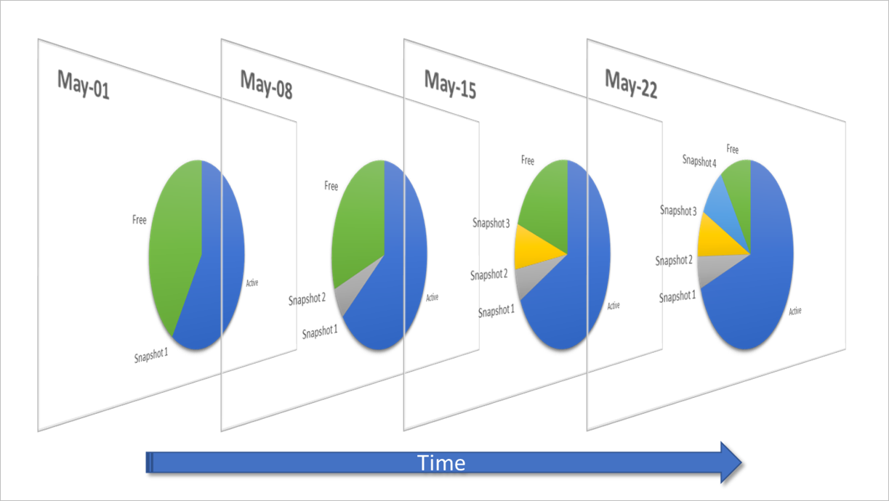
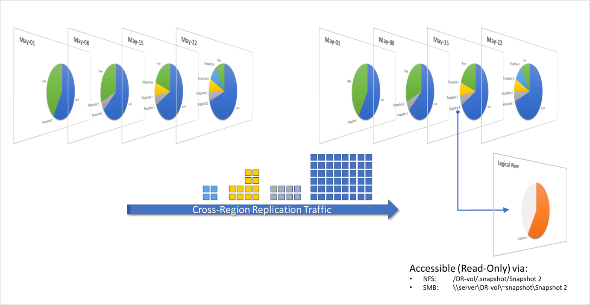
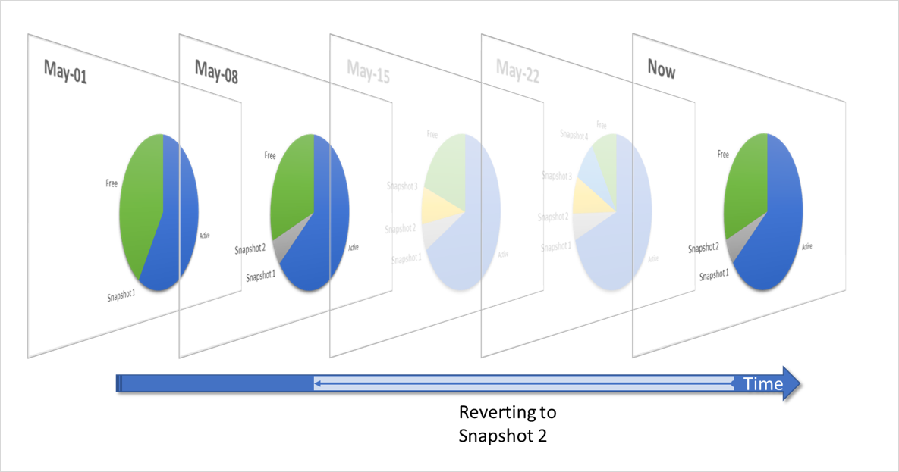

# How Azure NetApp Files snapshots work

This article explains how Azure NetApp Files snapshots work. Azure NetApp Files snapshot technology delivers stability, scalability, and faster recoverability, with no impact to performance. Azure NetApp Files snapshot technology provides the foundation for data protection solutions, including single file restores, volume restores and clones, and cross-region replication. 

For steps about using volume snapshots, see [Manage snapshots by using Azure NetApp Files](azure-netapp-files-manage-snapshots.md). For considerations about snapshot management in cross-region replication, see [Requirements and considerations for using cross-region replication](cross-region-replication-requirements-considerations.md).

## What volume snapshots are  

An Azure NetApp Files snapshot is a point-in-time file system (volume) image. It can serve as an ideal online backup. You can use a snapshot to [create a new volume](azure-netapp-files-manage-snapshots.md#restore-a-snapshot-to-a-new-volume), [restore a file](azure-netapp-files-manage-snapshots.md#restore-a-file-from-a-snapshot-using-a-client), or [revert a volume](azure-netapp-files-manage-snapshots.md#revert-a-volume-using-snapshot-revert). In specific application data stored on Azure NetApp Files volumes, extra steps might be required to ensure application consistency.  

Low-overhead snapshots are made possible by the unique features of the underlaying volume virtualization technology that is part of Azure NetApp Files. Like a database, this layer uses pointers to the actual data blocks on disk. But, unlike a database, it doesn't rewrite existing blocks; it writes updated data to a new block and changes the pointer. An Azure NetApp Files snapshot simply manipulates block pointers, creating a “frozen”, read-only view of a volume that lets applications access older versions of files and directory hierarchies without special programming. Actual data blocks aren’t copied. As such, snapshots are efficient in the time needed to create them; they are near-instantaneous, regardless of volume size. Snapshots are also efficient in storage space. They themselves consume no space, and only delta blocks between snapshots and active volume are kept. 

The following diagrams illustrate the concepts:  

A snapshot is taken in Figure 1a. In Figure 1b, changed data is written to a *new block* and the pointer is updated. But the snapshot pointer still points to the *previously written block*, giving you a live and a historical view of the data. Another snapshot is taken in Figure 1c. Now you have access to three generations of data (the live data, Snapshot 2, and Snapshot 1, in order of age), without taking up the volume space that three full copies would require. 

A snapshot takes only a copy of the volume metadata (*inode table*). It takes just a few seconds to create, regardless of the volume size, the capacity used, or the level of activity on the volume. So taking a snapshot of a 100-TiB volume takes the same (next to zero) time as taking a snapshot of a 100-GiB volume. After a snapshot is created, changes to data files are reflected in the active version of the files, as normal.

Meanwhile, the data blocks that are pointed to from a snapshot remains stable and immutable. Due to the “Redirect on Write” nature of Azure NetApp Files snapshots, a snapshot incurs no performance overhead and in itself does not consume any space. You can store up to 255 snapshots per volume over time, all of which are accessible as read-only and online versions of the data, consuming as little capacity as the number of changed blocks between each snapshot. Modified blocks are stored in the active volume. Blocks pointed to in snapshots are kept (as read-only) in the volume for safekeeping, to be repurposed only when all snapshots (pointers) have been cleared. Therefore, volume utilization will increase over time, by either new data blocks or (modified) data blocks kept in snapshots.

 The following diagram shows a volume’s snapshots and used space over time: 

Because a volume snapshot records only the block changes since the latest snapshot, it provides the following key benefits:

* Snapshots are ***storage efficient***.   
    Snapshots consume minimal storage space because it doesn't copy the data blocks of the entire volume. Two snapshots taken in sequence differ only by the blocks added or changed in the time interval between the two. This block-incremental behavior limits associated storage capacity consumption. Many alternative snapshot implementations consume storage volumes equal to the active file system, raising storage capacity requirements. Depending on application daily *block-level* change rates, Azure NetApp Files snapshots will consume more or less capacity, but on changed data only. Average daily snapshot consumption ranges from only 1-5% of used volume capacity for many application volumes, or up to 20-30% for volumes such as SAP HANA database volumes. Be sure to [monitor your volume and snapshot usage](azure-netapp-files-metrics.md#volumes) for snapshot capacity consumption relative to the number of created and maintained snapshots.   

* Snapshots are ***quick to create, replicate, restore, or clone***.   
    It takes only a few seconds to create, replicate, restore, or clone a snapshot, regardless of the volume size and level of activities. You can create a volume snapshot [on-demand](azure-netapp-files-manage-snapshots.md#create-an-on-demand-snapshot-for-a-volume). You can also use [snapshot policies](azure-netapp-files-manage-snapshots.md#manage-snapshot-policies) to specify when Azure NetApp Files should automatically create a snapshot and how many snapshots to keep for a volume.  Application consistency can be achieved by orchestrating snapshots with the application layer, for example, by using the [AzAcSnap](azacsnap-introduction.md) tool for SAP HANA.

* Snapshots have no impact on volume ***performance***.   
    Because of the “Redirect on Write” nature of the underlaying technology, storing or retaining Azure NetApp Files snapshots has no performance impact, even with heavy data activity. Deleting a snapshot also has little to no performance impact in many cases. 

* Snapshots provide ***scalability*** because they can be created frequently and many can be retained.   
    Azure NetApp Files volumes support up to 255 snapshots. The ability to store a large number of low-impact, frequently created snapshots increases the likelihood that the desired version of data can be successfully recovered.

* Snapshots provide ***user visibility*** and ***file recoverability***.   
The high performance, scalability, and stability of Azure NetApp Files snapshot technology means it provides an ideal online backup for user-driven recovery. Snapshots can be made user-accessible for file, directory, or volume restore purposes. Additional solutions allow you to copy backups to offline storage or [replicate cross-region](cross-region-replication-introduction.md) for retention or disaster recovery purposes.

## Ways to create snapshots   

Azure NetApp Files snapshots are versatile in use. As such, multiple methods are available for creating and maintaining snapshots:

* Manually (on-demand), by using:   
    * The [Azure portal](azure-netapp-files-manage-snapshots.md#create-an-on-demand-snapshot-for-a-volume), [REST API](/rest/api/netapp/snapshots), [Azure CLI](/cli/azure/netappfiles/snapshot), or [PowerShell](/powershell/module/az.netappfiles/new-aznetappfilessnapshot) tools
    * Scripts (see [examples](azure-netapp-files-solution-architectures.md#sap-tech-community-and-blog-posts))

* Automated, by using:
    * Snapshot policies, via the [Azure portal](azure-netapp-files-manage-snapshots.md#manage-snapshot-policies), [REST API](/rest/api/netapp/snapshotpolicies), [Azure CLI](/cli/azure/netappfiles/snapshot/policy), or [PowerShell](/powershell/module/az.netappfiles/new-aznetappfilessnapshotpolicy) tools
    * Application consistent snapshot tooling, like [AzAcSnap](azacsnap-introduction.md)

## How volumes and snapshots are replicated cross-region for DR  

Azure NetApp Files supports [cross-region replication](cross-region-replication-introduction.md) for disaster recovery (DR) purposes. Azure NetApp Files cross-region replication uses SnapMirror technology. Only changed blocks are sent over the network in a compressed, efficient format. After a cross-region replication is initiated between volumes, the entire volume contents (that is, the actual stored data blocks) are transferred only once. This operation is called a *baseline transfer*. After the initial transfer, only changed blocks (as captured in snapshots) are transferred. An asynchronous 1:1 replica of the source volume is created(including all snapshots).  This behavior follows a full and incremental-forever replication mechanism. This proprietary technology minimizes the amount of data required to replicate across the regions, therefore saving data transfer costs. It also shortens the replication time. You can achieve a smaller Recovery Point Objective (RPO), because more snapshots can be created and transferred more frequently with limited data transfers.

The following diagram shows snapshot traffic in cross-region replication scenarios: 

## Ways to restore data from snapshots  

The Azure NetApp Files snapshot technology greatly improves the frequency and reliability of backups. It incurs minimal performance overhead and can be safely created on an active volume. Azure NetApp Files snapshots allow near-instantaneous, secure, and optionally user-managed restores. This section describes various ways in which data can be accessed or restored from Azure NetApp Files snapshots.

### Restoring files or directories from snapshots 

If [Snapshot Path visibility](azure-netapp-files-manage-snapshots.md#edit-the-hide-snapshot-path-option) is not hidden, users can directly access snapshots to recover from accidental deletion, corruption, or modification of their data. The security of files and directories are retained in the snapshot, and snapshots are read-only by design. As such, the restoration is secure and simple. 

The following diagram shows file or directory access to a snapshot: 

In the diagram, Snapshot 1 consumes only the delta blocks between the active volume and the moment of snapshot creation. However, when you access the snapshot via the volume snapshot path, the data will *appear* as if it’s the full volume capacity at the time of the snapshot creation. By accessing the snapshot folders, users can self-restore data by copying files and directories out of a snapshot of choice.
Similarly, snapshots in target cross-region replication volumes can be accessed read-only for data recovery in the DR region.  

The following diagram shows snapshot access in cross-region replication scenarios: 

See [Restore a file from a snapshot using a client](azure-netapp-files-manage-snapshots.md#restore-a-file-from-a-snapshot-using-a-client) about restoring individual files or directories from snapshots.

### Restoring (cloning) a snapshot to a new volume

Azure NetApp Files snapshots can be restored to a separate, independent volume. This operation is near-instantaneous, regardless of the volume size and the capacity consumed. The newly created volume is almost immediately available for access, while the actual volume and snapshot data blocks are being copied over. Depending on volume size and capacity, this process can take considerable time during which the parent volume and snapshot cannot be deleted. However, the volume can already be accessed after initial creation, while the copy process is in progress in the background. This capability enables fast volume creation for data recovery or volume cloning for test and development. By nature of the data copy process, storage capacity pool consumption will double when the restore completes, and the new volume will show the full active capacity of the original snapshot. After this process is completed, the volume will be independent and disassociated with the original volume, and source volumes and snapshot can be managed or removed independently from the new volume.

The following diagram shows a new volume created by restoring (cloning) a snapshot:   

The same operations can be performed on replicated snapshots to a disaster recovery (DR) volume. Any snapshot can be restored to a new volume, even when cross-region replication remains active or in progress. This capability enables non-disruptive creation of test and dev environments in a DR region, putting the data to use, whereas the replicated volumes would otherwise be used only for DR purposes. This use case enables test and development be isolated from production, eliminating potential impact on production environments.  

The following diagram shows volume restoration (cloning) by using DR target volume snapshot while cross-region replication is taking place:  

See [Restore a snapshot to a new volume](azure-netapp-files-manage-snapshots.md#restore-a-snapshot-to-a-new-volume) about volume restore operations.

### Restoring (reverting) a snapshot in-place

In some cases, because the new volume will consume storage capacity, creating a new volume from a snapshot might not be needed or appropriate. To recover from data corruption (for example, database corruptions or ransomware attacks) quickly, it might be more appropriate to restore a snapshot within the volume itself. This operation can be done using the Azure NetApp Files snapshot revert functionality. This functionality enables you to quickly revert a volume to the state it was in when a particular snapshot was taken. In most cases, reverting a volume is much faster than restoring individual files from a snapshot to the active file system, especially in large, multi-TiB volumes. 

Reverting a volume snapshot is near-instantaneous and takes only a few seconds to complete, even for the largest volumes. The active volume metadata (*inode table*) is replaced with the snapshot metadata from the time of snapshot creation, thus rolling back the volume to that specific point in time. No data blocks need to be copied for the revert to take effect. As such, it's more space efficient than restoring a snapshot to a new volume. 

The following diagram shows a volume reverting to an earlier snapshot:  

> [!IMPORTANT]
> Active filesystem data that was written and snapshots that were taken after the selected snapshot was taken will be lost. The snapshot revert operation will replace all the data in the targeted volume with the data in the selected snapshot. You should pay attention to the snapshot contents and creation date when you select a snapshot. You cannot undo the snapshot revert operation.  

See [Revert a volume using snapshot revert](azure-netapp-files-manage-snapshots.md#revert-a-volume-using-snapshot-revert) about how to use this feature.

## How snapshots are deleted 

Because snapshots do consume storage capacity, they are not typically kept indefinitely. For data protection, retention, and recoverability, some snapshots (created at various points in time) are typically kept online for a certain duration depending on RPO, RTO, and retention SLA requirements. However, older snapshots often do not have to be kept on the storage service and might need to be deleted to free up space. Any snapshot can be deleted (not necessarily in order of creation) by an administrator at any time. 

> [!IMPORTANT]
> The snapshot deletion operation cannot be undone. 

When a snapshot is deleted, all pointers from that snapshot to existing data blocks will be removed. When a data block has no more pointers pointing at it (by the active volume, or other snapshots in the volume), the data block is returned to the volume free space for future use. Therefore, removing snapshots usually frees up more capacity in a volume than deleting data from the active volume, because data blocks are often captured in previously created snapshots. 

The following diagram shows the effect on storage consumption of snapshot deletion for a volume:  

Be sure to [monitor volume and snapshot consumption](azure-netapp-files-metrics.md#volumes) and understand how the application, active volume, and snapshot consumption interact. 

See Delete snapshots about how to manage snapshot deletion. See [Manage snapshot policies](azure-netapp-files-manage-snapshots.md#manage-snapshot-policies) about how to automate this process.

## Next steps

* [Manage snapshots by using Azure NetApp Files](azure-netapp-files-manage-snapshots.md)
* [Monitor volume and snapshot metrics](azure-netapp-files-metrics.md#volumes)
* [Troubleshoot snapshot policies](troubleshoot-snapshot-policies.md)
* [Resource limits for Azure NetApp Files](azure-netapp-files-resource-limits.md)
* [Azure NetApp Files Snapshots 101 video](https://www.youtube.com/watch?v=uxbTXhtXCkw)
* [NetApp Snapshot - NetApp Video Library](https://tv.netapp.com/detail/video/2579133646001/snapshot)

