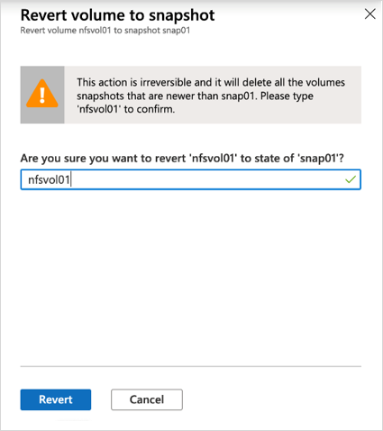

# Revert a volume using snapshot revert with Azure NetApp Files

The [snapshot](snapshots-introduction.md) revert functionality enables you to quickly revert a volume to the state it was in when a particular snapshot was taken. In most cases, reverting a volume is much faster than restoring individual files from a snapshot to the active file system. It is also more space efficient compared to restoring a snapshot to a new volume. 

You can find the Revert Volume option in the Snapshots menu of a volume. After you select a snapshot for reversion, Azure NetApp Files reverts the volume to the data and timestamps that it contained when the selected snapshot was taken. 

The revert functionality is also available in cross-region replication configurations, allowing you to revert to volumes that have not been yet been replicated to the destination side. This feature is currently in public preview, and you must register the feature before using it. 

<!-- Register the feature section -->

> [!IMPORTANT]
> Active filesystem data and snapshots that were taken after the selected snapshot will be lost. The snapshot revert operation will replace *all* the data in the targeted volume with the data in the selected snapshot. You should pay attention to the snapshot contents and creation date when you select a snapshot. You cannot undo the snapshot revert operation.

## Considerations

* Reverting a volume using snapshot revert is not supported on [Azure NetApp Files volumes that have backups](backup-requirements-considerations.md). 
* If you are reverting a volume in a cross-region replication setting, you can only revert to snapshots that are more recent than the SnapMirror snapshot. Alternately, you can also revert to the SnapMirror snapshot. 

## Steps

1. Go to the **Snapshots** menu of a volume. Right-click the snapshot you want to use for the revert operation. Select **Revert volume**. 

     

2. In the Revert Volume to Snapshot window, 
type the name of the volume, and click **Revert**.   

    The volume is now restored to the point in time of the selected snapshot.

 

## Next steps

* [Learn more about snapshots](snapshots-introduction.md)
* [Resource limits for Azure NetApp Files](azure-netapp-files-resource-limits.md)
* [Azure NetApp Files Snapshots 101 video](https://www.youtube.com/watch?v=uxbTXhtXCkw)
* [Azure NetApp Files Snapshot Overview](https://anfcommunity.com/2021/01/31/azure-netapp-files-snapshot-overview/)
