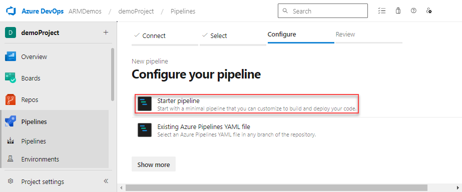

# Integrate Bicep with Azure Pipelines

You can integrate Bicep files with Azure Pipelines for continuous integration and continuous deployment (CI/CD). In this article, you learn how to use an Azure CLI pipeline task to deploy a Bicep file.

## Prepare your project

This article assumes your Bicep file and Azure DevOps organization are ready for creating the pipeline. The following steps show how to make sure you're ready:

* You have an Azure DevOps organization. If you don't have one, [create one for free](/azure/devops/pipelines/get-started/pipelines-sign-up). If your team already has an Azure DevOps organization, make sure you're an administrator of the Azure DevOps project that you want to use.

* You've configured a [service connection](/azure/devops/pipelines/library/connect-to-azure) to your Azure subscription. The tasks in the pipeline execute under the identity of the service principal. For steps to create the connection, see [Create a DevOps project](../templates/deployment-tutorial-pipeline.md#create-a-devops-project).

* You have a [Bicep file](../templates/quickstart-create-bicep-use-visual-studio-code.md) that defines the infrastructure for your project.

## Create pipeline

1. If you haven't added a pipeline previously, you need to create a new pipeline. From your Azure DevOps organization, select **Pipelines** and **New pipeline**.

   

1. Specify where your code is stored. The following image shows selecting **Azure Repos Git**.

   

1. From that source, select the repository that has the code for your project.

   

1. Select the type of pipeline to create. You can select **Starter pipeline**.

   

You're ready to either add an Azure PowerShell task or the copy file and deploy tasks.

## Azure CLI task

This section shows how to build a Bicep file into an ARM template before the template is deployed.

The following YAML file builds a Bicep file by using an [Azure CLI task](/azure/devops/pipelines/tasks/deploy/azure-cli):

```yml
trigger:
- master

name: Deploy Bicep files

variables:
  vmImageName: 'ubuntu-latest'

  azureServiceConnection: '<your-connection-name>'
  resourceGroupName: '<your-resource-group-name>'
  location: '<your-resource-group-location>'
  templateFile: './azuredeploy.bicep'
pool:
  vmImage: $(vmImageName)

steps:
- task: AzureCLI@2
  inputs:
    azureSubscription: $(azureServiceConnection)
    scriptType: bash
    scriptLocation: inlineScript
    inlineScript: |
      az --version
      az group create --name $(resourceGroupName) --location $(location)
      az deployment group create --resource-group $(resourceGroupName) --template-file $(templateFile)
```

The Azure CLI takes the following inputs:

* `azureSubscription`, provide the name of the service connection that you created.  See [Prepare your project](#prepare-your-project).
* `scriptType`, use **bash**.
* `scriptLocation`, use **inlineScript**, or **scriptPath**. If you specify **scriptPath**, you will also need to specify a `scriptPath` parameter.
* `inlineScript`, specify your script lines.  The script provided in the sample builds a bicep file called *azuredeploy.bicep* and exists in the root of the repository.

## Next steps

* To use the what-if operation in a pipeline, see [Test ARM templates with What-If in a pipeline](https://4bes.nl/2021/03/06/test-arm-templates-with-what-if/).
* To learn about using Bicep file with GitHub Actions, see [Deploy Bicep files by using GitHub Actions](./deploy-github-actions.md).
