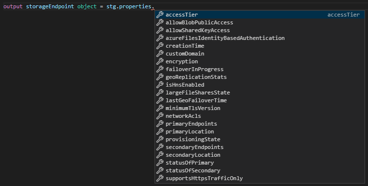
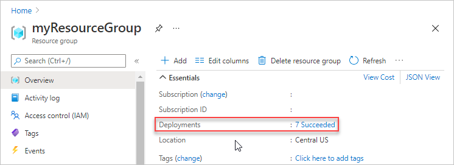
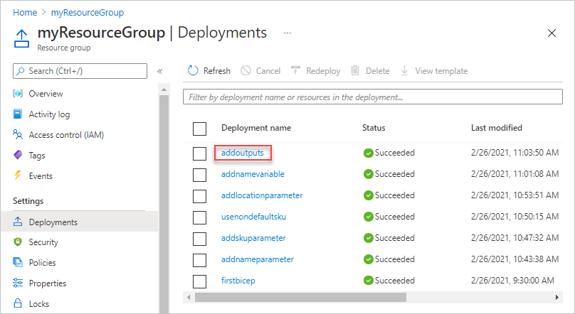
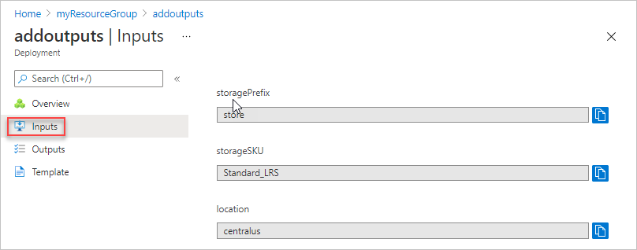
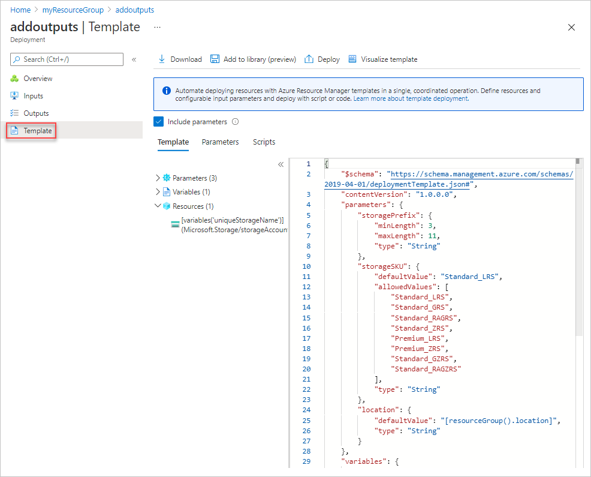

# Tutorial: Add outputs to Azure Resource Manager Bicep file

In this tutorial, you learn how to return a value from your deployment. You use outputs when you need a value from a deployed resource. This tutorial takes **7 minutes** to complete.

[!INCLUDE [Bicep preview](../../../includes/resource-manager-bicep-preview.md)]

## Prerequisites

We recommend that you complete the [tutorial about variables](./tutorial-add-variables.md), but it's not required.

You must have Visual Studio Code with the Bicep extension, and either Azure PowerShell or Azure CLI. For more information, see [Bicep tools](./tutorial-create-first-bicep.md#get-tools).

## Review Bicep file

At the end of the previous tutorial, your Bicep file had the following contents:

:::code language="bicep" source="~/resourcemanager-templates/get-started-with-templates/add-variable/azuredeploy.bicep":::

It deploys a storage account, but it doesn't return any information about the storage account. You might need to capture properties from a new resource so they're available later for reference.

## Add outputs

You can use outputs to return values from the deployment. For example, it might be helpful to get the endpoints for your new storage account.

The following example shows the change to your Bicep file to add an output value. Copy the whole file and replace your Bicep file with its contents.

:::code language="bicep" source="~/resourcemanager-templates/get-started-with-templates/add-outputs/azuredeploy.bicep" range="1-33" highlight="33":::

There are some important items to note about the output value you added.

The type of returned value is set to `object`, which means it returns a template object.

To get the `primaryEndpoints` property from the storage account, you use the storage account symbolic name. The autocomplete feature of the Visual Studio Code presents you a full list of the properties:

   

## Deploy Bicep file

You're ready to deploy the Bicep file and look at the returned value.

If you haven't created the resource group, see [Create resource group](./tutorial-create-first-bicep.md#create-resource-group). The example assumes you've set the `bicepFile` variable to the path to the Bicep file, as shown in the [first tutorial](./tutorial-create-first-bicep.md#deploy-bicep-file).

# [PowerShell](#tab/azure-powershell)

```azurepowershell
New-AzResourceGroupDeployment `
  -Name addoutputs `
  -ResourceGroupName myResourceGroup `
  -TemplateFile $bicepFile `
  -storagePrefix "store" `
  -storageSKU Standard_LRS
```

# [Azure CLI](#tab/azure-cli)

To run this deployment command, you must have the [latest version](/cli/azure/install-azure-cli) of Azure CLI.

```azurecli
az deployment group create \
  --name addoutputs \
  --resource-group myResourceGroup \
  --template-file $bicepFile \
  --parameters storagePrefix=store storageSKU=Standard_LRS
```

---

In the output for the deployment command, you'll see an object similar to the following example only if the output is in JSON format:

```json
{
  "dfs": "https://storeluktbfkpjjrkm.dfs.core.windows.net/",
  "web": "https://storeluktbfkpjjrkm.z19.web.core.windows.net/",
  "blob": "https://storeluktbfkpjjrkm.blob.core.windows.net/",
  "queue": "https://storeluktbfkpjjrkm.queue.core.windows.net/",
  "table": "https://storeluktbfkpjjrkm.table.core.windows.net/",
  "file": "https://storeluktbfkpjjrkm.file.core.windows.net/"
}
```

> [!NOTE]
> If the deployment failed, use the `verbose` switch to get information about the resources being created. Use the `debug` switch to get more information for debugging.

## Review your work

You've done a lot in the last six tutorials. Let's take a moment to review what you have done. You created a Bicep file with parameters that are easy to provide. The Bicep file is reusable in different environments because it allows for customization and dynamically creates needed values. It also returns information about the storage account that you could use in your script.

Now, let's look at the resource group and deployment history.

1. Sign in to the [Azure portal](https://portal.azure.com).
1. From the left menu, select **Resource groups**.
1. Select the resource group you deployed to.
1. Depending on the steps you did, you should have at least one and perhaps several storage accounts in the resource group.
1. You should also have several successful deployments listed in the history. Select that link.

   

1. You see all of your deployments in the history. Select the deployment called **addoutputs**.

   

1. You can review the inputs.

   

1. You can review the outputs.

   

1. You can review the JSON template.

   

## Clean up resources

If you're moving on to the next tutorial, you don't need to delete the resource group.

If you're stopping now, you might want to clean up the resources you deployed by deleting the resource group.

1. From the Azure portal, select **Resource group** from the left menu.
2. Enter the resource group name in the **Filter by name** field.
3. Select the resource group name.
4. Select **Delete resource group** from the top menu.

## Next steps

In this tutorial, you added a return value to the Bicep file. In the next tutorial, you'll learn how to export a JSON template and use parts of that exported template in your Bicep file.

> [!div class="nextstepaction"]
> [Use exported template](./tutorial-export-template.md)
