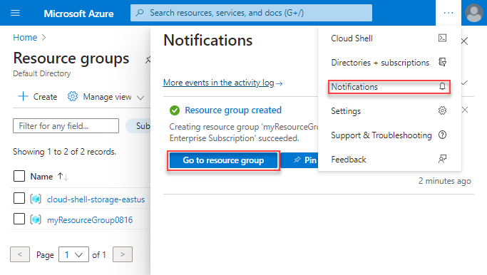
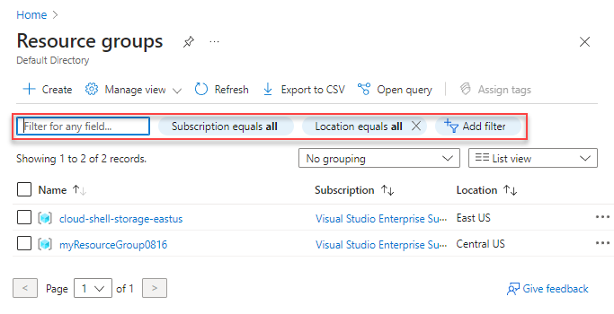
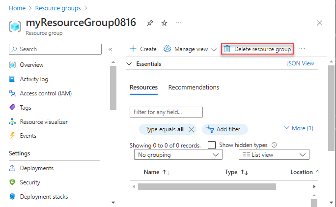
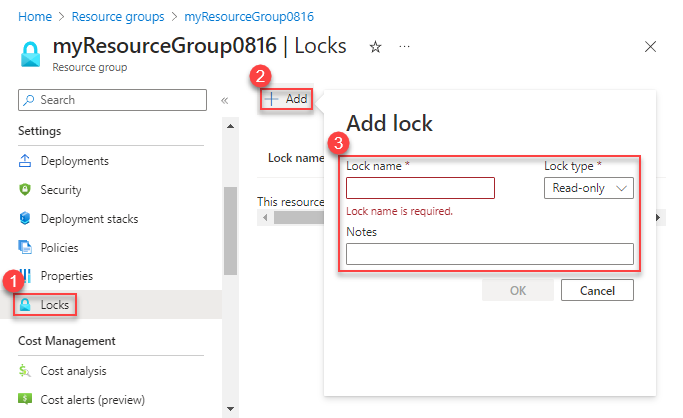

# Manage Azure resource groups by using the Azure portal

Learn how to use the [Azure portal](https://portal.azure.com) with [Azure Resource Manager](overview.md) to manage your Azure resource groups. For managing Azure resources, see [Manage Azure resources by using the Azure portal](manage-resources-portal.md).

[!INCLUDE [Handle personal data](../../../includes/gdpr-intro-sentence.md)]

## What is a resource group

A resource group is a container that holds related resources for an Azure solution. The resource group can include all the resources for the solution, or only those resources that you want to manage as a group. You decide how you want to allocate resources to resource groups based on what makes the most sense for your organization. Generally, add resources that share the same lifecycle to the same resource group so you can easily deploy, update, and delete them as a group.

The resource group stores metadata about the resources. Therefore, when you specify a location for the resource group, you are specifying where that metadata is stored. For compliance reasons, you may need to ensure that your data is stored in a particular region.

## Create resource groups

1. Sign in to the [Azure portal](https://portal.azure.com).
2. Select **Resource groups**

    
3. Select **Add**.
4. Enter the following values:

   - **Subscription**: Select your Azure subscription. 
   - **Resource group**: Enter a new resource group name. 
   - **Region**: Select an Azure location, such as **Central US**.

     
5. Select **Review + Create**
6. Select **Create**. It takes a few seconds to create a resource group.
7. Select **Refresh** from the top menu to refresh the resource group list, and then select the newly created resource group to open it. Or select **Notification**(the bell icon) from the top, and then select **Go to resource group** to open the newly created resource group

    

## List resource groups

1. Sign in to the [Azure portal](https://portal.azure.com).
2. To list the resource groups, select **Resource groups**

    

3. To customize the information displayed for the resource groups, select **Edit columns**. The following screenshot shows the addition columns you could add to the display:

## Open resource groups

1. Sign in to the [Azure portal](https://portal.azure.com).
2. Select **Resource groups**.
3. Select the resource group you want to open.

## Delete resource groups

1. Open the resource group you want to delete.  See [Open resource groups](#open-resource-groups).
2. Select **Delete resource group**.

    

For more information about how Azure Resource Manager orders the deletion of resources, see [Azure Resource Manager resource group deletion](delete-resource-group.md).

## Deploy resources to a resource group

After you have created a Resource Manager template, you can use the Azure portal to deploy your Azure resources. For creating a template, see [Quickstart: Create and deploy Azure Resource Manager templates by using the Azure portal](../templates/quickstart-create-templates-use-the-portal.md). For deploying a template using the portal, see [Deploy resources with Resource Manager templates and Azure portal](../templates/deploy-portal.md).

## Move to another resource group or subscription

You can move the resources in the group to another resource group. For more information, see [Move resources to new resource group or subscription](move-resource-group-and-subscription.md).

## Lock resource groups

Locking prevents other users in your organization from accidentally deleting or modifying critical resources, such as Azure subscription, resource group, or resource. 

1. Open the resource group you want to lock.  See [Open resource groups](#open-resource-groups).
2. In the left pane, select **Locks**.
3. To add a lock to the resource group, select **Add**.
4. Enter **Lock name**, **Lock type**, and **Notes**. The lock types include **Read-only**, and **Delete**.

    

For more information, see [Lock resources to prevent unexpected changes](lock-resources.md).

## Tag resource groups

You can apply tags to resource groups and resources to logically organize your assets. For information, see [Using tags to organize your Azure resources](tag-resources-portal.md).

## Export resource groups to templates

For information about exporting templates, see [Single and multi-resource export to template - Portal](../templates/export-template-portal.md).

## Manage access to resource groups

[Azure role-based access control (Azure RBAC)](../../role-based-access-control/overview.md) is the way that you manage access to resources in Azure. For more information, see [Assign Azure roles using the Azure portal](../../role-based-access-control/role-assignments-portal.md).

## Next steps

- To learn Azure Resource Manager, see [Azure Resource Manager overview](overview.md).
- To learn the Resource Manager template syntax, see [Understand the structure and syntax of Azure Resource Manager templates](../templates/syntax.md).
- To learn how to develop templates, see the [step-by-step tutorials](../index.yml).
- To view the Azure Resource Manager template schemas, see [template reference](/azure/templates/).
