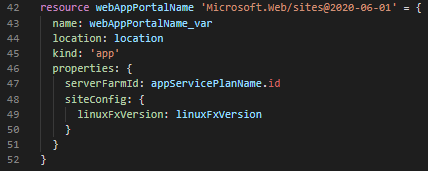

# Tutorial: Use Azure Quickstart templates

[Azure Quickstart templates](https://azure.microsoft.com/resources/templates/) is a repository of community contributed templates. You can use the sample templates in your template development. In this tutorial, you find a website resource definition, and add it to your own template. It takes about **12 minutes** to complete.

## Prerequisites

We recommend that you complete the [tutorial about exported templates](template-tutorial-bicep-export-template.md), but it's not required.

You must have Visual Studio Code with the Bicep extension, and either Azure PowerShell or Azure CLI. For more information, see [template tools](template-tutorial-bicep-create-first-template.md#get-tools).

## Review template

At the end of the previous tutorial, your template had the following Bicep:

:::code language="bicep" source="~/resourcemanager-templates/get-started-with-templates/export-template/azuredeploy.bicep":::

This template works for deploying storage accounts and app service plans, but you might want to add a website to it. You can use pre-built templates to quickly discover the JSON required for deploying a resource. Before Azure Quickstart templates offer Bicep templates, you can use conversion tools to convert JSON templates to Bicep templates.

## Find template

1. Open [Azure Quickstart templates](https://azure.microsoft.com/resources/templates/)
1. In **Search**, enter _deploy linux web app_.
1. Select the tile with the title **Deploy a basic Linux web app**. If you have trouble finding it, here's the [direct link](https://azure.microsoft.com/resources/templates/101-webapp-basic-linux/).
1. Select **Browse on GitHub**.
1. Select _azuredeploy.json_.
1. Review the template. In particular, look for the `Microsoft.Web/sites` resource.

    

1. Browse to **https://bicepdemo.z22.web.core.windows.net/**, and decompile azuredeploy.json to a Bicep template.

## Revise existing template

Merge the decompiled quickstart template with the existing Bicep template:

:::code language="bicep" source="~/resourcemanager-templates/get-started-with-templates/quickstart-template/azuredeploy.bicep" range="1-79" highlight="20-31,34,67-77":::

[jgao - work on the next paragraph]

The web app name needs to be unique across Azure. To prevent having duplicate names, the `webAppPortalName` variable has been updated from `"webAppPortalName": "[concat(parameters('webAppName'), '-webapp')]"` to `"webAppPortalName": "[concat(parameters('webAppName'), uniqueString(resourceGroup().id))]"`.

## Deploy template

Use either Azure CLI or Azure PowerShell to deploy a Bicep template.

If you haven't created the resource group, see [Create resource group](template-tutorial-bicep-create-first-template.md#create-resource-group). The example assumes you've set the **templateFile** variable to the path to the template file, as shown in the [first tutorial](template-tutorial-bicep-create-first-template.md#deploy-template).

# [PowerShell](#tab/azure-powershell)

```azurepowershell
New-AzResourceGroupDeployment `
  -Name addwebapp `
  -ResourceGroupName myResourceGroup `
  -TemplateFile $templateFile `
  -storagePrefix "store" `
  -storageSKU Standard_LRS `
  -webAppName demoapp
```

# [Azure CLI](#tab/azure-cli)

To run this deployment command, you must have the [latest version](/cli/azure/install-azure-cli) of Azure CLI.

```azurecli
az deployment group create \
  --name addwebapp \
  --resource-group myResourceGroup \
  --template-file $templateFile \
  --parameters storagePrefix=store storageSKU=Standard_LRS webAppName=demoapp
```

---

> [!NOTE]
> If the deployment failed, use the `verbose` switch to get information about the resources being created. Use the `debug` switch to get more information for debugging.

## Clean up resources

If you're moving on to the next tutorial, you don't need to delete the resource group.

If you're stopping now, you might want to clean up the resources you deployed by deleting the resource group.

1. From the Azure portal, select **Resource group** from the left menu.
2. Enter the resource group name in the **Filter by name** field.
3. Select the resource group name.
4. Select **Delete resource group** from the top menu.

## Next steps

You learned how to use a quickstart template for your Bicep template development. In the next tutorial, you add tags to the resources.

> [!div class="nextstepaction"]
> [Add tags](template-tutorial-bicep-add-tags.md)
