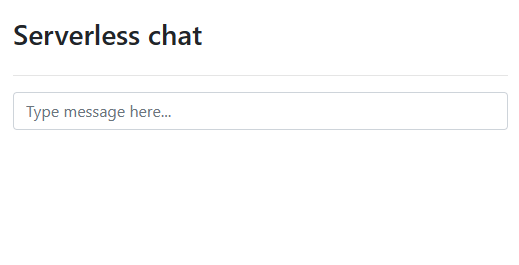
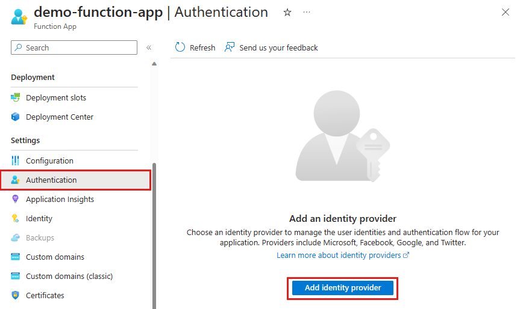
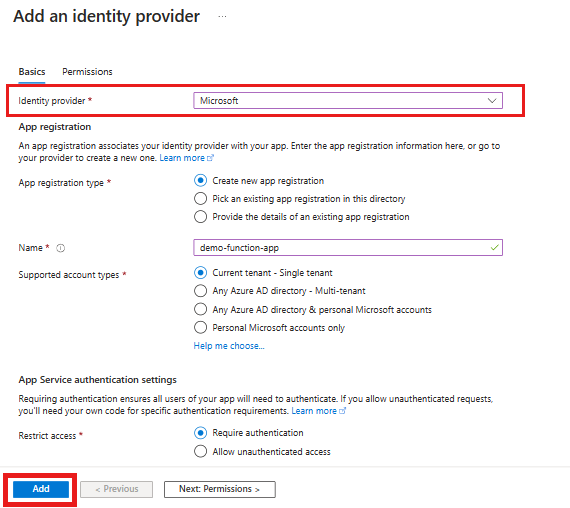
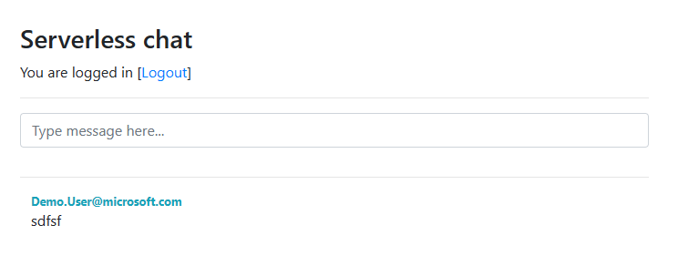

# Tutorial: Azure SignalR Service authentication with Azure Functions

A step by step tutorial to build a chat room with authentication and private messaging using Azure Functions, App Service Authentication, and SignalR Service.

## Introduction

### Technologies used

* [Azure Functions](https://azure.microsoft.com/services/functions/?WT.mc_id=serverlesschatlab-tutorial-antchu) - Backend API for authenticating users and sending chat messages
* [Azure SignalR Service](https://azure.microsoft.com/services/signalr-service/?WT.mc_id=serverlesschatlab-tutorial-antchu) - Broadcast new messages to connected chat clients
* [Azure Storage](https://azure.microsoft.com/services/storage/?WT.mc_id=serverlesschatlab-tutorial-antchu) - Required by Azure Functions

### Prerequisites

* [Node.js](https://nodejs.org/en/download/) (Version 18.x)
* [Azure Functions Core Tools](../azure-functions/functions-run-local.md?#install-the-azure-functions-core-tools) (Version 4)

[Having issues? Let us know.](https://aka.ms/asrs/qsauth)

## Create essential resources on Azure
### Create an Azure SignalR service resource

Your application will access a SignalR Service instance, which you need to create ahead of time.

1. Select on the **Create a resource** (**+**) button for creating a new Azure resource.

1. Search for **SignalR Service** and select it. Select **Create**.

1. Enter the following information.

    | Name | Value |
    |---|---|
    | Resource name | A unique name for the SignalR Service instance |
    | Resource group | Create a new resource group with a unique name |
    | Location | Select a location close to you |
    | Pricing Tier | Free |

1. Select **Create**.

1. After the deployment finishes, open it in the portal and locate its Settings page. Change the Service Mode setting to *Serverless*.

    

[Having issues? Let us know.](https://aka.ms/asrs/qsauth)

### Create an Azure Function App and an Azure Storage account

1. Select on the **Create a resource** (**+**) button for creating a new Azure resource.

1. Search for **Function App** and select it. Select **Create**.

1. Enter the following information.

    | Name | Value |
    |---|---|
    | Function App name | A unique name for the SignalR Service instance |
    | Resource group | Create a new resource group with a unique name |
    | Location | Select a location close to you |
    | Runtime stack | Node.js |

1. By default, a new Azure Storage account will also be created in the same resource group together with your function app. If you want to use another storage account in the function app, switch to **Hosting** tab to choose an account.

1. Select **Review + Create**, then select **Create**.

## Create an Azure Functions project locally
### Initialize a function app

1. Create a new folder locally and execute the following command in your terminal to create a new JavaScript Functions project.
```
func init --worker-runtime node --language javascript --name my-app
```
The generated project by default has an extension bundle in the `host.json` file, which contains SignalR extensions, and you don't need to install it yourself. For more information about extension bundle, see [Register Azure Functions binding extensions](../azure-functions/functions-bindings-register.md#extension-bundles) .

### Configure application settings

When running and debugging the Azure Functions runtime locally, application settings are read by the function app from **local.settings.json**. Update this file with the connection strings of the SignalR Service instance and the storage account that you created earlier.

1. Modify the content of **local.settings.json** to the following.

    ```json
    {
    "IsEncrypted": false,
    "Values": {
        "FUNCTIONS_WORKER_RUNTIME": "node",
        "AzureWebJobsStorage": "<your-storage-account-connection-string>",
        "AzureSignalRConnectionString": "<your-Azure-SignalR-connection-string>"
    }
    }
    ```

   * Enter the Azure SignalR Service connection string into a setting named `AzureSignalRConnectionString`. Obtain the value from the **Keys** page in the Azure SignalR Service resource in the Azure portal; you can use either primary or secondary connection string.


[Having issues? Let us know.](https://aka.ms/asrs/qsauth)

### Create a function to authenticate users to SignalR Service

When the chat app first opens in the browser, it requires valid connection credentials to connect to Azure SignalR Service. You'll create an HTTP triggered function named *negotiate* in your function app to return this connection information.

> [!NOTE]
> This function must be named *negotiate* as the SignalR client requires an endpoint that ends in `/negotiate`.

1. Create a negotiation function named "negotiate" from a built-in template with the following command.
    ```bash
    func new --template "SignalR negotiate HTTP trigger" --name negotiate
    ```

1. Open **negotiate/function.json** to view the function binding configuration. The function contains an HTTP trigger binding to receive request from SignalR clients and a SignalR input binding to generate valid credentials for a client to connect to an Azure SignalR Service hub named `default`.

    ```json
    {
        "disabled": false,
        "bindings": [
            {
                "authLevel": "anonymous",
                "type": "httpTrigger",
                "direction": "in",
                "methods": ["post"],
                "name": "req",
                "route": "negotiate"
            },
            {
                "type": "http",
                "direction": "out",
                "name": "res"
            },
            {
                "type": "signalRConnectionInfo",
                "name": "connectionInfo",
                "hubName": "default",
                "connectionStringSetting": "AzureSignalRConnectionString",
                "direction": "in"
            }
        ]
    }
    ```

    There's no `userId` property in the `signalRConnectionInfo` binding for local development, but you'll add it later to set the user name of a SignalR connection when you deploy the function app to Azure.

1. Open **negotiate/index.js** to view the body of the function.

    ```javascript
    module.exports = async function (context, req, connectionInfo) {
        context.res.body = connectionInfo;
    };
    ```

    This function takes the SignalR connection information from the input binding and returns it to the client in the HTTP response body. The SignalR client uses this information to connect to the SignalR Service instance.

[Having issues? Let us know.](https://aka.ms/asrs/qsauth)

### Create a function to send chat messages

The web app also requires an HTTP API to send chat messages. You'll create an HTTP triggered function named *sendMessage* that sends messages to all connected clients using SignalR Service.

1. Create an HTTP trigger function named *sendMessage* from template with the command:
    ```bash
    func new --name sendMessage --template "Http trigger"
    ```

1. Modify the content of **sendMessage/function.json** to configure bindings for the function.
    ```json
    {
        "disabled": false,
        "bindings": [
            {
                "authLevel": "anonymous",
                "type": "httpTrigger",
                "direction": "in",
                "name": "req",
                "route": "messages",
                "methods": ["post"]
            },
            {
                "type": "http",
                "direction": "out",
                "name": "res"
            },
            {
                "type": "signalR",
                "name": "$return",
                "hubName": "default",
                "direction": "out"
            }
        ]
    }
    ```
    We make two changes to the original function:
    * Changes the route to `messages` and restricts the HTTP trigger to the **POST** HTTP method.
    * Adds a SignalR Service output binding that sends a message returned by the function to all clients connected to a SignalR Service hub named `default`.

1. Modify the content of **sendMessage/index.js** to the following.

    ```javascript
    module.exports = async function (context, req) {
        const message = req.body;
        message.sender = req.headers && req.headers['x-ms-client-principal-name'] || '';

        let recipientUserId = '';
        if (message.recipient) {
            recipientUserId = message.recipient;
            message.isPrivate = true;
        }

        return {
            'userId': recipientUserId,
            'target': 'newMessage',
            'arguments': [ message ]
        };
    };
    ```

    This function takes the body from the HTTP request and sends it to clients connected to SignalR Service, invoking a function named `newMessage` on each client.

    The function can read the sender's identity and can accept a *recipient* value in the message body to allow you to send a message privately to a single user. You'll use these functionalities later in the tutorial.

1. Save the file.

[Having issues? Let us know.](https://aka.ms/asrs/qsauth)

### Host the chat client web user interface

The chat application's UI is a simple single page application (SPA) created with the Vue JavaScript framework using [ASP.NET Core SignalR JavaScript client](/aspnet/core/signalr/javascript-client). For simplicity, we use the function app to host the web page. In production environment, you can use [Static Web Apps](https://azure.microsoft.com/products/app-service/static) to host the web page.

1. Create a new folder named **content** in the root directory of your function project. In the **content** folder, create a new file named **index.html**.

1. Copy and paste the content of **[index.html](https://github.com/aspnet/AzureSignalR-samples/blob/da0aca70f490f3d8f4c220d0c88466b6048ebf65/samples/ServerlessChatWithAuth/content/index.html)** to your file. Save the file.

1. Create an HTTP trigger function named *index* from template with the command:
    ```bash
    func new --name index --template "Http trigger"
    ```

1. Modify the content of **index/index.js** to the following:
    ```js
    const fs = require('fs');

    module.exports = async function (context, req) {
        const fileContent = fs.readFileSync('content/index.html', 'utf8');

        context.res = {
            // status: 200, /* Defaults to 200 */
            body: fileContent,
            headers: {
                'Content-Type': 'text/html'
            },
        };
    }
    ```
    The function reads the static web page and returns it to the user.

1. Open **index/function.json**, change the **authLevel** of the bindings to **anonymous**. Now the whole file looks like this:
    ```json
    {
        "bindings": [
            {
                "authLevel": "anonymous",
                "type": "httpTrigger",
                "direction": "in",
                "name": "req",
                "methods": ["get", "post"]
            },
            {
                "type": "http",
                "direction": "out",
                "name": "res"
            }
        ]
    }
    ```

1. Now you can test your app locally. Start the function app with the command:
    ```bash
    func start
    ```

1. Open **http://localhost:7071/api/index** in your web browser. You should be able to see a web page as follows:

    

1. Enter a message in the chat box and press enter. Refresh the application to see new messages. Because we don't set the user name of the SignalR client, we send all messages as "anonymous".

[Having issues? Let us know.](https://aka.ms/asrs/qsauth)

## Deploy to Azure and enable authentication

You have been running the function app and chat application locally. You'll now deploy them to Azure and enable authentication and private messaging in the application.

### Configure function app for authentication

So far, the chat app works anonymously. In Azure, you'll use [App Service Authentication](../app-service/overview-authentication-authorization.md) to authenticate the user. We can pass the user ID or username of the authenticated user to the *SignalRConnectionInfo* binding to generate connection information that is authenticated as the user.

1. Open **negotiate/function.json**.

1. Insert a *userId* property to the *SignalRConnectionInfo* binding with value `{headers.x-ms-client-principal-name}`. This value is a [binding expression](../azure-functions/functions-triggers-bindings.md) that sets the user name of the SignalR client to the name of the authenticated user. The binding should now look like this.

    ```json
    {
        "type": "signalRConnectionInfo",
        "name": "connectionInfo",
        "userId": "{headers.x-ms-client-principal-name}",
        "hubName": "default",
        "direction": "in"
    }
    ```

1. Save the file.


### Deploy function app to Azure
Deploy the function app to Azure with the following command:

```bash
func azure functionapp publish <your-function-app-name> --publish-local-settings
```

The *--publish-local-settings* option enables publishing your local settings in **local.settings.json** to Azure so that you don't need to configure them in Azure again.


### Enable App Service Authentication

App Service Authentication supports authentication with Azure Active Directory, Facebook, Twitter, Microsoft account, and Google. Here we use **Microsoft** as identity provider.

1. Go to the resource page of your function app on Azure portal. Select **Settings** -> **Authentication** -> **Add an identity provider**.
    

1. Select **Microsoft** as the identity provider.
    

    You could follow the documentations for more information about different identity providers.

    - [Azure Active Directory](../app-service/configure-authentication-provider-aad.md)
    - [Facebook](../app-service/configure-authentication-provider-facebook.md)
    - [Twitter](../app-service/configure-authentication-provider-twitter.md)
    - [Microsoft account](../app-service/configure-authentication-provider-microsoft.md)
    - [Google](../app-service/configure-authentication-provider-google.md)

1. Select **Add** to complete the settings. An app registration will be created, which associates your identity provider with your function app.

### Try the application

1. Open **https://\<YOUR-FUNCTION-APP-NAME\>.azurewebsites.net/api/index**

1. Select **Login** to authenticate with your chosen authentication provider.

1. Send public messages by entering them into the main chat box.

1. Send private messages by clicking on a username in the chat history. Only the selected recipient will receive these messages.



Congratulations! You've deployed a real-time, serverless chat app!

[Having issues? Let us know.](https://aka.ms/asrs/qsauth)

## Clean up resources

To clean up the resources created in this tutorial, delete the resource group using the Azure portal.

[Having issues? Let us know.](https://aka.ms/asrs/qsauth)

## Next steps

In this tutorial, you learned how to use Azure Functions with Azure SignalR Service. Read more about building real-time serverless applications with SignalR Service bindings for Azure Functions.

> [!div class="nextstepaction"]
> [Build Real-time Apps with Azure Functions](signalr-concept-azure-functions.md)

[Having issues? Let us know.](https://aka.ms/asrs/qsauth)
