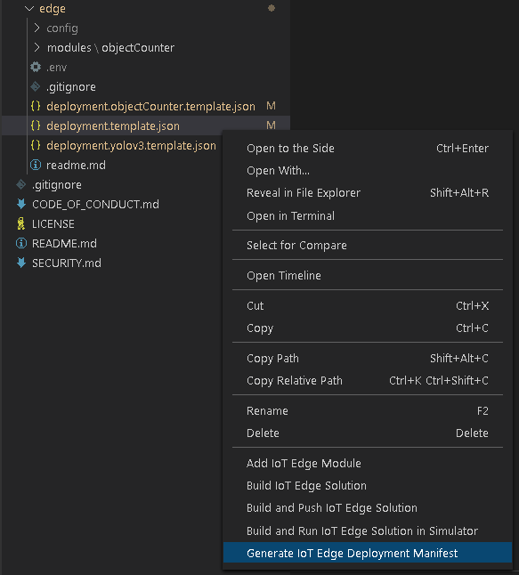

The deployment manifest defines what modules are deployed to an edge device. It also defines configuration settings for those modules. 

Follow these steps to generate the manifest from the template file and then deploy it to the edge device.

1. Open Visual Studio Code.
1. Next to the **AZURE IOT HUB** pane, select the **More actions** icon to set the IoT Hub connection string. You can copy the string from the *src/cloud-to-device-console-app/appsettings.json* file. 

    
> [!NOTE]
> You might be asked to provide Built-in endpoint information for the IoT Hub. To get that information, in Azure portal, navigate to your IoT Hub and look for **Built-in endpoints** option in the left navigation pane. Click there and look for the **Event Hub-compatible endpoint** under **Event Hub compatible endpoint** section. Copy and use the text in the box. The endpoint will look something like this:  
    ```
    Endpoint=sb://iothub-ns-xxx.servicebus.windows.net/;SharedAccessKeyName=iothubowner;SharedAccessKey=XXX;EntityPath=<IoT Hub name>
    ```

1. Right-click **src/edge/deployment.template.json** and select **Generate IoT Edge Deployment Manifest**.

    
        <!-- This image location may have changed -->

    This action should create a manifest file named *deployment.amd64.json* in the *src/edge/config* folder.
1. Right-click **src/edge/config/deployment.amd64.json**, select **Create Deployment for Single Device**, and then select the name of your edge device.

    
    <!-- This image location may have changed -->

1. When you're prompted to select an IoT Hub device, choose **ava-sample-device** from the drop-down menu.
1. After about 30 seconds, in the lower-left corner of the window, refresh Azure IoT Hub. The edge device now shows the following deployed modules:

    * Azure Video Analyzer on IoT Edge (module name `avaEdge`)
    * Real-Time Streaming Protocol (RTSP) simulator (module name `rtspsim`)

The RTSP simulator module simulates a live video stream by using a video file that was copied to your edge device when you ran the [Azure Video Analyzer resources setup script](https://github.com/Azure/live-video-analytics/tree/master/edge/setup). 
<!-- Above link will need to be updated to new AVA setup script-->

> [!NOTE]
> If you are using your own edge device instead of the one provisioned by our setup script, go to your edge device and run the following commands with **admin rights**, to pull and store the sample video file used for this quickstart:  

```
mkdir /home/avaedgeuser/samples      
mkdir /home/avaedgeuser/samples/input    
curl https://avamedia.blob.core.windows.net/public/camera-300s.mkv > /home/lvaedgeuser/samples/input/camera-300s.mkv  
chown -R avalvaedgeuser:localusergroup /home/avaedgeuser/samples/  
```
<!-- I assume that to reflect ava:
we will change the username to ava...
we will change the foldername ava...
We will change the blob name/location to reflect ava

-->
At this stage, the modules are deployed but no media graphs are active.
