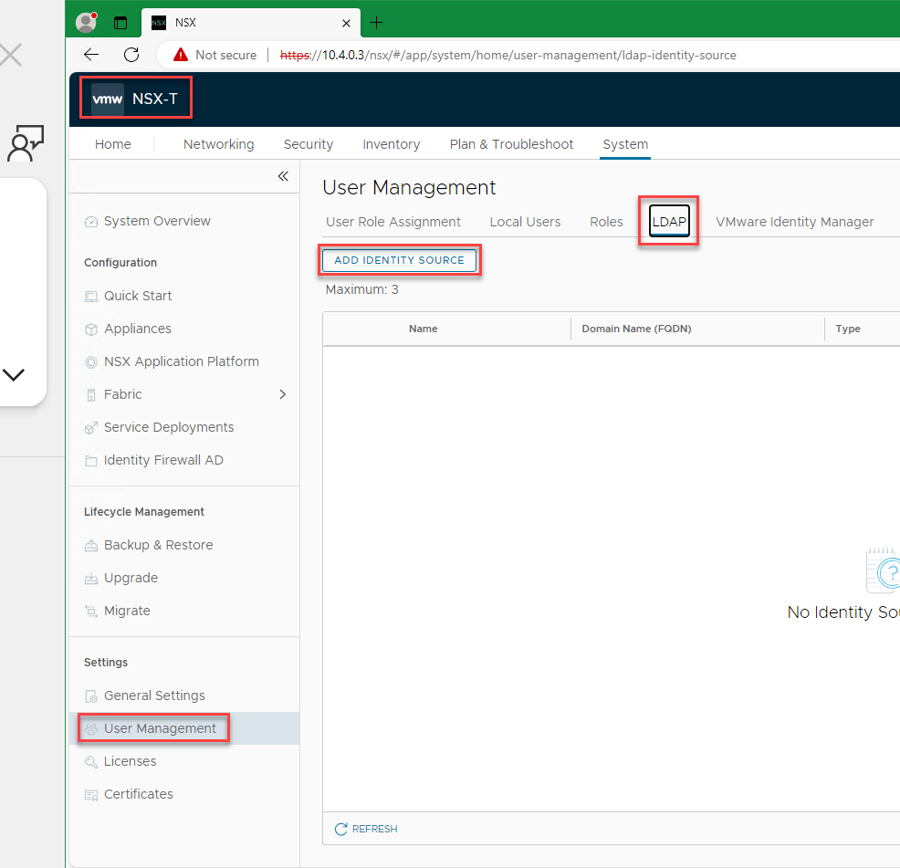
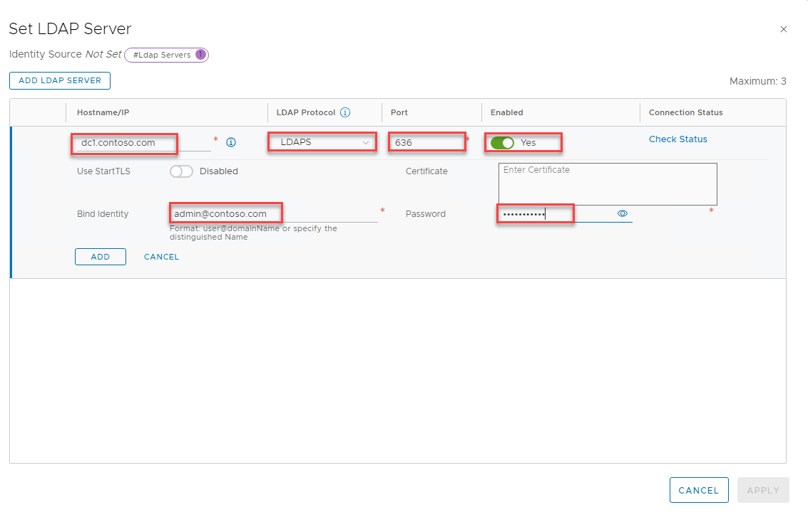
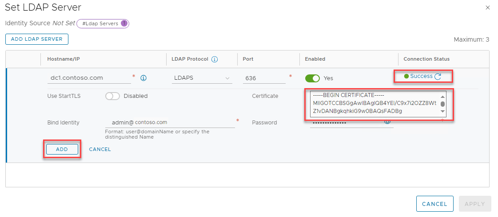
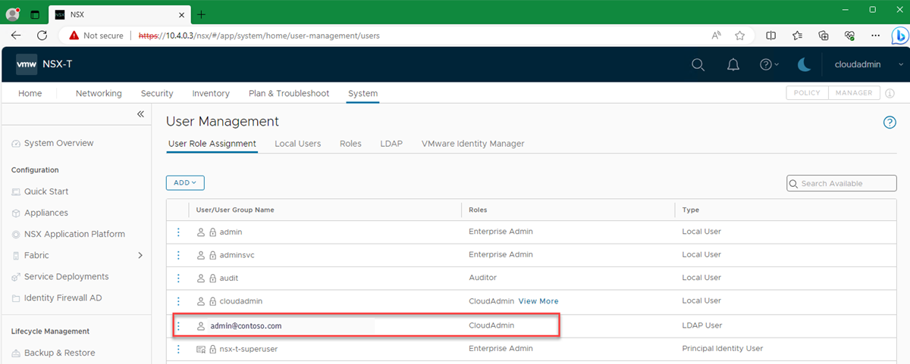

# Set up an external identity source for NSX-T Data Center

In this article, you will learn how to configure an external identity source for the NSX-T Data Center in an Azure VMware Solution. The NSX-T Data Center can be configured to use an external LDAP directory service to authenticate users, enabling a user to log in using their Active Directory account credentials, or those from a 3rd party LDAP server. The account can then be assigned an NSX-T Data Center Role, like you have with on-premises environments, to provide RBAC for each NSX-T user.

## Prerequisites

- A working connection from your Active Directory network to your Azure VMware Solution private cloud.  
- A network path from your Active Directory server to the management network of Azure VMware solution where NSX-T is deployed.  
- Best practice: Two domain controllers located in Azure in the same region as the Azure VMware Solution SDDC.  
- Active Directory Domain Controller(s) with a valid certificate. The certificate could be issued by an [Active Directory Certificate Services Certificate Authority (CA)](https://social.technet.microsoft.com/wiki/contents/articles/2980.ldap-over-ssl-ldaps-certificate.aspx) or a [third-party CA](/troubleshoot/windows-server/identity/enable-ldap-over-ssl-3rd-certification-authority).

> [!NOTE]
> Self-sign certificates are not recommended for production environments.

- An account with Administrator permissions 
- The Azure VMware Solution DNS zones and the DNS servers have been correctly deployed. See: [Configure NSX-T Data Center DNS for resolution to your Active Directory Domain and Configure DNS forwarder for Azure VMware Solution](configure-dns-azure-vmware-solution.md) 

>[!NOTE]
> For more information about LDAPS and certificate issuance, see with your security or identity management team.

 

## Configure NSX-T to use Active Directory as LDAPS identity source

1. Sign in to NSX-T Manager and go to **System** > **User Management** > **LDAP** > **Add Identity Source**.

   

1. Enter the Name, Domain Name (FQDN), the Type and base DN.  Optionally add a description.
The base DN is the container where your user accounts are kept, it is the starting point that an LDAP server uses when searching for users for an authentication request.  For example CN=users,dc=azfta,dc=com.

> [!NOTE]
> You can use more than one directory as an LDAP provider, i.e. with multiple AD domains when using AVS as a way to consolidate workloads.
 

   

1. Next,  click Set (!) as shown on the screenshot above, then click on "ADD LDAP SERVER" and fill in the following fields

    | Field                | Explanation|
    |----------------------|------------|
    | Hostname/IP          | The LDAP server’s FQDN or IP address. For example, `azfta-dc01.azfta.com` or `10.5.4.4`. |
    | LDAP Protocol        | Select **LDAPS**. |
    | Port Choose 636     | The default secure LDAP port. |
    | Enabled              | Leave as **Yes**. |
    | Use StartTLS        | Only required if non-secured LDAP is being used. |
    | Bind Identity        | Use your account with domain administrator permissions. For example, `<admin@contoso.com>`. |
    | Password            | Enter the password for the LDAP server, this is the password for the example `<admin@contoso.com>` account. |
    | Certificate          | Leave empty (see step 6). |

   

1. The screen will update, click Click ADD, then APPLY

    

1. Back on the User Management screen, click "SAVE" to complete the changes.

1. To add a second domain controller or another external identity provider, go back to step 1.

>[!NOTE]
> A best practice is to have two domain controllers to act as LDAP servers. You can also put the LDAP servers behind a load balancer.

## Assign other NSX-T Data Center roles to Active Directory identities

After adding an external identity, you can assign NSX-T Data Center Roles to Active Directory security groups based on your organization's security controls.

1. Sign in to NSX-T Manager and go to **System** > **Users Management** > **User Role Assignment** > **Add**.

   

1. Select **Add** > **Role Assignment for LDAP**.  

    1. Select the external identity provider. This is the identity provider that you selected in step 3 in the preceding section.  “NSX-T External Identity Provider”

    1. Enter the first few characters of the user's name, sign-in ID, or a group name to search the LDAP directory. Then select a user or group from the list of results.

    1. Select a role. In this example, assign the FTAdmin the role of **CloudAdmin**.

    1. Select **Save**.

   

1. Under **User Role Assignment**, verify that the permissions assignment is displayed.

   

Users should now be able to sign in to NSX-T Manager by using their Windows Server Active Directory credentials.

## Related content

Now that you configured the external source, you can also learn about:

- [Configure an external identity source for vCenter Server](configure-identity-source-vcenter.md)
- [Azure VMware Solution identity concepts](concepts-identity.md)
- [VMware product documentation](https://docs.vmware.com/en/VMware-NSX-T-Data-Center/3.1/administration/GUID-DB5A44F1-6E1D-4E5C-8B50-D6161FFA5BD2.html)
