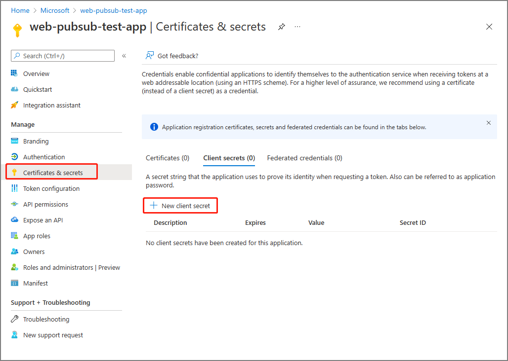
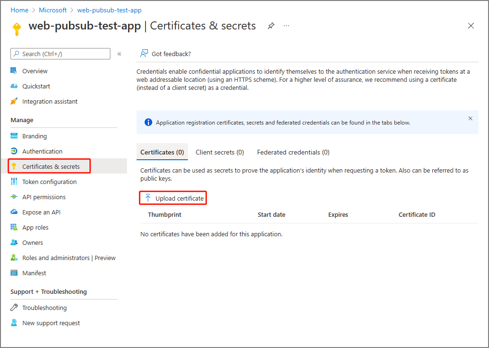
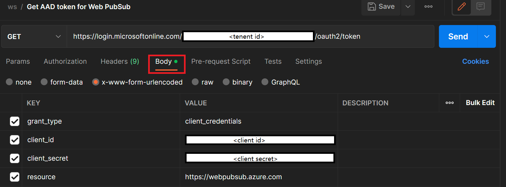
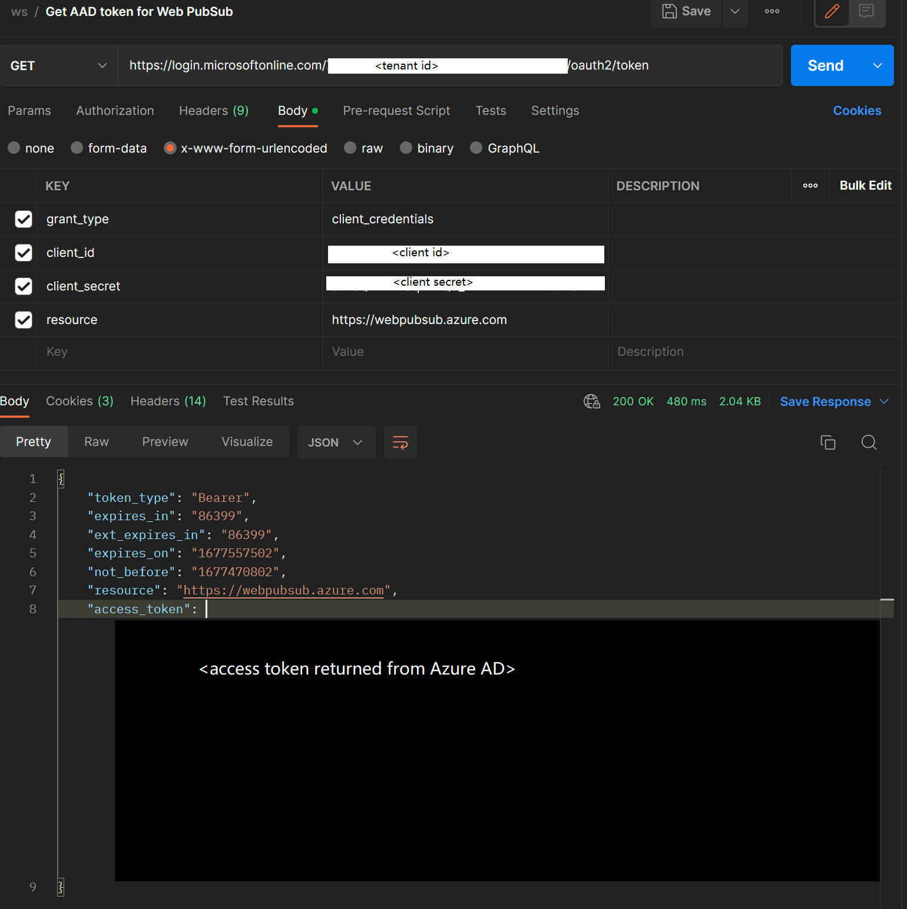

# Authorize request to Web PubSub resources with Azure AD from Azure applications

Azure Web PubSub Service supports Azure Active Directory (Azure AD) authorizing requests from [Azure applications](../active-directory/develop/app-objects-and-service-principals.md). 

This article shows how to configure your Web PubSub resource and codes to authorize the request to a Web PubSub resource from an Azure application.

## Register an application

The first step is to register an Azure application.

1. On the [Azure portal](https://portal.azure.com/), search for and select **Azure Active Directory**
2. Under **Manage** section, select **App registrations**.
3. Click **New registration**.

    

4. Enter a display **Name** for your application.
5. Click **Register** to confirm the register.

Once you have your application registered, you can find the **Application (client) ID** and **Directory (tenant) ID** under its Overview page. These GUIDs can be useful in the following steps.

To learn more about registering an application, see
- [Quickstart: Register an application with the Microsoft identity platform](../active-directory/develop/quickstart-register-app.md).

## Add credentials

You can add both certificates and client secrets (a string) as credentials to your confidential client app registration.

### Client secret

The application requires a client secret to prove its identity when requesting a token. To create a client secret, follow these steps.

1. Under **Manage** section, select **Certificates & secrets**
1. On the **Client secrets** tab, click **New client secret**.

1. Enter a **description** for the client secret, and choose a **expire time**.
1. Copy the value of the **client secret** and then paste it to a secure location. 
    > [!NOTE]
    > The secret will display only once.
### Certificate

You can also upload a certification instead of creating a client secret.

To learn more about adding credentials, see

- [Add credentials](../active-directory/develop/quickstart-register-app.md#add-credentials)

## Add role assignments on Azure portal

This sample shows how to assign a `Web PubSub Service Owner` role to a service principal (application) over a Web PubSub resource. 

> [!Note]
> A role can be assigned to any scope, including management group, subscription, resource group or a single resource. To learn more about scope, see [Understand scope for Azure RBAC](../role-based-access-control/scope-overview.md)
1. On the [Azure portal](https://portal.azure.com/), navigate to your Web PubSub resource.

1. Click **Access Control (IAM)** to display access control settings for the Azure Web PubSub.

1. Click the **Role assignments** tab to view the role assignments at this scope.

   The following screenshot shows an example of the Access control (IAM) page for a Web PubSub resource.

   

1. Click **Add > Add role assignment**.

1. On the **Roles** tab, select `Web PubSub Service Owner`.

1. Click **Next**.

   

1. On the **Members** tab, under **Assign access to** section, select **User, group, or service principal**.

1. Click **Select Members**

3. Search for and select the application that you would like to assign the role to.

1. Click **Select** to confirm the selection.

4. Click **Next**.

   

5. Click **Review + assign** to confirm the change.

> [!IMPORTANT]
> Azure role assignments may take up to 30 minutes to propagate.
To learn more about how to assign and manage Azure role assignments, see these articles:
- [Assign Azure roles using the Azure portal](../role-based-access-control/role-assignments-portal.md)
- [Assign Azure roles using the REST API](../role-based-access-control/role-assignments-rest.md)
- [Assign Azure roles using Azure PowerShell](../role-based-access-control/role-assignments-powershell.md)
- [Assign Azure roles using Azure CLI](../role-based-access-control/role-assignments-cli.md)
- [Assign Azure roles using Azure Resource Manager templates](../role-based-access-control/role-assignments-template.md)

## Use Postman to get the Azure AD token
1. Launch Postman

2. For the method, select **GET**.

3. For the **URI**, enter `https://login.microsoftonline.com/<TENANT ID>/oauth2/token`. Replace `<TENANT ID>` with the **Directory (tenant) ID** value in the **Overview** tab of the application you created earlier.

4. On the **Headers** tab, add **Content-Type** key and `application/x-www-form-urlencoded` for the value.

5. Switch to the **Body**tab, and add the following keys and values.
    1. Select **x-www-form-urlencoded**.
    2. Add `grant_type` key, and type `client_credentials` for the value.
    3. Add `client_id` key, and paste the value of **Application (client) ID** in the **Overview** tab of the application you created earlier.
    4. Add `client_secret` key, and paste the value of client secret you noted down earlier.
    5. Add `resource` key, and type `https://webpubsub.azure.com` for the value.

6. Select **Send** to send the request to get the token. You see the token in the `access_token` field. 

## Sample codes using Azure AD auth

We officially support 4 programming languages:

- [C#](./howto-create-serviceclient-with-net-and-azure-identity.md)
- [Python](./howto-create-serviceclient-with-python-and-azure-identity.md)
- [Java](./howto-create-serviceclient-with-java-and-azure-identity.md)
- [JavaScript](./howto-create-serviceclient-with-javascript-and-azure-identity.md)

## Next steps

See the following related articles:
- [Overview of Azure AD for Web PubSub](concept-azure-ad-authorization.md)
- [Authorize request to Web PubSub resources with Azure AD from managed identities](howto-authorize-from-managed-identity.md)
