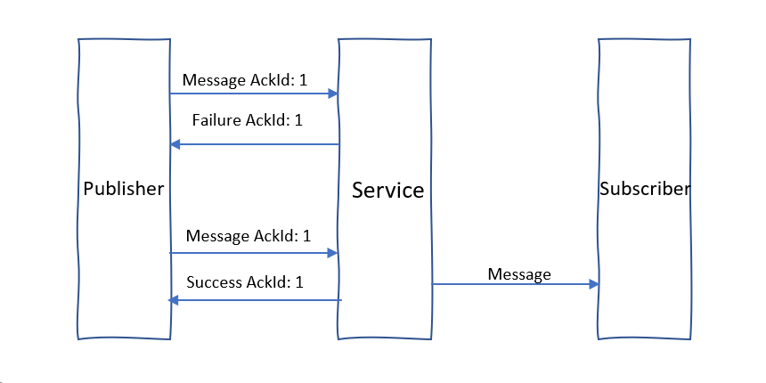
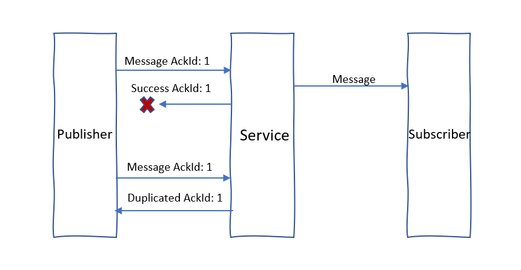

# Create reliable Websocket with subprotocol

When Websocket client connections drop due to intermittent network issues, messages can be lost. In a pub/sub system, publishers are decoupled from subscribers, so publishers may not detect a subscribers' dropped connection or message loss. It's crucial for clients to overcome intermittent network issues and maintain reliable message delivery. To achieve that, you can create a reliable Websocket client with the help of reliable Azure Web PubSub subprotocols.

> [!NOTE]
> Reliable protocols are still in preview. Some changes are expected in the future.

## Reliable Protocol

The Web PubSub service supports two reliable subprotocols `json.reliable.webpubsub.azure.v1` and `protobuf.reliable.webpubsub.azure.v1`. Clients must follow the publisher, subscriber, and reconnection parts of the subprotocol to achieve reliability.  Failing to properly implement the subprotocol may result in the message delivery not working as expected or the service terminating the client due to protocol violations.

## Initialization

To use reliable subprotocols, you must set the subprotocol when constructing Websocket connections. In JavaScript, you can use the following command:

- Use Json reliable subprotocol

    ```js
    var pubsub = new WebSocket('wss://test.webpubsub.azure.com/client/hubs/hub1', 'json.reliable.webpubsub.azure.v1');
    ```

- Use Protobuf reliable subprotocol

    ```js
    var pubsub = new WebSocket('wss://test.webpubsub.azure.com/client/hubs/hub1', 'protobuf.reliable.webpubsub.azure.v1');
    ```

## Reconnection

Reconnection is the basis of achieving reliability and must be implemented when using the `json.reliable.webpubsub.azure.v1` and `protobuf.reliable.webpubsub.azure.v1` protocols.

Websocket connections rely on TCP.  When the connection doesn't drop, messages are lossless and delivered in order. When connections drop, reconnection is enabled by using the connection status information, including group and message information kept by the Web PubSub service. 

When the client reconnects to the service using reliable subprotocols, the client will receive a `Connected` message containing the  `connectionId` and `reconnectionToken`. The `connectionId` identifies the session of the connection in the service.

```json
{
    "type":"system",
    "event":"connected",
    "connectionId": "<connection_id>",
    "reconnectionToken": "<reconnection_token>"
}
```

Once the WebSocket connection drops, the client should try to reconnect with the same `connectionId` to keep the restore the same session. Clients don't need to negotiate with the server and obtain the `access_token`. Instead, reconnection should make a websocket connect request directly to the service with the service uri, `connection_id`, and `reconnection_token`:

```text
wss://<service-endpoint>/client/hubs/<hub>?awps_connection_id=<connection_id>&awps_reconnection_token=<reconnection_token>
```

Reconnection may fail if the network issue hasn't been recovered yet. The client should keep retrying to reconnect until:

1. The Websocket connection is closed with status code 1008. The status code means the connectionId has been removed from the service.
2. A reconnection failure continues to occur for more than 1 minute.

## Publisher

Clients that send events to event handlers or publish messages to other clients are called publishers. Publishers should set `ackId` in the message to receive an acknowledgment from the Web PubSub service that publishing the message was successful or not. The `ackId` in message is the identifier of the message, each new message should use a unique ID.  The original `ackId` should be used when resending a message.

A sample group send message:

```json
{
    "type": "sendToGroup",
    "group": "group1",
    "dataType" : "text",
    "data": "text data",
    "ackId": 1
}
```

A sample ack response:

```json
{
    "type": "ack",
    "ackId": 1,
    "success": true
}
```

When the Web PubSub service returns an ack response with `success: true`, the message has been processed by the service, and the client can expect the message will be delivered to all subscribers.

When the service experiences a transient internal error and the message can't be sent to subscriber, the publisher will receive an ack with `success: false`.  The publisher should read the error to determine whether or not to resend the message.  If the message is resent, the same `ackId` should be used.

```json
{
    "type": "ack",
    "ackId": 1,
    "success": false,
    "error": {
        "name": "InternalServerError",
        "message": "Internal server error"
    }
}
```



If the service's ack response is lost because the WebSocket connection dropped, the publisher should resend message with the same `ackId` after reconnection. When the message was previously processed by the service, it will send an ack containing a `Duplicate` error and the publisher should stop resending this message.

```json
{
    "type": "ack",
    "ackId": 1,
    "success": false,
    "error": {
        "name": "Duplicate",
        "message": "Message with ack-id: 1 has been processed"
    }
}
```



## Subscriber

Clients that receive messages from event handlers or publishers are called subscribers. When connections drop due to network issues, the Web PubSub service doesn't know how many messages were sent to subscribers. To determine the last message received by the subscriber, the service sends a data message containing a `sequenceId`. The subscriber responds with a sequence ack message:

A sample sequence ack:

```json
{
    "type": "sequenceAck",
    "sequenceId": 1
}
```

The `sequenceId` is a uint64 incremental number in a connection-id session. Subscribers should record the largest `sequenceId` it has received, accept only messages with a larger `sequenceId`, and drop messages with a smaller or equal `sequenceId`. The subscriber should ack with the largest `sequenceId` it recorded, so that the service can skip redelivering messages that subscribers have already received. For example, if the subscriber responds with a `sequenceAck` with `sequenceId: 5`, the service will only resend messages with a `sequenceId` larger than 5.

All messages are delivered to subscribers in order until the WebSocket connection drops. With `sequenceId`, the service can know how many messages subscribers have received across WebSocket connections in a session. After a WebSocket connection drops, the service will redeliver messages not acknowledged by the subscriber. The service stores a limited number of unacknowledged messages. When the number of messages exceed the limit, the service will close the WebSocket connection and remove the session. Thus, subscribers should ack the `sequenceId` as soon as possible.
