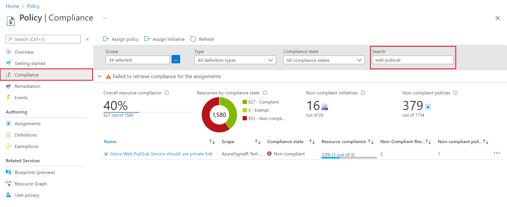

# Audit compliance of Azure Web PubSub Service resources using Azure Policy

[Azure Policy](../governance/policy/overview.md) is a free service in Azure to create, assign, and manage policies that enforce rules and effects to ensure your resources stay compliant with your corporate standards and service level agreements. Use these policies to audit Web PubSub resources for compliance.

This article describes the built-in policies for Azure Web PubSub Service.

## Built-in policy definitions

The following table contains an index of Azure Policy built-in policy definitions for Azure Web PubSub. For Azure Policy built-ins for other services, see [Azure Policy built-in definitions](../governance/policy/samples/built-in-policies.md).

The name of each built-in policy definition links to the policy definition in the Azure portal. Use the link in the Version column to view the source on the [Azure Policy GitHub repo](https://github.com/Azure/azure-policy).

[!INCLUDE [azure-policy-reference-policies-web-pubsub](../../includes/policy/reference/bycat/policies-web-pubsub.md)]

## Assign policy definitions

When assigning a policy definition:

- You can assign policy definitions using the [Azure portal](../governance/policy/assign-policy-portal.md), [Azure CLI](../governance/policy/assign-policy-azurecli.md), a [Resource Manager template](../governance/policy/assign-policy-template.md), or the Azure Policy SDKs.
- Policy assignments can be scoped to a resource group, a subscription, or an [Azure management group](../governance/management-groups/overview.md).
- You can enable or disable [policy enforcement](../governance/policy/concepts/assignment-structure.md#enforcement-mode) at any time.
- Web PubSub policy assignments apply to existing and new Web PubSub resources within the scope.

> [!NOTE]
> After you assign or update a policy, it takes some time for the assignment to be applied to resources in the defined scope. See information about [policy evaluation triggers](../governance/policy/how-to/get-compliance-data.md#evaluation-triggers).

## Review policy compliance

Access compliance information generated by your policy assignments using the Azure portal, Azure command-line tools, or the Azure Policy SDKs. For details, see [Get compliance data of Azure resources](../governance/policy/how-to/get-compliance-data.md).

When a resource is non-compliant, there are many possible reasons. To determine the reason or to find the change responsible, see [Determine non-compliance](../governance/policy/how-to/determine-non-compliance.md).

### Policy compliance in the portal:

1. Open the Azure portal and search for **Policy**.
1. Select **Policy**.
1. Select **Compliance**.
1. Use the filters to display by **Scope**, **Type** or **Compliance state**. Use search list by name or
   ID.
   [  ](./media/howto-monitor-azure-policy/azure-policy-compliance.png#lightbox)
1. Select a policy to review aggregate compliance details and events.
1. Select a specific Web PubSub for resource compliance.

### Policy compliance in the Azure CLI

You can use the Azure CLI to get compliance data. Use the [az policy assignment list](/cli/azure/policy/assignment#az-policy-assignment-list) command to get the policy IDs of the Azure Web PubSub Service policies that are applied:

```azurecli
az policy assignment list --query "[?contains(displayName,'Web PubSub')].{name:displayName, ID:id}" --output table
```

Example output:

```
Name                                                                                   ID
-------------------------------------------------------------------------------------  --------------------------------------------------------------------------------------------------------------------------------
[Preview]: Azure Web PubSub Service should use private links  /subscriptions/<subscriptionId>/resourceGroups/<resourceGroup>/providers/Microsoft.Authorization/policyAssignments/<assignmentId>
```

Run the [az policy state list](/cli/azure/policy/state#az-policy-state-list) command to return the JSON-formatted compliance state for all resources under a specific resource group:

```azurecli
az policy state list --g <resourceGroup>
```

Run the [az policy state list](/cli/azure/policy/state#az-policy-state-list) command to return the JSON-formatted compliance state of a specific Web PubSub resource:

```azurecli
az policy state list \
 --resource /subscriptions/<subscriptionId>/resourceGroups/<resourceGroup>/providers/Microsoft.SignalRService/WebPubSub/<resourceName> \
 --namespace Microsoft.SignalRService \
 --resource-group <resourceGroup>
```

## Next steps

- Learn more about Azure Policy [definitions](../governance/policy/concepts/definition-structure.md) and [effects](../governance/policy/concepts/effects.md)

- Create a [custom policy definition](../governance/policy/tutorials/create-custom-policy-definition.md)

- Learn more about [governance capabilities](../governance/index.yml) in Azure

<!-- LINKS - External -->

[terms-of-use]: https://azure.microsoft.com/support/legal/preview-supplemental-terms/
