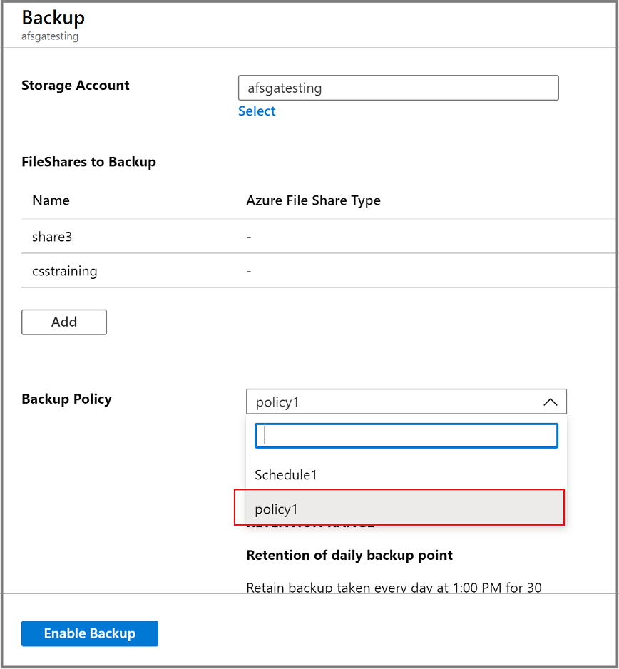
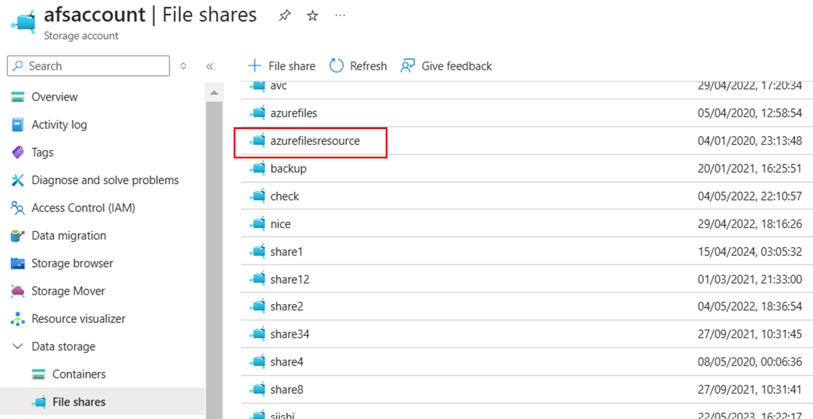
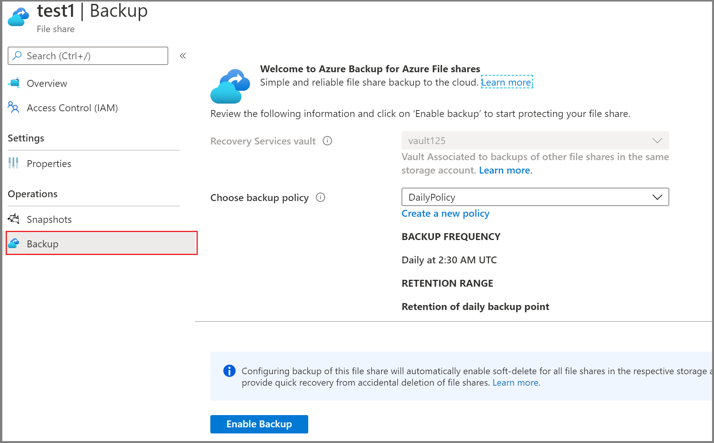
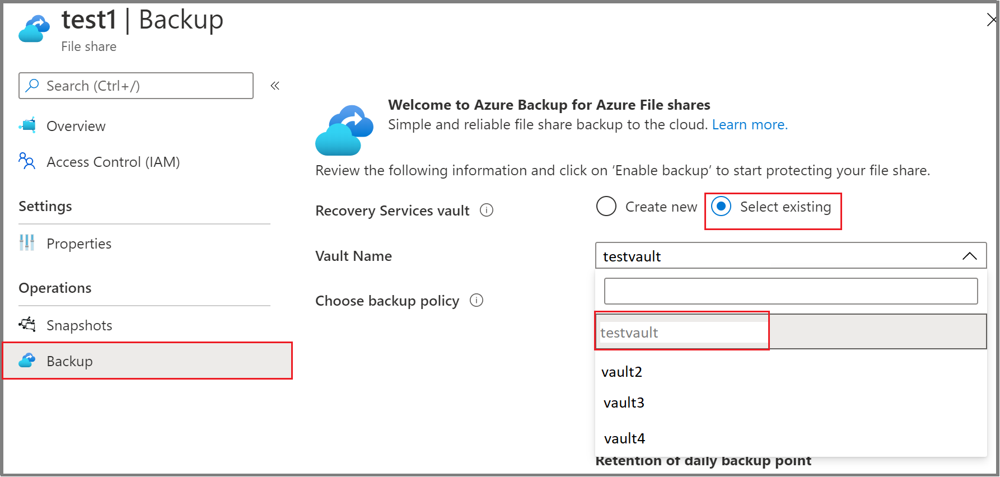
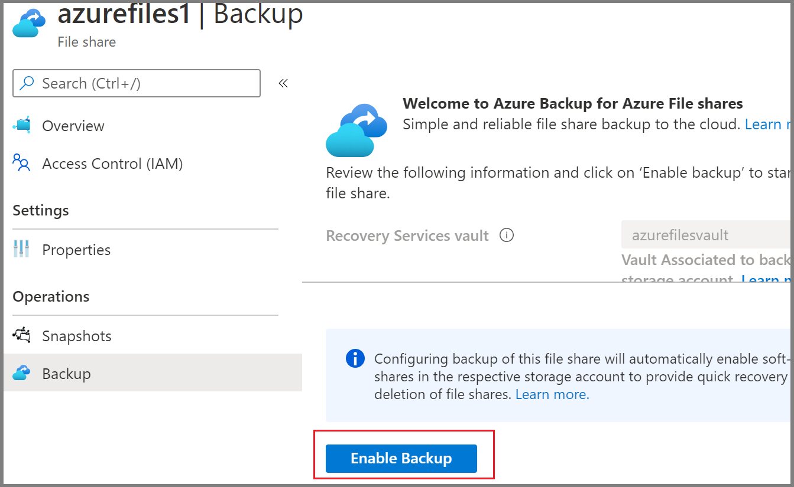
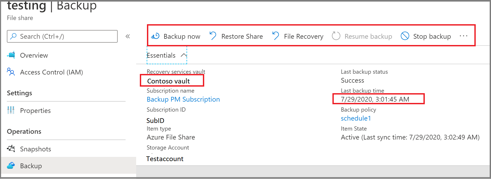
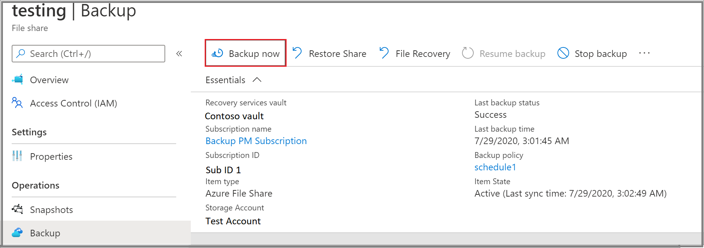
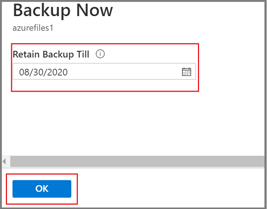

# Back up Azure file shares

This article explains how to  back up [Azure file shares](../storage/files/storage-files-introduction.md) from the Azure portal.

In this article, you'll learn how to:

* Create a Recovery Services vault.
* Configure backup from the Recovery Services vault
* Configure backup from the file share pane
* Run an on-demand backup job to create a restore point

## Prerequisites

* [Learn](azure-file-share-backup-overview.md) about the Azure file share snapshot-based backup solution.
* Ensure that the file share is present in one of the [supported storage account types](azure-file-share-support-matrix.md).
* Identify or create a [Recovery Services vault](#create-a-recovery-services-vault) in the same region and subscription as the storage account that hosts the file share.

[!INCLUDE [How to create a Recovery Services vault](../../includes/backup-create-rs-vault.md)]

## Configure backup from the Recovery Services vault

To configure backup for multiple file shares from the Recovery Services vault pane, follow these steps:

1. In the [Azure portal](https://portal.azure.com/), go to **Backup center** and click **+Backup**.

   :::image type="content" source="./media/backup-afs/backup-center-configure-inline.png" alt-text="Screenshot showing to configure Backup for Azure File." lightbox="./media/backup-afs/backup-center-configure-expanded.png":::

1. Select **Azure Files (Azure Storage)** as the datasource type, select the vault that you wish to protect the file shares with, and then click **Continue**.

   :::image type="content" source="./media/backup-afs/azure-file-share-select-vault.png" alt-text="Screenshot showing to select Azure Files.":::

1. Click **Select** to select the storage account that contains the file shares to be backed-up.

   The **Select Storage Account Pane** opens on the right, listing a set of discovered supported storage accounts. They're either associated with this vault or present in the same region as the vault, but not yet associated to any Recovery Services vault.

   :::image type="content" source="./media/backup-afs/azure-file-share-select-storage-account-inline.png" alt-text="Screenshot showing to select a storage account." lightbox="./media/backup-afs/azure-file-share-select-storage-account-expanded.png":::

1. From the list of discovered storage accounts, select an account, and select **OK**.

   :::image type="content" source="./media/backup-afs/azure-file-share-confirm-storage-account-inline.png" alt-text="Screenshot showing to select one of the discovered storage accounts." lightbox="./media/backup-afs/azure-file-share-confirm-storage-account-expanded.png":::
   
   >[!NOTE]
   >If a storage account is present in a different region than the vault, it won't be present in the list of discovered storage accounts.

1. The next step is to select the file shares you want to back up. Select the **Add** button in the **FileShares to Backup** section.

   :::image type="content" source="./media/backup-afs/azure-select-file-share-inline.png" alt-text="Screenshot showing to select the file shares to back up." lightbox="./media/backup-afs/azure-select-file-share-expanded.png":::

1. The **Select File Shares** context pane opens on the right. Azure searches the storage account for file shares that can be backed up. If you recently added your file shares and don't see them in the list, allow some time for the file shares to appear.

1. From the **Select File Shares** list, select one or more of the file shares you want to back up. Select **OK**.

1. To choose a backup policy for your file share, you have three options:

   * Choose the default policy. 
   This option allows you to enable daily backup that will be retained for 30 days. If you don’t have an existing backup policy in the vault, the backup pane opens with the default policy settings. If you want to choose the default settings, you can directly select **Enable backup**.

   * Create a new policy  

      1. To create a new backup policy for your file share, select the link text below the drop-down list in the **Backup Policy** section. 

         :::image type="content" source="./media/backup-afs/azure-file-share-edit-policy-inline.png" alt-text="Screenshot showing to create new policy." lightbox="./media/backup-afs/azure-file-share-edit-policy-expanded.png":::

      1. Follow the steps 3-7 in the [Create a new policy](manage-afs-backup.md#create-a-new-policy) section.

      1. After defining all attributes of the policy, click **OK**.

         :::image type="content" source="./media/backup-afs/azure-file-share-policy-parameters-inline.png" alt-text="Screenshot showing to provide policy name and retention values." lightbox="./media/backup-afs/azure-file-share-policy-parameters-expanded.png":::

   * Choose one of the existing backup policies  

      To choose one of the existing backup policies for configuring protection, select the desired policy from the **Backup policy** drop-down list. 

      

1. Select **Enable Backup** to start protecting the file share.

   

After you set a backup policy, a snapshot of the file shares is taken at the scheduled time. The recovery point is also retained for the chosen period.

## Configure backup from the file share pane

The following steps explain how you can configure backup for individual file shares from the respective file share pane:

1. In the [Azure portal](https://portal.azure.com/), open the storage account hosting the file share you want to back up.

1. Once in the storage account, select the tile labeled **File shares**. You can also navigate to **File shares** via the table of contents for the storage account.

   

1. In the file share listing, you should see all the file shares present in the storage account. Select the file share you want to back up.

   

1. Select **Backup** under the **Operations** section of the file share pane. The **Configure backup** pane will load on the right.

   

1. For the Recovery Services vault selection, do one of the following:

    * If you already have a vault, select the **Select existing** Recovery Services vault radio button, and choose one of the existing vaults from **Vault Name** drop down menu.

       

    * If you don't have a vault, select the **Create new** Recovery Services vault radio button. Specify a name for the vault. It's created in the same region as the file share. By default, the vault is created in the same resource group as the file share. If you want to choose a different resource group, select **Create New** link below the **Resource Type** drop down and specify a name for the resource group. Select **OK** to continue.

       

      >[!IMPORTANT]
      >If the storage account is registered with a vault, or there are few protected shares within the storage account hosting the file share you're trying to protect, the Recovery Services vault name will be pre-populated and you won’t be allowed to edit it [Learn more here](backup-azure-files-faq.yml#why-can-t-i-change-the-vault-to-configure-backup-for-the-file-share-).

1. For the **Backup Policy** selection, do one of the following:

    * Leave the default policy. It will schedule daily backups with a retention of 30 days.

    * Select an existing backup policy, if you have one, from the **Backup Policy** drop-down menu.

       

    * Create a new policy with daily/weekly/monthly/yearly retention according to your requirement.  

         1. Select the **Create a new policy** link text.

         2. Follow the steps 3-7 in the [Create a new policy](manage-afs-backup.md#create-a-new-policy) section.

         3. After defining all attributes of the policy, click **OK**.

            

1. Select **Enable backup** to start protecting the file share.

   

1. You can track the configuration progress in the portal notifications, or by monitoring the backup jobs under the vault you're using to protect the file share.

   

1. After the completion of the configure backup operation, select **Backup** under the **Operations** section of the file share pane. The context pane listing **Vault Essentials** will load on the right. From there, you can trigger on-demand backup and restore operations.

   

## Run an on-demand backup job

Occasionally, you might want to generate a backup snapshot, or recovery point, outside of the times scheduled in the backup policy. A common reason to generate an on-demand backup is right after you've configured the backup policy. Based on the schedule in the backup policy, it might be hours or days until a snapshot is taken. To protect your data until the backup policy engages, initiate an on-demand backup. Creating an on-demand backup is often required before you make planned changes to your file shares.

### From Backup center

1. Go to **Backup center** and click **Backup Instances** from the menu.

   Filter for **Azure Files (Azure Storage)** as the datasource type.

   :::image type="content" source="./media/backup-afs/azure-file-share-backup-instances-inline.png" alt-text="Screenshot showing to select Backup instances." lightbox="./media/backup-afs/azure-file-share-backup-instances-expanded.png":::

1. Select the item for which you want to run an on-demand backup job.

1. On the **Backup Item** menu, select **Backup now**. Because this backup job is on demand, there's no retention policy associated with the recovery point.

   :::image type="content" source="./media/backup-afs/azure-file-share-backup-now-inline.png" alt-text="Screenshot showing to select Backup now." lightbox="./media/backup-afs/azure-file-share-backup-now-expanded.png":::

1. The **Backup Now** pane opens. Specify the last day you want to retain the recovery point. You can have a maximum retention of 10 years for an on-demand backup.

   :::image type="content" source="./media/backup-afs/azure-file-share-on-demand-backup-retention.png" alt-text="Screenshot showing to choose retention date.":::

1. Select **OK** to confirm the on-demand backup job that runs.

1. Monitor the portal notifications to keep a track of backup job run completion.

   To monitor the job progress in the **Backup center** dashboard, select **Backup Jobs** > **In progress**.

### From the file share pane

1. Open the file share’s **Overview** pane for which you want to take an on-demand backup.

1. Select **Backup** under the **Operation** section. The context pane listing **Vault Essentials** will load on the right. Select **Backup Now** to take an on-demand backup.

   

1. The **Backup Now** pane opens. Specify the retention for the recovery point. You can have a maximum retention of 10 years for an on-demand backup.

   

1. Select **OK** to confirm.

>[!NOTE]
>Azure Backup locks the storage account when you configure protection for any file share in the corresponding account. This provides protection against accidental deletion of a storage account with backed up file shares.

## Best practices

* Don't delete snapshots created by Azure Backup. Deleting snapshots can result in loss of recovery points and/or restore failures.

* Don't remove the lock taken on the storage account by Azure Backup. If you delete the lock, your storage account will be prone to accidental deletion and if it's deleted, you'll lose your snapshots or backups.

## Next steps

Learn how to:

* [Restore Azure file shares](restore-afs.md)
* [Manage Azure file share backups](manage-afs-backup.md)
