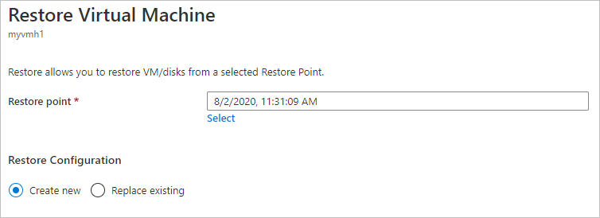
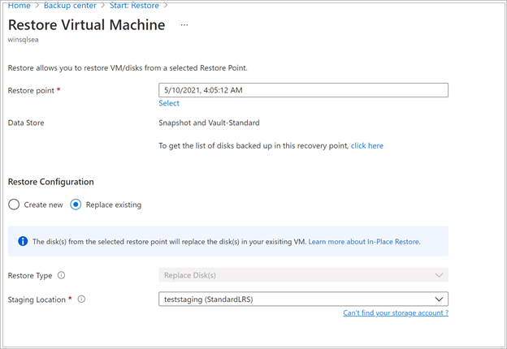
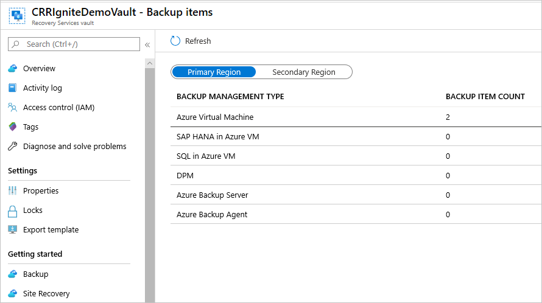
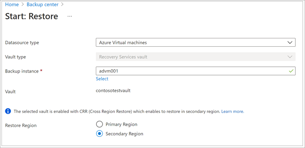
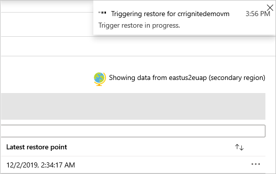
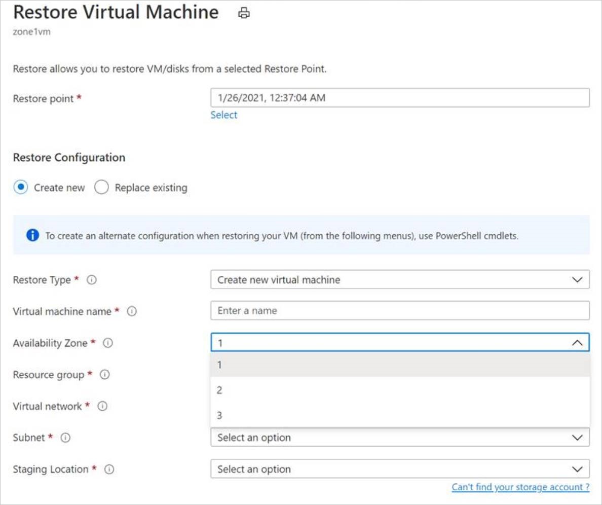

# How to restore Azure VM data in Azure portal

This article describes how to restore Azure VM data from the recovery points stored in [Azure Backup](backup-overview.md) Recovery Services vaults.

## Restore options

Azure Backup provides a number of ways to restore a VM.

**Restore option** | **Details**
--- | ---
**Create a new VM** | Quickly creates and gets a basic VM up and running from a restore point.<br/><br/> You can specify a name for the VM, select the resource group and virtual network (VNet) in which it will be placed, and specify a storage account for the restored VM. The new VM must be created in the same region as the source VM.<br><br>If a VM restore fails because an Azure VM SKU wasn't available in the specified region of Azure, or because of any other issues, Azure Backup still restores the disks in the specified resource group.
**Restore disk** | Restores a VM disk, which can then be used to create a new VM.<br/><br/> Azure Backup provides a template to help you customize and create a VM. <br/><br> The restore job generates a template that you can download and use to specify custom VM settings, and create a VM.<br/><br/> The disks are copied to the Resource Group you specify.<br/><br/> Alternatively, you can attach the disk to an existing VM, or create a new VM using PowerShell.<br/><br/> This option is useful if you want to customize the VM, add configuration settings that weren't there at the time of backup, or add settings that must be configured using the template or PowerShell.
**Replace existing** | You can restore a disk, and use it to replace a disk on the existing VM.<br/><br/> The current VM must exist. If it's been deleted, this option can't be used.<br/><br/> Azure Backup takes a snapshot of the existing VM before replacing the disk, and stores it in the staging location you specify. Existing disks connected to the VM are replaced with the selected restore point.<br/><br/> The snapshot is copied to the vault, and retained in accordance with the retention policy. <br/><br/> After the replace disk operation, the original disk is retained in the resource group. You can choose to manually delete the original disks if they aren't needed. <br/><br/>Replace existing is supported for unencrypted managed VMs, including VMs [created using custom images](https://azure.microsoft.com/resources/videos/create-a-custom-virtual-machine-image-in-azure-resource-manager-with-powershell/). It's unsupported for classic VMs.<br/><br/> If the restore point has more or less disks than the current VM, then the number of disks in the restore point will only reflect the VM configuration.<br><br> Replace existing is also supported for VMs with linked resources, like [user-assigned managed-identity](../active-directory/managed-identities-azure-resources/overview.md) or [Key Vault](../key-vault/general/overview.md).
**Cross Region (secondary region)** | Cross Region restore can be used to restore Azure VMs in the secondary region, which is an [Azure paired region](../best-practices-availability-paired-regions.md#what-are-paired-regions).<br><br> You can restore all the Azure VMs for the selected recovery point if the backup is done in the secondary region.<br><br> During the backup, snapshots aren't replicated to the secondary region. Only the data stored in the vault is replicated. So secondary region restores are only [vault tier](about-azure-vm-restore.md#concepts) restores. The restore time for the secondary region will be almost the same as the vault tier restore time for the primary region.  <br><br> This feature is available for the options below:<br> <li> [Create a VM](#create-a-vm) <br> <li> [Restore Disks](#restore-disks) <br><br> We don't currently support the [Replace existing disks](#replace-existing-disks) option.<br><br> Permissions<br> The restore operation on secondary region can be performed by Backup Admins and App admins.
**Cross-zonal restore** | Cross-zonal restore can be used to restore [Azure zone pinned VMs](https://docs.microsoft.com/azure/virtual-machines/windows/create-portal-availability-zone) in any [availability zones](https://docs.microsoft.com/azure/availability-zones/az-overview) of the same region. <br> <br> You can restore all the Azure zone pinned VMs for the selected recovery point that were backed up after the release of this feature, to the zone of your choice. By default it will restore in the same zone as it was backed up. <br> <br> This can be used during disaster recovery scenarios, if the pinned zone of the VM becomes unavailable.

> [!NOTE]
> You can also recover specific files and folders on an Azure VM. [Learn more](backup-azure-restore-files-from-vm.md).

## Storage accounts

Some details about storage accounts:

- **Create VM**: When you create a new VM, the VM will be placed in the storage account you specify.
- **Restore disk**: When you restore a disk, the disk is copied to the storage account you specify. The restore job generates a template that you can download and use to specify custom VM settings. This template is placed in the specified storage account.
- **Replace disk**: When you replace a disk in an existing VM, Azure Backup takes a snapshot of the existing VM before replacing the disk. The snapshot is also copied to the Recovery Services vault through data transfer, as a background process. However, once the snapshot phase is completed, the replace disks operation is triggered. After the replace disk operation, the disks of the source Azure VM are left in the specified Resource group for your operation and the VHDs are stored in the specified storage account. You can choose to delete or retain these VHDs and disks.
- **Storage account location**: The storage account must be in the same region as the vault. Only these accounts are displayed. If there are no storage accounts in the location, you need to create one.
- **Storage type**: Blob storage isn't supported.
- **Storage redundancy**: Zone redundant storage (ZRS) isn't supported. The replication and redundancy information for the account is shown in parentheses after the account name.
- **Premium storage**:
  - When restoring non-premium VMs, premium storage accounts aren't supported.
  - When restoring managed VMs, premium storage accounts configured with network rules aren't supported.

## Before you start

To restore a VM (create a new VM), make sure you have the correct Azure role-based access control (Azure RBAC) [permissions](backup-rbac-rs-vault.md#mapping-backup-built-in-roles-to-backup-management-actions) for the Restore VM operation.

If you don't have permissions, you can [restore a disk](#restore-disks), and then after the disk is restored, you can [use the template](#use-templates-to-customize-a-restored-vm) that was generated as part of the restore operation to create a new VM.

[!INCLUDE [backup-center.md](../../includes/backup-center.md)]

## Select a restore point

1. In the vault associated with the VM you want to restore, select **Backup items** > **Azure Virtual Machine**.
1. Select a VM. By default on the VM dashboard, recovery points from the last 30 days are displayed. You can display recovery points older than 30 days, or filter to find recovery points based on dates, time ranges, and different types of snapshot consistency.
1. To restore the VM, select **Restore VM**.

    

1. Select a restore point to use for the recovery.

## Choose a VM restore configuration

1. In **Restore Virtual Machine**, select a restore option:
    - **Create new**: Use this option if you want to create a new VM. You can create a VM with simple settings, or restore a disk and create a customized VM.
    - **Replace existing**: Use this option if you want to replace disks on an existing VM.

        

1. Specify settings for your selected restore option.

## Create a VM

As one of the [restore options](#restore-options), you can create a VM quickly with basic settings from a restore point.

1. In **Restore Virtual Machine** > **Create new** > **Restore Type**, select **Create a virtual machine**.
1. In **Virtual machine name**, specify a VM that doesn't exist in the subscription.
1. In **Resource group**, select an existing resource group for the new VM, or create a new one with a globally unique name. If you assign a name that already exists, Azure assigns the group the same name as the VM.
1. In **Virtual network**, select the VNet in which the VM will be placed. All VNets associated with the subscription are displayed. Select the subnet. The first subnet is selected by default.
1. In **Staging Location**, specify the storage account for the VM. [Learn more](#storage-accounts).

    

1. Select **Restore** to trigger the restore operation.

## Restore disks

As one of the [restore options](#restore-options), you can create a disk from a restore point. Then with the disk, you can do one of the following actions:

- Use the template that's generated during the restore operation to customize settings, and trigger VM deployment. You edit the default template settings, and submit the template for VM deployment.
- [Attach restored disks](../virtual-machines/windows/attach-managed-disk-portal.md) to an existing VM.
- [Create a new VM](./backup-azure-vms-automation.md#create-a-vm-from-restored-disks) from the restored disks using PowerShell.

1. In **Restore configuration** > **Create new** > **Restore Type**, select **Restore disks**.
1. In **Resource group**, select an existing resource group for the restored disks, or create a new one with a globally unique name.
1. In **Staging location**, specify the storage account to which to copy the VHDs. [Learn more](#storage-accounts).

    

1. Select **Restore** to trigger the restore operation.

When your virtual machine uses managed disks and you select the **Create virtual machine** option, Azure Backup doesn't use the specified storage account. In the case of **Restore disks** and **Instant Restore**, the storage account is used only for storing the template. Managed disks are created in the specified resource group.
When your virtual machine uses unmanaged disks, they're restored as blobs to the storage account.

### Use templates to customize a restored VM

After the disk is restored, use the template that was generated as part of the restore operation to customize and create a new VM:

1. In **Backup Jobs**, select the relevant restore job.

1. In **Restore**, select **Deploy Template** to initiate template deployment.

    

1. To customize the VM setting provided in the template, select **Edit template**. If you want to add more customizations, select **Edit parameters**.
    - [Learn more](../azure-resource-manager/templates/deploy-portal.md#deploy-resources-from-custom-template) about deploying resources from a custom template.
    - [Learn more](../azure-resource-manager/templates/template-syntax.md) about authoring templates.

   

1. Enter the custom values for the VM, accept the **Terms and Conditions** and select **Purchase**.

   

## Replace existing disks

As one of the [restore options](#restore-options), you can replace an existing VM disk with the selected restore point. [Review](#restore-options) all restore options.

1. In **Restore configuration**, select **Replace existing**.
1. In **Restore Type**, select **Replace disk/s**. This is the restore point that will be used replace existing VM disks.
1. In **Staging Location**, specify where snapshots of the current managed disks should be saved during the restore process. [Learn more](#storage-accounts).

   

## Cross Region Restore

As one of the [restore options](#restore-options), Cross Region Restore (CRR) allows you to restore Azure VMs in a secondary region, which is an Azure paired region.

To begin using the feature, read the [Before You Begin section](./backup-create-rs-vault.md#set-cross-region-restore).

To see if CRR is enabled, follow the instructions in [Configure Cross Region Restore](backup-create-rs-vault.md#configure-cross-region-restore).

### View backup items in secondary region

If CRR is enabled, you can view the backup items in the secondary region.

1. From the portal, go to **Recovery Services vault** > **Backup items**.
1. Select **Secondary Region** to view the items in the secondary region.

>[!NOTE]
>Only Backup Management Types supporting the CRR feature will be shown in the list. Currently, only support for restoring secondary region data to a secondary region is allowed.




### Restore in secondary region

The secondary region restore user experience will be similar to the primary region restore user experience. When configuring details in the Restore Configuration pane to configure your restore, you'll be prompted to provide only secondary region parameters.

Currently, secondary region [RPO](azure-backup-glossary#rpo-recovery-point-objective) is up to 12 hours from the primary region, even though [read-access geo-redundant storage (RA-GRS)](https://docs.microsoft.com/azure/storage/common/storage-redundancy#redundancy-in-a-secondary-region) replication is 15 minutes.






- To restore and create a VM, refer to [Create a VM](#create-a-vm).
- To restore as a disk, refer to [Restore disks](#restore-disks).

>[!NOTE]
>
>- After the restore is triggered and in the data transfer phase, the restore job can't be cancelled.
>- The Cross Region Restore feature restores CMK (customer-managed keys) enabled Azure VMs, which aren't backed-up in a CMK enabled Recovery Services vault, as non-CMK enabled VMs in the secondary region.
>- The Azure roles needed to restore in the secondary region are the same as those in the primary region.

## Cross-zonal restore

Cross-zonal restore can be used to restore [Azure zone pinned VMs](https://docs.microsoft.com/azure/virtual-machines/windows/create-portal-availability-zone) in any [availability zones](https://docs.microsoft.com/azure/availability-zones/az-overview) of the same region.

In the restore process, you'll see the option **Availability Zone.** You'll see your default zone first. To choose a different zone, choose the number of the zone of your choice. Choose a different zone if the default availability zone isn't available due to an outage, or for any other reason you choose to restore in a different zone.



### Monitoring secondary region restore jobs

1. From the portal, go to **Recovery Services vault** > **Backup Jobs**
1. Select **Secondary Region** to view the items in the secondary region.

    

## Restoring unmanaged VMs and disks as managed

You're provided with an option to restore [unmanaged disks](../storage/common/storage-disaster-recovery-guidance.md#azure-unmanaged-disks) as [managed disks](../virtual-machines/managed-disks-overview.md) during restore. By default, the unmanaged VMs / disks are restored as unmanaged VMs / disks. However, if you choose to restore as managed VMs / disks, it's now possible to do so. These restores aren't triggered from the snapshot phase but only from the vault phase. This feature isn't available for unmanaged encrypted VMs.


## Restore VMs with special configurations

There are a number of common scenarios in which you might need to restore VMs.

**Scenario** | **Guidance**
--- | ---
**Restore VMs using Hybrid Use Benefit** | If a Windows VM uses [Hybrid Use Benefit (HUB) licensing](../virtual-machines/windows/hybrid-use-benefit-licensing.md), restore the disks, and create a new VM using the provided template (with **License Type** set to **Windows_Server**), or PowerShell.  This setting can also be applied after creating the VM.
**Restore VMs during an Azure datacenter disaster** | If the vault uses GRS and the primary datacenter for the VM goes down, Azure Backup supports restoring backed-up VMs to the paired datacenter. You select a storage account in the paired datacenter, and restore as normal. Azure Backup uses the compute service in the paired region to create the restored VM. [Learn more](/azure/architecture/resiliency/recovery-loss-azure-region) about datacenter resiliency.<br><br> If the vault uses GRS, you can choose the new feature, [Cross Region Restore](#cross-region-restore). This lets you restore to a second region in either full or partial outage scenarios, or even if there's no outage at all.
**Bare-metal restore** | The major difference between Azure VMs and on-premises hypervisors is that there's no VM console available in Azure. A console is required for certain scenarios, such as recovering by using a bare-metal recovery (BMR)-type backup. However, VM restore from the vault is a full replacement for BMR.
**Restore VMs with special network configurations** | Special network configurations include VMs using internal or external load balancing, using multiple NICS, or multiple reserved IP addresses. You restore these VMs by using the [restore disk option](#restore-disks). This option makes a copy of the VHDs into the specified storage account, and you can then create a VM with an [internal](../load-balancer/quickstart-load-balancer-standard-internal-powershell.md) or [external](../load-balancer/quickstart-load-balancer-standard-public-powershell.md) load balancer, [multiple NICS](../virtual-machines/windows/multiple-nics.md), or [multiple reserved IP addresses](../virtual-network/virtual-network-multiple-ip-addresses-powershell.md), in accordance with your configuration.
**Network Security Group (NSG) on NIC/Subnet** | Azure VM backup supports Backup and Restore of NSG information at vnet, subnet, and NIC level.
**Zone Pinned VMs** | If you back up an Azure VM that's pinned to a zone (with Azure Backup), then you can restore it in the same zone where it was pinned. [Learn more](../availability-zones/az-overview.md)
**Restore VM in any availability set** | When restoring a VM from the portal, there's no option to choose an availability set. A restored VM doesn't have an availability set. If you use the restore disk option, then you can [specify an availability set](../virtual-machines/windows/tutorial-availability-sets.md) when you create a VM from the disk using the provided template or PowerShell.
**Restore special VMs such as SQL VMs** | If you're backing up a SQL VM using Azure VM backup and then use the restore VM option or create a VM after restoring disks, then the newly created VM must be registered with the SQL provider as mentioned [here](../azure-sql/virtual-machines/windows/sql-agent-extension-manually-register-single-vm.md?tabs=azure-cli%2cbash). This will convert the restored VM into a SQL VM.

### Restore domain controller VMs

**Scenario** | **Guidance**
--- | ---
**Restore a single domain controller VM in a single domain** | Restore the VM like any other VM. Note that:<br/><br/> From an Active Directory perspective, the Azure VM is like any other VM.<br/><br/> Directory Services Restore Mode (DSRM) is also available, so all Active Directory recovery scenarios are viable. [Learn more](#post-restore-steps) about backup and restore considerations for virtualized domain controllers.
**Restore multiple domain controller VMs in a single domain** | If other domain controllers in the same domain can be reached over the network, the domain controller can be restored like any VM. If it's the last remaining domain controller in the domain, or a recovery in an isolated network is performed, use a [forest recovery](/windows-server/identity/ad-ds/manage/ad-forest-recovery-single-domain-in-multidomain-recovery).
**Restore a single domain controller VM in a multiple domain configuration** |  Restore the disks and create a VM by [using PowerShell](backup-azure-vms-automation.md#restore-the-disks)  
**Restore multiple domains in one forest** | We recommend a [forest recovery](/windows-server/identity/ad-ds/manage/ad-forest-recovery-single-domain-in-multidomain-recovery).

For more information, see [Back up and restore Active Directory domain controllers](active-directory-backup-restore.md).

## Track the restore operation

After you trigger the restore operation, the backup service creates a job for tracking. Azure Backup displays notifications about the job in the portal. If they aren't visible, select the **Notifications** symbol, and then select **More events in the activity log** to see the Restore Process Status.


 Track restore as follows:

1. To view operations for the job, select the notifications hyperlink. Alternatively, in the vault, select **Backup jobs**, and then select the relevant VM.

    

1. To monitor restore progress, select any restore job with a status of **In-progress**. This displays the progress bar, which displays information about the restore progress:

    - **Estimated time of restore**: Initially provides the time taken to complete the restore operation. As the operation progresses, the time taken reduces and reaches zero when the restore operation finishes.
    - **Percentage of restore**. Shows the percentage of restore operation that's done.
    - **Number of bytes transferred**: If you're restoring by creating a new VM, it shows the bytes that were transferred against the total number of bytes to be transferred.

## Post-restore steps

There are a number of things to note after restoring a VM:

- Extensions present during the backup configuration are installed, but not enabled. If you see an issue, reinstall the extensions.
- If the backed-up VM had a static IP address, the restored VM will have a dynamic IP address to avoid conflict. You can [add a static IP address to the restored VM](/powershell/module/az.network/set-aznetworkinterfaceipconfig#description).
- A restored VM doesn't have an availability set. If you use the restore disk option, then you can [specify an availability set](../virtual-machines/windows/tutorial-availability-sets.md) when you create a VM from the disk using the provided template or PowerShell.
- If you use a cloud-init-based Linux distribution, such as Ubuntu, for security reasons the password is blocked after the restore. Use the VMAccess extension on the restored VM to [reset the password](../virtual-machines/troubleshooting/reset-password.md). We recommend using SSH keys on these distributions, so you don't need to reset the password after the restore.
- If you're unable to access a VM once restored because the VM has a broken relationship with the domain controller, then follow the steps below to bring up the VM:
  - Attach OS disk as a data disk to a recovered VM.
  - Manually install VM agent if Azure Agent is found to be unresponsive by following this [link](../virtual-machines/troubleshooting/install-vm-agent-offline.md).
  - Enable Serial Console access on VM to allow command-line access to VM

  ```cmd
    bcdedit /store <drive letter>:\boot\bcd /enum
    bcdedit /store <VOLUME LETTER WHERE THE BCD FOLDER IS>:\boot\bcd /set {bootmgr} displaybootmenu yes
    bcdedit /store <VOLUME LETTER WHERE THE BCD FOLDER IS>:\boot\bcd /set {bootmgr} timeout 5
    bcdedit /store <VOLUME LETTER WHERE THE BCD FOLDER IS>:\boot\bcd /set {bootmgr} bootems yes
    bcdedit /store <VOLUME LETTER WHERE THE BCD FOLDER IS>:\boot\bcd /ems {<<BOOT LOADER IDENTIFIER>>} ON
    bcdedit /store <VOLUME LETTER WHERE THE BCD FOLDER IS>:\boot\bcd /emssettings EMSPORT:1 EMSBAUDRATE:115200
    ```

  - When the VM is rebuilt use Azure portal to reset local administrator account and password
  - Use Serial console access and CMD to disjoin VM from domain

    ```cmd
    cmd /c "netdom remove <<MachineName>> /domain:<<DomainName>> /userD:<<DomainAdminhere>> /passwordD:<<PasswordHere>> /reboot:10 /Force"
    ```

- Once the VM is disjoined and restarted, you'll be able to successfully RDP to the VM with local admin credentials and rejoin VM back to domain successfully.

## Backing up restored VMs

- If you restored a VM to the same resource group with the same name as the originally backed-up VM, backup continues on the VM after restore.
- If you restored the VM to a different resource group or you specified a different name for the restored VM, you need to set up backup for the restored VM.

## Next steps

- If you experience difficulties during the restore process, [review](backup-azure-vms-troubleshoot.md#restore) common issues and errors.
- After the VM is restored, learn about [managing virtual machines](backup-azure-manage-vms.md)
