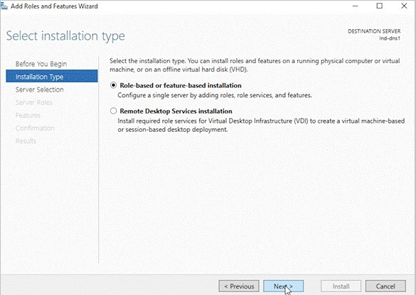
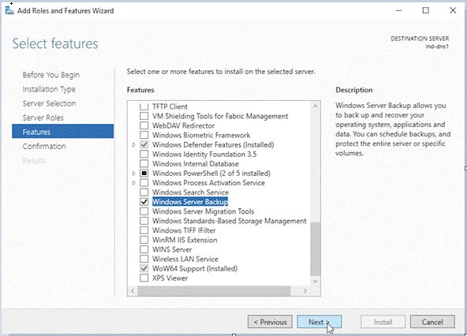
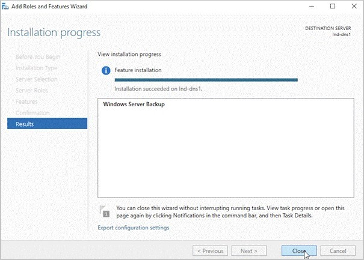

# Troubleshoot System State Backup

This article describes solutions for issues that you might come across while using System State Backup.

## Basic troubleshooting

We recommend you perform the following validation steps, before you start troubleshooting System State backup:

- [Ensure Microsoft Azure Recovery Services (MARS) Agent is up to date](https://go.microsoft.com/fwlink/?linkid=229525&clcid=0x409)
- [Ensure there's network connectivity between MARS agent and Azure](./backup-azure-mars-troubleshoot.md#the-microsoft-azure-recovery-service-agent-was-unable-to-connect-to-microsoft-azure-backup)
- Ensure Microsoft Azure Recovery Services is running (in Service console). If necessary, restart and retry the operation
- [Ensure 5-10% free volume space is available on scratch folder location](./backup-azure-file-folder-backup-faq.yml#what-s-the-minimum-size-requirement-for-the-cache-folder-)
- [Check if another process or antivirus software is interfering with Azure Backup](./backup-azure-troubleshoot-slow-backup-performance-issue.md#cause-another-process-or-antivirus-software-interfering-with-azure-backup)
- [Scheduled backup fails, but manual backup works](./backup-azure-mars-troubleshoot.md#backups-dont-run-according-to-schedule)
- Ensure your OS has the latest updates
- [Ensure unsupported drives and files with unsupported attributes are excluded from backup](backup-support-matrix-mars-agent.md#supported-drives-or-volumes-for-backup)
- Ensure **System Clock** on the protected system is configured to correct time zone <br>
- [Ensure that the server has at least .NET Framework version 4.5.2 and higher](https://www.microsoft.com/download/details.aspx?id=30653)<br>
- If you're trying to **reregister your server** to a vault, then: <br>
  - Ensure the agent is uninstalled on the server and it's deleted from the portal <br>
  - Use the same passphrase that was initially used for registering the server <br>
- If this is an offline backup, ensure that Azure PowerShell version 3.7.0 is installed on both source and copy computer before you begin offline backup operation
- [Consideration when Backup agent is running on an Azure virtual machine](./backup-azure-troubleshoot-slow-backup-performance-issue.md#cause-backup-agent-running-on-an-azure-virtual-machine)

### Limitation

- Recovering to different hardware using System State recovery isn't recommended by Microsoft
- System State backup currently supports "on-premises" Windows servers. This functionality isn't available for Azure VMs.

## Prerequisites

Before we troubleshoot System State Backup with Azure Backup, perform the following prerequisites check.

### Verify Windows Server Backup is installed

Ensure Windows Server Backup is installed and enabled in the server. To check the installation status, run this PowerShell command:

```powershell
Get-WindowsFeature Windows-Server-Backup
```

If the output displays the **Install State** as **available**, then it means Windows Server backup feature is available for the installation but not installed on the server. However, if Windows Server Backup isn't installed, then use one of the methods below to install it.

#### Method 1: Install Windows Server Backup using PowerShell

To install Windows Server Backup using PowerShell, run the following command:

  ```powershell
  Install-WindowsFeature -Name Windows-Server-Backup
  ```

#### Method 2: Install Windows Server Backup using Server Manager

To install Windows Server Backup using Server Manager, perform the following steps:

1. In **Server Manger**, select **Add roles and features**. The **Add roles and features wizard** appears.

    

2. Select **Installation Type** and select **Next**.

    

3. Select a server from the server pool and select **Next**. In the Server Role, leave the default selection and select **Next**.
4. Select **Windows Server Backup** in **Features** tab and select **Next**.

    

5. In the **Confirmation** tab, select **Install** to start the installation process.
6. In the **Results** tab, it will display the Windows Server Backup feature is successfully installed on your Windows Server.

    

### System Volume information permission

Ensure that the Local SYSTEM has full control on the **System Volume Information** folder located in the volume where Windows is installed. Usually this is **C:\System Volume Information**. Windows Server backup can fail if the permissions above aren't set correctly.

### Dependent services

Ensure the services below are in the running state:

**Service Name** | **Startup Type**
--- | ---
Remote Procedure Call(RPC) | Automatic
COM+ Event System(EventSystem) | Automatic
System Event Notification Service(SENS) | Automatic
Volume Shadow Copy(VSS) | Manual
Microsoft Software Shadow Copy Provider(SWPRV) | Manual

### Validate Windows Server Backup status

To validate Windows Server Backup status, perform the following steps:

- Ensure WSB PowerShell is running

  - Run `Get-WBJob` from an elevated PowerShell and make sure it doesn't return the following error:

    > [!WARNING]
    > Get-WBJob: The term 'Get-WBJob' is not recognized as the name of a cmdlet, function, script file, or operable program. Check the spelling of the name, or if a path was included, verify that the path is correct and try again.

    - If it fails with this error, then reinstall the Windows Server Backup feature on the server machine as mentioned in step 1 of the prerequisites.

  - Ensure WSB backup is working properly, by running the following command from an elevated command prompt:

      `wbadmin start systemstatebackup -backuptarget:X: -quiet`

      > [!NOTE]
      > Replace X with the drive letter of the volume where you want to store the system state back up image.

    - Periodically check the status of the job by running `Get-WBJob` command from elevated PowerShell
    - After backup job completes check the final status of the job by running `Get-WBJob -Previous 1` command

If the job fails, it indicates a WSB issue that would result in MARS agent System State Backups failure.

## Common errors

### VSS Writer timeout error

| Symptom | Cause | Resolution
| -- | -- | --
| - MARS agent fails with error message: "WSB job failed with VSS errors. Check VSS event logs to resolve the failure"<br/><br/> - Following error log is present in VSS Application event logs: "A VSS writer has rejected an event with error 0x800423f2, the writer's timeout expired between the Freeze and Thaw events."| VSS writer is unable to complete in time due to lack of CPU and memory resources on the machine <br/><br/> Another backup software is already using the VSS writer, as a result snapshot operation could not complete for this backup | Wait for CPU/memory to be freed up on system or abort the processes taking too much memory/CPU and try the operation again. <br/><br/>  Wait for the ongoing backup to complete and try the operation at a later point when no backups are running on the machine.

### Insufficient disk space to grow shadow copies

| Symptom | Resolution
| -- | --
| - MARS agent fails with error message: Backup failed as the shadow copy volume could not grow due to insufficient disk space on volumes containing system files <br/><br/> - Following error/warning log is present in volsnap system event logs: "There was insufficient disk space on volume C: to grow the shadow copy storage for shadow copies of C: due to this failure all shadow copies of volume C: are at risk of being deleted" | - Free up space in the highlighted volume in the event log so that there's sufficient space for shadow copies to grow while backup is in progress <br/><br/> -  While configuring shadow copy space we can restrict the amount of space used for shadow copy. For more information, see this [article](/windows-server/administration/windows-commands/vssadmin-resize-shadowstorage)

### EFI partition locked

| Symptom | Resolution
| -- | --
| MARS agent fails with error message: "System state backup failed as the EFI system partition is locked. This can be due to system partition access by a third-party security or back up software" | - If the issue is due to a third-party security software, then you need to contact the Anti Virus vendor so that they can allow MARS agent <br/><br/> - If a third-party backup software is running, then wait for it to finish and then retry back up

## Next steps

- For more information about Windows system state in Resource Manager deployment, see [Back up Windows Server System State](backup-azure-system-state.md)
