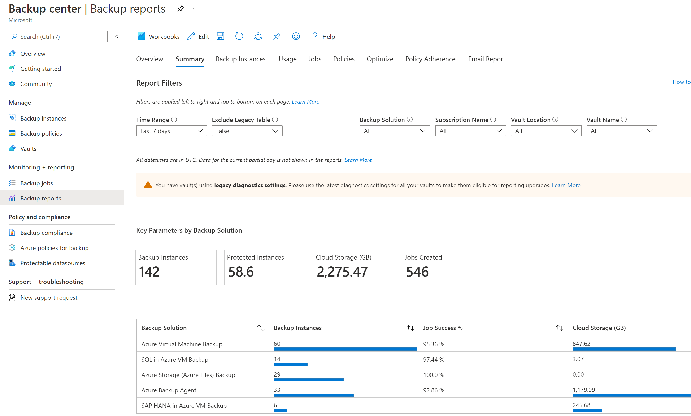

# Obtain Insights using Backup Center (Preview)

For analyzing historical trends and gaining deeper insights on your backups, Backup Center provides an interface to [Backup Reports (Preview)](configure-reports.md), which uses [Azure Monitor Logs](../azure-monitor/logs/data-platform-logs.md) and [Azure Workbooks](../azure-monitor/visualizations/workbooks-overview.md). Backup Reports offers the following capabilities:

- Allocating and forecasting of cloud storage consumed.

- Auditing of backups and restores.

- Identifying key trends at different levels of granularity.

- Gaining visibility and insights into cost optimization opportunities for your backups.

## Supported scenarios

- Backup Reports (Preview) is currently not available for Azure Database for PostgreSQL server backup.

- Refer to the [support matrix](backup-center-support-matrix.md) for a detailed list of supported and unsupported scenarios.

## Get started

### Configure your vaults to send data to a Log Analytics workspace

[Learn how to configure diagnostics settings at scale for your vaults](./configure-reports.md#get-started)

### View Backup Reports in the Backup Center portal

Selecting the **Backup Reports** menu item in Backup Center opens up the reports. Choose one or more Log Analytics workspaces to view and analyze key information on your backups.

Following are the views available:

1. **Summary** - Use this tab to get a high-level overview of your backup estate. [Learn more](./configure-reports.md#summary)

1. **Backup Items** - Use this tab to see information and trends on cloud storage consumed at a Backup-item level. [Learn more](./configure-reports.md#backup-items)

1. **Usage** - Use this tab to view key billing parameters for your backups. [Learn more](./configure-reports.md#usage)

1. **Jobs** - Use this tab to view long-running trends on jobs, such as the number of failed jobs per day and the top causes of job failure. [Learn more](./configure-reports.md#jobs)

1. **Policies** - Use this tab to view information on all of your active policies, such as the number of associated items and the total cloud storage consumed by items backed up under a given policy. [Learn more](./configure-reports.md#policies)

1. **Optimize** - Use this tab to gain visibility into potential cost-optimization opportunities for your backups. [Learn more](./configure-reports.md#optimize)

## Next steps

- [Monitor and Operate backups](backup-center-monitor-operate.md)
- [Govern your backup estate](backup-center-govern-environment.md)
- [Perform actions using Backup Center](backup-center-actions.md)