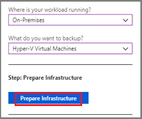
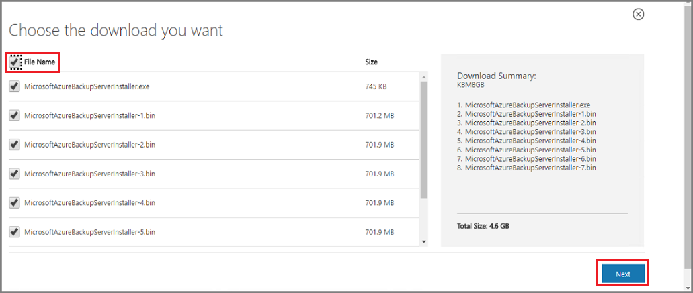
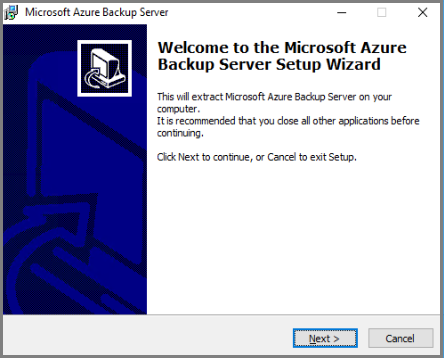
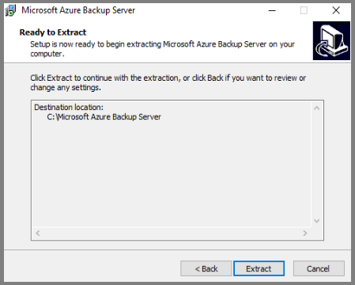
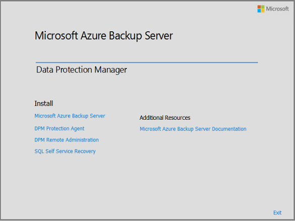
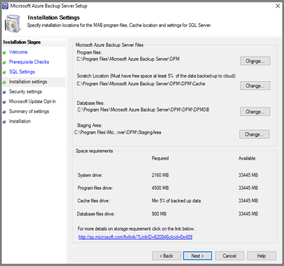
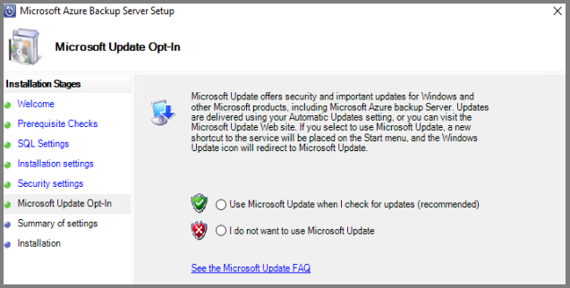
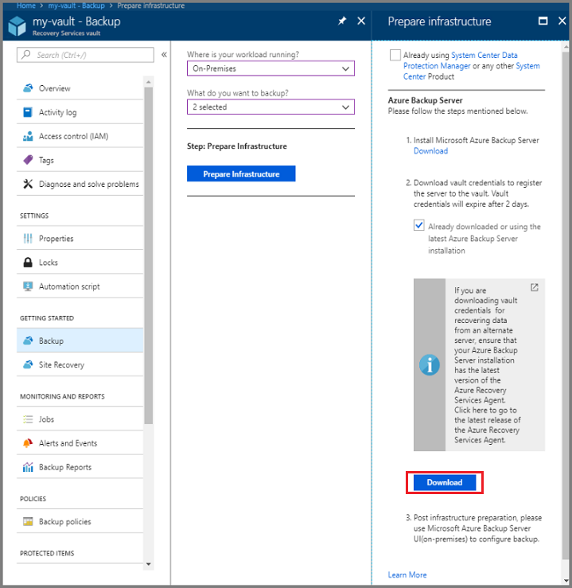
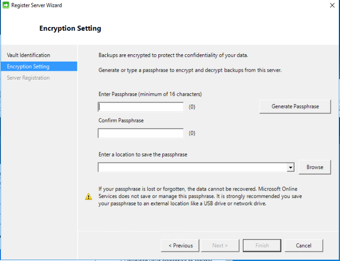

# Install Azure Backup Server on Azure Stack

This article explains how to install Azure Backup Server on Azure Stack. With Azure Backup Server, you can protect Infrastructure as a Service (IaaS) workloads such as virtual machines running in Azure Stack. A benefit of using Azure Backup Server to protect your workloads is you can manage all workload protection from a single console.

> [!NOTE]
> To learn about security capabilities, refer to [Azure Backup security features documentation](backup-azure-security-feature.md).
>
>For more information on tbe supported workloads, see the [Azure Backup Server protection matrix](backup-mabs-protection-matrix.md).

## Prerequisites for the Azure Backup Server environment

Consider the recommendations in this section when installing Azure Backup Server in your Azure Stack environment. The Azure Backup Server installer checks that your environment has the necessary prerequisites, but you'll save time by preparing before you install.

### Determining size of virtual machine

To run Azure Backup Server on an Azure Stack virtual machine, use size A2 or larger. For assistance in choosing a virtual machine size, download the [Azure Stack VM size calculator](https://www.microsoft.com/download/details.aspx?id=56832).

### Virtual Networks on Azure Stack virtual machines

All virtual machines used in an Azure Stack workload must belong to the same Azure virtual network and Azure Subscription.

### Azure Backup Server VM performance

If shared with other virtual machines, the storage account size and IOPS limits impact Azure Backup Server VM performance. For this reason, you should use a separate storage account for the Azure Backup Server virtual machine. The Azure Backup agent running on the Azure Backup Server needs temporary storage for:

- its own use (a cache location),
- data restored from the cloud (local staging area)

### Configuring Azure Backup temporary disk storage

Each Azure Stack virtual machine comes with temporary disk storage, which is available to the user as volume `D:\`. The local staging area needed by Azure Backup can be configured to reside in `D:\`, and the cache location can be placed on `C:\`. In this way, no storage needs to be carved away from the data disks attached to the Azure Backup Server virtual machine.

### Storing backup data on local disk and in Azure

Azure Backup Server stores backup data on Azure disks attached to the virtual machine, for operational recovery. Once the disks and storage space are attached to the virtual machine, Azure Backup Server manages storage for you. The amount of backup data storage depends on the number and size of disks attached to each [Azure Stack virtual machine](/azure-stack/user/azure-stack-storage-overview). Each size of Azure Stack VM has a maximum number of disks that can be attached to the virtual machine. For example, A2 is four disks. A3 is eight disks. A4 is 16 disks. Again, the size and number of disks determines the total backup storage pool.

> [!IMPORTANT]
> You should **not** retain operational recovery (backup) data on Azure Backup Server-attached disks for more than five days.
>

Storing backup data in Azure reduces backup infrastructure on Azure Stack. If data is more than five days old, it should be stored in Azure.

To store backup data in Azure, create or use a Recovery Services vault. When preparing to back up the Azure Backup Server workload, you [configure the Recovery Services vault](backup-azure-microsoft-azure-backup.md#create-a-recovery-services-vault). Once configured, each time a backup job runs, a recovery point is created in the vault. Each Recovery Services vault holds up to 9999 recovery points. Depending on the number of recovery points created, and how long they're retained, you can retain backup data for many years. For example, you could create monthly recovery points, and retain them for five years.

### Scaling deployment

If you want to scale your deployment, you have the following options:

- Scale up - Increase the size of the Azure Backup Server virtual machine from A series to D series, and increase the local storage [per the Azure Stack virtual machine instructions](/azure-stack/user/azure-stack-manage-vm-disks).
- Offload data - send older data to Azure and retain only the newest data on the storage attached to the Azure Backup Server.
- Scale out - Add more Azure Backup Servers to protect the workloads.

### .NET Framework

.NET Framework 4.5 or higher must be installed on the virtual machine.

### Joining a domain

The Azure Backup Server virtual machine must be joined to a domain. A domain user with administrator privileges must install Azure Backup Server on the virtual machine.

## Using an IaaS VM in Azure Stack

When choosing a server for Azure Backup Server, start with a Windows Server 2022 R2 Datacenter or Windows Server 2019 Datacenter gallery image. The article, [Create your first Windows virtual machine in the Azure portal](../virtual-machines/windows/quick-create-portal.md?toc=/azure/virtual-machines/windows/toc.json), provides a tutorial for getting started with the recommended virtual machine. The recommended minimum requirements for the server virtual machine (VM) should be: A2 Standard with two cores and 3.5-GB RAM.

Protecting workloads with Azure Backup Server has many nuances. The [protection matrix for MABS](./backup-mabs-protection-matrix.md) helps explain these nuances. Before deploying the machine, read this article completely.

> [!NOTE]
> Azure Backup Server is designed to run on a dedicated, single-purpose virtual machine. You can't install Azure Backup Server on:
>
> - A computer running as a domain controller
> - A computer on which the Application Server role is installed
> - A computer on which Exchange Server is running
> - A computer that's a node of a cluster

Always join Azure Backup Server to a domain. If you need to move Azure Backup Server to a different domain, first install Azure Backup Server, then join it to the new domain. Once you deploy Azure Backup Server, you can't move it to a new domain.

[!INCLUDE [backup-create-rs-vault.md](../../includes/backup-create-rs-vault.md)]

### Set Storage Replication

The Recovery Services vault storage replication option allows you to choose between geo-redundant storage and locally redundant storage. By default, Recovery Services vaults use geo-redundant storage. If this vault is your primary vault, leave the storage option set to geo-redundant storage. Choose locally redundant storage if you want a cheaper option that's less durable. Read more about [geo-redundant](../storage/common/storage-redundancy.md#geo-redundant-storage), [locally redundant](../storage/common/storage-redundancy.md#locally-redundant-storage), and [zone-redundant](../storage/common/storage-redundancy.md#zone-redundant-storage) storage options in the [Azure Storage replication overview](../storage/common/storage-redundancy.md).

To edit the storage replication setting:

1. Select your vault to open the vault dashboard and the Settings menu. If the **Settings** menu doesn't open, select **All settings** in the vault dashboard.
2. On the **Settings** menu, select **Backup Infrastructure** > **Backup Configuration** to open the **Backup Configuration** menu. On the **Backup Configuration** menu, choose the storage replication option for your vault.

    

## Download Azure Backup Server installer

There are two ways to download the Azure Backup Server installer. You can download the Azure Backup Server installer from the [Microsoft Download Center](https://www.microsoft.com/download/details.aspx?id=55269). You can also download Azure Backup Server installer while you're configuring a Recovery Services vault. The following steps walk you through downloading the installer from the Azure portal while configuring a Recovery Services vault.

1. From your Azure Stack virtual machine, [sign in to your Azure subscription in the Azure portal](https://portal.azure.com/).
2. In the left-hand menu, select **All Services**.

    

3. In the **All services** dialog, type *Recovery Services*. As you begin typing, your input filters the list of resources. Once you see it, select **Recovery Services vaults**.

    

    The list of Recovery Services vaults in the subscription appears.

4. From the list of Recovery Services vaults, select your vault to open its dashboard.

    

5. In the vault's Getting Started menu, select **Backup** to open the Getting Started wizard.

    

    The backup menu opens.

    

6. In the backup menu, from the **Where is your workload running** menu, select **On-premises**. From the **What do you want to backup?** drop-down menu, select the workloads you want to protect using Azure Backup Server. If you aren't sure which workloads to select, choose **Hyper-V Virtual Machines** and then select **Prepare Infrastructure**.

    

    The **Prepare infrastructure** menu opens.

7. In the **Prepare infrastructure** menu, select **Download** to open a web page to download Azure Backup Server installation files.

    

    The Microsoft web page that hosts the downloadable files for Azure Backup Server, opens.

8. In the Microsoft Azure Backup Server download page, choose a language, and select **Download**.

9. The Azure Backup Server installer is composed of eight files - an installer and seven .bin files. Check **File Name** to select all required files and select **Next**. Download all files to the same folder.

    

    The download size of all installation files is larger than 3 GB. On a 10-Mbps download link, downloading all installation files may take up to 60 minutes. The files download to your specified download location.

## Extract Azure Backup Server install files

After you've downloaded all files to your Azure Stack virtual machine, go to the download location. The first phase of installing Azure Backup Server is to extract the files.


1. To start the installation, from the list of downloaded files, select **MicrosoftAzureBackupserverInstaller.exe**.

    > [!WARNING]
    > At least 4GB of free space is required to extract the setup files.
    >

2. In the Azure Backup Server wizard, select **Next** to continue.

    

3. Choose the path for the Azure Backup Server files, and select **Next**.

   

4. Verify the extraction location, and select **Extract**.

   

5. The wizard extracts the files and readies the installation process.

   

6. Once the extraction process completes, select **Finish**. By default, **Execute setup.exe** is selected. When you select **Finish**, Setup.exe installs Microsoft Azure Backup Server to the specified location.

   

## Install the software package

In the previous step, you select **Finish** to exit the extraction phase, and start the Azure Backup Server setup wizard.



Azure Backup Server shares code with Data Protection Manager. You'll see references to Data Protection Manager and DPM in the Azure Backup Server installer. Though Azure Backup Server and Data Protection Manager are separate products, these products are closely related.

1. To launch the setup wizard, select **Microsoft Azure Backup Server**.

   

2. On the **Welcome** screen, select **Next**.

    

3. On the **Prerequisite Checks** screen, select **Check** to determine if the hardware and software prerequisites for Azure Backup Server have been met.

    

    If your environment has the necessary prerequisites, you'll see a message indicating that the machine meets the requirements. Select **Next**.  

    

    If your environment doesn't meet the necessary prerequisites, the issues will be specified. The prerequisites that weren't met are also listed in the DpmSetup.log. Resolve the prerequisite errors, and then run **Check Again**. Installation can't continue until all prerequisites are met.

    

4. Microsoft Azure Backup Server requires SQL Server. The Azure Backup Server installation package comes bundled with the appropriate SQL Server binaries. If you want to use your own SQL installation, you can. However, the recommended choice is let the installer add a new instance of SQL Server. To ensure your choice works with your environment, select **Check and Install**.

   > [!NOTE]
   > Azure Backup Server won't work with a remote SQL Server instance. The instance used by Azure Backup Server must be local.
   >

    

    After checking, if the virtual machine has the necessary prerequisites to install Azure Backup Server, select **Next**.

    If a failure occurs with a recommendation to restart the machine, then restart the machine. After restarting the machine, restart the installer, and when you get to the **SQL Settings** screen, select **Check Again**.

5. In the **Installation Settings**, provide a location for the installation of Microsoft Azure Backup server files and select **Next**.

    

    The scratch location is required to back up to Azure. Ensure the size of the scratch location is equivalent to at least 5% of the data planned to be backed up to Azure. For disk protection, separate disks need to be configured once the installation completes. For more information about storage pools, see [Prepare data storage](/system-center/dpm/plan-long-and-short-term-data-storage).

6. On the **Security Settings** screen, provide a strong password for restricted local user accounts and select **Next**.

    

7. On the **Microsoft Update Opt-In** screen, select whether you want to use *Microsoft Update* to check for updates and select **Next**.

   > [!NOTE]
   > We recommend having Windows Update redirect to Microsoft Update, which offers security and important updates for Windows and other products like Microsoft Azure Backup Server.
   >

    

8. Review the *Summary of Settings* and select **Install**.

    

    When Azure Backup Server finishes installing, the installer immediately launches the Microsoft Azure Recovery Services agent installer.

9. The Microsoft Azure Recovery Services Agent installer opens, and checks for Internet connectivity. If Internet connectivity is available, continue with the installation. If there's no connectivity, provide proxy details to connect to the Internet. Once you've specified your proxy settings, select **Next**.

    

10. To install the Microsoft Azure Recovery Services Agent, select **Install**.

    

    The Microsoft Azure Recovery Services agent, also called the Azure Backup agent, configures the Azure Backup Server to the Recovery Services vault. Once configured, Azure Backup Server will always back up data to the same Recovery Services vault.

11. Once the Microsoft Azure Recovery Services agent finishes installing, select **Next** to start the next phase: registering Azure Backup Server with the Recovery Services vault.

    

    The installer launches the **Register Server Wizard**.

12. Switch to your Azure subscription and your Recovery Services vault. In the **Prepare Infrastructure** menu, select **Download** to download vault credentials. If the **Download** button in step 2 isn't active, select **Already downloaded or using the latest Azure Backup Server installation** to activate the button. The vault credentials download to the location where your downloads are stored. Be aware of this location because you'll need it for the next step.

    

13. In the **Vault Identification** menu, select **Browse** to find the Recovery Services vault credentials.

    

    In the **Select Vault Credentials** dialog, go to the download location, select your vault credentials, and select **Open**.

    The path to the credentials appears in the Vault Identification menu. Select **Next** to advance to the **Encryption Settings**.

14. In the **Encryption Setting** dialog, provide a passphrase for the backup encryption, and a location to store the passphrase, and select **Next**.

    

    You can provide your own passphrase, or use the passphrase generator to create one for you. The passphrase is yours, and Microsoft doesn't save or manage this passphrase. To prepare for a disaster, save your passphrase in an accessible location.

    Once you select **Next**, the Azure Backup Server is registered with the Recovery Services vault. The installer continues installing SQL Server and the Azure Backup Server.

    

15. When the installer completes, the **Status** shows that all software has been successfully installed.

    When installation completes, the Azure Backup Server console and the Azure Backup Server PowerShell icons are created on the server desktop.

## Add backup storage

The first backup copy is kept on storage attached to the Azure Backup Server machine. For more information about adding disks, see [Add Modern Backup storage](/system-center/dpm/add-storage).

> [!NOTE]
> You need to add backup storage even if you plan to send data to Azure. In the Azure Backup Server architecture, the Recovery Services vault holds the *second* copy of the data while the local storage holds the first (and mandatory) backup copy.
>
>

## Network connectivity

Azure Backup Server requires connectivity to the Azure Backup service for the product to work successfully. To validate whether the machine has the connectivity to Azure, use the ```Get-DPMCloudConnection``` cmdlet in the Azure Backup Server PowerShell console. If the output of the cmdlet is TRUE, then connectivity exists, otherwise there's no connectivity.

At the same time, the Azure subscription needs to be in a healthy state. To find out the state of your subscription and to manage it, sign in to the [subscription portal](https://portal.azure.com/#blade/Microsoft_Azure_Billing/SubscriptionsBlade).

Once you know the state of the Azure connectivity and of the Azure subscription, you can use the table below to find out the impact on the backup/restore functionality offered.

| Connectivity State | Azure Subscription | Back up to Azure | Back up to disk | Restore from Azure | Restore from disk |
| --- | --- | --- | --- | --- | --- |
| Connected |Active |Allowed |Allowed |Allowed |Allowed |
| Connected |Expired |Stopped |Stopped |Allowed |Allowed |
| Connected |Deprovisioned |Stopped |Stopped |Stopped and Azure recovery points deleted |Stopped |
| Lost connectivity > 15 days |Active |Stopped |Stopped |Allowed |Allowed |
| Lost connectivity > 15 days |Expired |Stopped |Stopped |Allowed |Allowed |
| Lost connectivity > 15 days |Deprovisioned |Stopped |Stopped |Stopped and Azure recovery points deleted |Stopped |

### Recovering from loss of connectivity

If your machine has limited internet access, ensure that firewall settings on the machine or proxy allow the following URLs and IP addresses:

- **URLs**
  - `www.msftncsi.com`
  - `*.Microsoft.com`
  - `*.WindowsAzure.com`
  - `*.microsoftonline.com`
  - `*.windows.net`
  - `www.msftconnecttest.com`
  - `*.blob.core.windows.net`
  - `*.queue.core.windows.net`
  - `*.blob.storage.azure.net`
- **IP addresses**
  - `20.190.128.0/18`
  - `40.126.0.0/18`


Once connectivity to Azure is restored to the Azure Backup Server, the Azure subscription state determines the operations that can be performed. Once the server is **Connected**, use the table in [Network connectivity](backup-mabs-install-azure-stack.md#network-connectivity) to see the available operations.

### Handling subscription states

It's possible to change an Azure subscription from *Expired* or *Deprovisioned* state to *Active* state. While the subscription state isn't *Active*:

- While a subscription is *Deprovisioned*, it loses functionality. If you restore the subscription to *Active*, it revives the backup/restore functionality. If the backup data on the local disk was retained with a sufficiently large retention period, that backup data can be retrieved. However, backup data in Azure is irretrievably lost once the subscription enters the *Deprovisioned* state.
- While a subscription is *Expired*, it loses functionality. Scheduled backups don't run while a subscription is *Expired*.

## Troubleshooting

If Microsoft Azure Backup server fails with errors during the setup phase (backup or restore), see the [error codes document](https://support.microsoft.com/kb/3041338).
You can also refer to [Azure Backup related FAQs](backup-azure-backup-faq.yml)

## Next steps

The article, [Preparing your environment for DPM](/system-center/dpm/prepare-environment-for-dpm), contains information about supported  Azure Backup Server configurations.

You can use the following articles to gain a deeper understanding of workload protection using Microsoft Azure Backup Server.

- [SQL Server backup](./backup-mabs-sql-azure-stack.md)
- [SharePoint Server backup](./backup-mabs-sharepoint-azure-stack.md)
- [Alternate server backup](backup-azure-alternate-dpm-server.md)
