# Back up Azure Managed Disks (in preview)

>[!IMPORTANT]
>Azure Disk Backup is in preview without a service level agreement, and it's not recommended for production workloads. For more information, see [Supplemental Terms of Use for Microsoft Azure Previews](https://azure.microsoft.com/support/legal/preview-supplemental-terms/). For region availability, see the [support matrix](disk-backup-support-matrix.md).

This article explains how to back up [Azure Managed Disk](https://docs.microsoft.com/azure/virtual-machines/managed-disks-overview) from the Azure portal.

In this article, you'll learn how to:

- Create a Backup vault

- Create a backup policy

- Configure a backup of an Azure Disk

- Run an on-demand backup job

For information on the Azure Disk backup region availability, supported scenarios and limitations, see the [support matrix](disk-backup-support-matrix.md).

## Create a Backup vault

A Backup vault is a storage entity in Azure that holds backup data for various newer workloads that Azure Backup supports, such as Azure Database for PostgreSQL servers and Azure Disks. Backup vaults make it easy to organize your backup data, while minimizing management overhead. Backup vaults are based on the Azure Resource Manager model of Azure, which provides enhanced capabilities to help secure backup data.

1. Sign in to the Azure portal at [https://portal.azure.com](https://portal.azure.com/).
1. Type **Backup center** in the search box.
1. Under **Services**, select **Backup center**.
1. In the **Backup center** page, select **Vault**.

   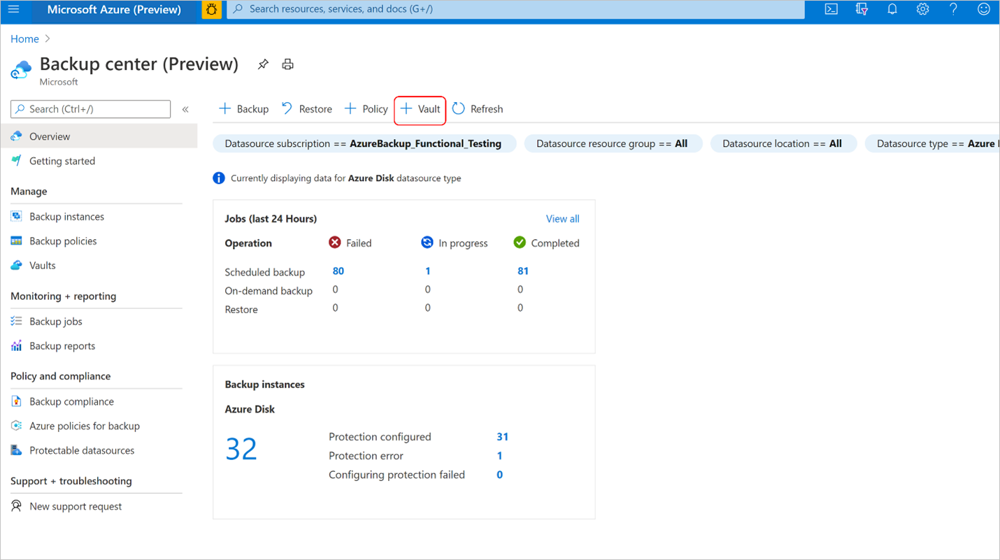

1. In the **Initiate: Create Vault** screen, select **Backup vault**, and **Proceed**.

   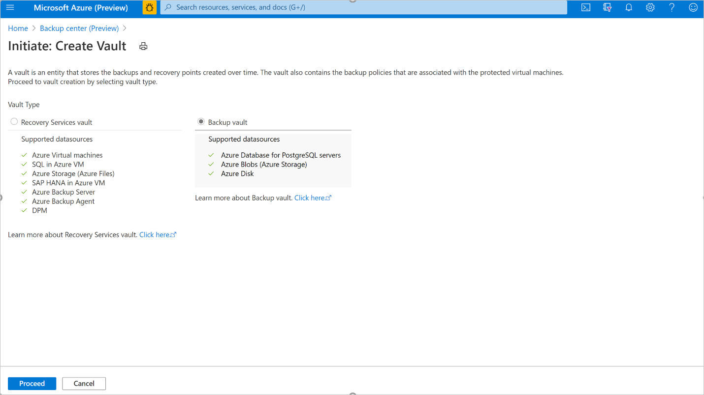

1. In the **Basics** tab, provide subscription, resource group, backup vault name, region, and backup storage redundancy. Continue by selecting **Review + create**. Learn more about [creating a Backup vault](https://docs.microsoft.com/azure/backup/backup-vault-overview#create-a-backup-vault).

   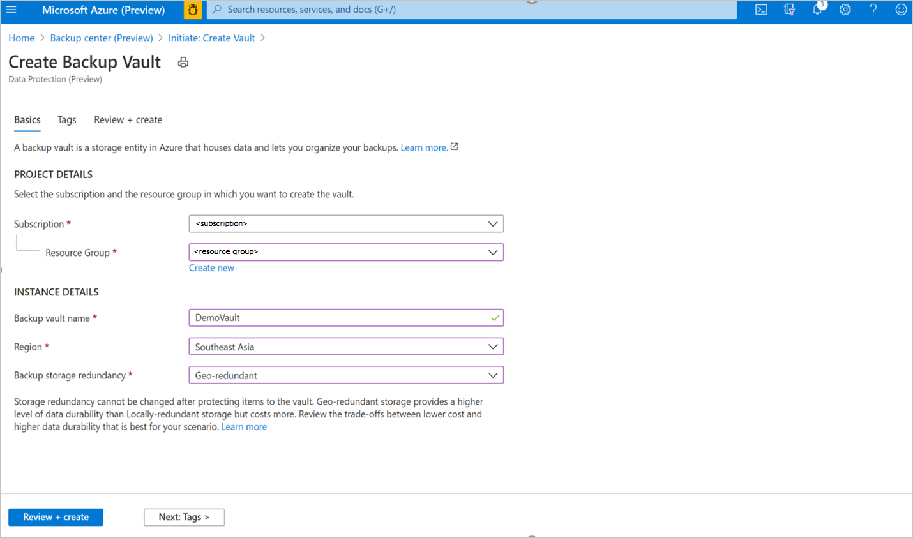

## Create Backup policy

1. In the *DemoVault* **Backup vault** created in the previous step, go to **Backup policies** and select **Add**.

   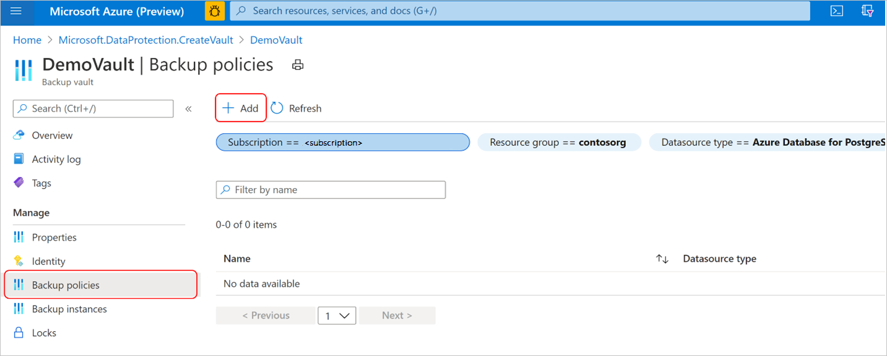

1. In the **Basics** tab, provide policy name, select **Datasource type** as **Azure Disk**. The vault is already prepopulated and the selected vault properties are presented.

   >[!NOTE]
   > Although the selected vault may have the global-redundancy setting, currently Azure Disk Backup supports snapshot datastore only. All backups are stored in a resource group in your subscription and aren't copied to backup vault storage.

   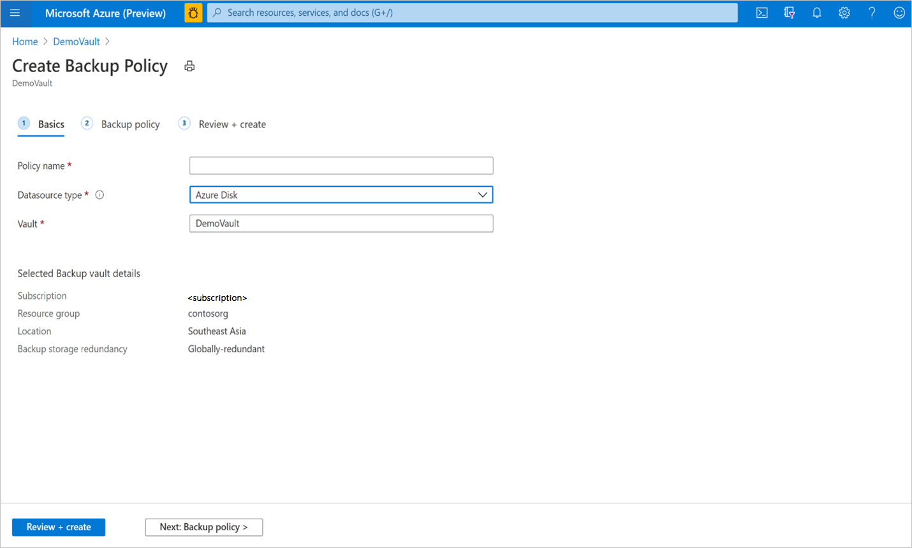

1. In the **Backup policy** tab, select the backup schedule frequency.

   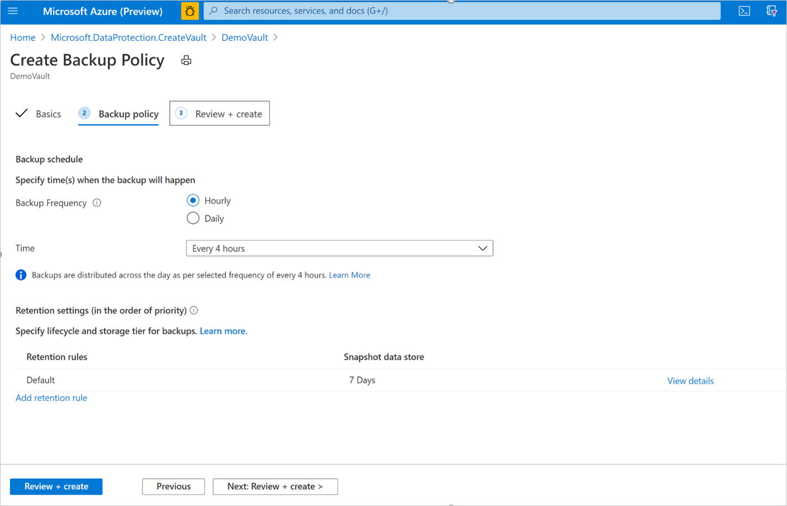

   Azure Disk Backup offers multiple backups per day. If you require more frequent backups, choose the **Hourly** backup frequency with the ability to take backups with intervals of every 4, 6, 8 or 12 hours. The backups are scheduled based on the **Time** interval selected. For example, if you select **Every 4 hours**, then the backups are taken at approximately in the interval of every 4 hours so the backups are distributed equally across the day. If a once a day backup is sufficient, then choose the **Daily** backup frequency. In the daily backup frequency, you can specify the time of the day when your backups are taken. It's important to note that the time of the day indicates the backup start time and not the time when the backup completes. The time required for completing the backup operation is dependent on various factors including size of the disk, and churn rate between consecutive backups. However, Azure Disk backup is an agentless backup that uses [incremental snapshots](https://docs.microsoft.com/azure/virtual-machines/windows/disks-incremental-snapshots-portal), which doesn't impact the production application performance.

1. In the **Backup policy** tab, select retention settings that meet the recovery point objective (RPO) requirement.

   The default retention rule applies if no other retention rule is specified. The default retention rule can be modified to change the retention duration, but it cannot be deleted. You can add a new retention rule by selecting **Add retention rule**.

   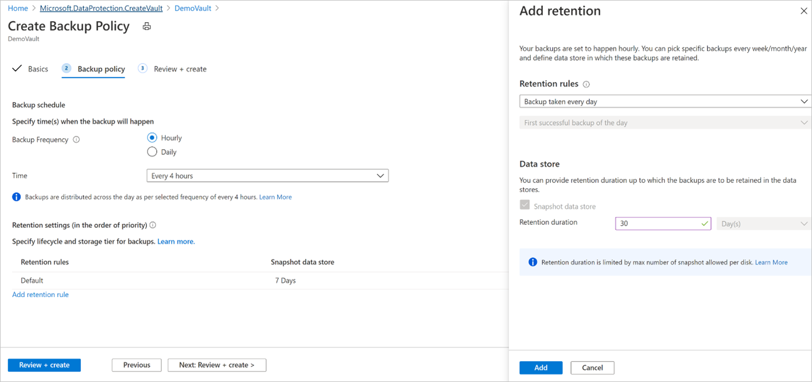

   You can pick **first successful backup** taken daily or weekly, and provide the retention duration that the specific backups are to be retained before they're deleted. This option is useful to retain specific backups of the day or week for a longer duration of time. All other frequent backups can be retained for a shorter duration.

   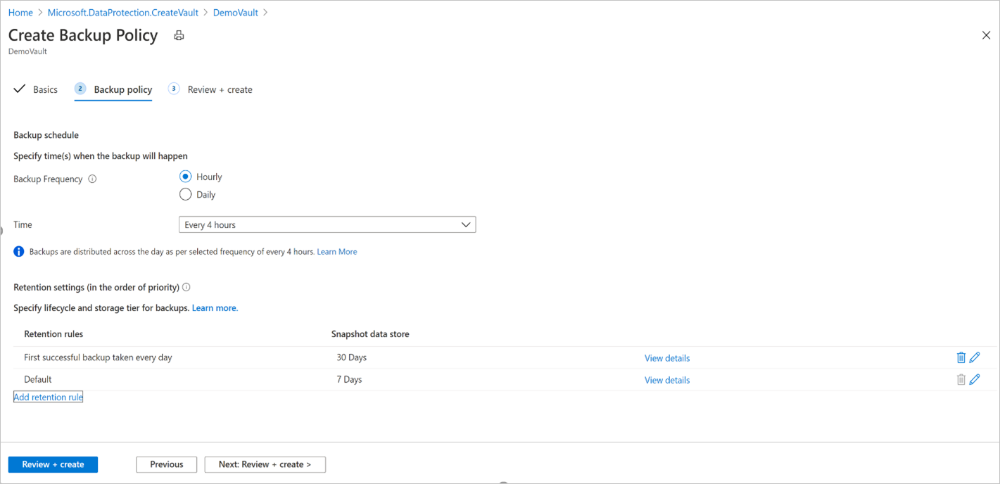

   >[!NOTE]
   >Azure Backup for Managed Disks uses incremental snapshots which are limited to 200 snapshots per disk. To allow you to take on-demand backups aside from scheduled backups, backup policy limits the total backups to 180. Learn more about [incremental snapshots](https://docs.microsoft.com/azure/virtual-machines/windows/disks-incremental-snapshots-portal#restrictions) for managed disk.

1. Complete the backup policy creation by selecting **Review + create**.

## Configure backup

Backup Vault uses Managed Identity to access other Azure resources. To configure backup of managed disks, Backup vault’s managed identity requires a set of permissions on the source disks and resource groups where snapshots are created and managed.

A system assigned managed identity is restricted to one per resource and is tied to the lifecycle of this resource. You can grant permissions to the managed identity by using Azure role-based access control (Azure RBAC). Managed identity is a service principal of a special type that may only be used with Azure resources. Learn more about [Managed Identities](https://docs.microsoft.com/azure/active-directory/managed-identities-azure-resources/overview).

The following prerequisites are required to configure backup of managed disks:

1. Assign the **Disk Backup Reader** role to Backup Vault’s managed identity on the Source disk that is to be backed up.

   1. Go to the disk that needs to be backed up.

   1. Go to **Access control (IAM)** and select **Add role assignments**

   1. On the right context pane, select **Disk Backup Reader** in the **Role** dropdown list. Select the backup vault’s managed identity and **Save**.

   >[!TIP]
   >Type the backup vault name to select the vault’s managed identity.

   

1. Assign the **Disk Snapshot Contributor** role to the Backup vault’s managed identity on the Resource group where backups are created and managed by the Azure Backup service. The disk snapshots are stored in a resource group within in your subscription. To allow Azure Backup service to create, store and manage snapshots, you need to provide permissions to the backup vault.

   **Choosing resource group for storing and managing snapshots:**

   - Don't select the same resource group as that of the source disk.

   - As a guideline, it's recommended to create a dedicated resource group as a snapshot datastore to be used by the Azure Backup service. Having a dedicated resource group allows restricting access permissions on the resource group, providing safety and ease of management of the backup data.

   - You can use this resource group for storing snapshots across multiple disks that are being (or planned to be) backed up.  

   - You can't create an incremental snapshot for a particular disk outside of that disk's subscription. So choose the resource group within the same subscription as that of the disk to be backed up. Learn more about [incremental snapshot](https://docs.microsoft.com/azure/virtual-machines/windows/disks-incremental-snapshots-portal#restrictions) for managed disks.

   1. Go to the Resource group. For example, the resource group is *SnapshotRG*, which is in the same subscription as that of the disk to be backed up.

   1. Go to **Access control (IAM)** and select **Add role assignments**.

   1. On the right context pane, select **Disk Snapshot Contributor** in the **Role** dropdown list. Select the backup vault’s managed identity and **Save**.

   >[!TIP]
   >Type the backup vault name to select the vault’s managed identity.

   

1. Verify that the backup vault's managed identity has the right set of role assignments on the source disk and resource group that serves as the snapshot datastore.

   1. Go to **Backup vault - > Identity** and select **Azure role assignments**.

      

   1. Verify that the role, resource name, and resource type are correctly reflected.

      

   >[!NOTE]
   >While the role assignments are reflected correctly on the portal, it may take approximately 15 minutes for the permission to be applied on the backup vault’s managed identity.

1. Once the prerequisites are met, go to **Backup vault - > overview** and select **Backup** to start configuring backup of the disks.

   

1. In the **Basics** tab, select **Azure Disk** as the datasource type.

   

   >[!NOTE]
   >Azure Backup uses [incremental snapshots](https://docs.microsoft.com/azure/virtual-machines/windows/disks-incremental-snapshots-portal#restrictions) of managed disks, which store only the delta changes to the disk since the last snapshot on Standard HDD storage, regardless of the storage type of the parent disk. For additional reliability, incremental snapshots are stored on Zone Redundant Storage (ZRS) by default in regions that support ZRS. Currently, Azure Disk Backup supports operational backup of managed disks that doesn't copy the backups to Backup vault storage. So the backup storage redundancy setting of Backup vault does not apply to the recovery points.

1. In the **Backup policy** tab, choose a backup policy.

   

1. In the **Resources** tab, select **Select Azure Disk**. On the right context pane, select the disks to be backed up.

   

   >[!NOTE]
   >While the portal allows you to select multiple disks and configure backup, each disk is an individual backup instance. Currently Azure Disk Backup only supports backup of individual disks. Point-in-time backup of multiple disks attached to a virtual disk isn't supported.
   >
   >When using the portal, you're limited to selecting disks within the same subscription. If you have several disks to be backed up or if the disks are spread across different subscription, you can use scripts to automate.
   >
   >For more information on the Azure Disk backup region availability, supported scenarios and limitations, see the [support matrix](disk-backup-support-matrix.md).

1. Select a **Snapshot Resource Group** and select **validate**. This is the resource group where the Azure Backup service created and manages the incremental snapshots for the backup vault. Managed identity is assigned with the required role permissions as part of the prerequisites.

   

   >[!NOTE]
   >Validation might take few minutes to complete before you can complete configuring backup workflow. Validation may fail if:
   >
   > - a disk is unsupported. Refer to the [Support Matrix](disk-backup-support-matrix.md) for unsupported scenarios.
   > - the Backup vault managed identity does not have valid role assignments on the **disk** to be backed up or on the **Snapshot resource group** where incremental snapshots are stored.

1. After a successful validation, select **review and configure** to configure the backup of the selected disks.

## Run an on-demand backup

1. In the *DemoVault* **Backup vault** created in the previous step, go to **Backup instances** and select a backup instance.

   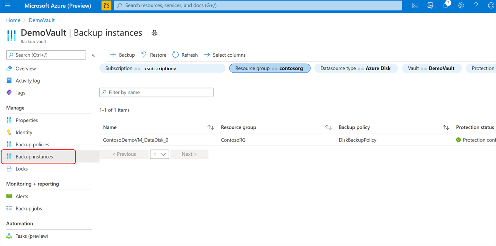

1. In the **Backup instances** screen, you'll find:

   - **essential** information including source disk name, the snapshot resource group where incremental snapshots are stored, backup vault, and backup policy.
   - **Job status** showing summary of backup and restore operations and their status in the last seven days.
   - A list of **restore points** for the selected time period.

1. Select **Backup** to initiate an on-demand backup.

   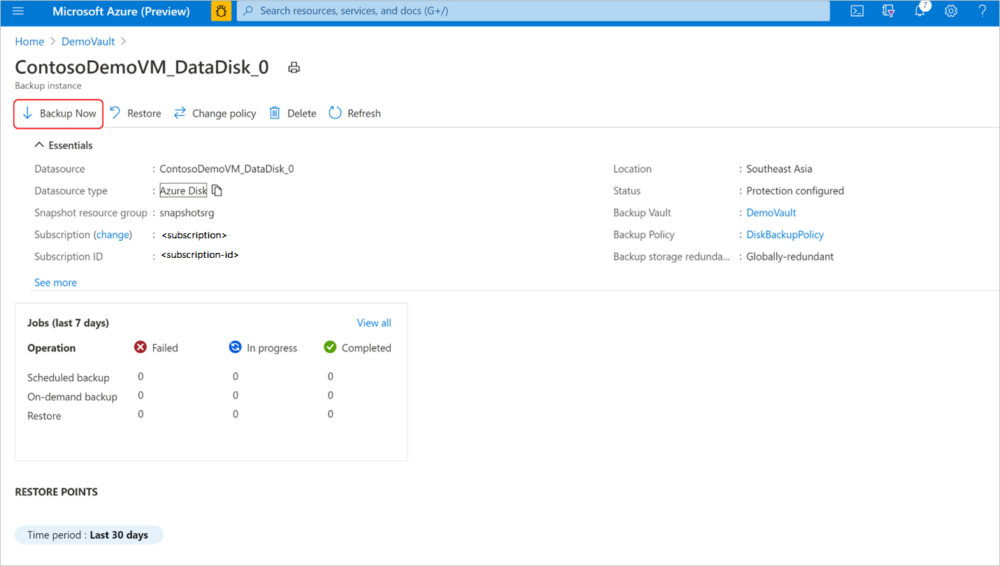

1. Select one of the retention rules associated with the backup policy. This retention rule will determine the retention duration of this on-demand  backup. Select **Backup now** to start the backup.

   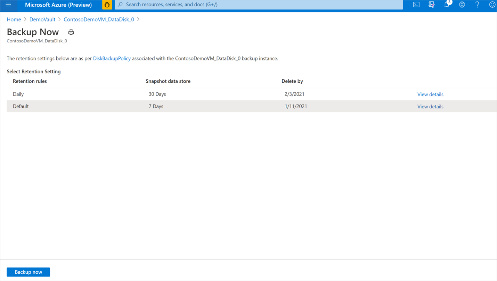

## Track a backup operation

The Azure Backup service creates a job for scheduled backups or if you trigger on-demand backup operation for tracking. To view the backup job status:

1. Go to the **Backup instance** screen. It shows the jobs dashboard with operation and status for the past seven days.

   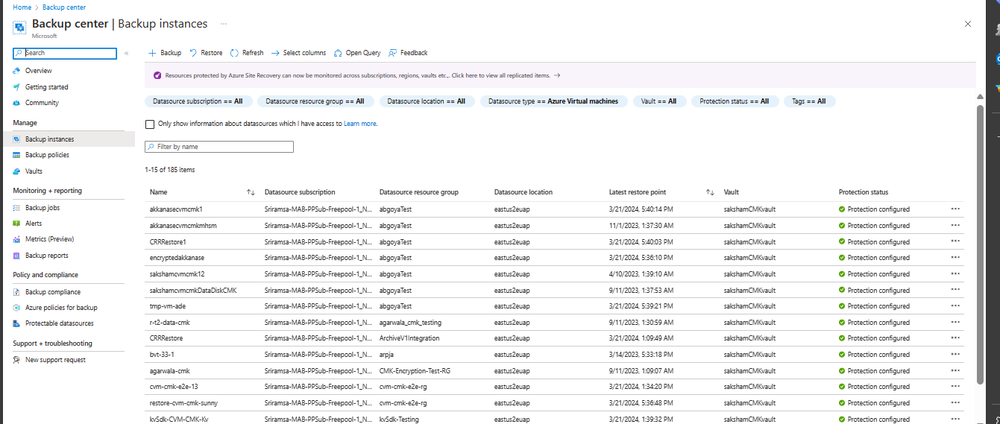

1. To view the status of the backup operation, select **View all** to show ongoing and past jobs of this backup instance.

   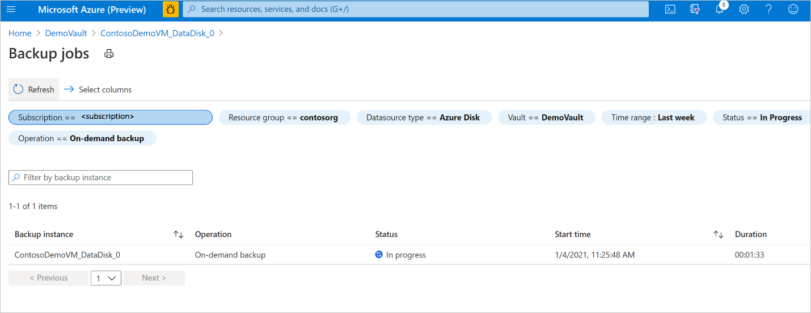

1. Review the list of backup and restore jobs and their status. Select a job from the list of jobs to view job details.

   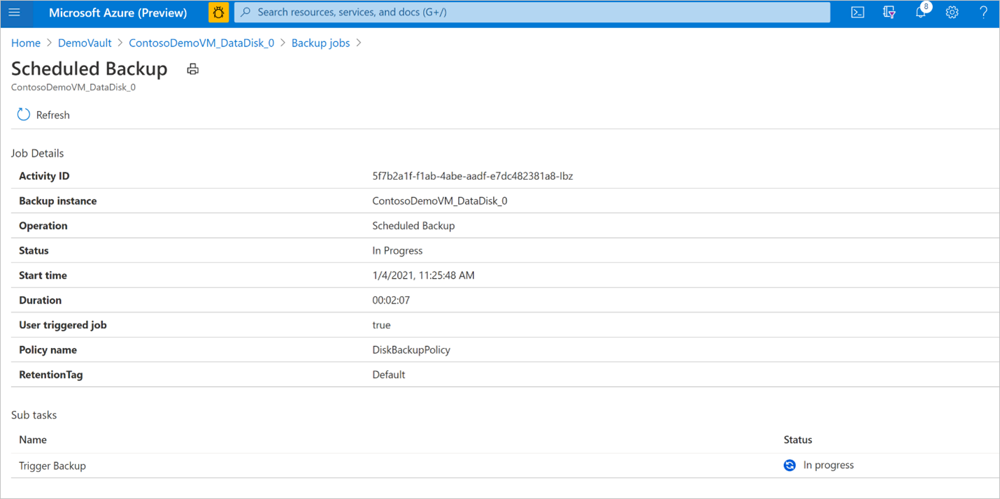

## Next steps

- [Restore Azure Managed Disks](restore-managed-disks.md)
