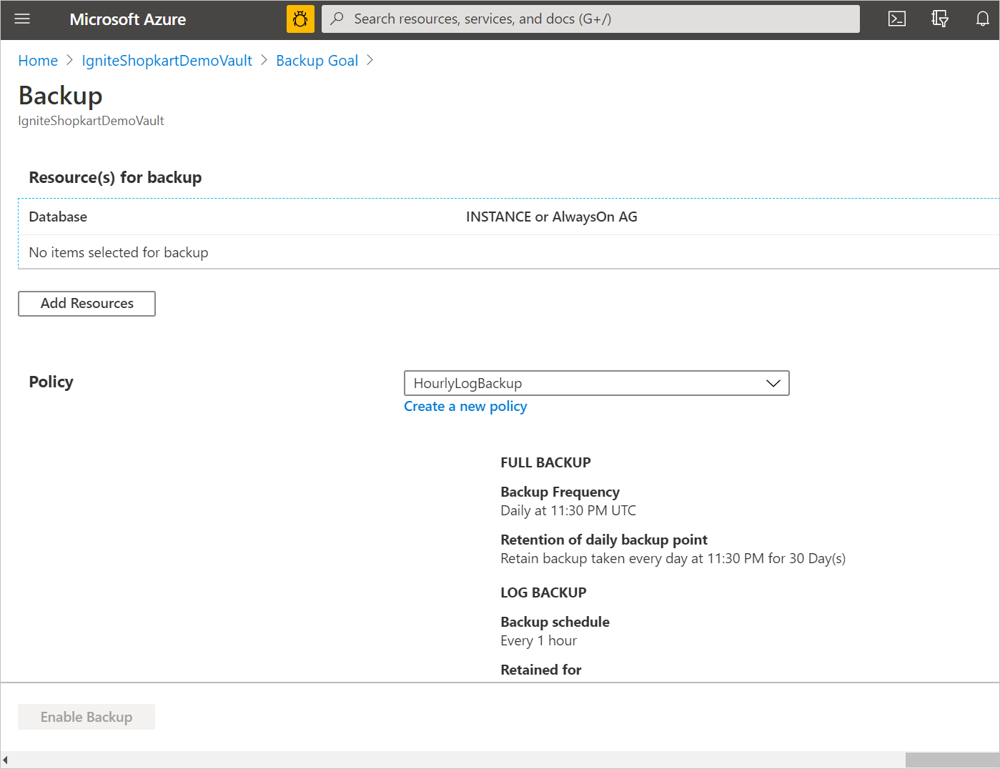
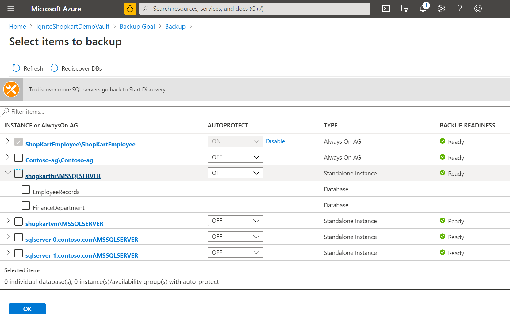
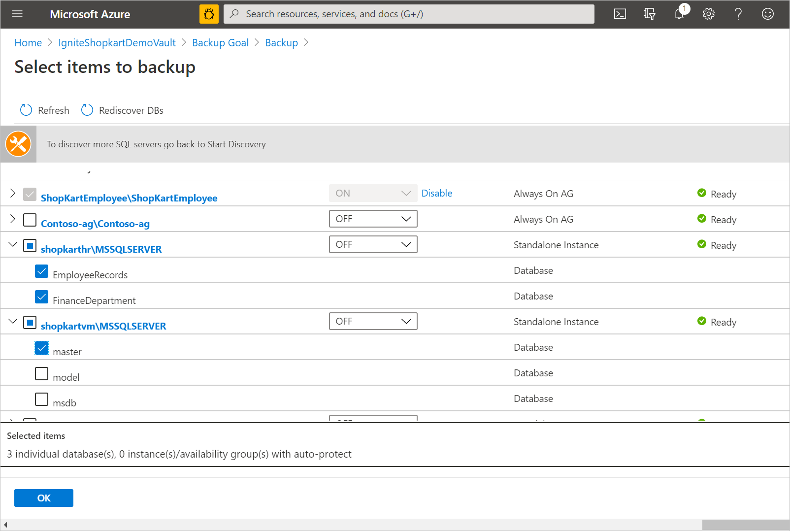
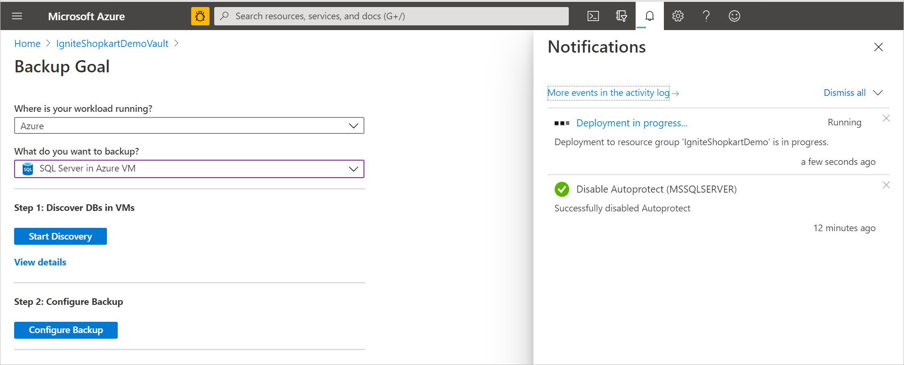

# Back up multiple SQL Server VMs from the Recovery Services vault

SQL Server databases are critical workloads that require a low recovery-point objective (RPO) and long-term retention. You can back up SQL Server databases running on Azure virtual machines (VMs) by using [Azure Backup](backup-overview.md).

This article shows how to back up a SQL Server database that's running on an Azure VM to an Azure Backup Recovery Services vault.

In this article, you'll learn how to:

> [!div class="checklist"]
>
> * Create and configure a vault.
> * Discover databases and set up backups.
> * Set up auto-protection for databases.

## Prerequisites

Before you back up a SQL Server database, check the following criteria:

1. Identify or create a [Recovery Services vault](backup-sql-server-database-azure-vms.md#create-a-recovery-services-vault) in the same region and subscription as the VM hosting the SQL Server instance.
1. Verify that the VM has [network connectivity](backup-sql-server-database-azure-vms.md#establish-network-connectivity).
1. Make sure that the [Azure Virtual Machine Agent](../virtual-machines/extensions/agent-windows.md) is installed on the VM.
1. Make sure that .NET 4.5.2 version or above is installed on the VM.
1. Make sure that the SQL Server databases follow the [database naming guidelines for Azure Backup](#database-naming-guidelines-for-azure-backup).
1. Ensure that the combined length of the SQL Server VM name and the resource group name doesn't exceed 84 characters for Azure Resource Manager VMs (or 77 characters for classic VMs). This limitation is because some characters are reserved by the service.
1. Check that you don't have any other backup solutions enabled for the database. Disable all other SQL Server backups before you back up the database.
1. When using SQL Server 2008 R2 or SQL Server 2012, you might run into the time zone issue for backup as described [here](https://support.microsoft.com/help/2697983/kb2697983-fix-an-incorrect-value-is-stored-in-the-time-zone-column-of). Make sure that you are on the latest cumulative updates to avoid the time zone-related issue described above. If applying the updates to the SQL Server instance on the Azure VM isn't feasible, disable Daylight Saving Time (DST) for the time zone on the virtual machine.

> [!NOTE]
> You can enable Azure Backup for an Azure VM and also for a SQL Server database running on the VM without conflict.

### Establish network connectivity

For all operations, a SQL Server VM requires connectivity to the Azure Backup service, Azure Storage, and Azure Active Directory. This can be achieved by using private endpoints or by allowing access to the required public IP addresses or FQDNs. Not allowing proper connectivity to the required Azure services may lead to failure in operations like database discovery, configuring backup, performing backups, and restoring data.

The following table lists the various alternatives you can use for establishing connectivity:

| **Option**                        | **Advantages**                                               | **Disadvantages**                                            |
| --------------------------------- | ------------------------------------------------------------ | ------------------------------------------------------------ |
| Private endpoints                 | Allow backups over private IPs inside the virtual network       Provide granular control on the network and vault side | Incurs standard private endpoint [costs](https://azure.microsoft.com/pricing/details/private-link/) |
| NSG service tags                  | Easier to manage as range changes are automatically merged        No additional costs | Can be used with NSGs only        Provides access to the entire service |
| Azure Firewall FQDN tags          | Easier to manage since the required FQDNs are automatically managed | Can be used with Azure Firewall only                         |
| Allow access to service FQDNs/IPs | No additional costs       Works with all network security appliances and firewalls | A broad set of IPs or FQDNs may be required to be accessed   |
| Use an HTTP proxy                 | Single point of internet access to VMs                       | Additional costs to run a VM with the proxy software         |

More details around using these options are shared below:

#### Private endpoints

Private endpoints allow you to connect securely from servers inside a virtual network to your Recovery Services vault. The private endpoint uses an IP from the VNET address space for your vault. The network traffic between your resources inside the virtual network and the vault travels over your virtual network and a private link on the Microsoft backbone network. This eliminates exposure from the public internet. Read more on private endpoints for Azure Backup [here](./private-endpoints.md).

#### NSG tags

If you use Network Security Groups (NSG), use the *AzureBackup* service tag to allow outbound access to Azure Backup. In addition to the Azure Backup tag, you also need to allow connectivity for authentication and data transfer by creating similar [NSG rules](../virtual-network/network-security-groups-overview.md#service-tags) for Azure AD (*AzureActiveDirectory*) and Azure Storage(*Storage*).  The following steps describe the process to create a rule for the Azure Backup tag:

1. In **All Services**, go to **Network security groups** and select the network security group.

1. Select **Outbound security rules** under **Settings**.

1. Select **Add**. Enter all the required details for creating a new rule as described in [security rule settings](../virtual-network/manage-network-security-group.md#security-rule-settings). Ensure the option **Destination** is set to *Service Tag* and **Destination service tag** is set to *AzureBackup*.

1. Select **Add**  to save the newly created outbound security rule.

You can similarly create NSG outbound security rules for Azure Storage and Azure AD.

#### Azure Firewall tags

If you're using Azure Firewall, create an application rule by using the *AzureBackup* [Azure Firewall FQDN tag](../firewall/fqdn-tags.md). This allows all outbound access to Azure Backup.

#### Allow access to service IP ranges

If you choose to allow access service IPs, refer to the IP ranges in the JSON file available [here](https://www.microsoft.com/download/confirmation.aspx?id=56519). You'll need to allow access to IPs corresponding to Azure Backup, Azure Storage, and Azure Active Directory.

#### Allow access to service FQDNs

You can also use the following FQDNs to allow access to the required services from your servers:

| Service    | Domain  names to be accessed                             | Ports
| -------------- | ------------------------------------------------------------ | ---
| Azure  Backup  | `*.backup.windowsazure.com`                             | 443
| Azure  Storage | `*.blob.core.windows.net`    `*.queue.core.windows.net`    `*.blob.storage.azure.net` | 443
| Azure  AD      | Allow  access to FQDNs under sections 56 and 59 according to [this article](/office365/enterprise/urls-and-ip-address-ranges#microsoft-365-common-and-office-online) | As applicable

#### Use an HTTP proxy server to route traffic

When you back up a SQL Server database on an Azure VM, the backup extension on the VM uses the HTTPS APIs to send management commands to Azure Backup and data to Azure Storage. The backup extension also uses Azure AD for authentication. Route the backup extension traffic for these three services through the HTTP proxy. Use the list of IPs and FQDNs mentioned above for allowing access to the required services. Authenticated proxy servers aren't supported.

### Database naming guidelines for Azure Backup

- Avoid using the following elements in database names:

  - Trailing and leading spaces
  - Trailing exclamation marks (!)
  - Closing square brackets (])
  - Semicolon (;)
  - Forward slash (/)

- Aliasing is available for unsupported characters, but we recommend avoiding them. For more information, see [Understanding the Table Service Data Model](/rest/api/storageservices/understanding-the-table-service-data-model).

- Multiple databases on the same SQL instance with casing difference aren't supported.

-	Changing the casing of a SQL database isn't supported after configuring protection.

>[!NOTE]
>The **Configure Protection** operation for databases with special characters, such as '+' or '&', in their name isn't supported. You can change the database name or enable **Auto Protection**, which can successfully protect these databases.

[!INCLUDE [How to create a Recovery Services vault](../../includes/backup-create-rs-vault.md)]

## Discover SQL Server databases

How to discover databases running on a VM:

1. In the [Azure portal](https://portal.azure.com), go to **Backup center** and click **+Backup**.

1. Select **SQL in Azure VM** as the datasource type, select the Recovery Services vault you have created, and then click **Continue**.

   :::image type="content" source="./media/backup-azure-sql-database/configure-sql-backup.png" alt-text="Screenshot showing to select Backup to view the databases running in a VM.":::

1. In **Backup Goal** > **Discover DBs in VMs**, select **Start Discovery** to search for unprotected VMs in the subscription. This search can take a while, depending on the number of unprotected VMs in the subscription.

   * Unprotected VMs should appear in the list after discovery, listed by name and resource group.
   * If a VM isn't listed as you expect, see whether it's already backed up in a vault.
   * Multiple VMs can have the same name, but they'll belong to different resource groups.

     

1. In the VM list, select the VM running the SQL Server database > **Discover DBs**.

1. Track database discovery in **Notifications**. The time required for this action depends on the number of VM databases. When the selected databases are discovered, a success message appears.

    

1. Azure Backup discovers all SQL Server databases on the VM. During discovery, the following elements occur in the background:

    * Azure Backup registers the VM with the vault for workload backup. All databases on the registered VM can be backed up to this vault only.
    * Azure Backup installs the AzureBackupWindowsWorkload extension on the VM. No agent is installed on a SQL database.
    * Azure Backup creates the service account NT Service\AzureWLBackupPluginSvc on the VM.
      * All backup and restore operations use the service account.
      * NT Service\AzureWLBackupPluginSvc requires SQL sysadmin permissions. All SQL Server VMs created in the Marketplace come with the SqlIaaSExtension installed. The AzureBackupWindowsWorkload extension uses the SQLIaaSExtension to automatically get the required permissions.
    * If you didn't create the VM from the Marketplace or if you are on SQL 2008 and 2008 R2, the VM may not have the SqlIaaSExtension installed, and the discovery operation fails with the error message UserErrorSQLNoSysAdminMembership. To fix this issue, follow the instructions under [Set VM permissions](backup-azure-sql-database.md#set-vm-permissions).

        

## Configure backup  

1. In **Backup Goal** > **Step 2: Configure Backup**, select **Configure Backup**.

   

1. Select **Add Resources** to see all the registered availability groups and standalone SQL Server instances.

    

1. In the **Select items to backup** screen, select the arrow to the left of a row to expand the list of all the unprotected databases in that instance or Always On availability group.

    

1. Choose all the databases you want to protect, and then select **OK**.

   

   To optimize backup loads, Azure Backup sets a maximum number of databases in one backup job to 50.

     * To protect more than 50 databases, configure multiple backups.
     * To [enable](#enable-auto-protection) the entire instance or the Always On availability group, in the **AUTOPROTECT** drop-down list, select  **ON**, and then select **OK**.

         > [!NOTE]
         > The [auto-protection](#enable-auto-protection) feature not only enables protection on all the existing databases at once, but also automatically protects any new databases added to that instance or the availability group.  

1. Define the **Backup policy**. You can do one of the following:

   * Select the default policy as *HourlyLogBackup*.
   * Choose an existing backup policy previously created for SQL.
   * Define a new policy based on your RPO and retention range.

     

1. Select **Enable Backup** to submit the **Configure Protection** operation and track the configuration progress in the **Notifications** area of the portal.

   

### Create a backup policy

A backup policy defines when backups are taken and how long they're retained.

* A policy is created at the vault level.
* Multiple vaults can use the same backup policy, but you must apply the backup policy to each vault.
* When you create a backup policy, a daily full backup is the default.
* You can add a differential backup, but only if you configure full backups to occur weekly.
* Learn about [different types of backup policies](backup-architecture.md#sql-server-backup-types).

To create a backup policy:

1. Go to **Backup center** and click **+Policy**.

1. Select **SQL Server in Azure VM** as the datasource type, select the vault under which the policy should be created, and then click **Continue**.

   :::image type="content" source="./media/backup-azure-sql-database/create-sql-policy.png" alt-text="Screenshot showing to choose a policy type for the new backup policy.":::

1. In **Policy name**, enter a name for the new policy.

   :::image type="content" source="./media/backup-azure-sql-database/sql-policy-summary.png" alt-text="Screenshot to showing to enter policy name.":::

1. Select the **Edit** link corresponding, to **Full backup**, to modify the default settings.

   * Select a **Backup Frequency**. Choose either **Daily** or **Weekly**.
   * For **Daily**, select the hour and time zone when the backup job begins. You can't create differential backups for daily full backups.

   :::image type="content" source="./media/backup-azure-sql-database/sql-backup-schedule.png" alt-text="Screenshot showing new backup policy fields.":::

1. In **RETENTION RANGE**, all options are selected by default. Clear any retention range limits that you don't want, and then set the intervals to use.

    * Minimum retention period for any type of backup (full, differential, and log) is seven days.
    * Recovery points are tagged for retention based on their retention range. For example, if you select a daily full backup, only one full backup is triggered each day.
    * The backup for a specific day is tagged and retained based on the weekly retention range and the weekly retention setting.
    * Monthly and yearly retention ranges behave in a similar way.

    :::image type="content" source="./media/backup-azure-sql-database/sql-retention-range.png" alt-text="Screenshot showing the retention range interval settings.":::

1. Select **OK** to accept the setting for full backups.
1. Select the **Edit** link corresponding to **Differential backup**, to modify the default settings.

    * In **Differential Backup policy**, select **Enable** to open the frequency and retention controls.
    * You can trigger only one differential backup per day. A differential backup can't be triggered on the same day as a full backup.
    * Differential backups can be retained for a maximum of 180 days.
    * Differential Backup isn't supported for the master database.

    :::image type="content" source="./media/backup-azure-sql-database/sql-differential-backup.png" alt-text="Screenshot showing the differential Backup policy.":::

1. Select the **Edit** link corresponding to **Log backup**, to modify the default settings

    * In **Log Backup**, select **Enable**, and then set the frequency and retention controls.
    * Log backups can occur as often as every 15 minutes and can be retained for up to 35 days.
    * If the database is in the [simple recovery model](/sql/relational-databases/backup-restore/recovery-models-sql-server), the log backup schedule for that database will be paused and so no log backups will be triggered.
    * If the recovery model of the database changes from **Full** to **Simple**, log backups will be paused within 24 hours of the change in the recovery model. Similarly, if the recovery model changes from **Simple**, implying log backups can now be supported for the database, the log backups schedules will be enabled within 24 hours of the change in recovery model.

    :::image type="content" source="./media/backup-azure-sql-database/sql-log-backup.png" alt-text="Screenshot showing the log Backup policy.":::

1. On the **Backup policy** menu, choose whether to enable **SQL Backup Compression** or not. This option is disabled by default. If enabled, SQL Server will send a compressed backup stream to the VDI. Azure Backup overrides instance level defaults with COMPRESSION / NO_COMPRESSION clause depending on the value of this control.

1. After you complete the edits to the backup policy, select **OK**.

> [!NOTE]
> Each log backup is chained to the previous full backup to form a recovery chain. This full backup will be retained until the retention of the last log backup has expired. This might mean that the full backup is retained for an extra period to make sure all the logs can be recovered. Let's assume you have a weekly full backup, daily differential and 2 hour logs. All of them are retained for 30 days. But, the weekly full can be really cleaned up/deleted only after the next full backup is available, that is, after 30 + 7 days. For example, a weekly full backup happens on Nov 16th. According to the retention policy, it should be retained until Dec 16th. The last log backup for this full happens before the next scheduled full, on Nov 22nd. Until this log is available until Dec 22nd, the Nov 16th full can't be deleted. So, the Nov 16th full is retained until Dec 22nd.

## Enable auto-protection  

You can enable auto-protection to automatically back up all existing and future databases to a standalone SQL Server instance or to an Always On availability group.

* There's no limit on the number of databases you can select for auto-protection at a time. Discovery typically runs every eight hours. However, you can discover and protect new databases immediately if you manually run a discovery by selecting the **Rediscover DBs** option.
* You can't selectively protect or exclude databases from protection in an instance at the time you enable auto-protection.
* If your instance already includes some protected databases, they'll remain protected under their respective policies even after you turn on auto-protection. All unprotected databases added later will have only a single policy that you define at the time of enabling auto-protection, listed under **Configure Backup**. However, you can change the policy associated with an auto-protected database later.  

To enable auto-protection:

  1. In **Items to backup**, select the instance for which you want to enable auto-protection.
  2. Select the drop-down list under **AUTOPROTECT**, choose **ON**, and then select **OK**.

      

  3. Backup is configured for all the databases together and can be tracked in **Backup Jobs**.

If you need to disable auto-protection, select the instance name under **Configure Backup**, and then select **Disable Autoprotect** for the instance. All databases will continue to be backed up, but future databases won't be automatically protected.

## Next steps

Learn how to:

* [Restore backed-up SQL Server databases](restore-sql-database-azure-vm.md)
* [Manage backed-up SQL Server databases](manage-monitor-sql-database-backup.md)
