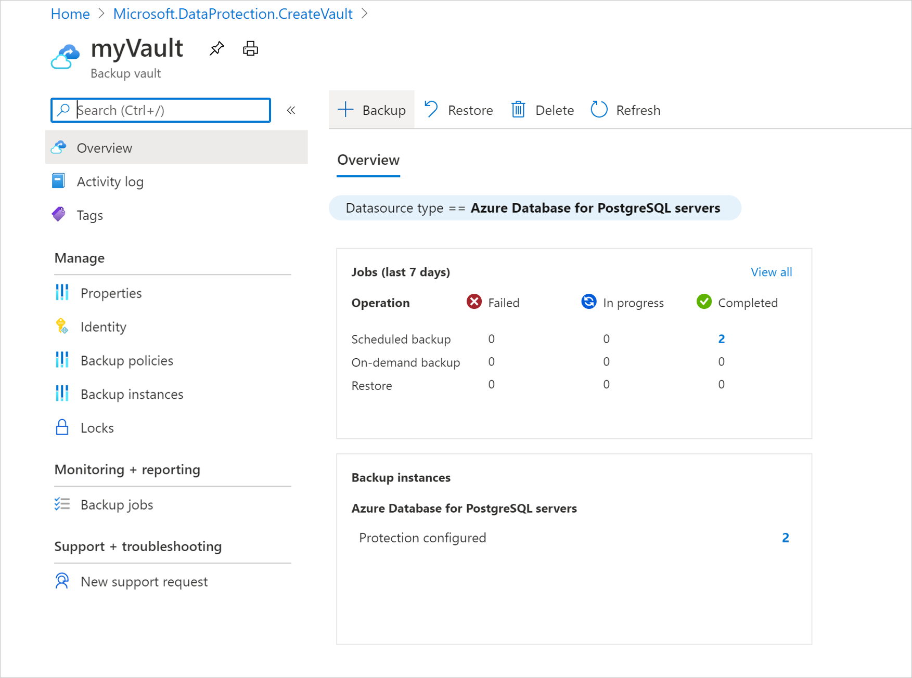
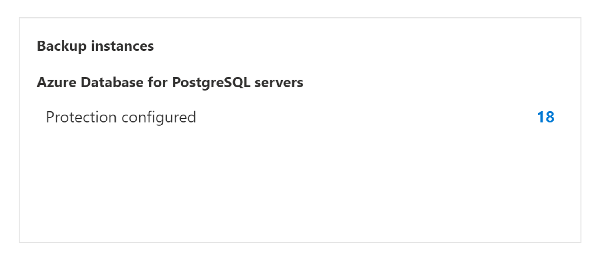
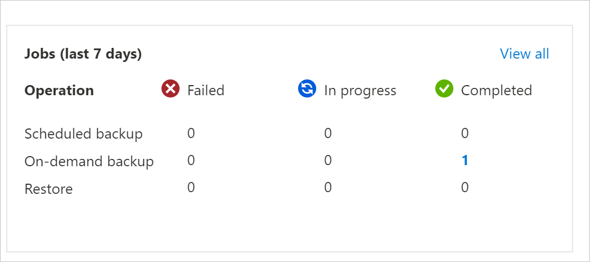

# Backup vaults overview

This article describes the features of a Backup vault. A Backup vault is a storage entity in Azure that houses backup data for certain newer workloads that Azure Backup supports. You can use Backup vaults to hold backup data for various Azure services, such Azure Database for PostgreSQL servers and newer workloads that Azure Backup will support. Backup vaults make it easy to organize your backup data, while minimizing management overhead. Backup vaults are based on the Azure Resource Manager model of Azure, which provides features such as:

- **Enhanced capabilities to help secure backup data**: With Backup vaults, Azure Backup provides security capabilities to protect cloud backups. The security features ensure you can secure your backups, and safely recover data, even if production and backup servers are compromised. [Learn more](backup-azure-security-feature.md)

- **Azure role-based access control (Azure RBAC)**: Azure RBAC provides fine-grained access management control in Azure. [Azure provides various built-in roles](../role-based-access-control/built-in-roles.md), and Azure Backup has three [built-in roles to manage recovery points](backup-rbac-rs-vault.md). Backup vaults are compatible with Azure RBAC, which restricts backup and restore access to the defined set of user roles. [Learn more](backup-rbac-rs-vault.md)

## Storage settings in the Backup vault

A Backup vault is an entity that stores the backups and recovery points created over time. The Backup vault also contains the backup policies that are associated with the protected virtual machines.

- Azure Backup automatically handles storage for the vault. Choose the storage redundancy that matches your business needs when creating the Backup vault.

- To learn more about storage redundancy, see these articles on [geo](../storage/common/storage-redundancy.md#geo-redundant-storage) and [local](../storage/common/storage-redundancy.md#locally-redundant-storage) redundancy.

## Encryption settings in the Backup vault

This section discusses the options available for encrypting your backup data stored in the Backup vault. Azure Backup service uses the **Backup Management Service** app to access Azure Key Vault, but not the managed identity of the Backup vault.

### Encryption of backup data using platform-managed keys

By default, all your data is encrypted using platform-managed keys. You don't need to take any explicit action from your end to enable this encryption. It applies to all workloads being backed up to your Backup vault.

## Create a Backup vault

A Backup vault is a management entity that stores recovery points created over time and provides an interface to perform backup related operations. These include taking on-demand backups, performing restores, and creating backup policies.

To create a Backup vault, follow these steps.

### Sign in to Azure

Sign in to the Azure portal at <https://portal.azure.com>.

### Create Backup vault

1. Type **Backup vaults** in the search box.
2. Under **Services**, select **Backup vaults**.
3. On the **Backup vaults** page, select **Add**.
4. On the **Basics** tab, under **Project details**, make sure the correct subscription is selected and then choose **Create new** resource group. Type *myResourceGroup* for the name.

    

5. Under **Instance details**, type *myVault* for the **Backup vault name** and choose your region of choice, in this case *East US* for your **Region**.
6. Now choose your **Storage redundancy**. Storage redundancy cannot be changed after protecting items to the vault.
7. We recommend that if you're using Azure as a primary backup storage endpoint, continue to use the default **Geo-redundant** setting.
8. If you don't use Azure as a primary backup storage endpoint, choose **Locally redundant**, which reduces the Azure storage costs. Learn more about [geo](../storage/common/storage-redundancy.md#geo-redundant-storage) and [local](../storage/common/storage-redundancy.md#locally-redundant-storage) redundancy.

    

9. Select the Review + create button at the bottom of the page.

    

## Delete a Backup vault

This section describes how to delete a Backup vault. It contains instructions for removing dependencies and then deleting a vault.

### Before you start

You can't delete a Backup vault with any of the following dependencies:

- You can't delete a vault that contains protected data sources (for example, Azure database for PostgreSQL servers).
- You can't delete a vault that contains backup data.

If you try to delete the vault without removing the dependencies, you'll encounter the following error messages:

>Cannot delete the Backup vault as there are existing backup instances or backup policies in the vault. Delete all backup instances and backup policies that are present in the vault and then try deleting the vault.

Ensure that you cycle through the **Datasource type** filter options in **Backup center** to not miss any existing Backup Instance or policy that needs to be removed, before being able to delete the Backup Vault.

### Proper way to delete a vault

>[!WARNING]
The following operation is destructive and can't be undone. All backup data and backup items associated with the protected server will be permanently deleted. Proceed with caution.

To properly delete a vault, you must follow the steps in this order:

- Verify if there are any protected items:
  - Go to **Backup Instances** in the left navigation bar. All items listed here must be deleted first.

After you've completed these steps, you can continue to delete the vault.

### Delete the Backup vault

When there are no more items in the vault, select **Delete** on the vault dashboard. You'll see a confirmation text asking if you want to delete the vault.

1. Select **Yes** to verify that you want to delete the vault. The vault is deleted. The portal returns to the **New** service menu.

## Monitor and manage the Backup vault

This section explains how to use the Backup vault **Overview** dashboard to monitor and manage your Backup vaults. The overview pane contains two tiles: **Jobs** and **Instances**.

### Manage Backup instances

In the **Jobs** tile, you get a summarized view of all backup and restore related jobs in your Backup vault. Selecting any of the numbers in this tile allows you to view more information on jobs for a particular datasource type, operation type, and status.

### Manage Backup jobs

In the **Backup Instances** tile, you get a summarized view of all backup instances in your Backup vault. Selecting any of the numbers in this tile allows you to view more information on backup instances for a particular datasource type and protection status.

## Move a Backup vault across Azure Subscriptions and Resource Groups (Public Preview)

This section explains how to move a Backup vault (configured for Azure Backup) across Azure subscriptions and resource groups using the Azure portal.

>[!Note]
>You can also move Backup vaults to a different resource group or subscription using [PowerShell](/powershell/module/az.resources/move-azresource?view=azps-6.3.0&preserve-view=true) and [CLI](/cli/azure/resource?view=azure-cli-latest#az_resource_move).

### Supported regions

The vault move across subscriptions and resource groups is currently supported in the following regions: West US, South Central US, East Asia, Switzerland North, South Africa North, UK West, North Central US, UAE North, Norway East, Australia Southeast, Japan West, Canada East, Korea Central, Australia Central, West Central US, Central India, West India, South India, UAE Central, South Africa West, Norway West, Switzerland West.

### Move Backup vault to a different resource group

1. Sign in to the [Azure portal](https://portal.azure.com/).

2. Open the list of Backup vaults and select the vault you want to move.

   The vault dashboard displays the vault details.

   :::image type="content" source="./media/backup-vault-overview/vault-dashboard-to-move-to-resource-group-inline.png" alt-text="Screenshot showing the dashboard of the vault to be moved to another resource group." lightbox="./media/backup-vault-overview/vault-dashboard-to-move-to-resource-group-expanded.png"::: 

3. In the vault **Overview** menu, click **Move**, and then select **Move to another resource group**.

   :::image type="content" source="./media/backup-vault-overview/select-move-to-another-resource-group-inline.png" alt-text="Screenshot showing the option for moving the Backup vault to another resource group." lightbox="./media/backup-vault-overview/select-move-to-another-resource-group-expanded.png":::

4. In the **Resource group** drop-down list, select an existing resource group or select **Create new** to create a new resource group.

   >[!Note]
   >The same subscription to move the vault auto populates.

   :::image type="content" source="./media/backup-vault-overview/select-existing-or-create-resource-group-inline.png" alt-text="Screenshot showing the selection of an existing resource group or creation of a new resource group." lightbox="./media/backup-vault-overview/select-existing-or-create-resource-group-expanded.png"::: 

5. On the **Resources to move** tab, you can view the validation progress status for the Backup vault that needs to be moved. Wait till the validation is complete.

   :::image type="content" source="./media/backup-vault-overview/move-validation-process-to-move-to-resource-group-inline.png" alt-text="Screenshot showing the Backup vault validation status." lightbox="./media/backup-vault-overview/move-validation-process-to-move-to-resource-group-expanded.png"::: 

6. Select the checkbox _I understand that tools and scripts associated with moved resources will not work until I update them to use new resource IDs_’ to confirm, and then select **Move**.
 
   >[!Note]
   >The resource path changes after moving vault across resource groups or subscriptions. Ensure that you update the tools and scripts with the new resource path after the move operation completes.

Wait till the move operation is complete to perform any other operations on the vault. Any operations performed on the Backup vault will fail while the move is in progress. When the process is complete, the Backup vault should appear in the target resource group.

>[!Important]
>If you encounter any error while moving the vault, refer to the [Error codes and troubleshooting section](#error-codes-and-troubleshooting).  

### Move Backup vault to a different subscription

1. Sign in to the [Azure portal](https://portal.azure.com/).

2. Open the list of Backup vaults and select the vault you want to move.
   
   The vault dashboard displays the vault details.

   :::image type="content" source="./media/backup-vault-overview/vault-dashboard-to-move-to-another-subscription-inline.png" alt-text="Screenshot showing the dashboard of the vault to be moved to another Azure subscription." lightbox="./media/backup-vault-overview/vault-dashboard-to-move-to-another-subscription-expanded.png"::: 

3. In the vault **Overview** menu, click **Move**, and then select **Move to another subscription**.

   :::image type="content" source="./media/backup-vault-overview/select-move-to-another-subscription-inline.png" alt-text="Screenshot showing the option for moving the Backup vault to another Azure subscription." lightbox="./media/backup-vault-overview/select-move-to-another-subscription-expanded.png"::: 

4. In the **Subscription** drop-down list, select an existing subscription.

5. In the **Resource group** drop-down list, select an existing resource group or select **Create new**  to create a new resource group.

   :::image type="content" source="./media/backup-vault-overview/select-existing-or-create-resource-group-to-move-to-other-subscription-inline.png" alt-text="Screenshot showing the selection of an existing resource group or creation of a new resource group in another Azure subscription." lightbox="./media/backup-vault-overview/select-existing-or-create-resource-group-to-move-to-other-subscription-expanded.png":::

6. On the **Resources to move** tab, you can view the validation process status for the Backup vault that needs to be moved. Wait till the validation is complete.

   :::image type="content" source="./media/backup-vault-overview/move-validation-process-to-move-to-another-subscription-inline.png" alt-text="Screenshot showing the validation status of Backup vault to be moved to another Azure subscription." lightbox="./media/backup-vault-overview/move-validation-process-to-move-to-another-subscription-expanded.png"::: 

7. Select the checkbox _I understand that tools and scripts associated with moved resources will not work until I update them to use new resource   IDs_ to confirm, and then select **Move**.
 
   >[!Note]
   >The resource path changes after moving vault across resource groups or subscriptions. Ensure that you update the tools and scripts with the new resource path after the move operation completes.

Wait till the move operation is complete to perform any other operations on the vault. Any operations performed on the Backup vault will fail if performed while move is in progress. When the process completes, the Backup vault should appear in the target Subscription and Resource group.

>[!Important]
>If you encounter any error while moving the vault, refer to the [Error codes and troubleshooting section](#error-codes-and-troubleshooting).

### Error codes and troubleshooting

Troubleshoot the following common issues you might encounter during Backup vault move:

#### BackupVaultMoveResourcesPartiallySucceeded   

You may face this error when Backup vault move succeeds only partially. The issue should get resolved automatically within 36 hours. If it persists, contact Microsoft Support. 

#### BackupVaultMoveResourcesCriticalFailure 

**Cause**: You may face this error when Backup vault move fails critically. 

**Recommendation**: The issue should get resolved automatically within 36 hours. If it persists, contact Microsoft Support. 

#### UserErrorBackupVaultResourceMoveInProgress 

**Cause**: You may face this error if you try to perform any operations on the Backup vault while it’s being moved. 

**Recommendation**: Wait till the move operation is complete, and then retry. 
#### UserErrorBackupVaultResourceMoveNotAllowedForMultipleResources

**Cause**: You may face this error if you try to move multiple Backup vaults  in one attempt. 

**Recommentation**: Ensure that only one Backup vault is selected for every move operation. 
#### UserErrorBackupVaultResourceMoveNotAllowedUntilResourceProvisioned

**Cause**: You may face this error if the vault is not yet provisioned. 

**Recommendation**: Retry the operation after some time.

#### BackupVaultResourceMoveIsNotEnabled 

**Cause**: Resource move for Backup vault is currently not supported in this Azure region. 

## Next steps

- [Configure backup on Azure PostgreSQL databases](backup-azure-database-postgresql.md#configure-backup-on-azure-postgresql-databases)
