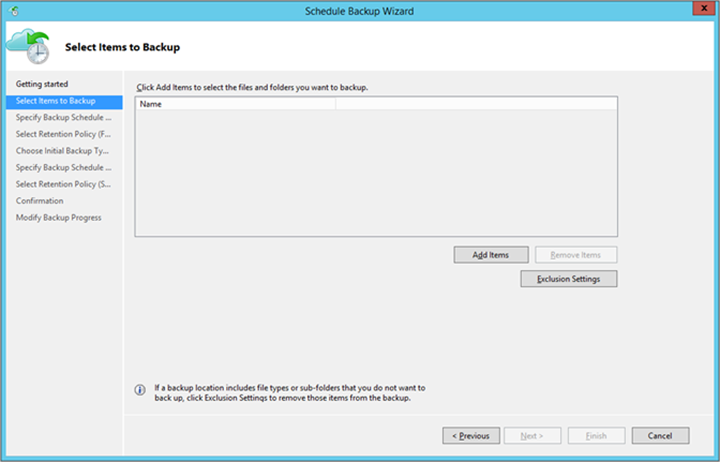
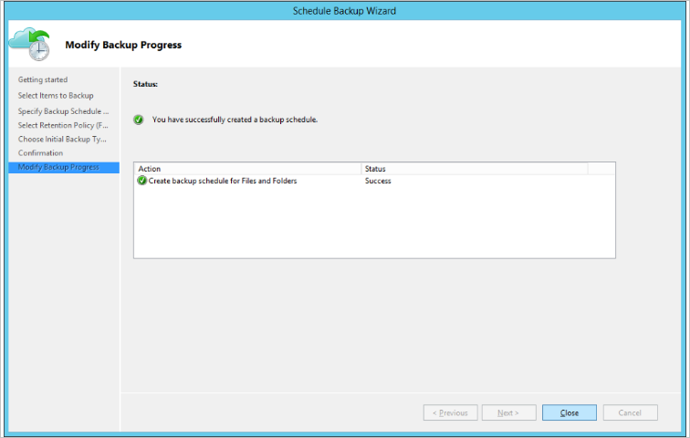

# Back up Windows Server files and folders to Azure

This article describes how to back up Windows machines by using the [Azure Backup](backup-overview.md) service and the Microsoft Azure Recovery Services (MARS) agent. MARS is also known as the Azure Backup agent.

## Before you start

* Learn how [Azure Backup uses the MARS agent to back up Windows machines](backup-architecture.md#architecture-direct-backup-of-on-premises-windows-server-machines-or-azure-vm-files-or-folders).
* Learn about the [backup architecture](backup-architecture.md#architecture-back-up-to-dpmmabs) that runs the MARS agent on a secondary MABS or Data Protection Manager server.
* Review [what's supported and what you can back up](backup-support-matrix-mars-agent.md) by the MARS agent.
* [Verify internet access](install-mars-agent.md#verify-internet-access) on the machines that you want to back up.
* If the MARS agent isn't installed, learn how to install it [here](install-mars-agent.md).

## Create a backup policy

The backup policy specifies when to take snapshots of the data to create recovery points. It also specifies how long to keep recovery points. You use the MARS agent to configure a backup policy.

Azure Backup doesn't automatically take daylight saving time (DST) into account. This default could cause some discrepancy between the actual time and the scheduled backup time.

To create a backup policy, follow these steps:

1. After you download and register the MARS agent, open the agent console. You can find it by searching your machine for **Microsoft Azure Backup**.  

1. Under **Actions**, select **Schedule Backup**.

    

1. In the Schedule Backup Wizard, select  **Getting started** > **Next**.
1. Under **Select Items to Back up**, select **Add Items**.

    

1. In the **Select Items** box, select items to back up, and then select **OK**.

    

1. On the **Select Items to Back Up** page, select **Next**.
1. On the **Specify Backup Schedule** page, specify when to take daily or weekly backups. Then select **Next**.

    * A recovery point is created when a backup is taken.
    * The number of recovery points created in your environment depends on your backup schedule.
    * You can schedule up to three daily backups per day. In the following example, two daily backups occur, one at midnight and one at 6:00 PM.

        

    * You can run weekly backups too. In the following example, backups are taken every alternate Sunday and Wednesday at 9:30 AM and 1:00 AM.

        

1. On the **Select Retention Policy** page, specify how to store historical copies of your data. Then select **Next**.

    * Retention settings specify which recovery points to store and how long to store them.
    * For a daily retention setting, you indicate that at the time specified for the daily retention, the latest recovery point will be retained for the specified number of days. Or you could specify a monthly retention policy to indicate that the recovery point created on the 30th of every month should be stored for 12 months.
    * Retention for daily and weekly recovery points usually coincides with the backup schedule. So when the schedule triggers a backup, the recovery point (that the backup operation creates) is stored for the duration that the daily or weekly retention policy specifies.
    * In the following example:

        * Daily backups at midnight and 6:00 PM are kept for seven days.
        * Backups taken on a Saturday at midnight and 6:00 PM are kept for four weeks.
        * Backups taken on the last Saturday of the month at midnight and 6:00 PM are kept for 12 months.
        * Backups taken on the last Saturday in March are kept for 10 years.

        

1. On the **Choose Initial Backup Type** page, decide if you want to take the initial backup over the network or use offline backup. To take the initial backup over the network, select **Automatically over the network** > **Next**.

    For more information about offline backup, see [Use Azure Data Box for offline backup](offline-backup-azure-data-box.md).

    

1. On the **Confirmation** page, review the information, and then select **Finish**.

    

1. After the wizard finishes creating the backup schedule, select **Close**.

    

Create a policy on each machine where the agent is installed.

### Run the initial backup offline

You can run an initial backup automatically over the network, or you can back up offline. Offline seeding for an initial backup is useful if you've large amounts of data that will require a lot of network bandwidths to transfer.

To do an offline transfer, follow these steps:

1. Write the backup data to a staging location.
1. Use the AzureOfflineBackupDiskPrep tool to copy the data from the staging location to one or more SATA disks.

    The tool creates an Azure Import job. For more information, see [What is the Azure Import/Export service](../import-export/storage-import-export-service.md).
1. Send the SATA disks to an Azure datacenter.

    At the datacenter, the disk data is copied to an Azure storage account. Azure Backup copies the data from the storage account to the vault, and incremental backups are scheduled.

For more information about offline seeding, see [Use Azure Data Box for offline backup](offline-backup-azure-data-box.md).

### Enable network throttling

You can control how the MARS agent uses network bandwidth by enabling network throttling. Throttling is helpful if you need to back up data during work hours but you want to control how much bandwidth the backup and restore activity uses.

Network throttling in Azure Backup uses [Quality of Service (QoS)](/windows-server/networking/technologies/qos/qos-policy-top) on the local operating system.

Network throttling for backups is available on Windows Server 2012 and later, and on Windows 8 and later. Operating systems should be running the latest service packs.

To enable network throttling:

1. In the MARS agent, select **Change Properties**.
1. On the **Throttling** tab, select **Enable internet bandwidth usage throttling for backup operations**.

    
1. Specify the allowed bandwidth during work hours and nonwork hours. Bandwidth values begin at 512 Kbps and go up to 1,023 Mbps. Then select **OK**.

## Run an on-demand backup

To run an on-demand backup, follow these steps:

1. In the MARS agent, select **Back Up Now**.

    

1. If the MARS agent version is *2.0.9269.0 or newer*, select a *subset of the volumes backed up periodically* for on-demand backup. Only the files/folders configured for periodic backup can be backed up on demand.

   :::image type="content" source="./media/backup-configure-vault/select-subset-of-volumes-backed-up-periodically-for-mars-on-demand-backup.png" alt-text="Screenshot shows how to select a subset of volumes backed up periodically for on-demand backup.":::

   If the MARS agent version is *2.0.9169.0 or newer*, set a custom retention date. In the **Retain Backup Till** section, choose a date from the calendar.

   

1. On the **Confirmation** page, review the settings, and select **Back Up**.
1. Select **Close** to close the wizard. If you close the wizard before the backup finishes, the wizard continues to run in the background.

After the initial backup finishes, the **Job completed** status appears in the Backup console.

## Set up on-demand backup policy retention behavior

The following table shows the data retention duration for various backup schedules:

| Backup-schedule option | Duration of data retention
| -- | --
| Day | **Default retention**: Equivalent to the "retention in days for daily backups."    **Exception**: If a daily scheduled backup that's set for long-term retention (weeks, months, or years) fails, an on-demand backup that's triggered right after the failure is considered for long-term retention. Otherwise, the next scheduled backup is considered for long-term retention.   **Example scenario**: The scheduled backup on Thursday at 8:00 AM failed. This backup was to be considered for weekly, monthly, or yearly retention. So the first on-demand backup triggered before the next scheduled backup on Friday at 8:00 AM is automatically tagged for weekly, monthly, or yearly retention. This backup substitute for the Thursday 8:00 AM backup.
| Week | **Default retention**: One day. On-demand backups that are taken for a data source that has a weekly backup policy are deleted the next day. They're deleted even if they're the most recent backups for the data source.    **Exception**: If a weekly scheduled backup that's set for long-term retention (weeks, months, or years) fails, an on-demand backup that's triggered right after the failure is considered for long-term retention. Otherwise, the next scheduled backup is considered for long-term retention.    **Example scenario**: The scheduled backup on Thursday at 8:00 AM failed. This backup was to be considered for monthly or yearly retention. So the first on-demand backup that's triggered before the next scheduled backup on Thursday at 8:00 AM is automatically tagged for monthly or yearly retention. This backup substitute for the Thursday 8:00 AM backup.

For more information, see [Create a backup policy](#create-a-backup-policy).

> [!NOTE]
> This information applies only to MARS agent versions that are older than 2.0.9169.0.

## Next steps

* Learn how to [Restore files in Azure](backup-azure-restore-windows-server.md).
* Find [Common questions about backing up files and folders](backup-azure-file-folder-backup-faq.yml)
