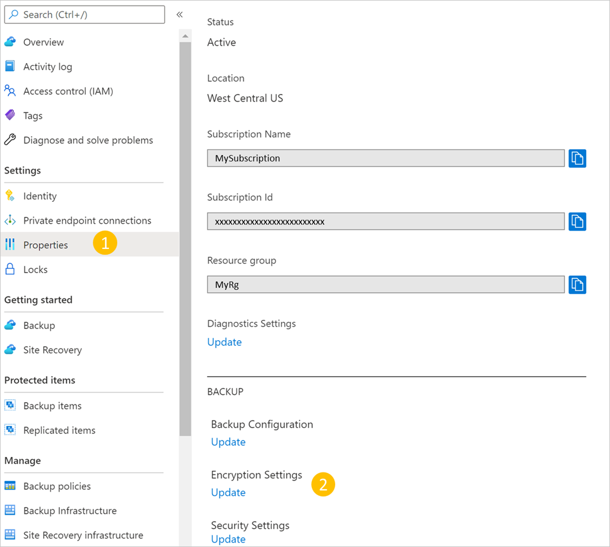
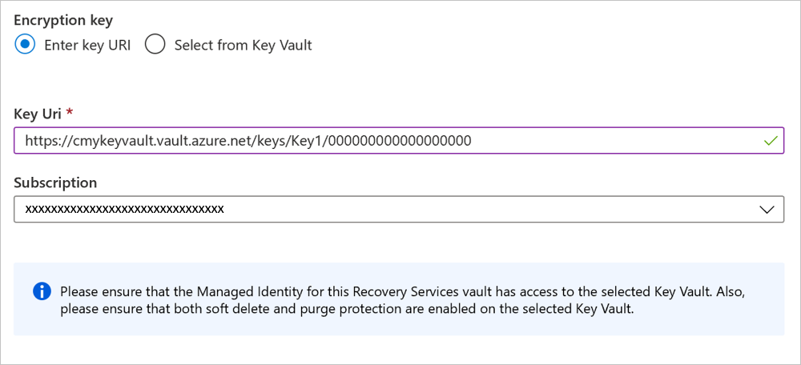
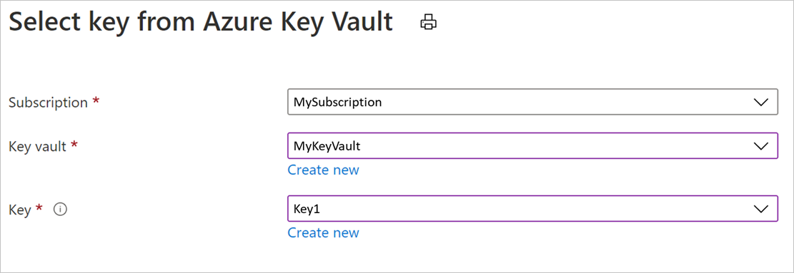
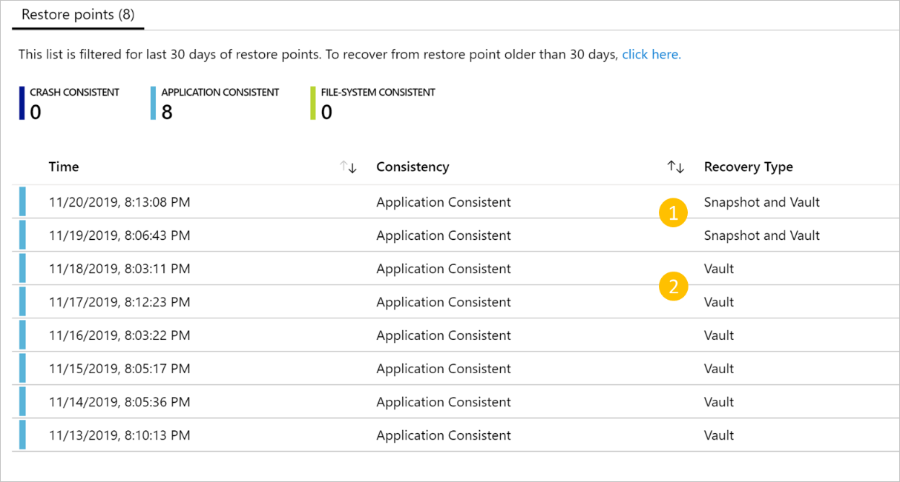
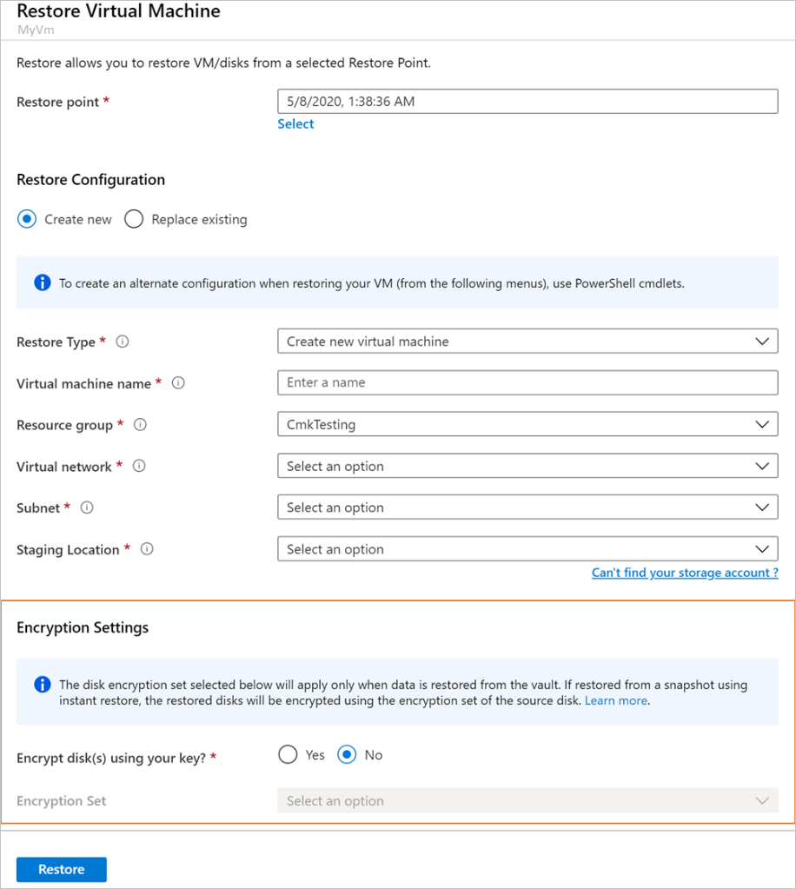
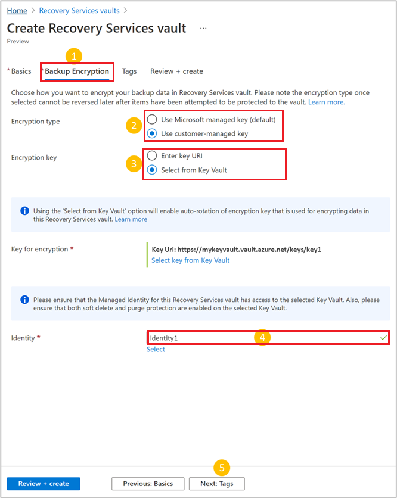

# Encryption of backup data using customer-managed keys

Azure Backup allows you to encrypt your backup data using customer-managed keys (CMK) instead of platform-managed keys, which are enabled by default. Your keys that encrypt the backup data must be stored in [Azure Key Vault](../key-vault/index.yml).

The encryption key used for encrypting backups may be different from the one used for the source. The data is protected using an AES 256-based data encryption key (DEK), which in turn, is protected using your key encryption keys (KEK). This provides you with full control over the data and the keys. To allow encryption, you must grant Recovery Services vault the permissions to access the encryption key in the Azure Key Vault. You can change the key when required.

In this article, you'll learn how to:

> [!div class="checklist"]
>
> - Create a Recovery Services vault
> - Configure the Recovery Services vault to encrypt the backup data using customer-managed keys (CMK)
> - Back up to vaults encrypted using customer-managed keys
> - Restore data from backups

## Before you start

- This feature allows you to encrypt **new Recovery Services vaults only**. Any vaults containing existing items registered or attempted to be registered to it aren't supported.

- After you enable it for a Recovery Services vault, encryption using customer-managed keys can't be reverted to use platform-managed keys (default). You can change the encryption keys as per the requirements.

- This feature currently **doesn't support backup using MARS agent**, and you may not be able to use a CMK-encrypted vault for the same. The MARS agent uses a user passphrase-based encryption. This feature also doesn't support backup of classic VMs.

- This feature isn't related to [Azure Disk Encryption](../virtual-machines/disk-encryption-overview.md), which uses guest-based encryption of a VM's disk using BitLocker (for Windows) and DM-Crypt (for Linux).

- The Recovery Services vault can be encrypted only with keys stored in Azure Key Vault, located in the **same region**. Also, keys must be [supported](../key-vault/keys/about-keys.md#key-types-and-protection-methods) **RSA keys** only and should be in **enabled** state.

- Moving CMK encrypted Recovery Services vault across Resource Groups and Subscriptions isn't currently supported.
- When you move a Recovery Services vault already encrypted with customer-managed keys to a new tenant, you'll need to update the Recovery Services vault to recreate and reconfigure the vault's managed identity and CMK (which should be in the new tenant). If this isn't done, the backup and restore operations will fail. Also, any Azure role-based access control (Azure RBAC) permissions set up within the subscription will need to be reconfigured.

- This feature can be configured through the Azure portal and PowerShell.

  >[!NOTE]
  >Use Az module 5.3.0 or later to use customer managed keys for backups in the Recovery Services vault.
    
  >[!Warning]
  >If you're using PowerShell for managing encryption keys for Backup, we don't recommend to update the keys from the portal.  <br>   If you update the key from the portal, you can't use PowerShell to update the encryption key further till a PowerShell update to support the new model is available. However, you can continue updating the key from the Azure portal.

If you haven't created and configured your Recovery Services vault, see [how to do so here](backup-create-rs-vault.md).

## Configure a vault to encrypt using customer-managed keys

To configure a vault, perform the following actions in the given sequence to achieve the intended results. Each action is discussed in detail in the sections below:

1. Enable managed identity for your Recovery Services vault.

2. Assign permissions to the vault to access the encryption key in Azure Key Vault.

3. Enable soft-delete and purge protection on Azure Key Vault.

4. Assign the encryption key to the Recovery Services vault.

### Enable managed identity for your Recovery Services vault

Azure Backup uses system-assigned managed identities and user-assigned managed identities to authenticate the Recovery Services vault to access encryption keys stored in Azure Key Vault. To enable managed identity for your Recovery Services vault, follow these steps:

>[!NOTE]
>Once enabled, you must **not** disable the managed identity (even temporarily). Disabling the managed identity may lead to inconsistent behavior.

### Enable system-assigned managed identity for the vault

Choose a client:

# [Azure portal](#tab/portal)

1. Go to your Recovery Services vault -> **Identity**.

    

2. Navigate to the **System assigned** tab.

3. Change the **Status** to **On**.

4. Select **Save** to enable the identity for the vault.

An Object ID is generated, which is the system-assigned managed identity of the vault.

>[!NOTE]
>Once enabled, the managed identity must not be disabled (even temporarily). Disabling the managed identity may lead to inconsistent behavior.

# [PowerShell](#tab/powershell)

Use the [Update-AzRecoveryServicesVault](/powershell/module/az.recoveryservices/update-azrecoveryservicesvault) command to enable system-assigned managed identity for the recovery services vault.

Example:

```AzurePowerShell
$vault=Get-AzRecoveryServicesVault -ResourceGroupName "testrg" -Name "testvault"

Update-AzRecoveryServicesVault -IdentityType SystemAssigned -ResourceGroupName TestRG -Name TestVault

$vault.Identity | fl
```

Output:

```output
PrincipalId : xxxxxxxx-xxxx-xxxx-xxxx-xxxxxxxxxxxx
TenantId    : xxxxxxxx-xxxx-xxxx-xxxx-xxxxxxxxxxxx
Type        : SystemAssigned
```

# [CLI](#tab/cli)

Use the [az backup vault identity assign](/cli/azure/backup/vault/identity) command to enable system-assigned managed identity for the Recovery Services vault.

Example:

```Azure CLI
az backup vault identity assign --system-assigned --resource-group MyResourceGroup --name MyVault
```

Output:

```output
PrincipalId : xxxxxxxx-xxxx-xxxx-xxxx-xxxxxxxxxxxx
TenantId    : xxxxxxxx-xxxx-xxxx-xxxx-xxxxxxxxxxxx
Type        : SystemAssigned
```

---

#### Assign user-assigned managed identity to the vault (in preview)

>[!Note]
>- Vaults using user-assigned managed identities for CMK encryption don't support the use of private endpoints for Backup.
>- Azure Key Vaults limiting access to specific networks aren't yet supported for use along with user-assigned managed identities for CMK encryption.

To assign the user-assigned managed identity for your Recovery Services vault, choose a client:

# [Azure portal](#tab/portal)

1. Go to your Recovery Services vault -> **Identity**.

    

2. Navigate to the **User assigned** tab.

3. Select **+Add** to add a user-assigned managed identity.

4. In the **Add user assigned managed identity** blade that opens, select the subscription for your identity.

5. Select the identity from the list. You can also filter by the name of the identity or the resource group.

6. Once done, select **Add** to finish assigning the identity.

# [PowerShell](#tab/powershell)

Use the [Update-AzRecoveryServicesVault](/powershell/module/az.recoveryservices/update-azrecoveryservicesvault) command to enable user-assigned managed identity for the recovery services vault.

Example:

```AzurePowerShell
$vault = Get-AzRecoveryServicesVault -Name "vaultName" -ResourceGroupName "resourceGroupName"
$identity1 = Get-AzUserAssignedIdentity -ResourceGroupName "resourceGroupName" -Name "UserIdentity1"
$identity2 = Get-AzUserAssignedIdentity -ResourceGroupName "resourceGroupName" -Name "UserIdentity2"
$updatedVault = Update-AzRecoveryServicesVault -ResourceGroupName $vault.ResourceGroupName -Name $vault.Name -IdentityType UserAssigned -IdentityId $identity1.Id, $identity2.Id

$updatedVault.Identity | fl
```

Output:

```output
PrincipalId : xxxxxxxx-xxxx-xxxx-xxxx-xxxxxxxxxxxx
TenantId    : xxxxxxxx-xxxx-xxxx-xxxx-xxxxxxxxxxxx
Type        : UserAssigned
UserAssignedIdentities : {[/subscriptions/xxxxxxxx-xxxx-xxxx-xxxx-xxxxxxxxxxxx/resourceGroups/resourceGroupName/providers/Microsoft.ManagedIdentity/userAssignedIdentities/UserIdentity1, Microsoft.Azure.Management.RecoveryServices.Models.UserIdentity],[/subscriptions/xxxxxxxx-xxxx-xxxx-xxxx-xxxxxxxxxxxx/resourceGroups/resourceGroupName/providers/Microsoft.ManagedIdentity/userAssignedIdentities/UserIdentity2,Microsoft.Azure.Management.RecoveryServices.Models.UserIdentity]}
```

# [CLI](#tab/cli)

Use the [az backup vault identity assign](/cli/azure/backup/vault/identity) command to enable system-assigned managed identity for the Recovery Services vault.

Example:

```Azure CLI
az backup vault identity assign --user-assigned MyIdentityId1 --resource-group MyResourceGroup --name MyVault
```

Output:

```output
PrincipalId : xxxxxxxx-xxxx-xxxx-xxxx-xxxxxxxxxxxx
TenantId    : xxxxxxxx-xxxx-xxxx-xxxx-xxxxxxxxxxxx
Type        : UserAssigned
UserAssignedIdentities : {[/subscriptions/xxxxxxxx-xxxx-xxxx-xxxx-xxxxxxxxxxxx/resourceGroups/resourceGroupName/providers/Microsoft.ManagedIdentity/userAssignedIdentities/MyIdentityId1,Microsoft.Azure.Management.RecoveryServices.Models.UserIdentity]}
```

---

### Assign permissions to the Recovery Services vault to access the encryption key in Azure Key Vault

>[!Note]
>If you are using user-assigned identities, the same permissions must be assigned to the user-assigned identity.

You now need to permit the Recovery Services vault to access the Azure Key Vault that contains the encryption key. This is done by allowing the Recovery Services vault's managed identity to access the Key Vault.

Choose a client:

# [Azure portal](#tab/portal)

1. Go to your Azure Key Vault -> **Access Policies**. Continue to **+Add Access Policies**.

    

2. Under **Key Permissions**, select **Get**, **List**, **Unwrap Key**, and **Wrap Key** operations. This specifies the actions on the key that will be permitted.

    

3. Go to **Select Principal** and search for your vault in the search box using its name or managed identity. Once it shows up, select the vault and choose **Select** at the bottom of the pane.

    

4. Once done, select **Add** to add the new access policy.

5. Select **Save** to save changes made to the access policy of the Azure Key Vault.

>[!NOTE] 
>You can also assign an RBAC role to the Recovery Services vault that contains the above mentioned permissions, such as the _[Key Vault Crypto Officer](../key-vault/general/rbac-guide.md#azure-built-in-roles-for-key-vault-data-plane-operations)_ role.<br><br>These roles may contain additional permissions other than the ones discussed above.

# [PowerShell](#tab/powershell)

Use the [Get-AzADServicePrincipal](/powershell/module/az.resources/get-azadserviceprincipal) command to get the principal ID of the Recovery Services vault, and then use this ID in the [Get-AzADServicePrincipal](/powershell/module/az.keyvault/set-azkeyvaultaccesspolicy) command to set an access policy for the Key vault.

Example:

```AzurePowerShell
$sp = Get-AzADServicePrincipal -DisplayName MyVault
$Set-AzKeyVaultAccessPolicy -VaultName myKeyVault -ObjectId $sp.Id -PermissionsToKeys get,list,unwrapkey,wrapkey

```

# [CLI](#tab/cli)

Use the [az ad sp list](/cli/azure/ad/sp#az-ad-sp-list) command to get the principal ID of the Recovery Services vault, and then use this ID in the [az keyvault set-policy](/cli/azure/keyvault#az-keyvault-set-policy) command to set an access policy for the Key vault.

Example:

```Azure CLI
az ad sp list --display-name MyVault
az keyvault set-policy --name myKeyVault --object-id <object-id> --key-permissions get,list,unwrapkey,wrapkey

```

---

### Enable soft-delete and purge protection on Azure Key Vault

You need to **enable soft delete and purge protection** on your Azure Key Vault that stores your encryption key.

To enable soft-delete and purge protection, choose a client:

# [Azure portal](#tab/portal)

You can do this from the Azure Key Vault UI as shown below. Alternatively, you can set these properties while creating the Key Vault. Learn more about these [Key Vault properties](../key-vault/general/soft-delete-overview.md).


# [PowerShell](#tab/powershell)

1. Sign in to your Azure Account.

    ```azurepowershell
    Login-AzAccount
    ```

2. Select the subscription that contains your vault.

    ```azurepowershell
    Set-AzContext -SubscriptionId SubscriptionId
    ```

3. Enable soft delete.

    ```azurepowershell
    ($resource = Get-AzResource -ResourceId (Get-AzKeyVault -VaultName "AzureKeyVaultName").ResourceId).Properties | Add-Member -MemberType "NoteProperty" -Name "enableSoftDelete" -Value "true"
    ```

    ```azurepowershell
    Set-AzResource -resourceid $resource.ResourceId -Properties $resource.Properties
    ```

4. Enable purge protection.

    ```azurepowershell
    ($resource = Get-AzResource -ResourceId (Get-AzKeyVault -VaultName "AzureKeyVaultName").ResourceId).Properties | Add-Member -MemberType "NoteProperty" -Name "enablePurgeProtection" -Value "true"
    ```

    ```azurepowershell
    Set-AzResource -resourceid $resource.ResourceId -Properties $resource.Properties
    ```

# [CLI](#tab/cli)

1. Sign in to your Azure Account.

    ```azurecli
    az login
    ```

2. Select the subscription that contains your vault.

    ```azurecli
    az account set --subscription "Subscription1"
    ```

3. Enable soft delete.

    ```azurecli
    az keyvault update --subscription {SUBSCRIPTION ID} -g {RESOURCE GROUP} -n {VAULT NAME} --enable-soft-delete true
    ```

4. Enable purge protection.

    ```azurecli
    az keyvault update --subscription {SUBSCRIPTION ID} -g {RESOURCE GROUP} -n {VAULT NAME} --enable-purge-protection true

    ```
---

### Assign encryption key to the Recovery Services vault

>[!NOTE]
>Before proceeding further, ensure the following:
>
>- All the steps mentioned above have been completed successfully:
>   - The Recovery Services vault's managed identity has been enabled and has been assigned the required permissions.
>   - The Azure Key Vault has soft-delete and purge-protection enabled.
>- The Recovery Services vault for which you want to enable CMK encryption **does not** have any items protected or registered to it.

Once the above are ensured, continue with selecting the encryption key for your vault.

To assign the key and follow the steps, choose a client:

# [Azure portal](#tab/portal)

1. Go to your Recovery Services vault -> **Properties**.

    

2. Select **Update** under **Encryption Settings**.

3. In the Encryption Settings pane, select **Use your own key** and continue to specify the key using one of the following ways. 
 
   *Ensure that you use an RSA key, which is in enabled state.*

    1. Enter the **Key URI** with which you want to encrypt the data in this Recovery Services vault. You  also need to specify the subscription in which the Azure Key Vault (that contains this key) is present. This key URI can be obtained from the corresponding key in your Azure Key Vault. Ensure the key URI is copied correctly. It's recommended that you use the **Copy to clipboard** button provided with the key identifier.

        >[!NOTE]
        >When specifying the encryption key using the full Key URI, the key will not be autorotated, and you need to perform key updates manually by specifying the new key when required. Alternatively, remove the Version component of the Key URI to get automatic rotation.

        

    2. Browse and select the key from the Key Vault in the key picker pane.

        >[!NOTE]
        >When specifying the encryption key using the key picker pane, the key will be autorotated whenever a new version for the key is enabled. [Learn more](#enable-autorotation-of-encryption-keys) on enabling autorotation of encryption keys.

        

4. Select **Save**.

5. **Tracking progress and status of encryption key update**: You can track the progress and status of the encryption key assignment using the **Backup Jobs** view on the left navigation bar. The status should soon change to **Completed**. Your vault will now encrypt all the data with the specified key as KEK.

    

    The encryption key updates are also logged in the vault's Activity Log.

    


# [PowerShell](#tab/powershell)

Use the [Set-AzRecoveryServicesVaultProperty](/powershell/module/az.recoveryservices/set-azrecoveryservicesvaultproperty) command to enable encryption using customer-managed keys, and to assign or update the encryption key to be used.

Example:

```azurepowershell
$keyVault = Get-AzKeyVault -VaultName "testkeyvault" -ResourceGroupName "testrg" 
$key = Get-AzKeyVaultKey -VaultName $keyVault -Name "testkey" 
Set-AzRecoveryServicesVaultProperty -EncryptionKeyId $key.ID -KeyVaultSubscriptionId "xxxx-yyyy-zzzz"  -VaultId $vault.ID


$enc=Get-AzRecoveryServicesVaultProperty -VaultId $vault.ID
$enc.encryptionProperties | fl
```

Output:

```output
EncryptionAtRestType          : CustomerManaged
KeyUri                        : testkey
SubscriptionId                : xxxxxxxx-xxxx-xxxx-xxxx-xxxxxxxxxxxx 
LastUpdateStatus              : Succeeded
InfrastructureEncryptionState : Disabled
```

# [CLI](#tab/cli)

Use the [az backup vault encryption update](/cli/azure/backup/vault/encryption#az-backup-vault-encryption-update) command to enable encryption using customer-managed keys and to assign or update the encryption key to be used.

Example:

```azurecli
az backup vault encryption update --encryption-key-id MyEncryptionKeyId --mi-system-assigned --resource-group MyResourceGroup --name MyVault
```

Output:

```output
EncryptionAtRestType          : CustomerManaged
KeyUri                        : testkey
SubscriptionId                : xxxxxxxx-xxxx-xxxx-xxxx-xxxxxxxxxxxx 
LastUpdateStatus              : Succeeded
InfrastructureEncryptionState : Disabled
```

>[!NOTE]
>This process remains the same when you wish to update or change the encryption key. If you wish to update and use a key from another Key Vault (different from the one that's being currently used), ensure that:
>
>- The key vault is located in the same region as the Recovery Services vault.
>
>- The key vault has soft-delete and purge protection enabled.
>
>- The Recovery Services vault has the required permissions to access the key Vault.

---

## Back up to a vault encrypted with customer-managed keys

Before proceeding to configure protection, we strongly recommend you adhere to the following checklist. This is important since once an item has been configured to be backed up (or attempted to be configured) to a non-CMK encrypted vault, encryption using customer-managed keys can't be enabled on it and it will continue to use platform-managed keys.

>[!IMPORTANT]
> Before proceeding to configure protection, you must have **successfully** completed the following steps:
>
>1. Created your Recovery Services vault
>2. Enabled the Recovery Services vault's system-assigned managed identity or assigned a user-assigned managed identity to the vault
>3. Assigned permissions to your Recovery Services vault (or the user-assigned managed identity) to access encryption keys from your Key Vault
>4. Enabled soft delete and purge protection for your Key Vault
>5. Assigned a valid encryption key for your Recovery Services vault
>
>If all the above steps have been confirmed, only then proceed with configuring backup.

The process to configure and perform backups to a Recovery Services vault encrypted with customer-managed keys is the same as to a vault that uses platform-managed keys with **no changes to the experience**. This holds true for [backup of Azure VMs](./quick-backup-vm-portal.md) as well as backup of workloads running inside a VM (for example, [SAP HANA](./tutorial-backup-sap-hana-db.md), [SQL Server](./tutorial-sql-backup.md) databases).

## Restore data from backup

### VM backup

Data stored in the Recovery Services vault can be restored according to the steps described [here](./backup-azure-arm-restore-vms.md). When restoring from a Recovery Services vault encrypted using customer-managed keys, you can choose to encrypt the restored data with a Disk Encryption Set (DES).

>[!Note]
>The experience described in this section only applies when you restore data from CMK encrypted vaults. When you restore data from a vault that isn't using CMK encryption, the restored data would be encrypted using Platform Managed Keys. If you restore from an instant recovery snapshot, it would be encrypted using the mechanism used for encrypting the source disk.

#### Restore VM/disk

1. When you recover disk/VM from a *Snapshot* recovery point, the restored data will be encrypted with the DES used for encrypting the source VM's disks.

1. When restoring disk/VM from a recovery point with Recovery Type as **Vault**, you can choose to have the restored data encrypted using a DES specified at the time of restore. Alternatively, you can choose to continue with the restore the data without specifying a DES, in which case the encryption setting on the VM will be applied.

1. During Cross Region Restore, CMK (customer-managed keys) enabled Azure VMs, which aren't backed up in a CMK enabled Recovery Services vault, are restored as non-CMK enabled VMs in the secondary region.

You can encrypt the restored disk/VM after the restore is complete, regardless of the selection made while initiating the restore.



#### Select a Disk Encryption Set while restoring from Vault Recovery Point

Choose a client:

# [Azure portal](#tab/portal)

To specify the Disk Encryption Set under Encryption Settings in the restore pane, follow these steps:

1. In the **Encrypt disk(s) using your key**, select **Yes**.

2. From the dropdown, select the DES you wish to use for the restored disk(s). **Ensure you have access to the DES.**

>[!NOTE]
>The ability to choose a `DES` while restore is now supported if you're doing Cross Region Restore. However, it's currently not suppported if you're restoring a VM that uses Azure Disk Encryption.



# [PowerShell](#tab/powershell)

Use the [Get-AzRecoveryServicesBackupItem](/powershell/module/az.recoveryservices/get-azrecoveryservicesbackupitem) command with the parameter [`-DiskEncryptionSetId <string>`] to [specify the DES](/powershell/module/az.compute/get-azdiskencryptionset) to be used for encrypting the restored disk. For more information about restoring disks from VM backup, see [this article](./backup-azure-vms-automation.md#restore-an-azure-vm).

Example:

```azurepowershell
$namedContainer = Get-AzRecoveryServicesBackupContainer  -ContainerType "AzureVM" -Status "Registered" -FriendlyName "V2VM" -VaultId $vault.ID
$backupitem = Get-AzRecoveryServicesBackupItem -Container $namedContainer  -WorkloadType "AzureVM" -VaultId $vault.ID
$startDate = (Get-Date).AddDays(-7)
$endDate = Get-Date
$rp = Get-AzRecoveryServicesBackupRecoveryPoint -Item $backupitem -StartDate $startdate.ToUniversalTime() -EndDate $enddate.ToUniversalTime() -VaultId $vault.ID
$restorejob = Restore-AzRecoveryServicesBackupItem -RecoveryPoint $rp[0] -StorageAccountName "DestAccount" -StorageAccountResourceGroupName "DestRG" -TargetResourceGroupName "DestRGforManagedDisks" -DiskEncryptionSetId "testdes1" -VaultId $vault.ID
```

# [CLI](#tab/cli)

Use the [az backup restore restore-disks](/cli/azure/backup/restore#az-backup-restore-restore-disks) command with the parameter [`-DiskEncryptionSetId <string>`] to [specify the DES](/cli/azure/disk-encryption-set) to be used for encrypting the restored disk.

Example:

```azurecli
az backup recoverypoint list --container-name MyContainer --item-name MyItem --resource-group MyResourceGroup --vault-name MyVault
az backup restore restore-disks --container-name MyContainer --disk-encryption-set-id testdes1 --item-name MyItem --resource-group MyResourceGroup --rp-name MyRp --storage-account mystorageaccount --vault-name MyVault
```

---

#### Restore files

When you perform a file restore, the restored data will be encrypted with the key used for encrypting the target location.

### Restore SAP HANA/SQL databases in Azure VMs

When you restore from a backed-up SAP HANA/SQL database running in an Azure VM, the restored data will be encrypted using the encryption key used at the target storage location. It may be a customer-managed key or a platform-managed key used for encrypting the disks of the VM.

## Additional topics

### Enable encryption using customer-managed keys at vault creation (in preview)

>[!NOTE]
>Enabling encryption at vault creation using customer managed keys is in limited public preview and requires allow-listing of subscriptions. To sign up for the preview, fill the [form](https://forms.office.com/Pages/ResponsePage.aspx?id=v4j5cvGGr0GRqy180BHbR0H3_nezt2RNkpBCUTbWEapURDNTVVhGOUxXSVBZMEwxUU5FNDkyQkU4Ny4u) and write to us at [AskAzureBackupTeam@microsoft.com](mailto:AskAzureBackupTeam@microsoft.com).

When your subscription is allow-listed, the **Backup Encryption** tab will display. This allows you to enable encryption on the backup using customer-managed keys during the creation of a new Recovery Services vault. To enable the encryption, perform the following steps:

1. Next to the **Basics** tab, on the **Backup Encryption** tab, specify the encryption key and the identity to use for encryption.

   


   >[!NOTE]
   >The settings apply to Backup only and are optional.

1. Select **Use customer-managed key** as the Encryption type.

1. To specify the key to be used for encryption, select the appropriate option.

   You can provide the URI for the encryption key, or browse and select the key. When you specify the key using the **Select the Key Vault** option, autorotation of the encryption key will enable automatically. [Learn more on autorotation](#enable-autorotation-of-encryption-keys). 

1. Specify the user assigned managed identity to manage encryption with customer-managed keys. Click **Select** to browse and select the required identity.

1. Proceed to add Tags (optional) and continue creating the vault.

### Enable autorotation of encryption keys

When you specify the customer-managed key that must be used to encrypt backups, use the following methods to specify it:

- Enter the key URI
- Select from Key Vault

Using the **Select from Key Vault** option helps to enable autorotation for the selected key. This eliminates the manual effort to update to the next version. However, using this option:
- Key version update may take up to an hour to take effect.
- When a new version of the key takes effect, the old version should also be available (in enabled state) for at least one subsequent backup job after the key update has taken effect.

> [!NOTE]
> When specifying the encryption key using the full Key URI, the key won't be auto rotated, and you need to perform key updates manually by specifying the new key when required. To enable automatic rotation, remove the Version component of the Key URI.

### Use Azure Policies to audit and enforce encryption with customer-managed keys (in preview)

Azure Backup allows you to use Azure Polices to audit and enforce encryption, using customer-managed keys, of data in the Recovery Services vault. Using the Azure Policies:

- The audit policy can be used for auditing vaults with encryption using customer-managed keys that are enabled after 04/01/2021. For vaults with the CMK encryption enabled before this date, the policy may fail to apply or may show false negative results (that is, these vaults may be reported as noncompliant despite having **CMK encryption** enabled).
- To use the audit policy for auditing vaults with **CMK encryption** enabled before 04/01/2021, use the Azure portal to update an encryption key. This helps to upgrade to the new model. If you don't want to change the encryption key, provide the same key again through the key URI or the key selection option. 

   >[!Warning]
    >If you're using PowerShell for managing encryption keys for Backup, we do not recommend to update the keys from the portal.<br>If you update the key from the portal, you can't use PowerShell to update the encryption key further, till a PowerShell update to support the new model is available. However, you can continue updating the key from the Azure portal.

## Frequently asked questions

### Can I encrypt an existing Backup vault with customer-managed keys?

No, CMK encryption can be enabled for new vaults only. So, the vault must never have had any items protected to it. In fact, no attempts to protect any items to the vault must be made before enabling encryption using customer-managed keys.

### I tried to protect an item to my vault, but it failed, and the vault still doesn't contain any items protected to it. Can I enable CMK encryption for this vault?

No, the vault must not have had any attempts to protect any items to it in the past.

### I have a vault that's using CMK encryption. Can I later revert to encryption using platform-managed keys even if I have backup items protected to the vault?

No, once you've enabled CMK encryption, it can't be reverted to use platform-managed keys. You can change the keys used according to your requirements.

### Does CMK encryption for Azure Backup also apply to Azure Site Recovery?

No, this article discusses encryption of Backup data only. For Azure Site Recovery, you need to set the property separately as available from the service.

### I missed one of the steps in this article and went on to protect my data source. Can I still use CMK encryption?

Not following the steps in the article and continuing to protect items may lead to the vault being unable to use encryption using customer-managed keys. It's therefore recommended you refer to [this checklist](#back-up-to-a-vault-encrypted-with-customer-managed-keys) before proceeding to protect items.

### Does using CMK-encryption add to the cost of my backups?

Using CMK encryption for Backup doesn't incur any additional costs to you. You may, however, continue to incur costs for using your Azure Key Vault where your key is stored.

## Next steps

[Overview of security features in Azure Backup](security-overview.md).
