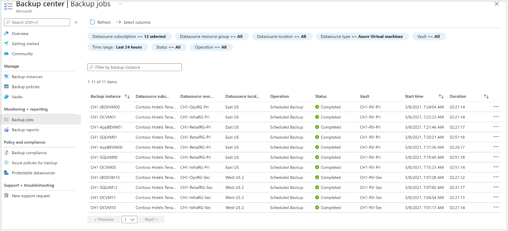
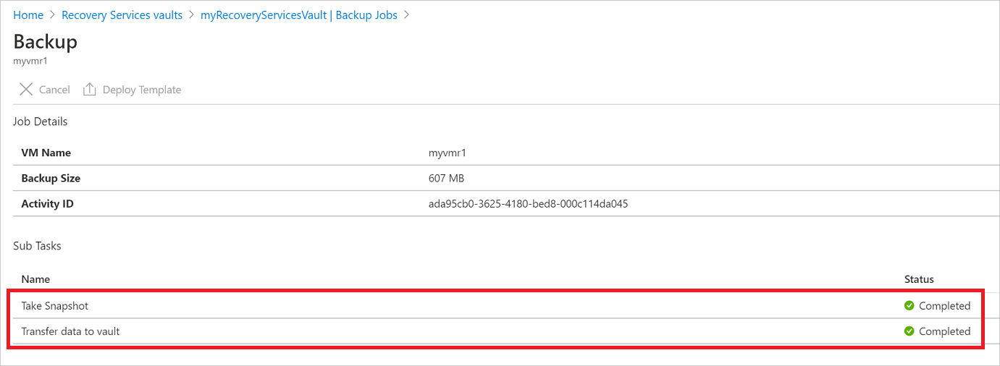
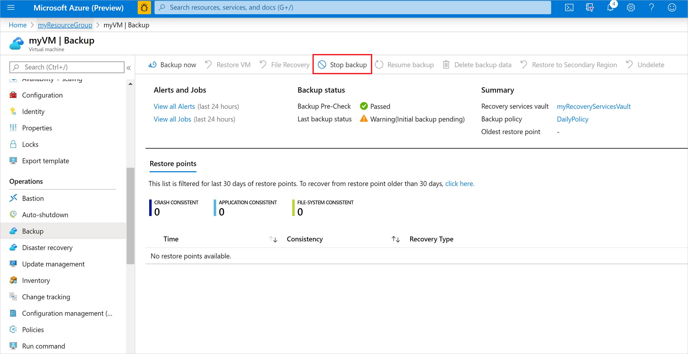

# Quickstart: Back up a virtual machine in Azure

This quickstart described how to enable backup on an existing Azure VM by using Azure portal. If you need to create a VM, you can [create a VM with the Azure portal](../virtual-machines/windows/quick-create-portal.md).

Azure backups can be created through the Azure portal. This method provides a browser-based user interface to create and configure Azure backups and all related resources. You can protect your data by taking backups at regular intervals. Azure Backup creates recovery points that can be stored in geo-redundant recovery vaults. This article details how to back up a virtual machine (VM) with the Azure portal.

## Sign in to Azure

Sign in to the [Azure portal](https://portal.azure.com).

[!INCLUDE [backup-center.md](../../includes/backup-center.md)]

[!INCLUDE [How to create a Recovery Services vault](../../includes/backup-create-rs-vault.md)]

## Apply a backup policy

To apply a backup policy to your Azure VMs, follow these steps:

1. Go to **Backup center** and select **+Backup** from the **Overview** tab.

   

1. On the **Start: Configure Backup** blade, select **Azure Virtual machines** as the **Datasource type** and select the vault you have created. Then select **Continue**.

   

1. Assign a Backup policy.

   - The default policy backs up the VM once a day. The daily backups are retained for _30 days_. Instant recovery snapshots are retained for two days.

      

   - If you don't want to use the default policy, select **Create New**, and create a custom policy as described in the next procedure.

> [!Note]
> With Enhanced policy, you can now back up Azure VMs multiple times a day that helps to perform hourly backups. [Learn more](backup-azure-vms-enhanced-policy.md).

## Select a VM to back up

Create a simple scheduled daily backup to a Recovery Services vault.

1. Under **Virtual Machines**, select **Add**.

      

1. The **Select virtual machines** blade will open. Select the VMs you want to back up using the policy. Then select **OK**.

   * The selected VMs are validated.
   * You can only select VMs in the same region as the vault.
   * VMs can only be backed up in a single vault.

     

    >[!NOTE]
    > All the VMs in the same region and subscription as that of the vault are available to configure backup. When configuring backup, you can browse to the virtual machine name and its resource group, even though you don’t have the required permission on those VMs. If your VM is in soft deleted state, then it won't be visible in this list. If you need to re-protect the VM, then you need to wait for the soft delete period to expire or undelete the VM from the soft deleted list. For more information, see [the soft delete for VMs article](soft-delete-virtual-machines.md#soft-delete-for-vms-using-azure-portal).

## Enable backup on a VM

A Recovery Services vault is a logical container that stores the backup data for each protected resource, such as Azure VMs. When the backup job for a protected resource runs, it creates a recovery point inside the Recovery Services vault. You can then use one of these recovery points to restore data to a given point in time.

To enable VM backup, in **Backup**, select **Enable backup**. This deploys the policy to the vault and to the VMs, and installs the backup extension on the VM agent running on the Azure VM.

After enabling backup:

- The Backup service installs the backup extension whether or not the VM is running.
- An initial backup will run in accordance with your backup schedule.
- When backups run, note that:
  - A VM that's running has the greatest chance for capturing an application-consistent recovery point.
  - However, even if the VM is turned off, it's backed up. Such a VM is known as an offline VM. In this case, the recovery point will be crash-consistent.
- Explicit outbound connectivity isn't required to allow backup of Azure VMs.

### Create a custom policy

If you selected to create a new backup policy, fill in the policy settings.

1. In **Policy name**, specify a meaningful name.
2. In **Backup schedule**, specify when backups should be taken. You can take daily or weekly backups for Azure VMs.
3. In **Instant Restore**, specify how long you want to retain snapshots locally for instant restore.
    * When you restore, backed up VM disks are copied from storage, across the network to the recovery storage location. With instant restore, you can leverage locally stored snapshots taken during a backup job, without waiting for backup data to be transferred to the vault.
    * You can retain snapshots for instant restore for between one to five days. The default value is two days.
4. In **Retention range**, specify how long you want to keep your daily or weekly backup points.
5. In **Retention of monthly backup point** and **Retention of yearly backup point**, specify whether you want to keep a monthly or yearly backup of your daily or weekly backups.
6. Select **OK** to save the policy.
    > [!NOTE]
    > To store the restore point collection (RPC), the Backup service creates a separate resource group (RG). This RG is different than RG of the VM. [Learn more](backup-during-vm-creation.md#azure-backup-resource-group-for-virtual-machines).

    

> [!NOTE]
   > Azure Backup doesn't support automatic clock adjustment for daylight-saving changes for Azure VM backups. As time changes occur, modify backup policies manually as required.

## Start a backup job

The initial backup will run in accordance with the schedule, but you can run it immediately as follows:

1. Go to **Backup center** and select the **Backup Instances** menu item.
1. Select **Azure Virtual machines** as the **Datasource type**. Then search for the VM that you have configured for backup.
1. Right-click the relevant row or select the more icon (…), and then select **Backup Now**.
1. In **Backup Now**, use the calendar control to select the last day that the recovery point should be retained. Then select **OK**.
1. Monitor the portal notifications.
   To  monitor the job progress, go to **Backup center** > **Backup Jobs** and filter the list for **In progress** jobs.
   Depending on the size of your VM, creating the initial backup may take a while.

## Monitor the backup job

The Backup job details for each VM backup consist of two phases, the **Snapshot** phase followed by the **Transfer data to vault** phase.

The snapshot phase guarantees the availability of a recovery point stored along with the disks for **Instant Restores** and are available for a maximum of five days depending on the snapshot retention configured by the user. Transfer data to vault creates a recovery point in the vault for long-term retention. Transfer data to vault only starts after the snapshot phase is completed.

  

There are two **Sub Tasks** running at the backend, one for front-end backup job that can be checked from the **Backup Job** details blade as given below:

  

The **Transfer data to vault** phase can take multiple days to complete depending on the size of the disks, churn per disk and several other factors.

Job status can vary depending on the following scenarios:

**Snapshot** | **Transfer data to vault** | **Job Status**
--- | --- | ---
Completed | In progress | In progress
Completed | Skipped | Completed
Completed | Completed | Completed
Completed | Failed | Completed with warning
Failed | Failed | Failed

Now with this capability, for the same VM, two backups can run in parallel, but in either phase (snapshot, transfer data to vault) only one sub task can be running. So in scenarios where a backup job in progress resulted in the next day’s backup to fail, it will be avoided with this decoupling functionality. Subsequent days' backups can have the snapshot completed, while **Transfer data to vault** is skipped if an earlier day’s backup job is in progress state.
The incremental recovery point created in the vault will capture all the churn from the most recent recovery point created in the vault. There's no cost impact on the user.

## Optional steps

### Install the VM agent

Azure Backup backs up Azure VMs by installing an extension to the Azure VM agent running on the machine. If your VM was created from an Azure Marketplace image, the agent is installed and running. If you create a custom VM, or you migrate an on-premises machine, you might need to install the agent manually, as summarized in the table.

**VM** | **Details**
--- | ---
**Windows** | 1. [Download and install](https://go.microsoft.com/fwlink/?LinkID=394789&clcid=0x409) the agent MSI file.    2. Install with admin permissions on the machine.    3. Verify the installation. In *C:\WindowsAzure\Packages* on the VM, right-click **WaAppAgent.exe** > **Properties**. On the **Details** tab, **Product Version** should be 2.6.1198.718 or higher.     If you're updating the agent, make sure that no backup operations are running, and [reinstall the agent](https://go.microsoft.com/fwlink/?LinkID=394789&clcid=0x409).
**Linux** | Install by using an RPM or a DEB package from your distribution's package repository. This is the preferred method for installing and upgrading the Azure Linux agent. All the [endorsed distribution providers](../virtual-machines/linux/endorsed-distros.md) integrate the Azure Linux agent package into their images and repositories. The agent is available on [GitHub](https://github.com/Azure/WALinuxAgent), but we don't recommend installing from there.     If you're updating the agent, make sure no backup operations are running, and update the binaries.</li><ul>

## Clean up deployment

When no longer needed, you can disable protection on the VM, remove the restore points and Recovery Services vault, then delete the resource group and associated VM resources

If you're going to continue on to a Backup tutorial that explains how to restore data for your VM, skip the steps in this section and go to [Next steps](#next-steps).

1. Select the **Backup** option for your VM.

2. Choose **Stop backup**.

    

3. Select **Delete Backup Data** from the drop-down menu.

4. In the **Type the name of the Backup item** dialog, enter your VM name, such as *myVM*. Select **Stop Backup**.

    Once the VM backup has been stopped and recovery points removed, you can delete the resource group. If you used an existing VM, you may want to leave the resource group and VM in place.

5. In the menu on the left, select **Resource groups**.
6. From the list, choose your resource group. If you used the sample VM quickstart commands, the resource group is named *myResourceGroup*.
7. Select **Delete resource group**. To confirm, enter the resource group name, then select **Delete**.

    

## Next steps

In this quickstart, you created a Recovery Services vault, enabled protection on a VM, and created the initial recovery point. To learn more about Azure Backup and Recovery Services, continue to the tutorials.

> [!div class="nextstepaction"]
> [Back up multiple Azure VMs](./tutorial-backup-vm-at-scale.md)
