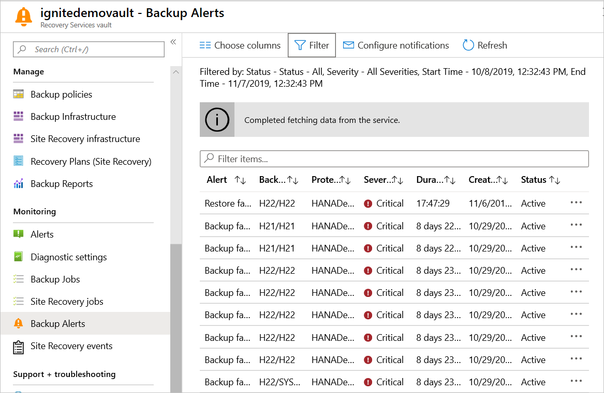
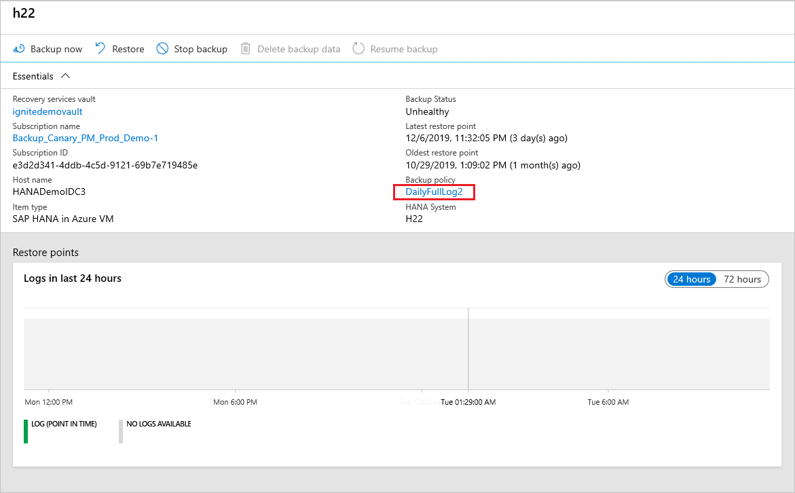
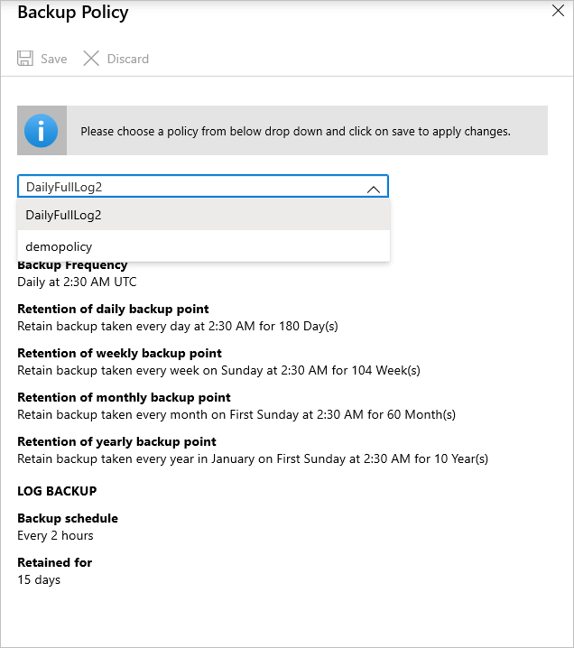
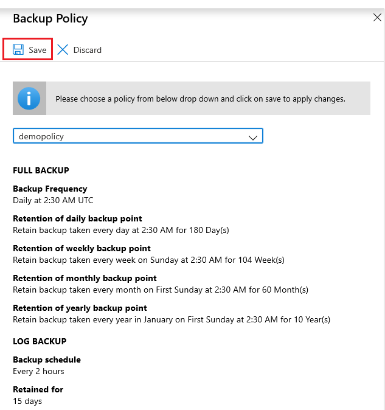
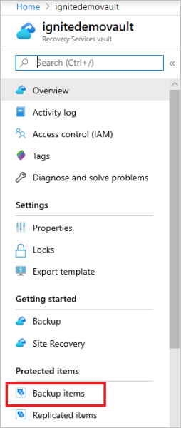
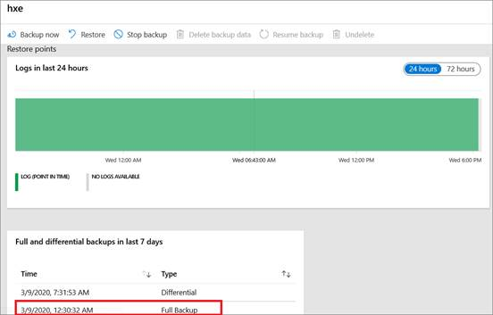

# Manage and monitor backed up SAP HANA databases

This article describes common tasks for managing and monitoring SAP HANA databases that are running on an Azure virtual machine (VM) and backed up to an Azure Backup Recovery Services vault by the [Azure Backup](./backup-overview.md) service. 

You'll learn how to monitor jobs and alerts, trigger an on-demand backup, edit policies, stop and resume database protection, and unregister a VM from backups.

>[!Note]
>Support for HANA instance snapshots and support for HANA System Replication mode are in preview.

If you haven't configured backups yet for your SAP HANA databases, see [Back up SAP HANA databases on Azure VMs](./backup-azure-sap-hana-database.md). To earn more about the supported configurations and scenarios, see [Support matrix for backup of SAP HANA databases on Azure VMs](sap-hana-backup-support-matrix.md).

## Monitor manual backup jobs

Azure Backup shows all manually triggered jobs in the **Backup jobs** section of **Backup center**.

:::image type="content" source="./media/sap-hana-db-manage/backup-center-jobs-list-inline.png" alt-text="Screenshot that shows the 'Backup jobs' section of 'Backup center'." lightbox="./media/sap-hana-db-manage/backup-center-jobs-list-expanded.png":::

The jobs that are displayed in the Azure portal include database discovery and registering, and backup and restore operations. Scheduled jobs, including log backups, aren't shown in this section. Manually triggered backups from the SAP HANA native clients (Studio, Cockpit, and DBA Cockpit) also aren't shown here.

:::image type="content" source="./media/sap-hana-db-manage/hana-view-jobs-inline.png" alt-text="Screenshot that shows the 'Backup jobs' list." lightbox="./media/sap-hana-db-manage/hana-view-jobs-expanded.png":::

To learn more about monitoring, go to [Monitor Azure Backup workloads in the Azure portal](./backup-azure-monitoring-built-in-monitor.md) and [Monitor at scale by using Azure Monitor](./backup-azure-monitoring-use-azuremonitor.md).

## Monitor backup alerts

Alerts are an easy means of monitoring backups of SAP HANA databases. Alerts help you focus on the events you care about the most without getting lost in the multitude of events that a backup generates. 

Azure Backup lets you set alerts, which you can monitor by doing the following:

1. Sign in to the [Azure portal](https://portal.azure.com/).

1. On the left pane of the Recovery Services vault, select **Backup Alerts**.

   

   The **Backup Alerts** pane opens.

   

1. To view alert details, select the alert:

   

With Azure Backup, you can send alerts by email. These alerts are:

* Triggered for all backup failures.
* Consolidated at the database level by error code.
* Sent only for a database's first backup failure.

## Manage operations using the Azure portal

This section describes several Azure Backup supported  management operations that make it easy to manage a backed-up SAP HANA database.

### Change a policy

You can change the underlying policy for an SAP HANA backup item.

> [!Note]
> For HANA snapshots, the new HANA instance policy can have a different resource group or another user-assigned managed identity. Currently, the Azure portal performs all validations during the backup configuration. So, you must assign the required roles on the new snapshot resource group or the new user-assigned identity by using the [CLI scripts](https://github.com/Azure/Azure-Workload-Backup-Troubleshooting-Scripts/tree/main/SnapshotPreReqCLIScripts).

On the **Backup center** dashboard, go to **Backup Instances**, and then do the following:

1. Choose **SAP HANA in Azure VM** as the datasource type.

   :::image type="content" source="./media/sap-hana-db-manage/hana-backup-instances-inline.png" alt-text="Screenshot that shows where to choose 'SAP HANA in Azure VM'." lightbox="./media/sap-hana-db-manage/hana-backup-instances-expanded.png":::

1. Choose the backup item whose underlying policy you want to change.

1. Select the existing Azure Backup policy.

   

1. On the **Backup Policy** pane, change the policy by selecting it in the dropdown list. If necessary, [Create a new backup policy](./backup-azure-sap-hana-database.md#create-a-backup-policy).

   

1. Select **Save**.

   

Making policy modifications affects all the associated backup items and triggers corresponding *configure protection* jobs.

### Edit a policy

To modify the policy to change backup types, frequencies, and retention range, follow these steps:

>[!NOTE]
> * Any change in the retention period will be applied to both the new recovery points and, retroactively, to all older recovery points.
>
> * For HANA snapshots, you can edit the HANA instance policy to have a different resource group or another user-assigned managed identity. Currently, the Azure portal performs all validations during the backup configuration only. So, you must assign the required roles on the new snapshot resource group or the new user-assigned identity by using the [CLI scripts](https://github.com/Azure/Azure-Workload-Backup-Troubleshooting-Scripts/tree/main/SnapshotPreReqCLIScripts).

1. On the **Backup center** dashboard, go to **Backup Policies**, and then select the policy you want to edit.

   :::image type="content" source="./media/sap-hana-db-manage/backup-center-policies-inline.png" alt-text="Screenshot that shows where to select the policy to edit." lightbox="./media/sap-hana-db-manage/backup-center-policies-expanded.png":::

1. On the **Backup policy** pane, select **Modify**.

   

1. Select the frequency of the backups.

   

Modifying the backup policy affects all the associated backup items and triggers corresponding *configure protection* jobs.

### Upgrade from SDC to MDC

Learn how to continue backing up an [SAP HANA database after you upgrade from a single container database (SDC) to a multiple container database (MDC)](backup-azure-sap-hana-database-troubleshoot.md#sdc-to-mdc-upgrade-with-a-change-in-sid).

### Inconsistent policy

Occasionally, a *modify policy* operation can lead to an *inconsistent* policy version for some backup items. This happens when the corresponding *configure protection* job fails for the backup item after a modify policy operation is triggered. It appears as follows in the backup item view:

You can fix the policy version for all the impacted items in one click:

### Upgrade from SDC to MDC without a SID change

Learn how to continue backing up an [SAP HANA database whose SID hasn't changed after your upgrade from an SDC to an MDC](backup-azure-sap-hana-database-troubleshoot.md#sdc-to-mdc-upgrade-with-no-change-in-sid).

### Upgrade to a new version in either SDC or MDC

Learn how to continue backing up an [SAP HANA database whose version you're upgrading](backup-azure-sap-hana-database-troubleshoot.md#sdc-version-upgrade-or-mdc-version-upgrade-on-the-same-vm).

### Stop protection for an SAP HANA database or HANA instance

You can stop protecting an SAP HANA database in a couple of ways:

* Stop all future backup jobs and delete all recovery points.
* Stop all future backup jobs and leave the recovery points intact.

If you choose to leave recovery points, keep these details in mind:

* All recovery points will remain intact forever, and all pruning will stop at stop protection with retain data.
* You'll incur charges for the protected instance and the consumed storage. For more information, see [Azure Backup pricing](https://azure.microsoft.com/pricing/details/backup/).
* If you delete a data source without stopping backups, new backups will fail.

> [!Note]
> For HANA instances, first stop the protection of the HANA instance, and then stop protection of all related databases; otherwise, the stop protection operation will fail.

To stop protection of a database:

1. On the **Backup center** dashboard, select **Backup Instances**.
1. Select **SAP HANA in Azure VM** as the datasource type.

   :::image type="content" source="./media/sap-hana-db-manage/hana-backup-instances-inline.png" alt-text="Screenshot that shows where to select 'SAP HANA in Azure VM'." lightbox="./media/sap-hana-db-manage/hana-backup-instances-expanded.png":::

1. Select the database for which you want to stop protection.

1. On the database menu, select **Stop backup**.

   :::image type="content" source="./media/sap-hana-db-manage/stop-backup.png" alt-text="Screenshot that shows where to select 'Stop backup'.":::

1. On the **Stop Backup** menu, select whether to retain or delete data. Optionally, you can provide a reason and comment.

   :::image type="content" source="./media/sap-hana-db-manage/retain-backup-data.png" alt-text="Screenshot that shows where to select to retain or delete data.":::

1. Select **Stop backup**.

### Resume protection for an SAP HANA database or HANA instance

When you stop protection for an SAP HANA database or SAP HANA instance, if you select the **Retain Backup Data** option, you can later resume protection. If you don't retain the backed-up data, you can't resume protection.

To resume protection for an SAP HANA database:

1. Open the backup item, and then select **Resume backup**.

   

1. On the **Backup policy** menu, select a policy, and then select **Save**.

### Re-register an extension on the SAP HANA server VM

The workload extension on the VM might sometimes be adversely affected for one reason or another. If it is, all operations that are triggered on the VM will begin to fail. You might then need to re-register the extension on the VM. The re-register operation reinstalls the workload backup extension on the VM for operations to continue.

Use this option with caution: when it's triggered on a VM with an already healthy extension, the operation will cause the extension to restart. This might in turn cause all the in-progress jobs to fail. Before you trigger a re-register operation, [check for one or more of the symptoms](backup-azure-sap-hana-database-troubleshoot.md#re-registration-failures).

### Unregister an SAP HANA instance

Unregister an SAP HANA instance after you disable protection but before you delete the vault:

1. In the Recovery Services vault, under **Manage**, select **Backup Infrastructure**.

   

1. For **Backup Management type**, select **Workload in Azure VM**.

   

1. On the **Protected Servers** pane, select the instance to unregister. To delete the vault, you must unregister all servers and instances.

1. Right-click the protected instance, and then select **Unregister**.

   

### Run on-demand backups

Backups run according to the policy schedule. You can run on-demand backups by doing the following:

1. On the left pane of the Recovery Services vault, select **Backup items**.

   

1. On the **Backup Items** pane, select the VM that's running the SAP HANA database, and then select **Backup now**.

1. On the **Backup Now** pane, choose the type of backup that you want to perform, and then select **OK**.

   The retention period of this backup is determined by the type of on-demand backup you want to run.

   - *On-demand full backups* are retained for a minimum of *45 days* and a maximum of *99 years*.
   - *On-demand differential backups* are retained as per the *log retention set in the policy*.
   - *On-demand incremental backups* aren't currently supported.

1. Monitor the Azure portal notifications. To do so, on the Recovery Services vault dashboard, select **Backup Jobs**, and then select **In progress**. 

   Depending on the size of your database, creating the initial backup might take a while.

## Manage operations using SAP HANA native clients

This section describes how to manage various operations from non-Azure clients, such as HANA Studio.

> [!Note]
> HANA native clients are integrated for Backint-based operations only. Snapshots and HANA System Replication mode-related operations are currently not supported.

### Backup via Backint

On-demand backups that are triggered from any of the HANA native clients that use Backint are displayed in the backup list on the **Backup Instances** page.

> [!Note]
> You can also [monitor the backups](#monitor-manual-backup-jobs) from the **Backup jobs** page.

These on-demand backups are also displayed in the list of restore points on the **Select restore point** pane.

#### Back up to local files instead of Backint

To back up local files, in the SAP HANA native client (HANA Studio/Cockpit), change the target to *local filesystem* instead of *Backint*.

Then HANA dumps the backups to the mentioned filesystem path and Azure Backup (the Backint service) places the subsequent catalog on that path using the `basepath_catalogbackup` parameter.

### Restore the backups

Restore operations that are triggered from HANA native clients that use Backint to restore backups *to the same machine* can be [monitored](#monitor-manual-backup-jobs) from the **Backup jobs** page.

Restore operations that are triggered from HANA native clients to restore *to another machine* aren't allowed. This is because, according to Azure role-based access control (RBAC) rules, the Azure Backup service can't authenticate the target server for restore operations.

### Delete the backups

The delete operation from HANA native clients isn't supported by Azure Backup, because the backup policy determines the lifecycle of backups in the Azure Recovery services vault.

### Clean up HANA catalog

The Azure Backup service currently doesn't modify the HANA backup catalog as per the policy. Because you can store the backup locally (outside of Backint), you need to maintain the lifecycle of the catalog. You can clean up the catalog as per the [SAP documentation](https://help.sap.com/docs/HANA_SERVICE_CF/7c78579ce9b14a669c1f3295b0d8ca16/22275913eb9e4a5bb539fc8df3da77f1.html) and Azure Backup (the Backint service) places the subsequent catalog in the path specified by the `basepath_catalogbackup` parameter.

## Next steps

[Troubleshoot common issues with SAP HANA database backups](./backup-azure-sap-hana-database-troubleshoot.md)
