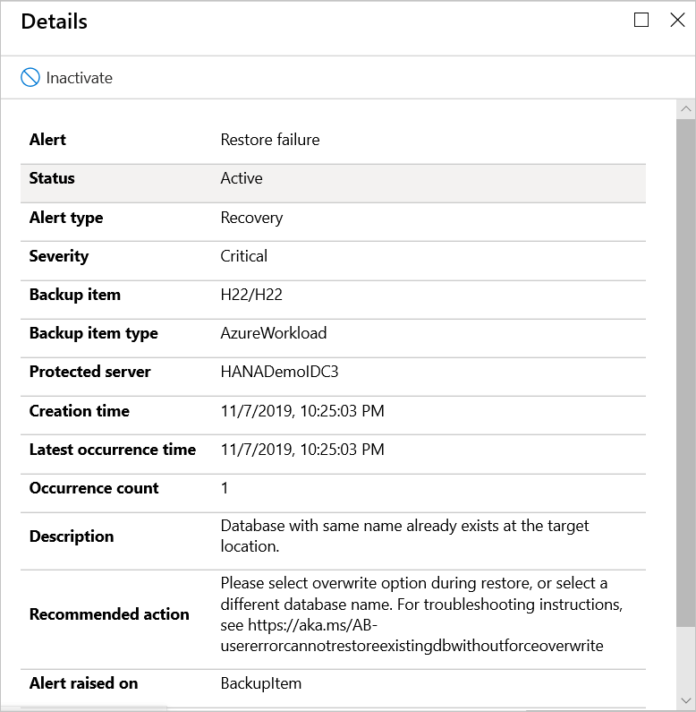
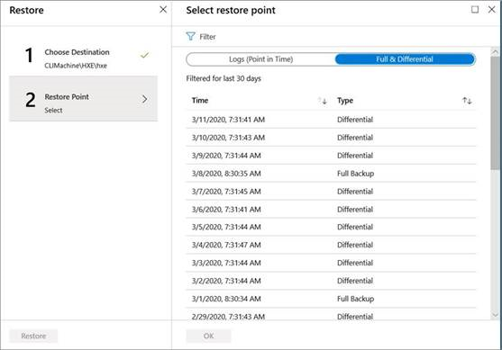
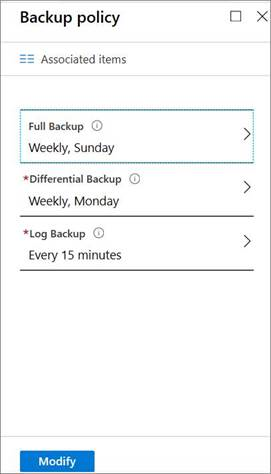
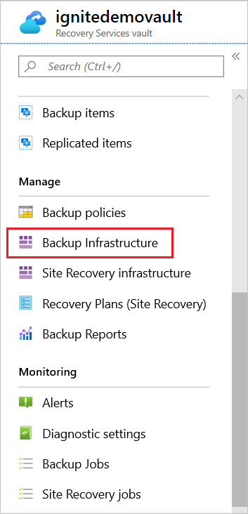

# Manage and monitor backed up SAP HANA databases

This article describes common tasks for managing and monitoring SAP HANA databases that are running on an Azure virtual machine (VM) and that are backed up to an Azure Backup Recovery Services vault by the [Azure Backup](./backup-overview.md) service. You'll learn how to monitor jobs and alerts, trigger an on-demand backup, edit policies, stop and resume database protection and unregister a VM from backups.

>[!Note]
>Support for HANA Instance snapshot and support for HANA System Replication mode are in preview.

If you haven't configured backups yet for your SAP HANA databases, see [Back up SAP HANA databases on Azure VMs](./backup-azure-sap-hana-database.md).

>[!Note]
>See the [SAP HANA backup support matrix](sap-hana-backup-support-matrix.md) to know more about the supported configurations and scenarios.

## Monitor manual backup jobs using the Azure portal

Azure Backup shows all manually triggered jobs in the **Backup jobs** section in **Backup center**.

:::image type="content" source="./media/sap-hana-db-manage/backup-center-jobs-list-inline.png" alt-text="Screenshot showing the Backup jobs section." lightbox="./media/sap-hana-db-manage/backup-center-jobs-list-expanded.png":::

The jobs you see in this portal includes database discovery and registering, and backup and restore operations. Scheduled jobs, including log backups aren't shown in this section. Manually triggered backups from the SAP HANA native clients (Studio/ Cockpit/ DBA Cockpit) also don't show up here.

:::image type="content" source="./media/sap-hana-db-manage/hana-view-jobs-inline.png" alt-text="Screenshot showing the Backup jobs list." lightbox="./media/sap-hana-db-manage/hana-view-jobs-expanded.png":::

To learn more about monitoring, go to [Monitoring in the Azure portal](./backup-azure-monitoring-built-in-monitor.md) and [Monitoring using Azure Monitor](./backup-azure-monitoring-use-azuremonitor.md).

## View backup alerts

Alerts are an easy means of monitoring backups of SAP HANA databases. Alerts help you focus on the events you care about the most without getting lost in the multitude of events that a backup generates. Azure Backup allows you to set alerts, and they can be monitored as follows:

* Sign in to the [Azure portal](https://portal.azure.com/).
* On the vault dashboard, select **Backup Alerts**.

  

* You'll be able to see the alerts:

  

* Select the alerts to see more details:

  

Today, Azure Backup allows the sending of alerts through email. These alerts are:

* Triggered for all backup failures.
* Consolidated at the database level by error code.
* Sent only for a database's first backup failure.

To learn more about monitoring, go to [Monitoring in the Azure portal](./backup-azure-monitoring-built-in-monitor.md) and [Monitoring using Azure Monitor](./backup-azure-monitoring-use-azuremonitor.md).

## Manage operations

Azure Backup makes management of a backed-up SAP HANA database easy with an abundance of management operations that it supports. These operations are discussed in more detail in the following sections.

### Run an on-demand backup

Backups run in accordance with the policy schedule. You can run a backup on-demand as follows:

1. In the vault menu, select **Backup items**.
1. In **Backup Items**,  select the VM running the SAP HANA database, and then select **Backup now**.
1. In **Backup Now**, choose the type of backup you want to perform. Then select **OK**.

   The retention period of this backup is determined by the type of on-demand backup you have run.

   - *On-demand full backups* are retained for a minimum of *45 days* and a maximum of *99 years*.
   - *On-demand differential backups* are retained as per the *log retention set in the policy*.
   - *On-demand incremental backups* aren't currently supported.

1. Monitor the portal notifications. You can monitor the job progress in the vault dashboard > **Backup Jobs** > **In progress**. Depending on the size of your database, creating the initial backup may take a while.

### HANA native client integration

>[!Note]
>HANA native clients are integrated for Backint based operations only. Snapshots and HANA System Replication mode related operations are currently not supported.

#### Backup

On-demand backups triggered from any of the HANA native clients (to **Backint**) will show up in the backup list on the **Backup Instances** page.

You can also [monitor these backups](#monitor-manual-backup-jobs-in-the-portal) from the **Backup jobs** page.

These on-demand backups will also show up in the list of restore points for restore.

#### Restore

Restores triggered from HANA native clients (using **Backint**) to restore to **the same machine** can be [monitored](#monitor-manual-backup-jobs-in-the-portal) from the **Backup jobs** page.
Restores triggered from HANA native clients to restore to another machine are not allowed. This is because Azure Backup service cannot authenticate the target server, as per Azure RBAC rules, for restore.

#### Delete

Delete operation from HANA native is **NOT** supported by Azure Backup since the backup policy determines the lifecycle of backups in Azure Recovery services vault.

### Change policy

You can change the underlying policy for an SAP HANA backup item.

>[!Note]
>In the case of HANA snapshot, the new HANA instance policy can have a different resource group and/or another user-assigned managed identity. Currently, the Azure portal performs all validations during the backup configuration. So, you must assign the required roles on the new snapshot resource group and/or the new user-assigned identity using the [CLI scripts](https://github.com/Azure/Azure-Workload-Backup-Troubleshooting-Scripts/tree/main/SnapshotPreReqCLIScripts).

In the **Backup center** dashboard, go to **Backup Instances**:

* Choose **SAP HANA in Azure VM** as the datasource type.

  :::image type="content" source="./media/sap-hana-db-manage/hana-backup-instances-inline.png" alt-text="Screenshot showing to choose SAP HANA in Azure VM." lightbox="./media/sap-hana-db-manage/hana-backup-instances-expanded.png":::

* Choose the backup item whose underlying policy you want to change.
* Select the existing Backup policy.

  

* Change the policy, choosing from the list. [Create a new backup policy](./backup-azure-sap-hana-database.md#create-a-backup-policy) if needed.

  

* Save the changes.

  

* Policy modification will impact all the associated Backup Items and trigger corresponding **configure protection** jobs.

>[!NOTE]
> Any change in the retention period will be applied retrospectively to all the older recovery points besides the new ones.

### Modify Policy

To modify policy to change backup types, frequencies, and retention range, follow these steps:

>[!NOTE]
>- Any change in the retention period will be applied retroactively to all the older recovery points, in addition to the new ones.
>- 
>- In the case of HANA snapshot, you can edit the HANA instance policy to have a different resource group and/or another user-assigned managed identity. Currently, the Azure portal performs all validations during the backup configure only. So, you must assign the required roles on the new snapshot resource group and/or the new user-assigned identity using the [CLI scripts](https://github.com/Azure/Azure-Workload-Backup-Troubleshooting-Scripts/tree/main/SnapshotPreReqCLIScripts).

1. In the **Backup center** dashboard, go to **Backup Policies** and choose the policy you want to edit.

   :::image type="content" source="./media/sap-hana-db-manage/backup-center-policies-inline.png" alt-text="Screenshot showing to choose the policy to edit." lightbox="./media/sap-hana-db-manage/backup-center-policies-expanded.png":::

1. Select **Modify**.

   

1. Choose the frequency for the backup types.

   

Policy modification will impact all the associated backup items and trigger corresponding **configure protection** jobs.

### Inconsistent policy

Occasionally a modify policy operation can lead to an **inconsistent** policy version for some backup items. This happens when the corresponding **configure protection** job fails for the backup item after a modify policy operation is triggered. It appears as follows in the backup item view:

You can fix the policy version for all the impacted items in one click:

### Stop protection for an SAP HANA database/ HANA Instance

You can stop protecting an SAP HANA database in a couple of ways:

* Stop all future backup jobs and delete all recovery points.
* Stop all future backup jobs and leave the recovery points intact.

If you choose to leave recovery points, keep these details in mind:

* All recovery points will remain intact forever, and all pruning will stop at stop protection with retain data.
* You'll be charged for the protected instance and the consumed storage. For more information, see [Azure Backup pricing](https://azure.microsoft.com/pricing/details/backup/).
* If you delete a data source without stopping backups, new backups will fail.

>[!Note]
>In the case of HANA instances, first stop the protection of HANA instance, and then stop protection of all related databases; otherwise the the stop protection operation will fail.

To stop protection for a database:

1. In the **Backup center** dashboard, select **Backup Instances**.
1. Select **SAP HANA in Azure VM** as the datasource type.

   :::image type="content" source="./media/sap-hana-db-manage/hana-backup-instances-inline.png" alt-text="Screenshot showing to select SAP HANA in Azure VM." lightbox="./media/sap-hana-db-manage/hana-backup-instances-expanded.png":::

1. Select the database for which you want to stop protection on.

1. In the database menu, select **Stop backup**.

   :::image type="content" source="./media/sap-hana-db-manage/stop-backup.png" alt-text="Screenshot showing to select stop backup.":::

1. In the **Stop Backup** menu, select whether to retain or delete data. If you want, provide a reason and comment.

   :::image type="content" source="./media/sap-hana-db-manage/retain-backup-data.png" alt-text="Screenshot showing to select retain or delete data.":::

1. Select **Stop backup**.

### Resume protection for an SAP HANA database/ HANA Instance

When you stop protection for the SAP HANA database or SAP HANA Instance, if you select the **Retain Backup Data** option, you can later resume protection. If you don't retain the backed-up data, you can't resume protection.

To resume protection for an SAP HANA database:

* Open the backup item and select **Resume backup**.

   

* On the **Backup policy** menu, select a policy, and then select **Save**.

### Upgrading from SDC to MDC

Learn how to continue backup for an SAP HANA database [after upgrading from SDC to MDC](backup-azure-sap-hana-database-troubleshoot.md#sdc-to-mdc-upgrade-with-a-change-in-sid).

### Upgrading from SDC to MDC without a SID change

Learn how to continue backup of an SAP HANA database whose [SID hasn't changed after upgrade from SDC to MDC](backup-azure-sap-hana-database-troubleshoot.md#sdc-to-mdc-upgrade-with-no-change-in-sid).

### Upgrading to a new version in either SDC or MDC

Learn how to continue backup of an SAP HANA database [whose version is being upgraded](backup-azure-sap-hana-database-troubleshoot.md#sdc-version-upgrade-or-mdc-version-upgrade-on-the-same-vm).

### Unregister an SAP HANA instance

Unregister an SAP HANA instance after you disable protection but before you delete the vault:

* On the vault dashboard, under **Manage**, select **Backup Infrastructure**.

   

* Select the **Backup Management type** as **Workload in Azure VM**

   

* In **Protected Servers**, select the instance to unregister. To delete the vault, you must unregister all servers/ instances.

* Right-click the protected instance and select **Unregister**.

   

### Re-register extension on the SAP HANA server VM

Sometimes the workload extension on the VM may get impacted for one reason or another. In such cases, all the operations triggered on the VM will begin to fail. You may then need to re-register the extension on the VM. Re-register operation reinstalls the workload backup extension on the VM for operations to continue.

Use this option with caution: when triggered on a VM with an already healthy extension, this operation will cause the extension to get restarted. This may cause all the in-progress jobs to fail. Check for one or more of the [symptoms](backup-azure-sap-hana-database-troubleshoot.md#re-registration-failures) before triggering the re-register operation.

## Next steps

* Learn how to [troubleshoot common issues when backing up SAP HANA databases.](./backup-azure-sap-hana-database-troubleshoot.md)
