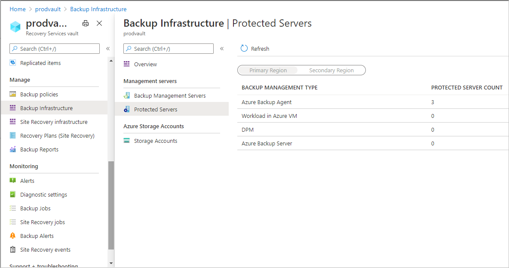
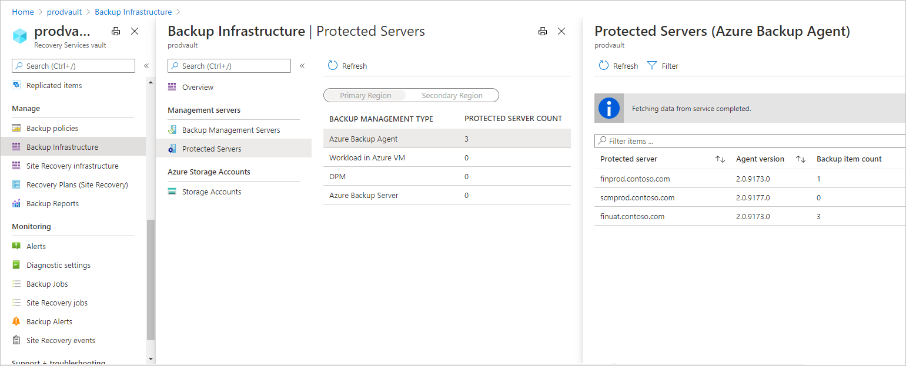
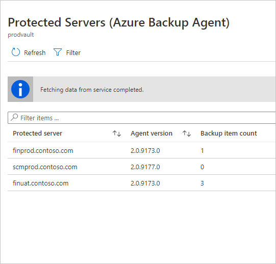
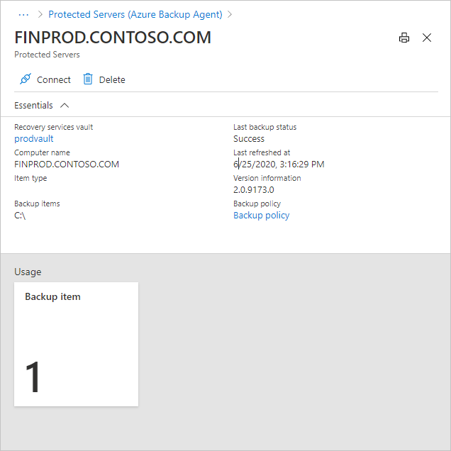
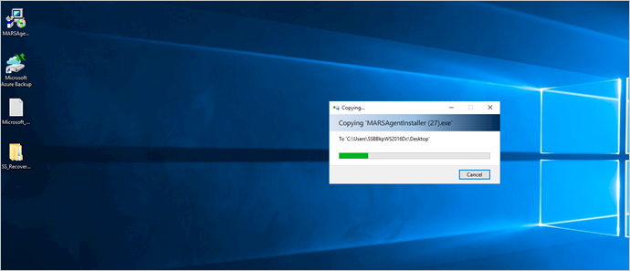
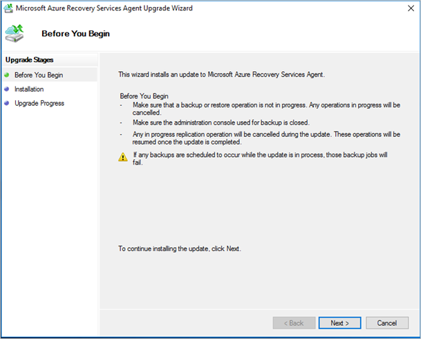
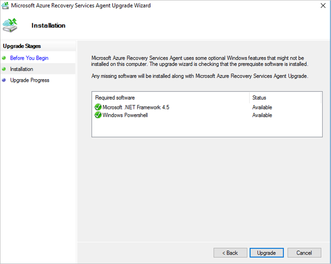

# Upgrade the Microsoft Azure Recovery Services (MARS) agent

This article describes how to upgrade the Microsoft Azure Recovery Services (MARS) agent.

Azure Backup uses the MARS agent to back up and recover files, folders, and the volume or system state from an on-premises computer to Azure.

## Identify servers with earlier versions of the MARS agent

For Installations of Azure Backup agent and Azure Backup server:

1. Go to the Recovery Services vault where you have registered servers that are potentially being backed up by older versions of the agent. You can find a representative list of vaults with older Azure Backup agents in the Azure Backup Update alerts from Azure.
1. On the left-side **Settings** section of the Recovery Services vault, select **Backup Infrastructure** under the **Manage** section.
1. To discover Azure Backup agents installed as part of Azure Backup server installations, go to **Backup Management Servers** under **Management Servers**. This will list the servers that have Azure Backup server installations along with the version number for the associated Azure Backup agent.

    

1. To check agent versions for Microsoft Azure Recovery Services (MARS) agent installations or the Azure Backup agent, go to **Protected Servers** under **Management Servers**. Then select **Azure Backup agent** under Backup Management Type. This will list the servers that have Azure Backup agent installations along with the version number for the installation.

    

1. Sort the Azure Backup Agent version column by selecting the **Agent Version** column for MARS Agent installations or the **Azure Backup Agent Version** column for Azure Backup Server installations.

1. The previous step will give you the list of servers with Azure Backup agents that have versions lower than 2.0.9083.0 or agent versions listed as blanks. These are the servers where Azure Backup agents need to be updated.

## Update the MARS agent installation on the server

Once you've identified the servers that need an Azure Backup agent update, perform the following steps for each identified server (using Azure Backup server or the MARS Agent). [Download the latest version of the Azure Backup agent](https://aka.ms/azurebackup_agent) before following the steps below.

1. Select a row that has Azure Backup agent lower than 2.0.9083.0 or blank. This will open the server detail screen.

    

    

1. Select **Connect** to receive a remote desktop connection file to connect with the server or directly connect to the server via the Remote Desktop connection on your server.

    

    >[!NOTE]
    > If the listed server doesn't exist or has been decommissioned, you can ignore the remaining steps below and skip to the next server.

1. Enter your administrative login details and sign in.

1. If your server or server's proxy has limited internet access, ensure that firewall settings on the server/proxy are configured to allow the URL appropriate to the Azure cloud you're using:

    Azure Cloud | URL
    --- | ---
    Azure Cloud (Public) |   `https://login.windows.net`
    Azure China 21Vianet Cloud   | `https://login.chinacloudapi.cn`
    Azure US Government Cloud |   `https://login.microsoftonline.us`
    Azure German Cloud  |  `https://login.microsoftonline.de`

1. Copy the Azure Backup agent update installer to the server.

    

1. Run the installer. The Microsoft Azure Recovery Services Agent Upgrade wizard opens.

    

1. Select **Next**.

1. Select **Upgrade**.

    

1. The final confirmation screen indicates that the Azure Backup agent has been successfully updated.

## Upgrade Azure Backup agent for System Center Data Protection Manager

If you've installed Azure Backup agents on the System Center Data Protection Manager (SC DPM) servers, then you need to follow the steps below to identify whether your DPM servers need an Azure Backup agent update:

1. Sign in to your SC DPM server as an Administrator.
2. Open the DPM Console.
3. Select **Management** in the lower left navigation of the console.
4. Within the information that appears on the left navigation, look for the Azure Backup agent version information.
5. If the version is lower than 2.0.9083.0, download the latest Azure Backup agent installer and run the installer on the DPM server to update the Azure Backup agent.

Repeat the steps above for all DPM servers in your environment.

## Next steps

- Learn how to [Back up Windows machines by using the Azure Backup MARS agent](backup-windows-with-mars-agent.md)
