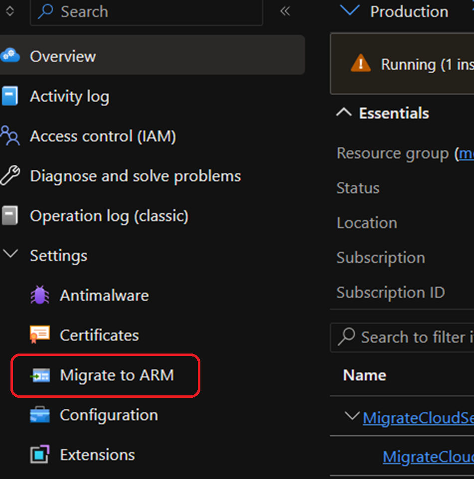

 
Some legacy cloud services are still running without Vnet support. While there is a process for migrating directly through the portal, there are certain considerations that should be made prior to migration. This article will walk you through the process of migrating a non Vnet supporting Cloud Service to a Vnet supporting Cloud Service.

## Advantages to direct migration
- These will be standard operations customer will be performing with no custom changes needed from platform side.
- No required changes in your configurations. You'll use the same configurations to deploy a staging deployment.
- Your DNS and Public IP address is preserved.
- Less downtime.

## Disdvantages to direct migration
- If using external sources you might need to make an effort to move the state of stagging slot. - Potential downtime while manually rebuilding network.

## Migrate Cloud Services not in a Virtual Network to a Virtual Network

1. Create a non vnet classic cloud service in the same region as the vnet you want to migrate to.

1. In the Azure portal, select the 'Staging' drop down.
    

1. Create a deployment with same configuration as existing deployment by selecting 'Upload'. The platform will create a Default Vnet deployment in staging slot.
    

1. Once staging deployment is created, the URL, IP address, and label will populate.
    
The staging deployment will have a different Deployment Name, Deployment Id, and Public Ip Address different tp the production deployment.

1. After verifying the data, select 'Swap' to swap the production and staging deployments.
    
This operation will swap both the deployments. After swapping, you'll find staging deployment in production slot with the DNS and IP address of production deployment with the production deployment will be present in stagging slot.

1. You can now safely delete the staging slot.

1. Trigger the Cloud Service Migration Operation.
    

## Next steps
- [Overview of Platform-supported migration of IaaS resources from classic to Azure Resource Manager](../virtual-machines/migration-classic-resource-manager-overview.md)
- Migrate to Cloud Services (extended support) using the [Azure portal](in-place-migration-portal.md)
- Migrate to Cloud Services (extended support) using [PowerShell](in-place-migration-powershell.md)
