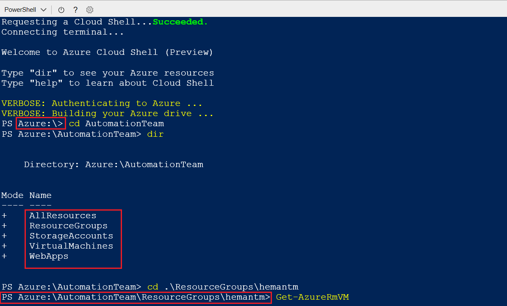

# Features & tools for Azure Cloud Shell

[!INCLUDE [features-introblock](../../includes/cloud-shell-features-introblock.md)]

Prior to August 2022, Azure Cloud Shell ran on **Common Base Linux - Delridge**. As of August 18,
2022, Azure Cloud Shell was changed to use **Common Base Linux - Mariner** (CBL-Mariner),
Microsoft's Linux distribution for cloud-infrastructure-edge products and services.

Microsoft internally compiles all the packages included in the **CBL-Mariner** repository to help
guard against supply chain attacks. Tooling has been updated to reflect the new base image
CBL-Mariner. You can get a full list of installed package versions using the following command:
`tdnf list installed`. If these changes affected your Cloud Shell environment, please contact
Azuresupport or create an issue in the
[Cloud Shell repository](https://github.com/Azure/CloudShell/issues).

## Features

### Secure automatic authentication

Cloud Shell securely and automatically authenticates account access for the Azure CLI and Azure PowerShell.

### $HOME persistence across sessions

To persist files across sessions, Cloud Shell walks you through attaching an Azure file share on first launch.
Once completed, Cloud Shell will automatically attach your storage (mounted as `$HOME\clouddrive`) for all future sessions.
Additionally, your `$HOME` directory is persisted as an .img in your Azure File share.
Files outside of `$HOME` and machine state are not persisted across sessions. Use best practices when storing secrets such as SSH keys. Services like [Azure Key Vault have tutorials for setup](../key-vault/general/manage-with-cli2.md#prerequisites).

[Learn more about persisting files in Cloud Shell.](persisting-shell-storage.md)

### Azure drive (Azure:)

PowerShell in Cloud Shell provides the Azure drive (`Azure:`). You can switch to the Azure drive with `cd Azure:` and back to your home directory with `cd  ~`.
The Azure drive enables easy discovery and navigation of Azure resources such as Compute, Network, Storage etc. similar to filesystem navigation.
You can continue to use the familiar [Azure PowerShell cmdlets](/powershell/azure) to manage these resources regardless of the drive you are in.
Any changes made to the Azure resources, either made directly in Azure portal or through Azure PowerShell cmdlets, are reflected in the Azure drive.  You can run `dir -Force` to refresh your resources.

### Manage Exchange Online

PowerShell in Cloud Shell contains a private build of the Exchange Online module.  Run `Connect-EXOPSSession` to get your Exchange cmdlets.

 Run `Get-Command -Module tmp_*`
> [!NOTE]
> The module name should begin with `tmp_`, if you have installed modules with the same prefix, their cmdlets will also be surfaced. 

### Deep integration with open-source tooling

Cloud Shell includes pre-configured authentication for open-source tools such as Terraform, Ansible, and Chef InSpec. Try it out from the example walkthroughs.

## Tools

|Category   |Name   |
|---|---|
|Linux tools            |bash  zsh  sh  tmux  dig                |
|Azure tools            |[Azure CLI](https://github.com/Azure/azure-cli) and [Azure classic CLI](https://github.com/Azure/azure-xplat-cli)  [AzCopy](../storage/common/storage-use-azcopy-v10.md)  [Azure Functions CLI](https://github.com/Azure/azure-functions-core-tools)  [Service Fabric CLI](../service-fabric/service-fabric-cli.md)  [Batch Shipyard](https://github.com/Azure/batch-shipyard)  [blobxfer](https://github.com/Azure/blobxfer)|
|Text editors           |code (Cloud Shell editor)  vim  nano  emacs    |
|Source control         |git                    |
|Build tools            |make  maven  npm  pip         |
|Containers             |[Docker Machine](https://github.com/docker/machine)  [Kubectl](https://kubernetes.io/docs/user-guide/kubectl-overview/)  [Helm](https://github.com/kubernetes/helm)  [DC/OS CLI](https://github.com/dcos/dcos-cli)         |
|Databases              |MySQL client  PostgreSql client  [sqlcmd Utility](/sql/tools/sqlcmd-utility)  [mssql-scripter](https://github.com/Microsoft/sql-xplat-cli) |
|Other                  |iPython Client  [Cloud Foundry CLI](https://github.com/cloudfoundry/cli)  [Terraform](https://www.terraform.io/docs/providers/azurerm/)  [Ansible](https://www.ansible.com/microsoft-azure)  [Chef InSpec](https://www.chef.io/inspec/)  [Puppet Bolt](https://puppet.com/docs/bolt/latest/bolt.html)  [HashiCorp Packer](https://www.packer.io/)  [Office 365 CLI](https://pnp.github.io/office365-cli/)|

## Language support

|Language   |Version   |
|---|---|
|.NET Core  |[3.1.302](https://github.com/dotnet/core/blob/master/release-notes/3.1/3.1.6/3.1.302-download.md)       |
|Go         |1.9        |
|Java       |1.8        |
|Node.js    |8.16.0      |
|PowerShell |[7.0.0](https://github.com/PowerShell/powershell/releases)       |
|Python     |2.7 and 3.7 (default)|

## Next steps
[Bash in Cloud Shell Quickstart](quickstart.md)  
[PowerShell in Cloud Shell Quickstart](quickstart-powershell.md)  
[Learn about Azure CLI](/cli/azure/)  
[Learn about Azure PowerShell](/powershell/azure/)  
