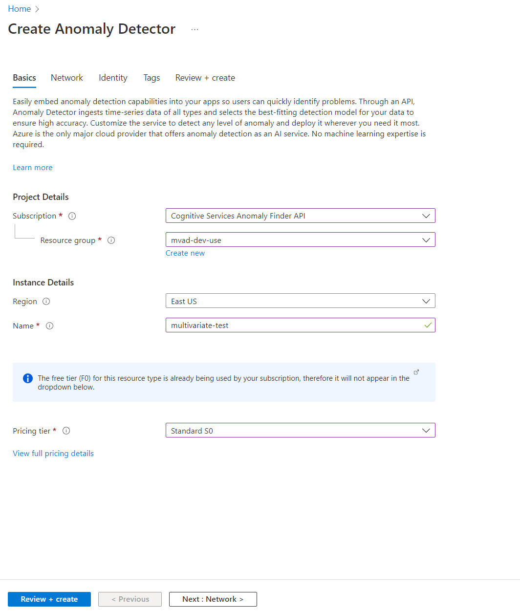
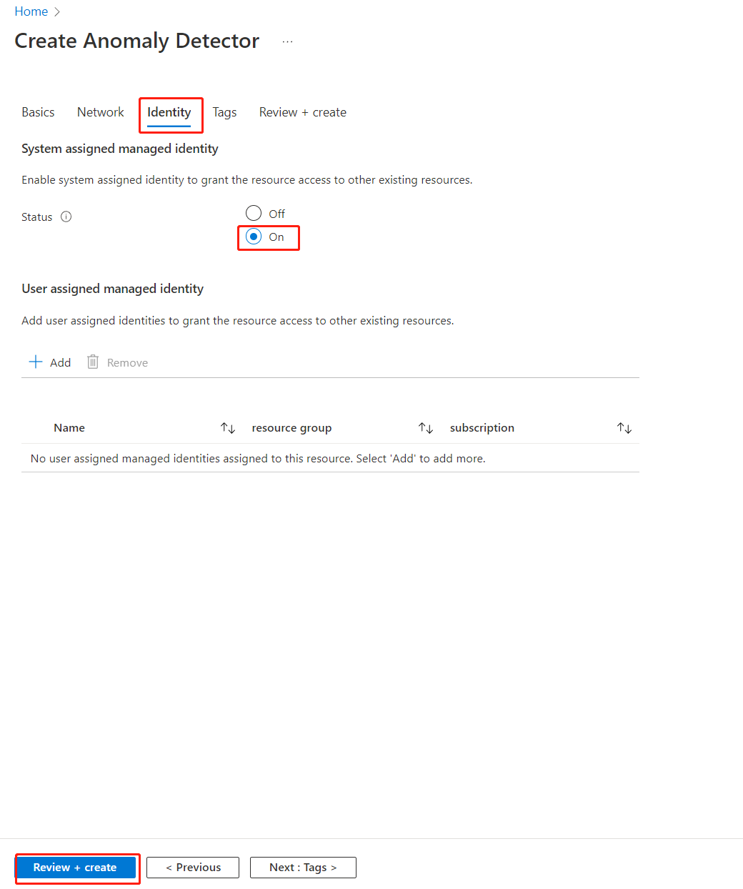
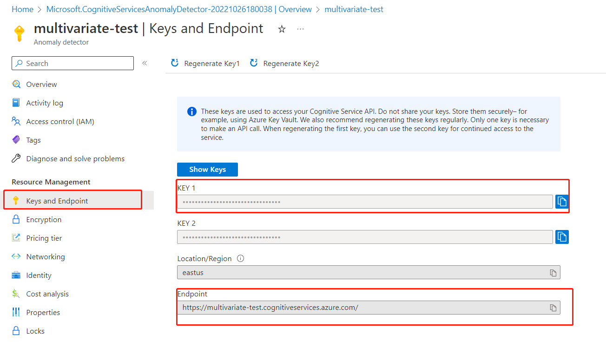

# Create and Anomaly Detector resource

Anomaly Detector service is a cloud-based Cognitive Service that uses machine-learning models to detect anomalies in your time series data. Here, you'll learn how to create an Anomaly Detector resource in the Azure portal.

## Create an Anomaly Detector resource in Azure portal

1. Create an Azure subscription if you don't have one - [Create one for free](https://azure.microsoft.com/free/cognitive-services)
1. Once you have your Azure subscription, [create an Anomaly Detector resource](https://portal.azure.com/#create/Microsoft.CognitiveServicesAnomalyDetector) in the Azure portal, and fill out the following fields:

    - **Subscription**: Select your current subscription.
    - **Resource group**: The [Azure resource group](/azure/cloud-adoption-framework/govern/resource-consistency/resource-access-management#what-is-an-azure-resource-group) that will contain your resource. You can create a new group or add it to a pre-existing group.
    - **Region**: Select your local region, see supported [Regions](../regions.md).
    - **Name**: Enter a name for your resource. We recommend using a descriptive name, for example *multivariate-msft-test*.
    - **Pricing tier**: The cost of your resource depends on the pricing tier you choose and your usage. For more information, see [pricing details](https://azure.microsoft.com/pricing/details/cognitive-services/anomaly-detector/). You can use the free pricing tier (F0) to try the service, and upgrade later to a paid tier for production.

    

1. Select **Identity** in the banner above and make sure you set the status as **On** which enables Anomaly Detector to visit your data in Azure in a secure way, then select **Review + create.**

    

1. Wait a few seconds until validation passed, and select **Create** button from the bottom-left corner.
1. After you select create, you'll be redirected to a new page that says Deployment in progress. After a few seconds, you'll see a message that says, Your deployment is complete, then select **Go to resource**.

## Get Endpoint URL and keys

In your resource, select **Keys and Endpoint** on the left navigation bar, copy the **key** (both key1 and key2 will work) and **endpoint** values from your Anomaly Detector resource.. You'll need the key and endpoint values to connect your application to the Anomaly Detector API.

That's it! You could start preparing your data for further steps!

## Next steps

* [Join us to get more supports!](https://aka.ms/adadvisorsjoin)