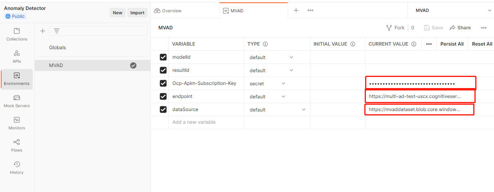
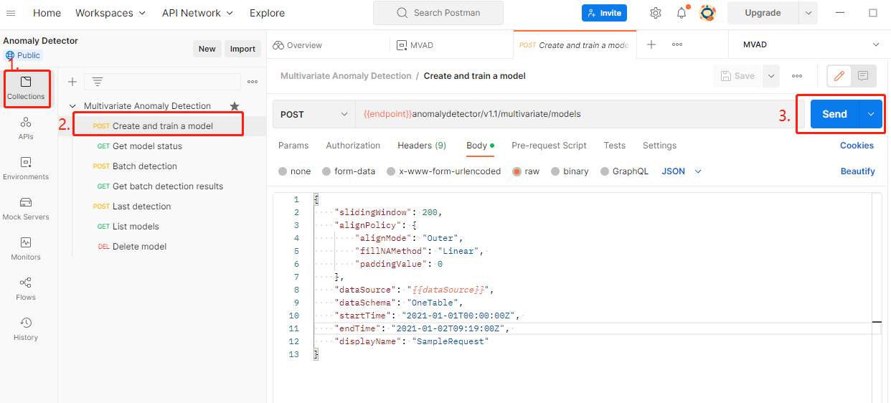
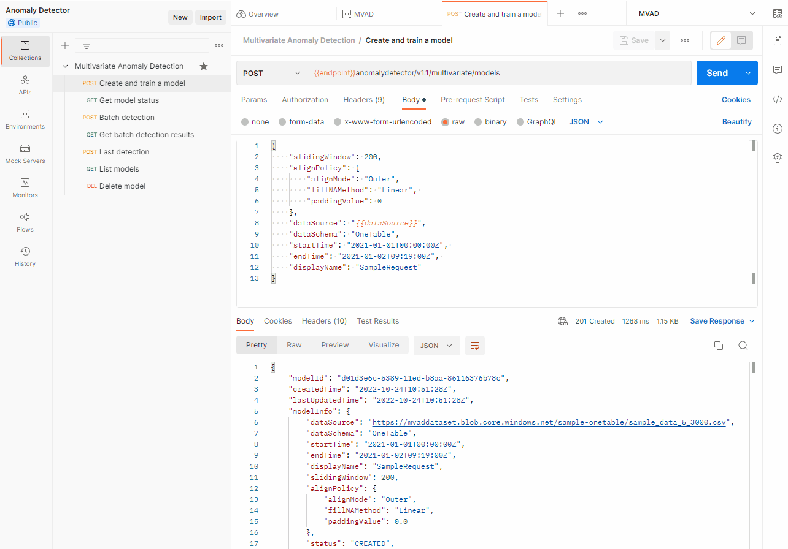
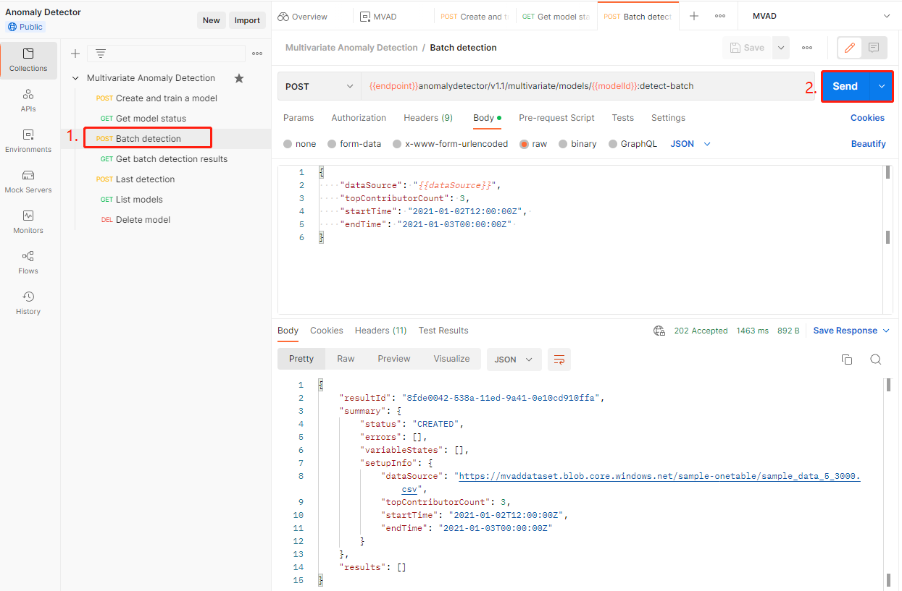

# How to run Multivariate Anomaly Detection API in Postman?

Select this button to fork the API collection in Postman and follow the steps in this article to test.

[](https://app.getpostman.com/run-collection/18763802-b90da6d8-0f98-4200-976f-546342abcade?action=collection%2Ffork&collection-url=entityId%3D18763802-b90da6d8-0f98-4200-976f-546342abcade%26entityType%3Dcollection%26workspaceId%3De1370b45-5076-4885-884f-e9a97136ddbc#?env%5BMVAD%5D=W3sia2V5IjoibW9kZWxJZCIsInZhbHVlIjoiIiwiZW5hYmxlZCI6dHJ1ZSwidHlwZSI6ImRlZmF1bHQiLCJzZXNzaW9uVmFsdWUiOiJlNjQxZTJlYy01Mzg5LTExZWQtYTkyMC01MjcyNGM4YTZkZmEiLCJzZXNzaW9uSW5kZXgiOjB9LHsia2V5IjoicmVzdWx0SWQiLCJ2YWx1ZSI6IiIsImVuYWJsZWQiOnRydWUsInR5cGUiOiJkZWZhdWx0Iiwic2Vzc2lvblZhbHVlIjoiOGZkZTAwNDItNTM4YS0xMWVkLTlhNDEtMGUxMGNkOTEwZmZhIiwic2Vzc2lvbkluZGV4IjoxfSx7ImtleSI6Ik9jcC1BcGltLVN1YnNjcmlwdGlvbi1LZXkiLCJ2YWx1ZSI6IiIsImVuYWJsZWQiOnRydWUsInR5cGUiOiJzZWNyZXQiLCJzZXNzaW9uVmFsdWUiOiJjNzNjMGRhMzlhOTA0MjgzODA4ZjBmY2E0Zjc3MTFkOCIsInNlc3Npb25JbmRleCI6Mn0seyJrZXkiOiJlbmRwb2ludCIsInZhbHVlIjoiIiwiZW5hYmxlZCI6dHJ1ZSwidHlwZSI6ImRlZmF1bHQiLCJzZXNzaW9uVmFsdWUiOiJodHRwczovL211bHRpLWFkLXRlc3QtdXNjeC5jb2duaXRpdmVzZXJ2aWNlcy5henVyZS5jb20vIiwic2Vzc2lvbkluZGV4IjozfSx7ImtleSI6ImRhdGFTb3VyY2UiLCJ2YWx1ZSI6IiIsImVuYWJsZWQiOnRydWUsInR5cGUiOiJkZWZhdWx0Iiwic2Vzc2lvblZhbHVlIjoiaHR0cHM6Ly9tdmFkZGF0YXNldC5ibG9iLmNvcmUud2luZG93cy5uZXQvc2FtcGxlLW9uZXRhYmxlL3NhbXBsZV9kYXRhXzVfMzAwMC5jc3YiLCJzZXNzaW9uSW5kZXgiOjR9XQ==)

1. Select environment as **MVAD**.

    

2. Select **Environment**, paste your Anomaly Detector `endpoint`, `key` and dataSource `url` into the **CURRENT VALUE** column, select **Save** to let the variables take effect.

    

3. Select **Collections**, and select the first API - **Create and train a model**, then select **Send**.

    > [!NOTE]
    > If your data is one CSV file, please set the dataSchema as **OneTable**, if your data is multiple CSV files in a folder, please set the dataSchema as **MultiTable.**

    

4. In the response of the first API, copy the modelId and paste it in the `modelId` in **Environments**, select **Save**. Then go to **Collections**, select **Get model status**, and select **Send**.
    

5. Select **Batch Detection**, and select **Send**. This API will trigger a synchronous inference task, and you should use the Get batch detection results API several times to get the status and the final results.

    

6. In the response, copy the `resultId` and paste it in the `resultId` in **Environments**, select **Save**. Then go to **Collections**, select **Get batch detection results**, and select **Send**.

    

7. For the rest of the APIs calls, select each and then select Send to test out their request and response.

    

## Next Steps

* [Create an Anomaly Detector resource](create-resource.md)
* [Quickstart: Detect anomalies in your time series data using the Anomaly Detector](../quickstarts/client-libraries.md)