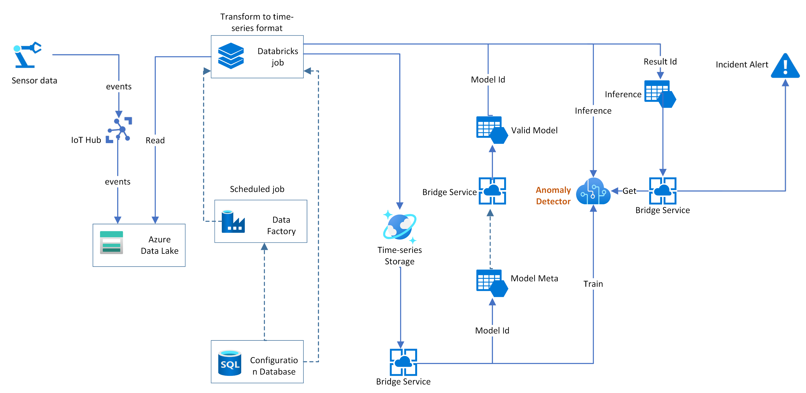

# Predictive Maintenance Solution with Anomaly Detector multivariate

Many different industries need predictive maintenance solutions to reduce risks and gain actionable insights through processing data from their equipment. Predictive maintenance evaluates the condition of equipment by performing online monitoring. The goal is to perform maintenance before the equipment degrades or breaks down.

Monitoring the health status of equipment can be challenging, as each component inside the equipment can generate dozens of signals, for example vibration, orientation, and rotation.  This can be even more complex when those signals have an implicit relationship, and need to be monitored and analyzed together. Defining different rules for those signals and correlating them with each other manually can be costly. Anomaly Detector's multivariate feature allows:

* Multiple correlated signals to be monitored together, and the inter-correlations between them are accounted for in the model.
* In each captured anomaly, the contribution rank of different signals can help with anomaly explanation, and incident root cause analysis.
* The multivariate anomaly detection model is built in an unsupervised manner. Models can be trained specifically for different types of equipment.

Here, we provide a reference architecture for a predictive maintenance solution based on Anomaly Detector multivariate.

## Reference architecture

In the above architecture, streaming events coming from sensor data will be stored in Azure Data Lake and then processed by a data transforming module to be converted into a time-series format. Meanwhile, the streaming event will trigger real-time detection with the trained model. In general, there will be a module to manage the multivariate model life cycle, like *Bridge Service* in this architecture.

**Model Training**: Before using the Anomaly Detector multivariate to detect anomalies for a component or equipment. We need to train a model on specific signals (time-series) generated by this entity. The *Bridge Service* will fetch historical data and submit a training job to the Anomaly Detector and then keep the Model ID in the *Model Meta* storage.

**Model Validation**: Training time of a certain model could be varied based on the training data volume. The *Bridge Service* could query model status and diagnostic info on a regular basis. Validating model quality could be necessary before putting it online. If there are labels in the scenario, those labels can be used to verify the model quality. Otherwise, the diagnostic info can be used to evaluate the model quality, and you can also perform detection on historical data with the trained model and evaluate the result to backtest the validity of the model.

**Model Inference**: Online detection will be performed with the valid model, and the result ID can be stored in the *Inference table*. Both the training process and the inference process are done in an asynchronous manner. In general, a detection task can be completed within seconds. Signals used for detection should be the same ones that have been used for training. For example, if we use vibration, orientation, and rotation for training, in detection the three signals should be included as an input.

**Incident Alerting** The detection results can be queried with result IDs. Each result contains severity of each anomaly, and contribution rank. Contribution rank can be used to understand why this anomaly happened, and which signal caused this incident. Different thresholds can be set on the severity to generate alerts and notifications to be sent to field engineers to conduct maintenance work.

## Next Steps

- [Quickstarts](./quickstarts/client-libraries-multivariate.md).
- [Best Practices](./concepts/best-practices-multivariate.md): This article is about recommended patterns to use with the  multivariate APIs.