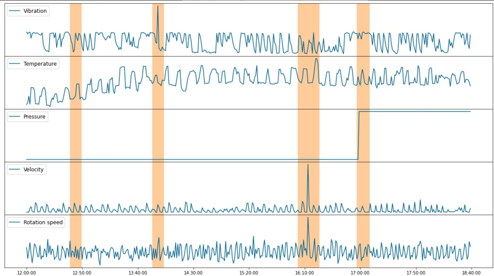

# Multivariate time-series Anomaly Detection (public preview)

The first release of the Azure Cognitive Services Anomaly Detector allowed you to build metrics monitoring solutions using the easy-to-use [univariate time-series Anomaly Detector APIs](overview.md). By allowing analysis of time-series individually, Anomaly Detector univariate provides simplicity and scalability.

The new **multivariate anomaly detection** APIs further enable developers by easily integrating advanced AI for detecting anomalies from groups of metrics, without the need for machine learning knowledge or labeled data. Dependencies and inter-correlations between up to 300 different signals are now automatically counted as key factors. This new capability helps you to proactively protect your complex systems such as software applications, servers, factory machines, spacecraft, or even your business, from failures.

Imagine 20 sensors from an auto engine generating 20 different signals like vibration, temperature, fuel pressure, etc. The readings of those signals individually may not tell you much about system level issues, but together they can represent the health of the engine. When the interaction of those signals deviates outside the usual range, the multivariate anomaly detection feature can sense the anomaly like a seasoned expert. The underlying AI models are trained and customized using your data such that it understands the unique needs of your business. With the new APIs in Anomaly Detector, developers can now easily integrate the multivariate time series anomaly detection capabilities into predictive maintenance solutions, AIOps monitoring solutions for complex enterprise software, or business intelligence tools.

## When to use **multivariate** APIs versus **univariate** APIs

Use univariate anomaly detection APIs, if your goal is to detect anomalies out of a normal pattern on each individual time series purely based on their own historical data. Examples: you want to detect daily revenue anomalies based on revenue data itself, or you want to detect a CPU spike purely based on CPU data.
- `POST /anomalydetector/v1.0/timeseries/last/detect`
- `POST /anomalydetector/v1.0/timeseries/batch/detect`
- `POST /anomalydetector/v1.0/timeseries/changepoint/detect`

Use multivariate anomaly detection APIs below, if your goal is to detect system level anomalies from a group of time series data. Any individual time series won't tell you much, and you have to look at all signals (a group of time series) holistically to determine a system level issue. Example: you have an expensive physical asset like aircraft, equipment on an oil rig, or a satellite. Each of these assets has tens or hundreds of different types of sensors. You would have to look at all those time series signals from those sensors to decide whether there is system level issue.

- `POST /anomalydetector/v1.1-preview/multivariate/models`
- `GET /anomalydetector/v1.1-preview/multivariate/models[?$skip][&$top]`
- `GET /anomalydetector/v1.1-preview/multivariate/models/{modelId}`
- `POST/anomalydetector/v1.1-preview/multivariate/models/{modelId}/detect`
- `GET /anomalydetector/v1.1-preview/multivariate/results/{resultId}`
- `DELETE /anomalydetector/v1.1-preview/multivariate/models/{modelId}`
- `GET /anomalydetector/v1.1-preview/multivariate/models/{modelId}/export`

## Core technology

- [Multivariate Time-series Anomaly Detection via Graph Attention Network](https://arxiv.org/abs/2009.02040)

## Next steps

- [Quickstarts](./quickstarts/client-libraries-multivariate.md).
- [Best Practices](./concepts/best-practices-multivariate.md): This article is about recommended patterns to use with the  multivariate APIs.
