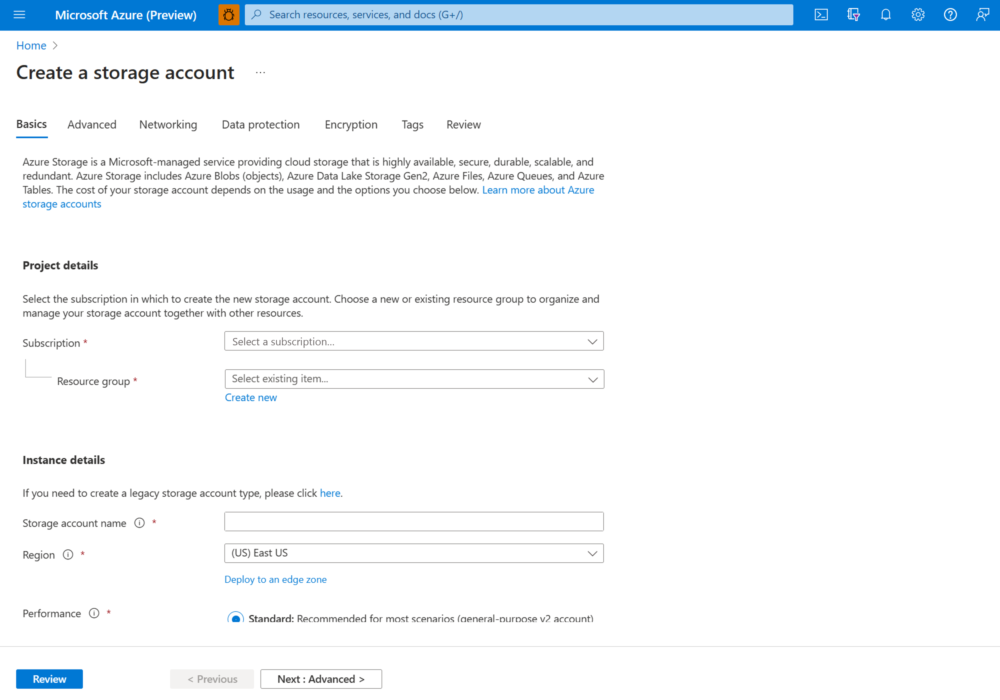
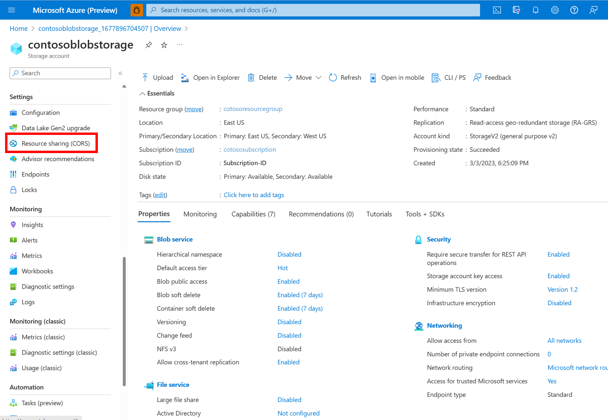
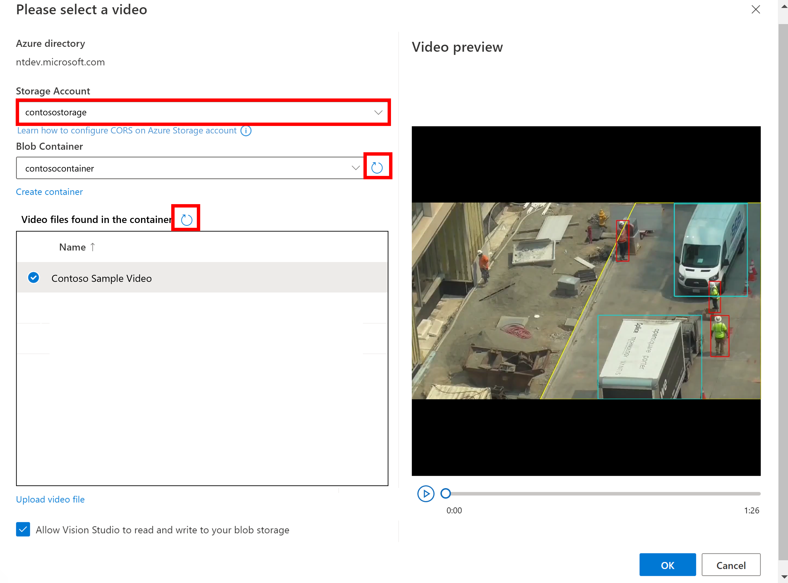

# How to configure your blob storage for image retrieval and video search in Vision Studio

## Getting started with storage account

To get started with the image retrieval and video search experiences in Vision Studio, you will need to [create a new Storage account](https://ms.portal.azure.com/#create/Microsoft.StorageAccount).

You can create your storage account in any region, but creating it in the same region as your Azure Computer Vision Resource is more efficient and reduces cost. Complete the required parameters to configure your storage account and select `Review`, then `Create`. 

> [!IMPORTANT]
> You need to create your storage account in the **same subscription as the Computer Vision resource** that you selected for this demo. 

Once your storage account has been deployed, select `Go to resource` to open the storage account overview. 

## Configure CORS rule on the storage account 

In your storage account overview, find the **Settings** section in the left hand navigation and select `Resource sharing (CORS)`, shown below.

**THIS MUST BE UPDATED PRIOR TO PRODUCTION**

Create a CORS rule by setting the **Allowed Origins** field to `https://uvs-portal-preview-prod-staging.azurewebsites.net`.

In the Allowed Methods field, select the `GET` checkbox to allow an authenticated request from a different domain.  In the **Max age** field, enter the value `9999`, and click `Save`. 

[Learn more about CORS support for Azure Storage](https://learn.microsoft.com/en-us/rest/api/storageservices/cross-origin-resource-sharing--cors--support-for-the-azure-storage-services).

This will allow Vision Studio to access images and videos in your blob storage container to extract insights on your data.

## Upload images and videos in Vision Studio

In the *Try with your own video* or *Try with your own image* section in Vision Studio, select the storage account that you configured with the CORS rule. Select the container in which your images or videos are stored. If you don't have a container, you can create one and upload the images or videos from your local device. If you have updated the CORS rules on the storage account, refresh the **Video files on container** section.

